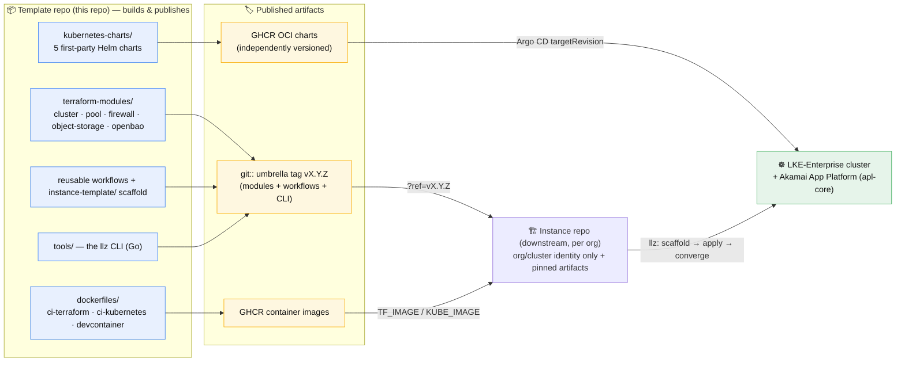

# LKE Landing Zone (LLZ)

- **A standard way to build and deploy clusters** — one repeatable path, not a pile of bespoke setups.
- **Automation for deployment** — scaffold → apply → converge driven by the `llz` CLI and reusable workflows.
- **Supports environments** — a `dev → staging → prod` promotion pipeline out of the box, each a separate cluster with an identical setup.
- **Automated security controls** — package scans, token rotation, and firewalls run on a schedule.
- **Standard tooling pre-installed** — the full toolchain ships ready to use, so you don't have to assemble it.
- **Standardized operations and monitoring** — clusters are operated and observed the same way everywhere.
- **[Delivery methodology as code](docs/delivery-methodology.md)** — the opinionated path from scaffold to day-2 is itself versioned and shipped, so the *how* of delivery is inherited and upgraded, not reinvented per team.

A reusable, **secure-by-default LKE-Enterprise (Linode Kubernetes Engine
Enterprise) landing zone** for the full cluster lifecycle — scaffold, bootstrap,
and operate. LLZ ships the hardened building blocks (versioned Terraform modules,
Helm charts, and CI images), the **`llz`** operator CLI that drives them, and a
set of reusable GitHub Actions workflows — so an adopting **system team** stands
up and runs a production-grade cluster on Linode LKE-E + Akamai App Platform
(apl-core) by **declaring a small instance spec and running commands**, not
hand-wiring Terraform, manifests, and CI.

It doesn't stop at bootstrap. The same reusable workflows keep an instance
healthy on day-2: scheduled health and audit checks, monthly credential rotation
(lke-admin tokens, Linode PATs, TF-state keys), and a self-healing OpenBao
auto-unseal loop — operational guarantees an adopter inherits, not wiring they
build.

The artifacts are *published and independently versioned*. This template repo
builds and publishes them; a downstream **instance repo** consumes them — thin
caller stubs for the workflows, a pinned `llz` binary, version-tagged modules and
charts — and overrides only its own org/cluster identity. Upstream fixes reach
adopters via version bumps, not manual diffs.

## Architecture at a glance

This repo is a **template that publishes immutable, independently versioned
artifacts** — it is not itself a running deployment. A downstream **instance
repo** consumes those artifacts (pinned to one umbrella tag) and the `llz` CLI
drives it from scaffold to a converged LKE-E cluster and on into day-2.



> Full high- and low-level diagrams (including the in-cluster bootstrap chain):
> [docs/architecture/overview.md](docs/architecture/overview.md).

## What it is

- **Secure-by-default.** Every non-obvious value (NetworkPolicy CIDRs, sync-wave
  ordering, disk encryption, firewall baselines, RBAC narrowing) ships as a
  default that encodes the failure mode it prevents.
- **Linode LKE-E + apl-core shaped.** Those substrates are hard givens, not
  abstracted away. Only org/cluster identity — endpoints, domains, CIDRs, names —
  is variabilized.
- **Lifecycle, not just bootstrap.** The `llz` CLI and the reusable workflows
  carry an instance from scaffold → apply → converge and on into day-2 — health
  audits, credential rotation, and self-healing auto-unseal run on a schedule, so
  the cluster stays converged without standing operator toil.
- **Dogfood-honest.** The published modules and charts are the real reuse units;
  the contract that makes them publishable is what keeps the extraction honest.

## What problems is this solving

- Currently everyone is solving the same problems alone in different spaces.
- People are forced to set up clusters by hand. The manual configuration process
  means it's not reproducible, and setting up matching environments is off the table.
- Folks don't follow best security practices because they've spent so much time
  getting things to work that they simply don't have the time.
- Operational handoff suffers because each solution is a one-off. The manual setup
  steps aren't always documented, and the lack of environments means upgrades can
  only be done live.
- Centralizing here lets us pool learnings so everyone benefits.
- This solves the problem of standardization.

## What it ships

### Terraform modules — `terraform-modules/`

Published as immutable `git::`-tagged sources, pinned to the one umbrella release
tag `vX.Y.Z` (`?ref=vX.Y.Z`). See [terraform-modules/README.md](terraform-modules/README.md)
and the version/publish contract in
[terraform-modules/RELEASING.md](terraform-modules/RELEASING.md).

| Module | Purpose |
|---|---|
| [`llz-cluster`](terraform-modules/llz-cluster/) | VPC + subnet + LKE-E cluster (no default node pool) |
| [`llz-pool`](terraform-modules/llz-pool/) | Node pool with `disk_encryption` and `firewall_id` enforced |
| [`llz-node-firewall`](terraform-modules/llz-node-firewall/) | Cloud Firewall with baseline rules; hands off to the controller |
| [`llz-object-storage`](terraform-modules/llz-object-storage/) | Linode OBJ buckets + scoped keys for registry/log storage, with key rotation |

### Helm charts — `kubernetes-charts/`

Published to **GHCR** as OCI artifacts at
`oci://ghcr.io/akamai-consulting/charts/<chart>:<version>`, versioned immutably
by convention (bump `Chart.yaml` `version:` to release). See
[kubernetes-charts/README.md](kubernetes-charts/README.md).

| Chart | Deploys |
|---|---|
| [`llz-cluster-foundation`](kubernetes-charts/llz-cluster-foundation/) | Secure-by-default baseline: namespaces, default-deny NetworkPolicies, CoreDNS, storage-class defaulting |
| [`llz-openbao-platform`](kubernetes-charts/llz-openbao-platform/) | Opinionated OpenBao-on-K8s wrapper (TLS, NP, ServiceMonitor, audit-log shipping) |
| [`llz-cert-automation`](kubernetes-charts/llz-cert-automation/) | Event-driven cert renewal (Argo Events + Workflows) |
| [`llz-argo-bootstrap-apps`](kubernetes-charts/llz-argo-bootstrap-apps/) | App-of-apps generator encoding sync-wave ordering |

### Container images — `dockerfiles/`

Multi-arch (amd64 + arm64) images built by
[`.github/workflows/build-images.yml`](.github/workflows/build-images.yml)
and pushed to `ghcr.io/akamai-consulting/*`:

| Image | Contents |
|---|---|
| `ghcr.io/akamai-consulting/ci-terraform` | Terraform/OpenTofu + linters + the `llz` CI binary (built from `tools/`) |
| `ghcr.io/akamai-consulting/ci-kubernetes` | `kubectl`, `helm`, kustomize, kube linters |
| `ghcr.io/akamai-consulting/devcontainer` | Adopter-workstation image for an instance's [Dev Container](docs/devcontainer.md) — the full `llz doctor` toolchain (terraform, kubectl, helm, bao, copier, gh, linode-cli) + linters |

### Native tooling — `tools/`

A single Go module providing `llz` — the adopter CLI + CI plumbing, including the
credential rotation/audit lifecycles. See [tools/AGENTS.md](tools/AGENTS.md). (The
`firewall-cidrs` / `firewall-controller` commands and the internal-CIDR firewall
chart are an Akamai-internal feature; they live in the private
`lke-landing-zone-internal` repo — see
[docs/consume-lke-landing-zone-internal.md](docs/consume-lke-landing-zone-internal.md).)

### Scaffold + instance template

- `llz env add` — authors the declarative **LandingZone spec** (`landingzone.yaml`
  + one `environments/<env>.yaml` per cluster) and runs `llz render` to reconcile
  it into the per-env Terraform tfvars + apl-values overlay. See
  [The LandingZone spec](#the-landingzone-spec--your-instances-source-of-truth).
- [`instance-template/`](instance-template/) — genericized starter material an
  instance repo instantiates: the LandingZone spec examples
  (`landingzone.yaml.example`, `environments/<env>.yaml.example`), Terraform roots
  (`cluster`, `cluster-bootstrap`, `object-storage`), the shared
  `apl-values` tree (`_shared/` base + per-component `components/`, from which
  `llz render` generates each env's thin overlay), and instance GitHub workflows +
  composite actions. The
  template repo itself only builds and publishes the reusable artifacts;
  `instance-template/` is starter material, not active here.
- **`make instance-test`** — fast, local, no-cloud smoke test of the
  instantiation path. `copier copy`s the template into a throwaway dir, then
  checks for unrendered tokens, asserts the load-bearing files rendered, and runs
  `terraform validate` on every rendered root (modules rewritten to the in-repo
  sources). The cheap counterpart to the real
  [release-e2e workflow](.github/workflows/release-e2e.yml), which stands up an
  actual LKE-E cluster — run this before paying for a full e2e.

## How artifacts are published and consumed

| Artifact | Published as | Consumed by an instance via |
|---|---|---|
| Terraform modules | Umbrella `git::` tag `vX.Y.Z` | `source = "git::ssh://…//terraform-modules/<name>?ref=vX.Y.Z"` |
| Reusable workflows + scaffold | Same umbrella tag `vX.Y.Z` | `uses: …/llz-<wf>.yml@vX.Y.Z` + `template-ref: vX.Y.Z` |
| `llz` CLI | Binaries on the `vX.Y.Z` release | `gh release download vX.Y.Z` / `llz self-update` |
| Helm charts | OCI on GHCR, immutable `version:` (independent) | Argo CD Application referencing `oci://ghcr.io/<org>/charts/<chart>:X.Y.Z` |
| CI images | GHCR tags | CI variables (`TF_IMAGE`, `KUBE_IMAGE`) |

GHCR (not the in-cluster Harbor) is deliberate for charts: the bootstrap consumes
charts that must come from a registry existing *before* the cluster does.

## The LandingZone spec — your instance's source of truth

An instance is described by a small **declarative spec** that `llz` reconciles into
everything Terraform and Argo CD consume — so you edit one spec, not three tfvars
roots and a manifest tree:

```text
landingzone.yaml          # instance identity + shared defaults, DNS, shared VPCs
environments/<env>.yaml   # one ClusterDefinition per cluster (region, sizing,
                          #   components, HA role, promotion rank)
```

`llz env add` authors these; **`llz render`** reconciles them into the per-env
tfvars + `apl-values/<env>/` overlay (CI re-renders on every build, and `llz render
--check` drift-guards the committed result). Change a deployment with `llz env set`
/ `llz env edit` (they re-render for you); inspect with `llz env show` / `llz
components` / `llz render --diff`. Full reference:
[docs/landing-zone-spec.md](docs/landing-zone-spec.md), plus the fully-commented
[`landingzone.yaml.example`](instance-template/landingzone.yaml.example) +
[`environments/prod-web-ord.yaml.example`](instance-template/environments/).

## Getting started (adopters)

The fastest path is the **`llz`** CLI, which fronts the whole flow (token wizard +
`copier` + `gh` + the bootstrap workflows). Install the release binary for your
platform, then:

```bash
./template-scripts/install-llz.sh                      # install the CLI (from a checkout)
llz new my-instance --push --yes                       # scaffold + create/push the instance repo
                                                       #   (--org only if you maintain your own template fork)
cd my-instance
llz env add lab --region us-sea --obj-cluster us-sea-1  # author the spec for a deployment + render; fill any overlay placeholders it lists
llz up lab --yes                                       # credentials → readiness gate → build; llz status lab to verify
```

- **Quick start (the `llz` path, end to end):** [docs/quickstart.md](docs/quickstart.md)
- **Full rationale for every step:** [docs/adopter-guide.md](docs/adopter-guide.md)
  — prerequisites (LKE-E, apl-core, an HTTPS GitOps repo), the values contract,
  the org literals to repoint, and the bootstrap order.

Prefer doing it by hand? Every `llz` command wraps a documented script/workflow,
so the adopter guide's manual steps remain fully supported.

## Documentation

| Topic | File |
|-------|------|
| Quick start (TL;DR checklist) | [docs/quickstart.md](docs/quickstart.md) |
| LandingZone spec reference (landingzone.yaml + environments/) | [docs/landing-zone-spec.md](docs/landing-zone-spec.md) |
| Delivery methodology (phases + how LLZ supports them) | [docs/delivery-methodology.md](docs/delivery-methodology.md) |
| End-to-end adopter path | [docs/adopter-guide.md](docs/adopter-guide.md) |
| Environments as a `dev → staging → prod` promotion pipeline | [docs/environments-and-promotion.md](docs/environments-and-promotion.md) |
| Agent / assistant conventions | [AGENTS.md](AGENTS.md) ([details](docs/agents.md)) |
| Terraform module release contract | [terraform-modules/RELEASING.md](terraform-modules/RELEASING.md) |
| Helm chart inventory + OCI publishing | [kubernetes-charts/README.md](kubernetes-charts/README.md) |
| Contributor workflow, prereqs, hooks | [CONTRIBUTING.md](CONTRIBUTING.md) |

### Operations & architecture

The hard-won operational knowledge an adopter inherits — each doc encodes a
failure mode the default already prevents.

| Topic | File |
|-------|------|
| Architecture overview (high- + low-level diagrams) | [docs/architecture/overview.md](docs/architecture/overview.md) |
| Bootstrap "done" contract (3 exit codes) | [docs/architecture/convergence-contract.md](docs/architecture/convergence-contract.md) |
| Secret backend (OpenBao) operations guide | [docs/secrets.md](docs/secrets.md) |
| Alerting inventory + coverage | [docs/alerting.md](docs/alerting.md) |
| apl-core cutover runbook | [docs/apl-core-migration-runbook.md](docs/apl-core-migration-runbook.md) |
| Resilience & disaster recovery (HA/PDB posture, RTO/RPO) | [docs/resilience.md](docs/resilience.md) |
| Linode account request + InfoSec checklist | [docs/infosec/linode-account-request-checklist.md](docs/infosec/linode-account-request-checklist.md) |

**Runbooks** ([docs/runbooks/](docs/runbooks/)) — bootstrap & rotation procedures:
[bootstrap-openbao](docs/runbooks/bootstrap-openbao.md) ·
[lke-admin-rotation](docs/runbooks/lke-admin-rotation.md) ·
[linode-credential-rotation](docs/runbooks/linode-credential-rotation.md) ·
[apl-values-propagation](docs/runbooks/apl-values-propagation.md) ·
[orphan-volume-cleanup](docs/runbooks/orphan-volume-cleanup.md) ·
[volume-labels](docs/runbooks/volume-labels.md) ·
[cluster-upgrade](docs/runbooks/cluster-upgrade.md)

**Playbooks** ([docs/playbooks/](docs/playbooks/)) — day-2 access & ops:
[operator-onboarding](docs/playbooks/operator-onboarding.md) (start here) ·
[argocd-ops](docs/playbooks/argocd-ops.md) ·
[openbao-accounts](docs/playbooks/openbao-accounts.md) ·
[harbor-accounts](docs/playbooks/harbor-accounts.md) ·
[grafana-access](docs/playbooks/grafana-access.md) ·
[loki-access](docs/playbooks/loki-access.md)

## License

Licensed under the Apache License, Version 2.0 — see [LICENSE](LICENSE).
