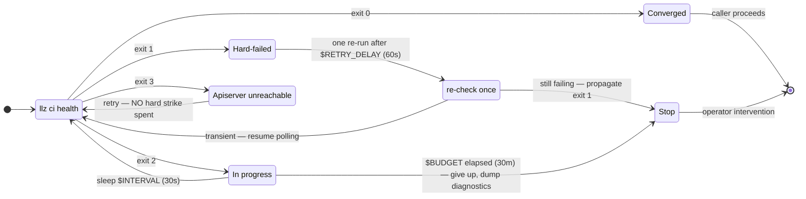

# Convergence contract

**Audience:** anyone touching Terraform, `llz ci bootstrap-cluster`, the bootstrap workflows, the cluster-health script, or an Argo Application in this repo.

This doc defines what "the cluster is done bootstrapping" means, and the four exit codes that every layer of the bootstrap honours.

## The problem we're solving

Before this contract existed, the bootstrap declared completion based on **commands returning**, while the cluster only reached a working state through **async convergence nobody waited for**. Concretely:

- The bootstrap returned success while the apl-core helm install had only confirmed the `apl-operator` Deployment was Ready — its 40-component helmfile pipeline still had 10–15 minutes of work left.
- Every step after that raced an invisible pipeline. The result (when this bootstrap was still the `cluster-bootstrap` Terraform workspace): ~6 polling `null_resource` loops totalling ~40 minutes of timeout budget, each guessing about when something downstream would be ready. That workspace has since been retired — the bootstrap now runs as the native `llz ci bootstrap-cluster` command — but the contract below is unchanged.
- ``llz ci health`` exited `0` for both *"fully converged"* and *"pre-bootstrap, nothing started yet"* (`Phase 0`). The workflow couldn't tell *"done"* from *"half-done"*.
- Soft-fails (`|| true`, `::warning::`, `BOOTSTRAP_ERRORS=true`) accumulated state in OpenBao / GitHub secrets / Harbor while the bootstrap was already known-broken.

The contract below replaces all of that with explicit signals.

---

## The four exit codes

Every "is the cluster ready?" check in this repo — ``llz ci health``, the TF readiness gates, the converge wrapper, any future workflow that needs to ask the question — uses **exactly four exit codes**:

| Exit | Meaning | What the caller should do |
|---|---|---|
| **`0`** | **Converged**. Every required component is Synced + Healthy or Ready, every operator-deferred input is documented as such, and no transient reconciles are in flight. | Proceed. |
| **`2`** | **In-progress**. The cluster is not yet converged, but no hard failure is observable — Argo apps are still applying / Pods are still pulling / Certificates are still issuing / a CRD just landed and its first reconcile loop hasn't run. | **Poll**. Re-run the same check after a backoff. |
| **`1`** | **Hard-failed**. A required component is in a state the reconciler cannot resolve on its own — ImagePullBackOff on an image that doesn't exist, CrashLoopBackOff with `Error` exit code, a Job past `backoffLimit`, a Certificate stuck on `IssuerNotReady` for an Issuer that itself is in a `NotReady` terminal state. | Stop. Operator intervention required. |
| **`3`** | **Apiserver unreachable**. An infrastructure-level blip, not a statement about the cluster's contents — the check could not ask the question at all. | **Retry without spending a hard strike.** Callers MUST distinguish this from `1`; collapsing it into `1` turns every transient apiserver blip into an operator-visible failure. |

The four codes are a loop, and `llz ci converge` is the thing that walks it:

> Two rules the diagram cannot show, and both are load-bearing:
>
> - **Phase 0 — a cluster with nothing on it yet — is exit `2`, not exit `0`.**
>   Conflating them is what produced the old step-and-pray model.
> - **"I don't know" is exit `2`, never exit `0`.** A check that cannot answer
>   makes the caller poll; it does not wave the caller through.

### How to classify a check

When writing a new check, the question to ask is:

> *Will time fix this without me doing anything?*

- If yes — and you can describe what time will fix (a reconciler will catch up, a TLS handshake will complete, a Job will retry) — it's exit `2`.
- If no — and you can describe what the operator has to do (provide a missing secret, fix a typo, deal with a payment failure) — it's exit `1`.
- If everything that needs to be true is true — it's exit `0`.

> **Phase 0 (cluster has nothing yet) is exit `2`, not exit `0`.** The cluster will eventually have things if the bootstrap chain keeps running. The previous behaviour of conflating Phase 0 with converged-state is the single change that breaks the "step-and-pray" model: the caller now distinguishes "nothing started" from "everything done".

### What the previous "soft-fail" buckets become

- `EXTERNAL_DEP_APPS` / `EXTERNAL_DEP_WORKLOADS` / `EXTERNAL_DEP_EXTERNALSECRETS` / `NP_EXTERNAL_DEP_NAMESPACES` — these allowlist *known-deferred* operator inputs (e.g. an application-supplied API key, `LINODE_DNS_TOKEN`, a security-scanner token, etc.). Items that match a list entry are **PENDING** (still exit `2`, not `0`) until the operator-supplied input arrives. The lists no longer change exit-`0`-vs-exit-`1` — they only determine whether a not-yet-Ready resource counts as `2` (waiting on a documented operator input) or `1` (broken).
- The previous "DRIFT" bucket (cosmetic OutOfSync drift from `ExternalSecrets` admission defaults, shared `PodDisruptionBudgets`, immutable StatefulSet template diffs) stays — these are exit `0` reportable annotations, not failures.
- **INSTANCE** — instance-**owned** content (`.template-manifest` `owned`, not `managed`): the operator escape hatch generated from `kubernetes-custom/`, any Application in the **`instance-custom` AppProject** (an instance's own generators may name their Applications anything — the managed-apps ApplicationSet names them after the app), **and the resources those Applications declare**. The convergence contract gates the **platform**, so a broken or still-settling instance-owned item is **reported but excluded from the platform verdict** (exit `0`, like DEFERRED/DRIFT). A team's typo in a custom `ExternalSecret` must not fail the whole platform bootstrap.

  **Ownership is resolved per resource, from the cluster.** `health.OwnershipIndex` reads each Application's `.status.resources` — the exact (group, kind, namespace, name) set Argo says it manages — so the boundary follows *down* from the Application to its ExternalSecrets, Certificates, Deployments, StatefulSets, DaemonSets, Workflows, Jobs, PVCs, Services, PDBs, Ingresses and Pods. A pod, a `CronWorkflow`'s Workflow, a `CronJob`'s Job and a `CertificateRequest` carry generated names no manifest declares, so each resolves through its controller. A Workflow submitted with `argo submit --from workflowtemplate/<name>` — the documented way to run a managed-apps build — has *no* controller at all, so it resolves through its `workflowTemplateRef` to the `WorkflowTemplate` the Application does declare, and its pods follow that same hop. Namespace is *not* the boundary inside the platform's own namespaces: `instance-custom-istio-system` deploys into `istio-system` alongside the platform's own workloads.

  It **fails closed**: a resource no instance-owned Application claims is platform; a resource a *platform* Application also claims stays platform however many instance apps declare it (the AppProject is deliberately permissive, so an operator manifest *can* name one); and an Application Argo has not yet compared publishes no resources, so its content gates until it does — over that Application's own `destination` namespace, which is the only evidence available about where the resources it did not publish would have landed (an Application naming no destination bounds nothing and vetoes every platform namespace). The report names each refusal rather than absorbing it.

  **The residual coupling is the project name, and the report says so.** Ownership keys on `.spec.project`, so an instance that generates Applications without setting it — a new ApplicationSet left on `default`, a copy-pasted manifest — puts its apps straight back on the platform gate, and the report would read exactly as it did before this boundary existed. Worse, such an Application marks its own namespace as one the platform occupies, which switches off the namespace inference below for the whole estate around it. So the summary names them: *"N Application(s) deploy only into the app estate but are NOT in the `instance-custom` AppProject … Set `spec.project: instance-custom`"*. It is a report line, not a gate — the test is that **every** namespace the Application declares into is one an instance-owned Application also occupies and none is a platform namespace, which keeps apl-core's own ~40 Applications silent (they share `istio-system` and `argocd` with the escape hatch by design). It is blind to the first app in a brand-new namespace, which has no correctly-projected sibling to be compared against; that one gates, loudly.

  **The one inference that is not a claim** is the app estate outside the platform's namespaces. The scan is widened to the namespaces instance-owned Applications declare into, because otherwise `--scope=apps` cannot see a Deployment, a StatefulSet or a Service at all — and those namespaces were previously examined by nobody, so everything in them that no Application declares (an operator's operand, a hand-applied manifest, anything a controller creates) would arrive as *platform* and hard-fail the platform gate. In a namespace the platform does not occupy, an undeclared resource is therefore the instance's. "Does not occupy" is read from the cluster, not from a list — a namespace any *platform* Application has a resource in is the platform's, which is what keeps `monitoring` (where apl-core runs loki, and where loki's generated `volumeClaimTemplate` PVCs are declared by no Application at all) out of the app estate even when an instance app drops a `ServiceMonitor` there. The inference never reaches a platform or reserved namespace, a platform Application's claim beats it, and it is off entirely while any platform Application is unresolved.

- **The apps scope is the gate that content has instead.** `--scope=apps` runs the same single scan and returns the verdict for the instance-owned half (`Report.AppVerdict()`), with the same 0/1/2 meanings. The delivered gate is **`llz ci converge --scope=apps`, in a blocking job of its own** (`app-scope-health` in `llz-scheduled-checks`, weekly per region, no `continue-on-error`); the observe reconciler publishes `llz_convergence_apps_instance_failed` for the `LLZAppScopeNotConverged` alert, which fires within the hour but is Application-level only. Use **`converge`**, not `llz ci health --scope=apps`: `health.Budgeted` is false outside a budget, so the one-shot reads a pod that is merely being created as failed and goes red on a routine app rollout. It is *not* in `llz-cluster-health`, which is `workflow_dispatch`-only — a gate a human has to click is not a gate — and it is a job rather than a step because a red step would skip the platform probes beside it, re-creating the coupling one layer up. Excluding app content from the platform verdict must not mean nothing goes red — the failure this boundary exists to fix was eight unseeded per-app credentials that survived eight days unnoticed. The escape-hatch **mechanism** is still hard-verified separately by `llz ci assert-instance-custom` in the release-e2e assert suite, which proves directory-generator discovery and sync of a seeded manifest — not the resource-level exemption.

---

## How the three layers honour the contract

### 1. The bootstrap command (`llz ci bootstrap-cluster`)

`llz ci bootstrap-cluster` returns success **only when the in-cluster bootstrap has reached the hand-off state**, not when the helm install returns. (Terraform now owns day-0 infra only — the cluster, VPC, firewall, node pool, and object-storage buckets; the in-cluster bootstrap that used to be the `cluster-bootstrap` Terraform workspace is this command.)

One loud readiness gate replaces the ~600 lines of imperative polling that used to live in `null_resource.wait_for_argo_application_crd`, `null_resource.wait_for_kyverno_crd`, and friends:

- **`waitAplPipeline`** (`tools/internal/extensions/lifecycle/converge/aplpipeline.go`, also runnable as `llz ci wait-apl-pipeline`) — waits for the apl-operator's helmfile pipeline by asserting **Argo CD's `argocd-application-controller` is serving, Kyverno's admission controller is Available, and cert-manager's webhook is Available**. Those are the canonical "the platform prerequisites are up" signals; before they're true, applying the bootstrap Application (or letting the helmfile create PVCs) is a race. We gate on these rather than the helm install's built-in wait because that wait only covers the `apl-operator` Deployment, not its downstream pipeline. The gate **fails loud** (non-nil error → the command fails) — no soft-fail-and-continue.

The command applies the bootstrap Argo Application only **after** that gate returns; from there Argo owns the reconcile (its `retry: backoff` rides out the first-boot convergence window), and the deep-convergence verdict is `llz ci converge` (below). The previous pattern — bash polling loops scattered across multiple `null_resource`s that each made up their own answer to "is X ready?" — is replaced by **one shared readiness model**.

### 2. The cluster-health script

``llz ci health`` is the single source of truth for "is the cluster converged?". It is the **only** script that decides exit `0` vs `1` vs `2` — every other script and workflow that needs the answer **calls it** rather than re-implementing.

There is one behavior — one scan, one decision order — and callers distinguish
outcomes by exit code alone. Its flags choose what the exit code is ABOUT, never
how the cluster is judged: `--fail-on-unhealthy` (report-only: run the checks,
print the report, always exit 0) and `--scope` (which half of the same report
decides the exit code — see the INSTANCE bucket above). `llz ci converge` takes
`--scope` too, so the app lane polls its own budget rather than taking a one-shot
reading, where a pod that is merely being created classifies as failed.

### 3. The converge wrapper

``llz ci converge`` is the "poll until ready" primitive. It:

1. Calls ``llz ci health``.
2. If exit `0` — succeeds.
3. If exit `2` — sleeps `$INTERVAL` seconds (default 30) and re-checks.
4. If exit `1` — re-runs once after `$RETRY_DELAY` seconds (default 60) to absorb transient-but-misclassified failures, then propagates exit `1`.
5. If exit `3` — retries without counting a hard strike (the apiserver was unreachable, so the cluster's state is simply unknown).
6. After `$BUDGET` seconds (default 30 min) of total elapsed time with no exit `0`, gives up with exit `1` and dumps a final diagnostic.

`llz-terraform.yml`'s `bootstrap-openbao` chain calls ``llz ci converge`` at its tail (the former standalone `bootstrap-cluster` and `converge` jobs are folded into the single `bootstrap` job) and treats its exit code as authoritative: a passed workflow now means "the cluster converged within budget", not "every step I happened to run returned 0".

---

## Anti-patterns that violate this contract

If you find yourself writing any of these, stop and reconsider:

1. **A `kubectl wait --for=condition=X` against a CRD that may not exist yet.** It errors `NotFound` immediately and `--timeout` only governs an *existing* resource. Use a real readiness gate — `waitAplPipeline` (existence-poll then condition-wait) is already there.
2. **A new polling step in the bootstrap (a `null_resource` back when it was TF, or an ad-hoc `kubectl wait` loop now).** Almost every case is better solved by letting the bootstrap Argo Application + Argo's reconcile own it. If you genuinely need a new platform-prerequisite gate (e.g., a new CRD-installing component the bootstrap depends on), add a stage to `aplPipelineStages`, not a sibling loop.
3. **`|| true` after a step that performs a write.** That's the pattern that produced multiple `BOOTSTRAP_ERRORS=true` flags in `bootstrap-openbao.yml`. If the write can fail and we want to keep going, the right shape is *classify the failure* (exit-2 vs exit-1) and propagate that — not silently swallow the error.
4. **A new side-controller to drive what an existing reconciler should observe.** Where cert-watcher side-controllers exist because upstream cached config until pod restart, they're tracked for removal as part of a follow-up that addresses CA trust via a normal cert-manager + Argo `health.lua` flow. Don't add a third one.
5. **`exit 0` in a check.** A check returns one of `0/1/2`. If the answer is genuinely "I don't know", that's `2` (the caller polls), not `0` (the caller proceeds).
6. **CI-imperative force-sync / rollout-restart / annotate-to-nudge.** If a reconciler will reach the target state on its own within an acceptable window (ESO immediate reconcile on creation, Argo `retry: backoff`, cert-manager renewal), the nudge is a workaround for an impatient wait, not a real fix. Either widen the wait budget on the downstream `kubectl wait` (the caller already polls), or push the work into the reconciler's natural cadence. Don't paper over reconcile latency with `kubectl annotate force-sync=$(date +%s)`.

---

## See also

- `tools/internal/extensions/lifecycle/bootstrapcluster/bootstrap_cluster.go` — the native bootstrap command: header comment + the ordered flow (the `waitAplPipeline` gate raced against the two Kyverno policies).
- `tools/internal/extensions/lifecycle/converge/aplpipeline.go` — the loud readiness gate (`aplPipelineStages` + the existence-poll → condition-wait state machine).
- ``llz ci health`` — header comment + the `MODE_*` constants + the helper functions that classify a resource into `0/1/2`.
- `instance-template/.github/workflows/bootstrap-openbao.yml` — header comment + the Branch A / Branch B / Re-configure mode selector, which is the same `0/1/2` shape applied to OpenBao seal state.
- ``llz ci converge`` — the polling wrapper itself.
