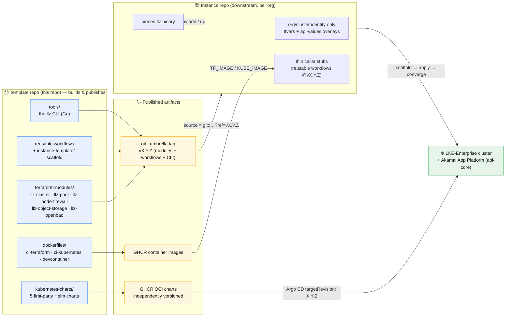
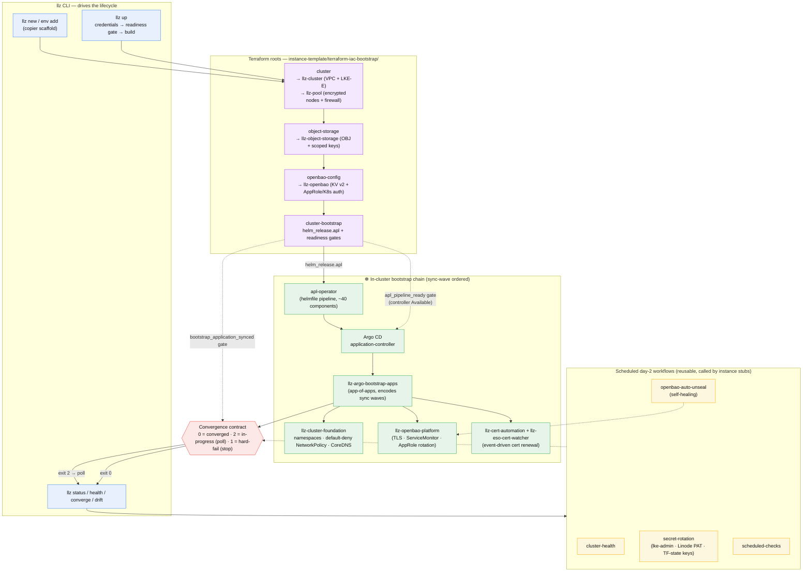

# Architecture overview

Two views of how the LKE Landing Zone (LLZ) fits together:

- The **[high-level view](#high-level-publish--consume)** — what this repo
  produces and how a downstream instance repo turns it into a running cluster.
- The **[low-level view](#low-level-how-an-instance-converges)** — the concrete
  components inside an instance: the `llz` CLI, the Terraform roots and modules,
  the in-cluster bootstrap chain, and the day-2 workflows.

> These diagrams are a map, not a contract. The load-bearing details live in the
> READMEs they point at and in
> [convergence-contract.md](convergence-contract.md). When code and a diagram
> disagree, the code wins — please fix the diagram.

## High-level: publish → consume

LLZ is a **template repo that publishes immutable, independently consumable
artifacts**. It is *not* a running deployment. A downstream **instance repo**
consumes those artifacts — pinned to one umbrella tag — and the `llz` CLI drives
it from scaffold to a converged LKE-Enterprise cluster and on into day-2.

**Key relationships**

| Edge | Meaning |
|---|---|
| Template → git tag | Modules, reusable workflows, and the `llz` CLI release **lockstep** under one bare SemVer tag `vX.Y.Z`. |
| Template → GHCR OCI | Helm charts are the **exception**: versioned independently via `Chart.yaml`, immutable by convention. |
| Tag/OCI → instance | The instance pins everything; upstream fixes arrive via a **version bump**, not a manual diff. |
| CLI → instance → cluster | The `llz` binary is the version anchor and the single driver of the whole lifecycle. |

## Low-level: how an instance converges

Inside an instance, `llz` drives four Terraform roots, the in-cluster bootstrap
chain hands off to Argo CD, and a set of scheduled workflows keep the cluster
converged on day-2. Every "is it ready?" check honours the
[three-exit-code convergence contract](convergence-contract.md).

**Reading the bootstrap chain**

1. `llz up` applies the Terraform roots in order; `cluster-bootstrap` installs the
   apl-operator via `helm_release.apl`.
2. The apl-operator runs its helmfile pipeline (~40 components) and stands up
   **Argo CD**. Terraform's `apl_pipeline_ready` gate waits for the
   `argocd-application-controller` StatefulSet to be `Available` before applying
   the bootstrap Application — otherwise it would race the pipeline.
3. The **app-of-apps** (`llz-argo-bootstrap-apps`) fans out the first-party charts
   in **sync-wave order**: foundation (namespaces, default-deny NetworkPolicy)
   before the OpenBao platform and cert automation.
4. `cluster-bootstrap` returns success **only** once
   `bootstrap_application_synced` reports `Synced + Healthy` (or the documented
   deferred-input steady state) — the single "TF has done its job" signal.
5. Day-2 reusable workflows poll the same readiness model and keep the cluster
   converged without standing operator toil.

## See also

- [README — what it ships and how it's published/consumed](../../README.md)
- [Delivery methodology — the phased path these mechanics drive](../delivery-methodology.md)
- [Convergence contract — the three exit codes in detail](convergence-contract.md)
- [Environments as a dev → staging → prod pipeline](../environments-and-promotion.md)
- [terraform-modules/README.md](../../terraform-modules/README.md) ·
  [kubernetes-charts/README.md](../../kubernetes-charts/README.md)
