# Extensions: user-enablable capabilities for llz

Status: **implemented (issue #10)** — the `llz extension` command surface, the
lifecycle registry, the built-in tier, and the git-pinned remote loader are all in
the binary on this branch. This document is the **as-built** spec. Where the design
once said something the code now contradicts, the code wins and the divergence is
called out in *Reconciliation note* below.

> **New to recipes?** Start with the hands-on
> [recipes-quickstart.md](../recipes-quickstart.md) — write a hello-world extension in a
> few minutes. This document is the deep reference behind it.

## Naming: "recipe" → "extension"

This subsystem was designed under the name **recipe** and shipped under the name
**extension**. They are the same thing. The shipped vocabulary is:

- the capability is an **extension**; the command group is `llz extension …`;
- the operator's enable/source state lives in **`.llz/extensions.yaml`**;
- the lock lives in **`.llz/extensions.lock`**;
- but each extension's **manifest file is still named `recipe.yaml`**
  (`const extensionManifest = "recipe.yaml"`), so authoring still reads "drop a
  `recipe.yaml`." That one residual "recipe" is deliberate and load-bearing in the
  loader; everywhere else the noun is "extension."

When this doc says "extension" it means the shipped value; "recipe.yaml" always
means the on-disk manifest file.

## Summary

An **extension** is a named, user-enablable capability bundle for an llz instance.
It can scaffold files into the instance repo, contribute steps to llz's gates
(`check`/`validate`), register CI jobs anchored to lifecycle positions, declare the
vars and secrets it needs, seed those secrets into a store, and surface its health
in `llz extension doctor`. Extensions come from two origins — **built-in** (compiled
into the binary) and **remote** (declarative manifests pulled from a pinned git
repo) — that share one runtime model: past the load boundary, built-in vs. remote is
invisible because both normalize to a single `Extension` value whose files are read
through an `fs.FS`.

The framework's *scope* is fixed by a real workload rather than guessed from toy
examples: it must be able to reconstruct the Rust/Spin delivery of the
`functions/ohttp` prototype from a clean llz instance plus extensions (see *The
forcing function*). The `ohttp − llz` delta is the spec.

### Reconciliation note (design → as-built)

Five design decisions in the original draft were reversed or simplified in the
shipped code. They are corrected throughout, but collected here so the delta is
legible:

| Original design said | As-built |
| --- | --- |
| concept = **recipe**, `llz recipe …`, `.llz/recipes.yaml` | **extension**, `llz extension …`, `.llz/extensions.yaml` (manifest file still `recipe.yaml`) |
| render through **copier's Jinja engine**, "byte-identical" | Go **`text/template`** with copier's `<@ @>` / `<% %>` delimiters — byte-identical to copier only for bare `<@ .var @>` substitution; the two are different template languages |
| outputs in a **separate `.llz/recipes-state.yaml`**; lock stays source-only | `Sources` **and** `Outputs` live in **one `.llz/extensions.lock`** |
| apply = **three-way render → plan → write** (create/adopt/update/conflict/respect-delete/orphan, `--force`) | apply = **render → write**; `managed` (default) overwrites, `seed` is write-once + operator-owned; `--check` is a read-only drift probe (in-sync / missing / modified / orphaned; seed files exempt). No three-way conflict plan, but the `managed`/`seed` per-file mode **did** ship |
| secrets are **declare + doctor-check only**; wiring deferred | `llz extension seed` / `unseed` **ship** — they wire declared secrets into OpenBao + GH env and revoke them |
| **provider integrations** (four VCS/runner host drivers, `ciEnv`, `platform.go`) land as Phase 0 | **not built** — there is no `platform.go`; the system is GitHub-Actions-only today. The section is retained as *design-only / future* |

## The lifecycle contract (as implemented)

The contract the implementation enforces is deliberately narrow:

- **The lifecycle has three top-level stages (IaC → Kube-Infra → App).** Above the
  phases sits a coarser axis: the delivery stack's three layers, in dependency order
  — **IaC** (Terraform provisions the cloud + cluster), **Kube-Infra** (the
  GitOps-converged platform layer), and **App** (workloads on the platform). The
  phases are the temporal cycle each stage passes through; the stage (`Stage` enum,
  `stages` registry in `lifecycle.go`) fixes the engine, the gate vocabulary, and
  the toolchain. An extension declares its `stage:`, and `llz extension stages`
  prints the layers + which extensions target each. The load-bearing rule is
  `StageMeta.PlatformGated`: **IaC and Kube-Infra checks run in the platform gate
  (`llz lint`/`validate`); App checks do NOT** — an app's quality bar (cargo
  coverage/mutants) runs in the app's own scaffolded CI, with the app's toolchain,
  on the app's PRs. That is why `akamai-functions` (stage `app`) ships its gates as a
  workflow, and its `check:`/`validate:` steps are **skipped** by the platform gate
  (`stagePlatformGated` returns false for app). An extension that targets no single
  layer declares `stage: universal` — cross-cutting and platform-gated (the lint packs).
  `stage:` is required; `universal` is the explicit value a cross-cutting extension uses
  instead of leaving it empty (`llz extension upgrade` migrates pre-v3 empty stages to it).

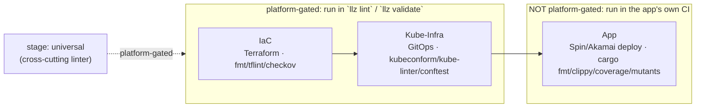

- **Lifecycle phases are core-owned.** There is one registry —
  `lifecyclePhases` in `tools/cmd/llz/lifecycle.go` — and it is the single source of
  truth. The CI anchor spine, the reconcile contributions, and the `runLint` /
  upgrade tails all *derive* from it; none re-declares the table.
  `llz extension lifecycle` (alias `anchors`) prints it. Each phase carries a
  structured set of `Runners` (`external` / `laptop` / `actions` / `bot` / `human`)
  beside its prose engine, so "what runs in CI?" is queryable, not parsed from a
  string — and a phase may legitimately span engines (Gate is laptop + Actions;
  Sustain is laptop + the Renovate bot).
- **The lifecycle has a teardown arc, not just a birth arc.** Beyond the eight
  methodology phases (and the code-only Gate / Converge), there is a code-only
  **Decommission** phase carrying the inverse actions `unseed` (revoke seeded
  secrets — the inverse of `seed`) and `teardown` (remove scaffolded files — the
  inverse of `scaffold`). This closes the `disable`→orphaned-{credential,file}
  asymmetry: `extension disable` is non-destructive and points at these gated
  actions.
- **An extension touches a phase through one of two disjoint registers.**
  - A **hook** (`HookKind`: `config`, `files`, `check`, `validate`, `ci`, `health`,
    `commands`) is a declarative artifact a phase drives. `check` is the lint tier
    (missing tool skips); `validate` is the heavyweight CI tier (tools *required*,
    folded into `runValidate`); `health` is a report-only probe surfaced by
    doctor/status; `ci` is the only hook permitted to cloud-mutate, and only at
    workflow runtime. `HookMeta.FiredBy` records *what* drives each (`reconcile` /
    `validate` / `doctor` / `startup`). A `ci:` step also has a *trigger* axis
    (`Trigger`: converge / dispatch / schedule): a `schedule:` cron emits the step
    into a separate `llz-extensions-scheduled.yml` (`on: schedule`), distinct from
    the converge-anchored `llz-extensions.yml`.
  - An **action** (`Action`: `seed`, `rotate`, `upgrade`, `unseed`, `teardown`,
    `provision`) is an imperative, usually cloud/host-mutating day-2 operation run
    *only* via a gated operator command or a cadence workflow, and **never fired by
    reconcile**. `seed` lives at Configure, `rotate` at Operate (backed by the
    `TokenRotator` interface; it *belongs to* the `llz-secret-rotation.yml` cadence
    but is operator-invoked today — recorded as `ActionMeta.DriverWired=false`),
    `upgrade` at Sustain. `ActionMeta` records each one's command, cadence driver,
    wiring status, and interface, so the day-2 story — including what is *not yet
    automated* — is legible from the registry. `TestActionDriverWiring` keeps the
    wiring flag honest against the actual workflow contents.

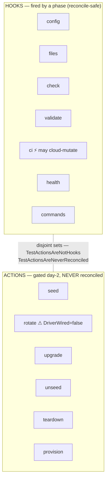

  The two registers are kept disjoint by test (`TestActionsAreNotHooks`,
  `TestActionsAreNeverReconciled`): an action can never be mistaken for a fired hook.
  There are no arbitrary `onEnable` / `onUpgrade` callbacks in either register.
- **CI anchors are only the GitHub Actions subset of the lifecycle.** A `ci:` step
  may anchor only to a phase that runs as a generated workflow job
  (`LifecyclePhase.Anchorable()` — today Converge/`converge` and Operate). A
  `post-converge` step runs only after `llz ci converge` returns exit 0 (see
  `docs/architecture/convergence-contract.md`). The other
  phases run in other engines (copier, the spec renderer, `promote.yml`, upgrade,
  humans) and are reached through their typed hook or action, not an anchor.
- **Extensions do not redefine bootstrap, promotion, or convergence.** Those are
  core phases. An extension contributes artifacts *around* them (a job that `needs:`
  converge, files re-applied on Sustain); it never owns the phase itself.
- **There are three enablement tiers, including a shipped-but-optional one.** A
  built-in ships compiled into the binary; with `optional: true` it is OFF by default
  and turned on with `llz extension enable <name>` (scaffolding from the embed), with
  `optional` absent it is always-on (core hygiene). A local/remote extension is
  opt-in but instance-authored. The optional-built-in tier is the home for **net-new**
  capabilities that should *travel with llz* yet stay off until wanted — the lint
  packs (`lint-yaml` / `lint-typos` / `lint-markdown`), `validate-trivy` (the
  heavyweight CI-tier IaC scan), `scheduled-checks`. A capability the **instance
  template already delivers** is NOT a built-in candidate: the devcontainer, for
  instance, is template-shipped and backed by a cosign-signed CI image — a built-in
  would only conflict with it (`c61006f` dropped the devcontainer built-in for
  exactly this reason).

Failure semantics live with the hook kind, not the call site (`HookMeta`): `check`
and `ci` are blocking, `files` is blocking when invoked directly but downgraded to
best-effort during upgrade, `config`/`health` is report-only, and only hooks marked
`ToolSkip` may skip on a missing external tool. Actions carry their own posture in
`ActionMeta` (`Gated` ⇒ `--yes` required before any cloud mutation), routed through
`proceedGated`.

**Tool supply.** An extension's steps need external tools, so each tool is declared
in `tools:` (`extTool{name, via, version}`). Declaration drives two things:
doctor/enable *verify* presence (a missing tool is surfaced, not a silent
check-skip), and `llz extension provision` (the Configure-phase `ActionProvision`)
*installs* the host/local set by aggregating the enabled extensions' pinned `via`
refs into a generated `.mise.toml` and running `mise`. The trust boundary is the
argv-only ceiling: an extension declares **what** to install — a pinned,
registry-resolvable ref (`pipx:yamllint`, `npm:markdownlint-cli`,
`aqua:crate-ci/typos`) — and **never how**. There is no install-script field, so a
remote, git-pinned extension cannot smuggle host execution; `mise` installs from its
backends' registries (checksum-verified), the version pins ride the source SHA+digest
lock, and the install is gated (`--yes`).

For **CI-run tools** the supply is the job's container image, not a host install: a
`ci:` step declares an `image:` and its generated job runs in `container: …`. The
image must be **digest-pinned** (`…@sha256:<64hex>`) — enforced at both
`extension lint` and workflow generation — because a remote extension's CI image runs
with the workflow's permissions. This is the right home for heavy workload kits (a
`spin`/`cargo` deploy runs in the extension's pinned toolchain image, never installed
on the runner).

## The lifecycle registry, drawn

`lifecyclePhases` is the canonical table. Index = lifecycle order; eight methodology
phases (■) plus three code-only subphases (□). Each phase lists the stages it
materializes and the hook/action surface it exposes to extensions.

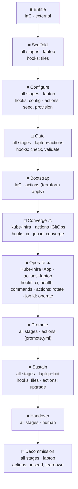

⚓ = Anchorable (`CoreJobID != ""`); a `ci:` step may anchor only here.

## Motivation

llz already had two patterns that bracket what we want:

| Pattern | What it is | Lives where |
| --- | --- | --- |
| `.llz/commands.yaml` (`ext.go`) | operator's ad-hoc shell aliases; no scaffolding; unversioned | operator repo, committed |
| checks/steps (`checks.go`) | curated capabilities (lint/validate), compiled into the binary "so they propagate with the binary instead of via copier update" | embedded in llz |

Neither covers the middle: a **curated, versioned, optional** capability that bundles
scaffolded files with the steps that consume them. The gap is visible in
`checks.go`'s own header — the lint *steps* ship with the binary while the lint
*configs* (`.tflintrc.hcl`, `.gitleaks.toml`, `.checkov.yaml`) still ship via copier,
so the two halves version independently and drift.

Why remote extensions are declarative: an extension fetched at runtime cannot be
compiled Go (plugins are platform-fragile and version-locked). A remote extension is
`commands.yaml`'s declarative argv model extended with scaffolding, templating, and
versioning. Everything flows through the existing `run` / `runGated` seam, so
`--dry-run`, the `→ argv` echo, and tool-skip carry over unchanged.

The scaffolder-first thesis (`extension.go` header): the relief valve for core bloat
is a **gradient** — `llz extension new` must make a well-formed, testable,
ceiling-respecting extension cheaper to create than a new `ci_*.go` in core, so the
path of least resistance points OUT of the binary. The `extension lint` ceiling
(argv-only manifest; logic-bearing `kind: check` extensions must ship tests) travels
*with* the extension rather than being enforced in core.

> **Stale code comment.** `extension.go`'s top comment still frames this as a
> two-command "EXPERIMENT" with "the loader/registry, git fetch, and the lock … out
> of scope." That was true at the spike; the loader, registry, remote git fetch, and
> SHA/digest lock all shipped since. Treat this document, not that header, as the
> current contract.

## The forcing function: rebuild ohttp atop llz

The framework's feature set is derived from a real delta, not invented from toy cases.

**History.** `functions/ohttp` (the `ohttp-bits` remote) is the **prototype that
predates llz**; llz was generalized and extracted *from* it. ohttp is a hybrid
monorepo: Rust/Spin functions (relay/gateway/target-echo), `terraform-iac-bootstrap/`,
`apl-values/`, a native Rust `tools/` workspace, and the full CI quality bar — all in
one repo.

**The vehicle.** Reconstruct ohttp's Rust/Spin delivery from **llz + extensions**
instead of as a bespoke repo, and use that as the forcing function. The delta between
a base llz instance and ohttp is the extension spec.

**The delta (`ohttp − llz`).** It clusters into:

- **`akamai-functions/` Rust + Spin components** — relay, gateway, target-echo. Each
  a standalone Cargo workspace (`crate-type=["cdylib"]`, `spin-sdk` v6, thin Wasm
  adapter over a `*-core` crate, Wasm-tuned release profile) with `spin.toml`.
- **CI + deploy** — the build-wasm → e2e → deploy pipeline, the
  `spin-cloud-deploy` composite action, `scripts/app/deploy-{local,cloud}.sh`.
- **Secrets/vars** — `FERMYON_CLOUD_TOKEN`, `OHTTP_KEY_SEED`,
  `PAT_ISSUER_PRIVATE_PEM`, `PAT_ORIGIN`; GH-environment secrets.
- **apl-values / manifests** — PAT issuer deployment, otel/gateway Istio ingress,
  OHTTP AppProjects + Grafana dashboards.
- **Toolchain** — `spin`, `wasm32-wasip2`, the pinned `ci-rust` image.

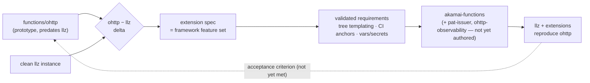

**What the delta validates.** Three requirements:

1. **Tree scaffolding + templated values.** ohttp needs a whole `akamai-functions/`
   subtree with substituted values — not a flat list of byte-for-byte copies.
   *Built:* `extFile.Src` may be a directory; `renderScaffold` walks it and renders
   every file (`e040bde`).
2. **CI contribution as a multi-step job, not a single argv.** The deploy is
   `build → e2e → deploy` with secret injection — a workflow fragment bound to a
   lifecycle anchor. *Built:* `extension_ci.go` lowers `ci:` steps (anchor +
   `dependsOn` + `schedule` + `image`) into a `needs:`-chained workflow.
3. **A secrets/vars contract.** *Built:* `vars:` / `secrets:` declarations checked by
   `extension doctor`; `secrets:` additionally carry optional `bao`/`ghEnv` targets
   that `extension seed` wires.

**Where the criterion stands today.** The shipped `akamai-functions` kit
(`external-candidates/`) is the **app-agnostic delivery machinery** — CI pipeline,
deploy action/script, toolchain, the Fermyon secret, and a reusable Rust quality bar
— and **no workload**. It is the reusable ~20%. The OHTTP-specific 80% (the crates,
the multi-gateway shared-`OHTTP_KEY_SEED` coordination, the PAT issuer, the
observability/apl-values) is still "bring your own app" plus the not-yet-authored
`pat-issuer` / `ohttp-observability` extensions. **The acceptance criterion —
"reproduces a working `functions/ohttp` deployment" — is therefore not yet met**; the
kit covers delivery, not the workload's stateful coordination.

## Extension vs. chart: when to reach for which

If I want to ship an optional capability, why not just publish another Helm chart
under `kubernetes-charts/`? Because the two operate on **different layers and at
different times**.

| | Helm chart (`kubernetes-charts/*`) | Extension |
| --- | --- | --- |
| Operates on | the **cluster** — runtime Kubernetes state | the **instance repo** + the operator's gate/CI/doctor workflow |
| Artifact | templated K8s manifests | scaffolded repo files + steps bound to `check`/`validate`/`ci`/`health` |
| Delivered by | OCI publish → ArgoCD sync | the scaffold pipeline, written into the repo and committed |
| Acts at | cluster runtime (reconcile loop) | author / commit / validate / CI / doctor time — no cluster required |
| Reconciler | ArgoCD (sync, prune, self-heal) | `render → write`; `--check` drift; enable/disable lifecycle |
| Versioned as | chart version + OCI tag | source tag (remote) or the binary (built-in) |
| Answers | "what must be *running in* the cluster" | "what must be *in the repo* and enforced around it" |

**The decision rule.** Is the thing *Kubernetes runtime state* — workloads, policies,
CRs that must exist in a cluster to have any effect? That is a chart;
`llz-cluster-foundation` is the archetype. Is it instead *repo-side capability* —
config files plus the gates, CI steps, and health checks that consume them at
author/build time? That is an extension.

**They compose; they don't compete.** An extension is the natural way to ship the
*repo-side half* of a chart-backed capability: scaffold the ArgoCD `Application` (or
the chart's values override), add a `check` step that lints those values, add a
`health` step that reports the chart's sync status — while the chart itself still does
all the in-cluster work.

### What an extension gives you that a chart cannot

- **It gates your workflow.** A chart cannot fail your pre-commit or block
  `llz validate`; an extension contributes blocking `check` / `validate` steps.
- **It scaffolds into the repo and keeps files + steps in lockstep**, closing the
  copier/binary drift the framework exists to fix. The lock records each owned file's
  digest so `--check` measures drift and `extension exclude` fences copier off.
- **It reports in doctor.** Tool presence, declared-secret presence, per-file drift
  surface in `llz extension doctor`.
- **It has an operator-legible lifecycle.** `extension enable` / `disable`, the
  `extensions.yaml` diff, and the lock make "is this capability on" a reviewable repo
  fact.
- **It needs no running cluster.** Extensions act at author time.

The inverse holds and bounds the framework: anything whose entire job is to put
resources *into* a cluster should stay a chart.

## Concepts

### The instance lifecycle extensions hook into

An llz instance moves through the fixed spine (the `lifecyclePhases` registry). The
verbs an extension contributes at each step:

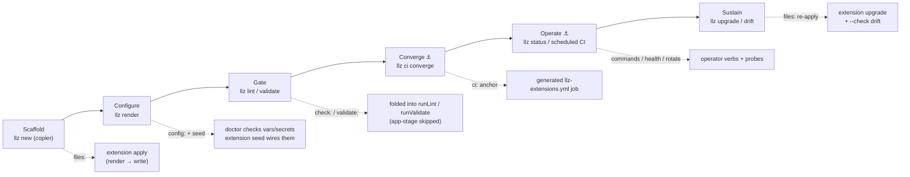

Two **delivery channels** already feed this spine; extensions are a *third*:

1. **Copier** — files rendered from `instance-template/`, governed by
   `.template-manifest`'s ownership classes. Updated by `llz upgrade`.
2. **Binary-embedded logic** — checks/ci/commands compiled into llz.
3. **Extensions (new)** — unify built-in + remote, scaffold files *and* contribute
   logic, re-applied by `llz extension apply`. To keep channel 3 from fighting
   channel 1, extension-owned paths are recorded in the lock and emitted as a copier
   `_exclude` block by `llz extension exclude`.

### The extension state lifecycle

Distinct from the instance spine, an extension itself moves through a
framework-owned state lifecycle:

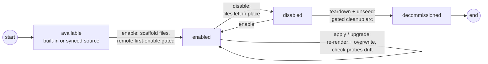

Note the asymmetry the Decommission arc closes: `disable` is intentionally
non-destructive (it never deletes a file or revokes a credential), so `teardown` and
`unseed` are the *separate, gated* inverses of `scaffold` and `seed`. While disabled,
`doctor` flags the orphaned files and seeded secrets the extension left behind.

### Hook points

Rule: **a hook point exists only when a shipping extension needs it.** Every hook is
a typed `HookKind`; there are no arbitrary-code callbacks. The set:

| Hook | Fired by | Posture / failure semantics |
| --- | --- | --- |
| `config` | reconcile (readiness) / `doctor` | report-only; a missing *required* secret fails the doctor gate |
| `files` | `extension apply`, `enable`, upgrade tail | blocking when invoked directly; best-effort under `upgrade` |
| `check` | `runLint` / `extension reconcile` | blocking; tool-absent skips with a warning; **app-stage skipped** |
| `validate` | `runValidate` | blocking; a missing tool is a **hard failure** (not a skip); **app-stage skipped** |
| `ci` | generated workflow at its anchor | step-declared blocking; the only hook that may cloud-mutate (at workflow runtime) |
| `health` | `doctor` / status | report-only — never blocks |
| `commands` | CLI startup (`addExtCommands`) | registration, not a phase firing |

Two deliberate properties:

- **Failure semantics belong to the hook kind, not the extension** (`HookMeta`), and
  `applyPosture` reads the table — so flipping a hook's `Posture` actually changes
  behavior, and a remote extension cannot opt its `health` step into blocking.
- **Hooks are data, not callbacks.** An extension attaches *steps* (name, argv,
  anchor) to named points. The complete set of moments where remote-supplied argv
  executes is `check` / `validate` / `ci` — all operator-initiated, all echoed
  through `run()`.

### The Extension value: one type, two origins

The only real difference between a built-in and a remote extension is *where its
files live*. Hide that behind `fs.FS` and no downstream code branches on origin.

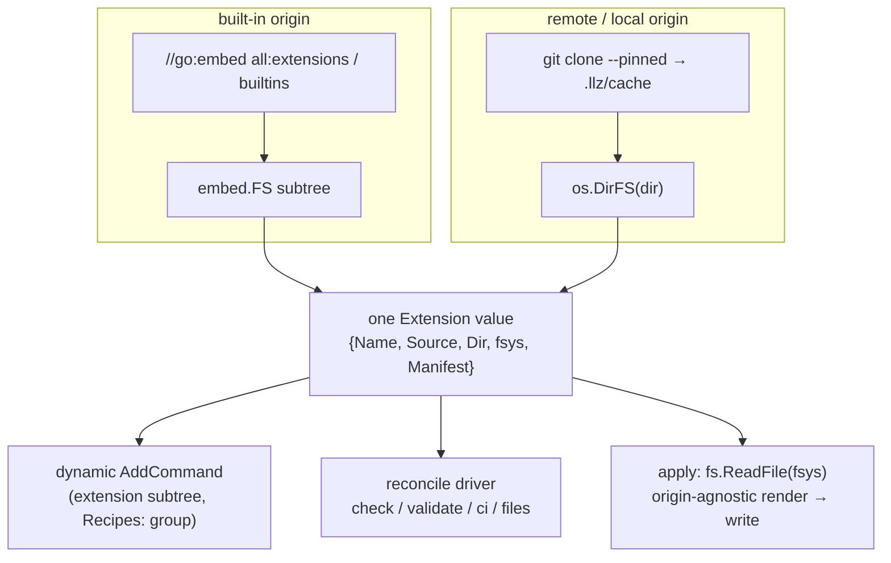

```go
// extension_value.go — the single runtime value both origins load into.
type Extension struct {
    Name     string
    Source   string      // "" built-in | "host/path@ref" remote
    Dir      string
    fsys     fs.FS       // embed.FS subtree (built-in) | os.DirFS(dir) (remote/local)
    Manifest extManifest
}

// extension.go — the declarative manifest (recipe.yaml).
type extManifest struct {
    SchemaVersion int                       // absent/0 ⇒ v1; current extSchemaVersion = 3
    Name, Short   string
    Kind          string       // "check" | "tool" | "observability"
    Stage         Stage        // required: "iac" | "kube-infra" | "app" | "universal" (cross-cutting)
    Optional      bool         // built-ins: ships but OFF by default
    Tools         []extTool    // {name, via, version}; provision installs, doctor verifies
    Vars          []extVar     // {name, default, doc}
    Secrets       []extSecret  // {name, doc, required, bao, ghEnv}
    GHVars        []extGHVar   // {name, default, doc, required, image, ghEnv} — GitHub Actions variables (required = live-runtime readiness)
    Files         []extFile    // {src, dst, mode} — src may be a directory (whole subtree); mode: managed|seed
    Check         []extStep    // lint-tier gate
    Validate      []extStep    // CI-tier gate (tools REQUIRED)
    CI            []extStep    // {name, anchor, schedule, image, argv, dependsOn}
    Health        []extStep    // report-only probes
    Commands      []extCommand // operator CLI (reuses ext.go's extCommand)
    Rotate        *extRotate   // {argv, secret} — the TokenRotator interface
}
```

The reconcile driver replaces the old hardcoded loops: `Contribution` implementations
(`extension_reconcile.go`) are sorted by `phaseIndex` and run in lifecycle order over
built-ins + enabled extensions. A remote `check: [{argv: […]}]` becomes a step whose
`run` is `func(g) error { return run(g, argv...) }` — inheriting `--dry-run`, the argv
echo, and tool-skip from the existing seam.

## The scaffold (apply) pipeline — as built

> The original design specified an elaborate three-way `render → plan → write` model
> (recorded vs. desired vs. actual, with create/adopt/update/conflict/respect-delete/
> orphan actions, a `--force` override, and a per-file `managed`/`seed` ownership
> mode). **None of that shipped.** The as-built pipeline is render → write, with a
> read-only `--check` drift probe. The richer model is retained below under *Deferred:
> three-way apply* as a future option, but it is not the current behavior.

`extension apply` (`extension_scaffold.go`) has two stages:

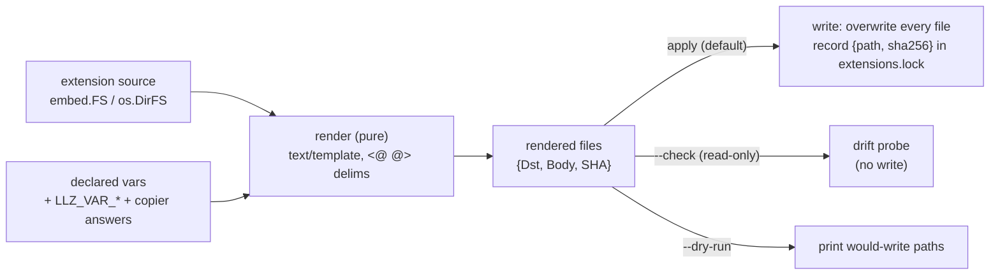

- **render** — pure: walk each `files:` entry (a file *or* a directory subtree),
  render every body through Go `text/template` with copier's `<@ @>` / `<% %>`
  delimiters, substituting `name` / `instance_repo` / `upstream_org` / declared vars
  (overridable by `LLZ_VAR_<NAME>`). `Dst` is fixed at author time (only file *bodies*
  are templated). `WalkDir` lexical order ⇒ a deterministic lock.
- **write** — for each rendered file, behave per its `mode:` (`extFile.Mode`):
  - **`managed`** (default) — overwrite, `MkdirAll` parents, record `{path, sha256,
    mode}` in `.llz/extensions.lock`. Apply is authoritative; operator edits are
    *surfaced* by `--check`, not preserved.
  - **`seed`** — write only when the file is *absent*; if it already exists the operator
    owns it and apply leaves it untouched (still recorded in the lock so `exclude` /
    `teardown` know the path). For *starter* configs an operator is meant to customize
    (`deny.toml`, a mutation config), so a re-apply/upgrade never clobbers their tuning.

  Default is `managed` (the safe-for-the-extension direction: a stale managed file is
  caught by `--check`; a wrongly-`seed` file just goes stale). `seed` is the explicit
  opt-out for operator-owned starter files.

### `--check`: the drift probe

`--check` writes nothing and exits non-zero on any drift, classifying each path:

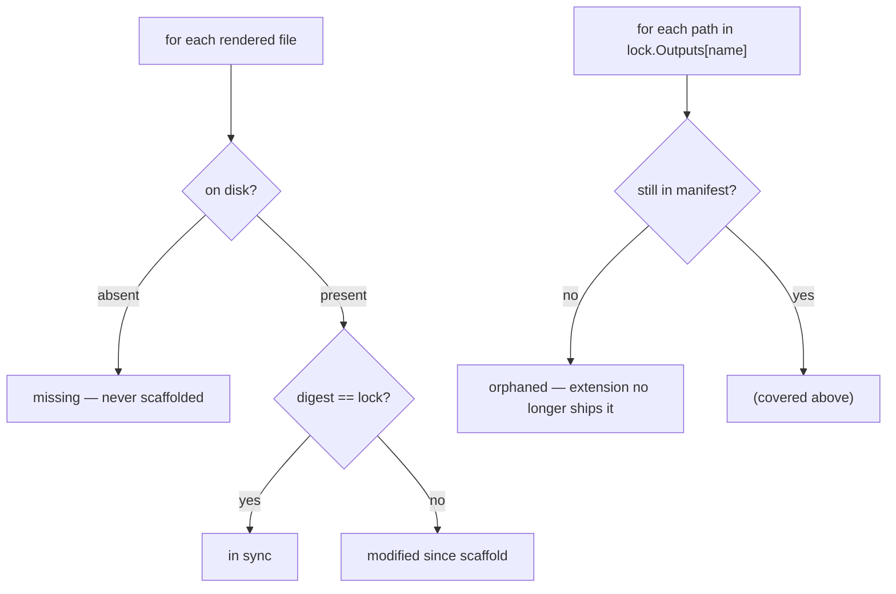

So the as-built outcomes are exactly four: **in-sync**, **missing**, **modified**,
**orphaned**. `extension upgrade` re-runs apply (overwriting managed files), which is the
resolution for *modified* and *missing*; *orphaned* files are reported for manual removal
(or removed by `extension teardown`). **`seed` files are exempt** from the missing/modified
classification — they are write-once and operator-owned, so a hand-edit or deletion is
never drift (the orphan check still applies if the extension drops the file entirely).

### Template engine reconciliation

The design called for "the same Jinja engine copier uses … byte-identical." The code
uses **Go `text/template`**, not Jinja. The delimiters match copier's (`copier.yml`
sets `_envops` to `<@ @>` for variables and `<% %>` for blocks, chosen because the
tree is bash- and Actions-heavy and the default `{{ }}` would collide), so a bare
`<@ .var @>` substitution renders identically across copier, built-in, and remote.
But Go templates and Jinja diverge on anything richer (filters, loops, conditionals),
so the "byte-identical for all inputs" guarantee holds **only for plain variable
substitution** — which is all the shipping extensions use.

### Fencing copier off

Every file apply writes (or seeds) is recorded in `.llz/extensions.lock`. `llz extension
exclude` emits those paths as a copier `_exclude:` block so `copier update` never clobbers
a path an extension owns. Together with the per-file `mode:` (`managed` / `seed`), this is
the "fourth ownership class" alongside copier's `managed` / `merge` / `owned`.

### Deferred: full three-way conflict apply

The `seed` mode gives the common operator-owned-file case (write-once, never clobber). The
heavier original design — a full three-way `desired × recorded × actual` classification
into create / adopt / update / conflict / respect-delete / orphan, with `--force` to
override a *conflict* on a `managed` file — is **not** implemented. The lock already stores
the per-file digest that would serve as the "recorded" base, so it remains an additive
change to `applyExtensionFiles` if a managed-file-merge case ever appears; today a managed
file is authoritative (overwrite) and `seed` covers the rest.

## Vars, secrets, and ghVars

The ohttp delta forces a configuration contract. The manifest **declares** its inputs in
three categories — render `vars`, `secrets`, and GitHub Actions `ghVars` (see *the third
input category* below); the framework checks, prompts, and (for secrets/ghVars with a
target) wires.

```yaml
# recipe.yaml
vars:
  - { name: gateway_url, doc: "public OHTTP gateway URL", default: "" }
  - { name: app_suffix,  doc: "per-env Fermyon app suffix" }
secrets:
  - { name: FERMYON_CLOUD_TOKEN, doc: "Fermyon deploy token", required: true, bao: "secret/akamai#fermyon_cloud_token", ghEnv: infra-prod }
  - { name: OHTTP_KEY_SEED,      doc: "HPKE key seed",         required: true }
```

- **`vars`** feed `render` and resolve from `LLZ_VAR_<NAME>` → declared default
  (with `name`/`instance_repo`/`upstream_org` always available). A required var with
  no value is a `doctor` finding.
- **`secrets`** are checked by `doctor` (a missing *required* secret is a hard
  finding) against the environment (the `TF_VAR_*`/CI model — the value is read from
  env, never stored in the manifest, repo, or lock).
- **Wiring shipped** (reversing the design's "declare-only first cut"): a secret may
  carry a `bao: "path#key"` and/or `ghEnv: <env>` target. `llz extension seed`
  (gated, `ActionSeed`) reads the value from the environment at seed time and wires it
  into OpenBao and/or the GitHub Environment; `llz extension unseed` (gated,
  `ActionUnseed`) revokes it — deletes the GH env secret, prints the OpenBao removal
  (shared-path safety). `extRotate{argv, secret}` (the `TokenRotator` interface) mints
  a fresh token and re-seeds it through the same targets.
- **Targets may reference a render var**: a `bao` / `ghEnv` address (and a ghVar's
  `ghEnv`) is resolved through the manifest's render vars (`renderString`), so a single
  declared var single-sources an address used in more than one place — e.g.
  `ghEnv: "<@ .gh_env @>"` makes one `gh_env` var drive both the scaffolded workflow's
  `environment:` and the secret's seed target, with no duplicated literal. This is bounded
  to target-address fields, deliberately *not* a general manifest-templating axis.

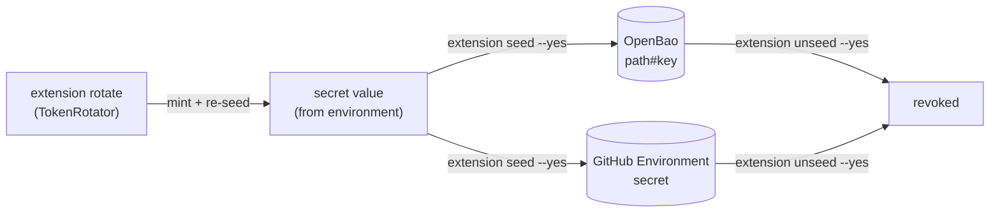

### GitHub Actions *variables* — the third input category (`ghVars:`)

The manifest models **three** input kinds, because a scaffolded workflow consumes a third
that is neither a render var nor a secret:

- **`vars:`** — render-time: substituted into scaffolded file *bodies* at apply time.
- **`secrets:`** — sensitive: read from env at seed time, wired into a store, never stored.
- **`ghVars:`** — non-secret GitHub Actions *variables* a workflow reads as `${{ vars.* }}`
  at workflow runtime. The workflow file ships verbatim (the runner resolves the
  expression, not `render`), and the value is config, not a credential — so a `Default`
  is allowed (unlike a secret). `llz extension seed` pushes a ghVar's `Default` (or
  `LLZ_VAR_<NAME>` override) to the repo/Environment variable via `gh variable set`; a ghVar
  with no value to push is skipped (it is set on GitHub directly), never an error. A ghVar
  that holds a container image is marked **`image: true`**: its `Default` must be
  digest-pinned, and a workflow `image: ${{ vars.NAME }}` is only accepted when `NAME` is an
  `image` ghVar (see the image-pin section).

  **`required` for a ghVar means live-runtime readiness, not local seed-material.** A ghVar's
  source of truth is GitHub, so it is **not** checked offline — a required ghVar like
  `RUST_IMAGE` legitimately has no local default and is set directly on the repo, and an
  offline "no default ⇒ fatal" check would fail a correctly-configured instance. Instead the
  live `doctor` pass (`liveGHVarFindings`) is authoritative and fails **only on a confirmed
  problem**: a required, non-seedable ghVar the live lookup proves *absent* is fatal; an
  unreachable GitHub yields a non-fatal **"unverified"** row (an offline doctor cannot prove
  live state); a set value is clean; a set-but-mutable `image:` value is a non-fatal advisory.

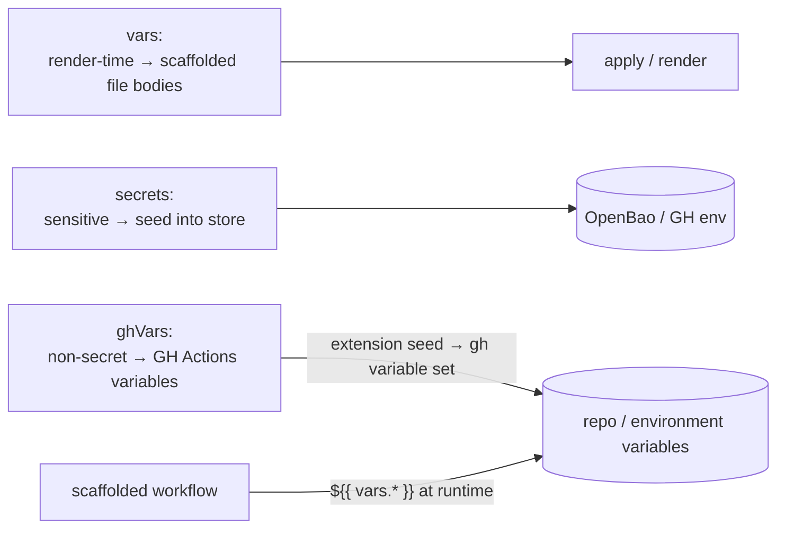

`akamai-functions` declares all four variables its workflow reads — `RUST_IMAGE` /
`GHCR_USER` (`required`, no default → `doctor` warns until set) and `SPIN_MANIFEST` /
`APP_SUFFIX` (with defaults). Declaring `RUST_IMAGE` here is also what lets its workflow's
`image: ${{ vars.RUST_IMAGE }}` pass the workflow image-pin lint (next section): a declared
ghVar is an operator-owned, reviewable image source. Before `ghVars:`, `RUST_IMAGE` /
`GHCR_USER` were declared nowhere and `SPIN_MANIFEST` / `APP_SUFFIX` were mis-declared as
render `vars:` (never rendered), so the CI variable contract was invisible to `doctor`.

## CI contribution: anchors, triggers, and multi-step jobs

An extension's CI is more than a single argv. Two mechanics cover the ohttp deploy
shape (`build → e2e → deploy`, with the deploy gated behind cluster convergence)
without a full DAG language.

- **Anchors.** Each `ci:` step binds to a small enum of lifecycle positions
  (`extension_ci.go`): `pre-converge` (an edge *into* the core converge job),
  `post-converge` (runs only after `llz ci converge` returns 0), and `operate`. The
  anchor target must be an `Anchorable()` phase (`converge` / `operate`).
  `dependsOn` adds arbitrary inter-step edges. There is deliberately **no**
  "mid-converge" anchor — a `needs:` edge cannot splice into a step *inside* a
  reusable workflow.
- **Triggers.** The `Trigger` axis is *when* a step's job runs: `converge` (anchored
  into the generated bootstrap DAG), `dispatch` (`workflow_dispatch`), and
  `schedule` (a `schedule:` cron emits the job into a separate
  `llz-extensions-scheduled.yml`). All three are wired (`TestCITriggersWiredHonesty`).

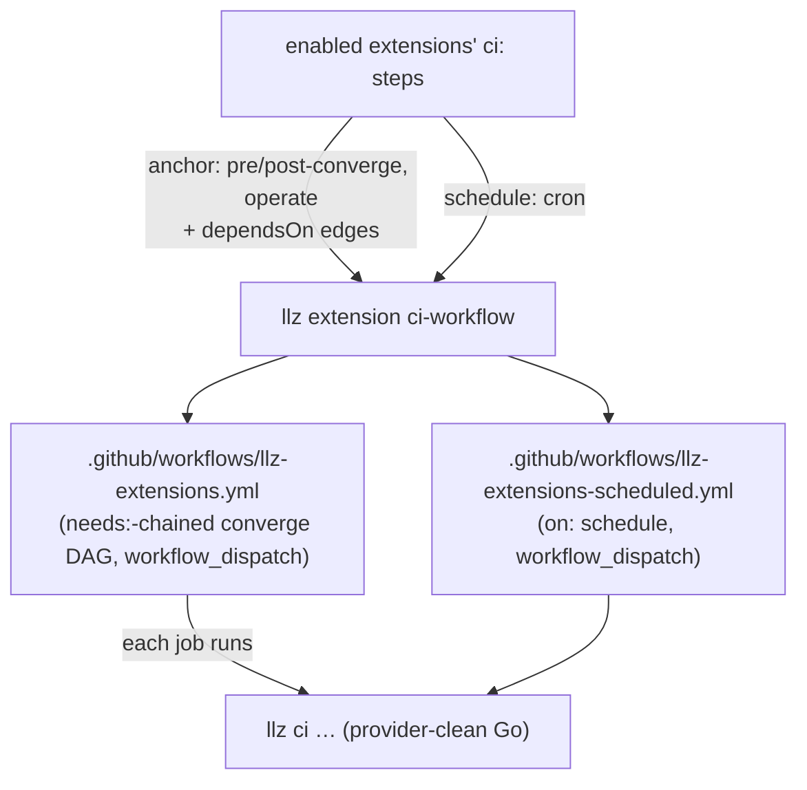

llz never edits a workflow in place: `ci-workflow` regenerates the two files from the
enabled set, and each generated job shells back into a stable `llz ci …` entrypoint.
A `ci:` step that deploys declares a digest-pinned `image:`, so the deploy runs in the
extension's toolchain container with the workflow's permissions.

### Two CI patterns — both first-class

There are **two** legitimate ways an extension contributes CI, and the framework should
bless both explicitly rather than implying every CI extension should use `ci:`. The
choice is not optional taste — it follows from what the job needs:

| | **Lifecycle CI** (`ci:` hook) | **Scaffolded workflow** (`files:` workflow) |
| --- | --- | --- |
| Mechanism | `ci:` steps → codegen into `llz-extensions.yml` / `…-scheduled.yml` | a workflow `.yml` shipped as a `files:` entry |
| Shape it expresses | a `needs:`-chained DAG of `llz ci …` jobs, anchored to converge/operate | anything GitHub Actions can express: matrix jobs, private-container credentials, environment-gated deploys, path filters, artifact flow, app-specific triggers |
| Lifecycle-coupled? | yes — ordered against the core converge/operate spine | no — runs on its own triggers (PR/push/dispatch), often against an external target |
| Typical stage | `kube-infra`, `universal` (scheduled monitors) | `app` (the workload's own pipeline) |
| Owns | the platform's converge-time and scheduled checks | the application's build → test → deploy |

`akamai-functions` is the **scaffolded-workflow** pattern, by design: its pipeline
needs a matrix, a private GHCR container, an environment-gated deploy, and a target
that is Fermyon/Akamai (a SaaS), not the LKE cluster — so the `post-converge` anchor is
semantically irrelevant and the `ci:` DAG cannot express the job. This is correct, not a
workaround. `HookCI` is therefore *lifecycle* CI only; an app pipeline is `HookFiles`,
and the framework owns it through **scaffold + drift**, not codegen.

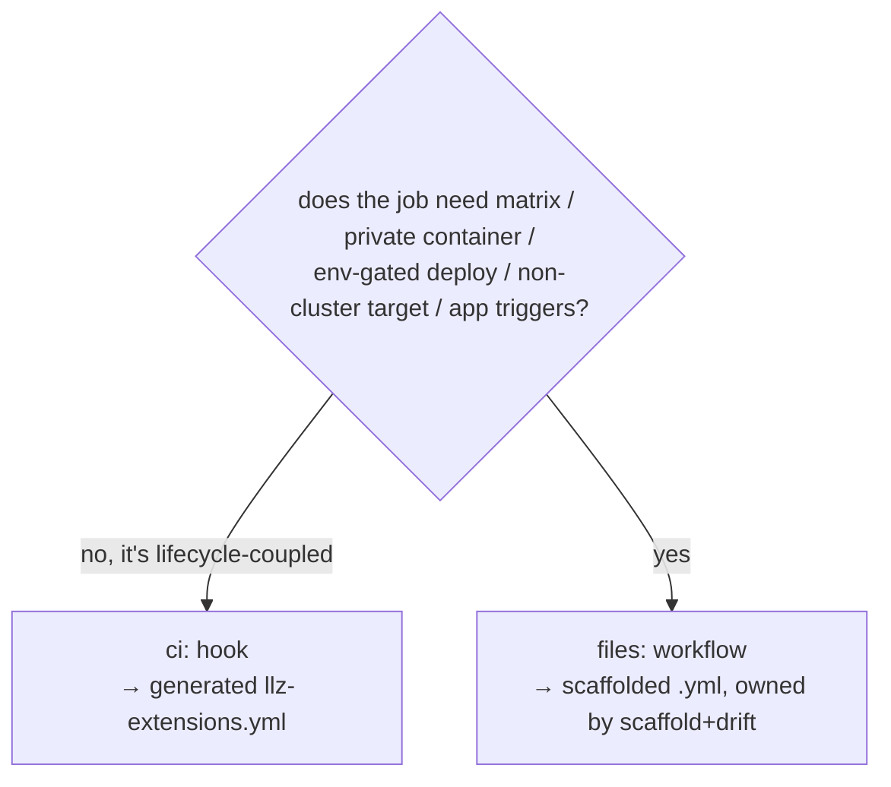

### Digest-pin parity for scaffolded workflows

`validateCIImage` pins `ci:` step images, but a workflow shipped as a `files:` blob would
otherwise escape that check while still running with the workflow's permissions — the
app-kit pattern that needs it most. `lintWorkflowImages` (`extension_ci.go`) closes the
gap: for every `files:` entry that targets `.github/workflows/**`, it reads the source and
requires each `image:` / `container:` reference to be either **digest-pinned**
(`…@sha256:<64hex>`) or a **`${{ vars.NAME }}` whose `NAME` is an `image: true` ghVar** —
an operator-owned, `doctor`-checked image source whose own `Default` is digest-pin-enforced
by `lintManifest`. A mutable `:latest`, an undeclared `vars` reference, or a declared but
**not** `image`-flagged ghVar is a lint finding. This ties the sections together:
`akamai-functions` passes because `RUST_IMAGE` is declared `image: true`, and the check
holds without forcing the app pipeline into the `ci:` DAG.

The scan is line/flow-map regex, **not** a structural YAML parse — deliberately. A GitHub
Actions workflow is not strict YAML: `${{ … }}` expressions in flow-map positions (e.g.
`credentials: {username: ${{ vars.X }}}`) fail a standard YAML parser, and `render` does
not remove them (they are runtime, not `<@ @>`). So a structural parse would need a
GitHub-expression-aware preprocessor; the scan handles both the block `image:` and the
flow-map `container: {image: …}` forms (the latter via `reFlowMapImage`, capturing a whole
`${{ … }}` value), the same tactic actionlint uses. The **live** variable value is now covered by an advisory
`doctor` pass (`liveGHVarFindings` — see *Vars, secrets, and ghVars*): lint pins the declared
`Default`, and `doctor` best-effort verifies the value actually set on GitHub is pinned. The
one residual gap is any exotic YAML layout the line scan could miss — acceptable while this
is an experiment; a GitHub-expression-aware parser is the eventual end-state, not generic
YAML.

## Per-repo state

Two committed files plus a gitignored cache:

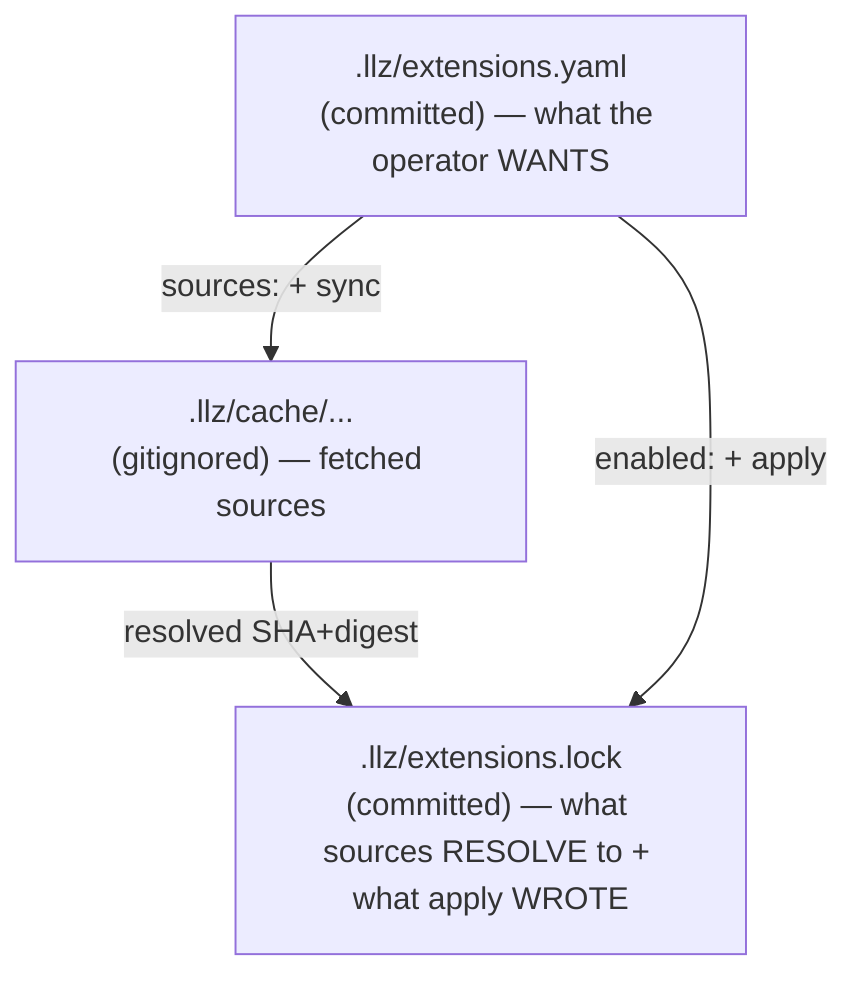

**`.llz/extensions.yaml`** (`extConfig`) — *what the operator wants*:

```yaml
dir: extensions            # local extensions directory (default)
sources:                   # git-pinned remote taps
  - { repo: github.com/apple/llz-extensions, ref: v1.4.0 }   # tag or SHA; floating refs drift
enabled:                   # names that are ON (built-ins implicit unless optional)
  - akamai-functions
```

**`.llz/extensions.lock`** (`extLock`) — **one file, two maps** (the design's separate
`recipes.lock` + `recipes-state.yaml` were merged):

```yaml
sources:                   # per-source resolved pin (the trust base)
  github.com/apple/llz-extensions:
    ref: v1.4.0
    sha: <commit>
    digest: <tree-hash>
outputs:                   # per-extension owned files (the drift + exclude base)
  akamai-functions:
    - { path: .github/workflows/akamai-functions.yml, sha256: <digest> }
```

**`.llz/cache/...`** (gitignored) holds fetched sources.

## Remote extensions

### Authoring model

A remote source is a **tap**: one directory per extension, each with a `recipe.yaml`;
one repo tag versions all extensions in it. Discovery is **by scan** — after cloning
the pinned source into the cache, llz globs for `recipe.yaml` manifests; no index
file to drift.

```
llz-extensions/
  renovate/recipe.yaml
  akamai-functions/
    recipe.yaml
    files/                 # a whole subtree, rendered with vars
      .github/workflows/akamai-functions.yml
      scripts/app/{quality,deploy-cloud}.sh
```

### Transport: git, pinned

Source = git repo + tag/SHA. Fetch via the existing git shell-out through `runGated`
(`git clone --depth=1 --branch <ref> …`) into `.llz/cache/<host>/<path>@<ref>`, then
`rev-parse HEAD` for the SHA and a tree hash for the digest, verified against
`.llz/extensions.lock`. The source spec is host-qualified, so a tap can live on any
git host.

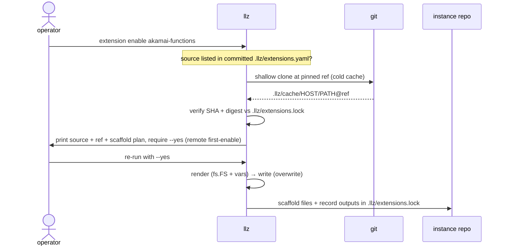

Network policy: **never touch the network implicitly except on a cold cache.** On
fetch, verify SHA + digest against the lock — hard error on mismatch. Re-resolve
upstream refs only on an explicit `llz extension sync --update`.

## Trust model

Remote extensions execute third-party argv and write files. Mitigations:

- **Pin + lock** — sources resolve to SHA + digest in `.llz/extensions.lock`;
  floating refs drift; mismatch is a hard error.
- **Cache re-verification** — `verifyRemoteCache` recomputes tree digests at load
  time, catching a tampered/stale cache, not only at fetch.
- **Allowlist by construction** — llz only fetches sources listed in the committed
  `.llz/extensions.yaml`; adding a source is a reviewable diff.
- **First-enable gated** — remote scaffolding refuses without `--yes`; prints source
  + ref + plan first.
- **Argv-only ceiling** — `extension lint` rejects inline shell; an extension invokes
  tools by name (tool-skip applies); it cannot fetch-and-run an arbitrary binary, and
  `tools:` declares *what* to install, never *how*.
- **Bounded execution moments** — remote argv runs only at `check` / `validate` /
  `ci`, all operator-initiated, all echoing through `run()`.
- **Secrets never leave the operator** — values are read from env at `seed` time and
  never written to the manifest, repo, lock, or cache.

Net blast radius equals `.llz/commands.yaml` today (runs argv against tools you have,
writes files you review in the diff) — just versioned, pinned, and shared.

## Provider integrations (VCS + runner) — DESIGN ONLY, NOT BUILT

> The original Phase 0 called for a multi-provider integration layer (host drivers
> for github / ghe / gitlab / bitbucket, a `ciEnv` normalizer, per-provider core CI
> surface, and a `platform:` selector in `platform.go`). **None of this is
> implemented** — there is no `platform.go`, and the system is GitHub-Actions-only.
> The section is retained as a future design; everything below is aspirational.

The intent: VCS/runner support is a **first-class integration, not an extension** —
exactly one per instance, chosen once at `llz new`, backing the *core* product
(terraform/bootstrap CI, secret push, repo create) with compiled-in Go. Because it is
load-bearing for the core landing zone, it cannot be an optional declarative
extension; it would be the foundation extensions ride on.

It would supply three things the rest of llz consumes:

1. **Host driver** — `dispatch` / `setSecret` / `setVariable` / `createRepo` /
   `pushRepo`, with `github` / `ghe` / `gitlab` / `bitbucket` implementations,
   hoisting today's scattered `gh …` argv builders and the `ghHost()` / `LLZ_GH_HOST`
   seam. The `secrets` seed/unseed wiring would resolve through `setSecret` here.
2. **Runner env (`ciEnv`)** — normalizes runner env vars so every `llz ci …` step is
   provider-agnostic Go instead of reading `$GITHUB_*` directly.
3. **Core CI surface** — the core pipeline files in each runner's dialect.

Until that exists, extensions' CI codegen emits GitHub Actions only, and a `files:`
entry's `platform:` selector (also unbuilt — `extFile` is `{src, dst}` today) would be
the eventual mechanism for shipping one workflow variant per runner.

## Command surface

`llz extension` parent command (Cobra subtree, `Recipes:` help group). Twenty
subcommands, grouped by lifecycle role:

| Group | Commands |
| --- | --- |
| **author** | `new <name> --kind check\|tool\|observability` · `lint <dir>` (the ceiling) · `wiring <dir>` (copier/renovate glue) |
| **enable** | `list` · `enable <name>` · `disable <name>` · `sync [--update]` |
| **scaffold** | `apply [dir] [--check]` · `adopt [--dry-run]` (enable + record migrated-in files) · `exclude` (copier `_exclude` block) · `upgrade [dir]` (schema migrate + re-apply) |
| **configure** | `doctor` · `seed --yes` · `unseed [name] --yes` · `provision --yes` |
| **operate** | `reconcile` · `rotate [name] --yes` |
| **decommission** | `teardown [name] --yes` |
| **introspect** | `lifecycle` (alias `anchors`) · `stages` · `ci-workflow [dir]` |

Compatibility surface (unchanged verbs): `llz lint` folds in enabled extensions'
`check:` steps via the reconcile driver; `llz validate` folds in `validate:` steps;
`llz upgrade` runs `extension upgrade` in its tail. Collision rule (from `ext.go`):
built-ins win; extension commands warn-and-skip on clash.

## Wiring into current code

- **check** — `runLint` fires the gate contribution (`runExtensionChecks`), which
  iterates enabled extensions in lifecycle order, skipping app-stage and
  tool-absent steps.
- **validate** — `runValidate` fires `runExtensionValidate` (tools required; app-stage
  skipped; a load failure is fatal).
- **apply** — `extension upgrade` migrates each manifest's schema then re-applies
  `files:`; `llz upgrade` invokes it after the copier update so both channels
  converge.
- **ci** — `extension ci-workflow` regenerates `llz-extensions.yml` (+ the scheduled
  variant) from enabled `ci:` steps; the anchor dictates the `needs:` edge.
- **doctor** — `extension doctor` reports per-extension tool presence and
  declared-but-absent vars/secrets.
- **drift** — `llz drift` reports extension **output drift** (on-disk digest vs the
  lock's `outputs:`, the same probe `extension apply --check` runs) alongside template
  drift, as Sustain-phase lifecycle health (`drift.go`).
- **copier fence** — `extension exclude` prints the owned-path `_exclude` block from
  the lock.

### What cobra gives us, and what we built

Cobra owns the command surface (dynamic `AddCommand` at startup — the same path
`ext.go` uses; a `Recipes:` `cobra.Group`; `Annotations`; `DisableFlagParsing` for
verbatim argv; `Hidden` for plumbing). The *flow engine* is ours: the typed
`Contribution`/reconcile driver, the apply pipeline, the lifecycle registry, and the
remote loader. `PersistentPreRunE` is deliberately **not** the hook mechanism (wrong
firing semantics); hooks are explicit calls in the handful of `RunE`s that own them.
There is no Go-plugin system — built-in = compiled Go + `//go:embed`; remote =
declarative `recipe.yaml`; both normalize to one `Extension`.

## Candidates

What makes a good candidate — at least two of: **optional**, **spans the
copier/binary divide**, **tool-dependent** (skippable), **different cadence** than
core bootstrap.

### Shipped built-ins (prove the framework)

- **lint packs** — `lint-yaml`, `lint-typos`, `lint-markdown`: optional built-ins
  that harvest whole-repo linters (`f4495d5`).
- **validate-trivy** — the heavyweight CI-tier IaC scan; exercises the `validate`
  tier (`edab02a`).
- **scheduled-checks** — migrated as an optional built-in (`ad5d55f`); rides the
  `schedule:` trigger into `llz-extensions-scheduled.yml`.

### External candidate (remote path, app-stage)

- **akamai-functions** (`external-candidates/`) — the app-agnostic Spin→Akamai
  delivery machinery + the reusable Rust quality bar. Exercises directory-tree
  scaffolding, the `secrets` contract with `bao`/`ghEnv` targets, and the `tools:` +
  `provision` path — but as `stage: app` its gates run in the app's own CI, not the
  platform gate.

### Not yet authored (the milestone)

- **pat-issuer**, **ohttp-observability** — the OHTTP-specific remainder
  (multi-gateway shared-seed coordination, PAT issuer, otel/gateway ingress + Grafana
  dashboards) that the acceptance criterion actually requires. These are where the
  `seed` wiring and cross-instance vars get stress-tested.

### Keep core — and why

- **Secrets guard + branch policy** — security floors; not disableable via the
  extension knob.
- **The lifecycle** — new/render/bootstrap/status/verify/upgrade/drift/doctor.
- **terraform.yml + bootstrap workflows and their ci steps** — core path.
- **`.llz/commands.yaml`** — stays as the unversioned one-off escape hatch.

## Migration

Two hazards:

**The copier→extension ownership handoff.** When a file leaves `instance-template/`
for an extension, the next `copier update` *deletes* it while `extension apply`
re-creates it. The `llz upgrade` ordering works (update deletes → apply restores) —
but only if the extension is enabled, and only if the path is `_exclude`d
(`extension exclude`).

**`.template-manifest` and `llz drift` must learn extension ownership.** Files that
move to extensions must leave the copier manifest and be `_exclude`d, or drift reports
extension-owned files as template drift forever. The flip side: `extensions.lock`
gives doctor/`--check` the same per-capability story.

**Adoption detection — built (`extension_adopt.go`).** Previously the single largest
migration hazard: `enable` reads an explicit `enabled:` list, so a file that migrated out
of `instance-template/` into an extension would be deleted by the next `copier update`
(it vanished from the template) on an instance that never enabled the extension. Now
`runExtensionAdopt` detects it: an available, not-enabled extension whose `files:` outputs
are **all present** on disk and that has **no lock entry** (never applied by us → evidence
it migrated in from the template) is **adopted** — enabled and its present files recorded in
the lock. The discriminators make it safe:

- **all-files-present** — a multi-file extension is never adopted from a single coincidental
  collision;
- **no-lock-entry** — a *deliberately disabled* extension keeps its lock entries, so it is
  never re-adopted (adoption can't fight `disable`);
- **non-destructive** — adoption records the file as-is and never overwrites, so a
  customized file is preserved.

Crucially, adoption runs **first in `llz upgrade`, before the `copier update`** — and that
update already excludes `ownedPaths(lock)`. So recording the migrated file in the lock fences
copier off it: the file survives the update instead of being deleted (preserving even an
operator-customized `seed` file). It is also exposed as `llz extension adopt [--dry-run]`.

### End-to-end validation (lint-yaml)

Driving a real built-in (`lint-yaml`) through `enable → apply → doctor → drift` surfaced
three integration warts, now fixed:

- **`enable` left the instance inconsistent.** It scaffolded only the enabled extension,
  so an always-on built-in's files (`.gitattributes`) stayed unapplied and the next
  `apply --check` / `llz drift` flagged them. Fixed: a non-dry-run `enable` applies the
  full enabled + always-on set (`runExtensionApplyAll`); dry-run still previews only the
  target.
- **`extension doctor` omitted the tool check.** Missing-tool reporting lived only in core
  `llz doctor`, so the standalone `extension doctor` said "all satisfied" with `yamllint`
  absent. Fixed: `reportMissingExtTools` moved into `runExtensionConfigDoctor` (one source;
  both paths report it).
- **`llz drift` skipped extension drift without a `.template-version`.** Extension output
  drift was reported *after* the template-version read, which errors early on an instance
  not created via `llz new`. Fixed: extension drift is reported first and unconditionally —
  it is a separate delivery channel from the copier template.

## Plan — status

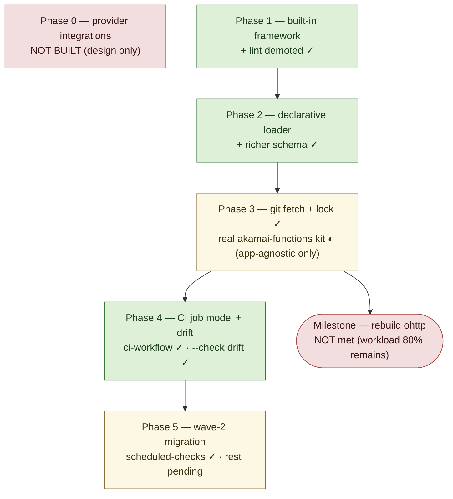

- ✓ **Built-in framework + lint demotion** — the reconcile driver, `recipeFS` embed,
  enable/disable/apply/list, the lock, and `runLint`/`runValidate` folding all ship.
- ✓ **Declarative loader + richer schema** — `recipe.yaml` → `extManifest`, schema
  v2 + `extension upgrade` migration, directory-tree scaffolding.
- ✓ **Git fetch + lock** — clone into `.llz/cache`, SHA+digest lock,
  `verifyRemoteCache`, `sync [--update]`, `--yes` gating, allowlist.
- ◐ **The real ohttp recipe** — the delivery machinery ships as an external
  candidate; the OHTTP workload itself (and `pat-issuer` / `ohttp-observability`) is
  not authored, so the milestone is **not met**.
- ✗ **Provider integrations** — not started; GitHub-Actions-only.

## Resolved questions (as decided in code)

- **Framework scope is set by ohttp**, not toy cases.
- **Templating**: Go `text/template` with copier's `<@ @>` delimiters — *not* Jinja.
  Byte-identical to copier for bare variable substitution only.
- **CI model**: extensions emit **generated workflows** (`llz-extensions.yml` +
  scheduled) invoking `llz ci …` at a bound **anchor** (`pre-converge` /
  `post-converge` / `operate`) with a `Trigger` axis (converge / dispatch / schedule).
- **Secrets**: declare + doctor-check **and wire** — `seed`/`unseed` ship (reversing
  the declare-only first cut). Values never enter the manifest, lock, or cache.
- **Lock**: one `.llz/extensions.lock` carries both source pins and output digests
  (the design's two-file split was merged).
- **Apply depth**: render → write with a per-file `managed` (overwrite) / `seed`
  (write-once) mode + `--check` drift; the full three-way *conflict* model is deferred.
- **GitHub Actions variables**: a third input category `ghVars:` ships — distinct from
  render `vars:` and `secrets:`, `seed`-pushed via `gh variable set`, and honored by the
  workflow image-pin lint. `required` means **live-runtime readiness**, not local
  seed-material: ghVars are NOT checked offline (their source of truth is GitHub), so a
  correctly-configured instance never fails offline; the authoritative live `doctor` pass
  (`liveGHVarFindings`) fails only on a *confirmed-absent* required, non-seedable ghVar, and
  reports "unverified" (non-fatal) when GitHub is unreachable. `seed` skips a ghVar with no
  value to push rather than aborting. An `image: true` ghVar carries the digest-pin metadata
  (its `Default` must be pinned; a workflow image expression must reference it; the live pass
  also flags a set-but-mutable live value). Declaring only `ghVars:` is a Configure-phase
  declaration (`manifestDeclaresHook(HookConfig)`). A secret/ghVar `bao`/`ghEnv` target may reference a
  render var (`<@ .gh_env @>`), so one declared var single-sources an address used in more
  than one place (the workflow `environment:` and the seed target) — scoped to target
  fields, not general manifest templating. A best-effort live `doctor` pass
  (`liveGHVarFindings`) additionally verifies the variable is actually set on GitHub and that
  an `image: true` value is digest-pinned (advisory; skips cleanly when GitHub is unreachable).
- **Candidate seam guard**: a unit test asserts every `akamai-functions` `validate:` target
  (which renders the CI matrix) is a case `quality.sh` accepts — closing the manifest↔script
  drift the matrix-from-`validate:` rendering would otherwise hide.
- **Scaffolded-workflow image pins**: `lintWorkflowImages` extends the digest-pin check
  to `files:` entries under `.github/workflows/**` — a workflow image must be digest-pinned
  or a declared `ghVars:` reference. The trust property now covers the app-kit pattern.
- **App CI single-source**: a scaffolded workflow renders its matrix from the manifest's
  `validate:` step names (`<@ .validate_targets @>`), so the gate list lives in one place
  and the `validate:` declaration is load-bearing (not decorative) even when app-stage
  gating skips it from the platform gate.
- **Adoption detection**: built (`extension_adopt.go`) — an available, not-enabled
  extension whose files are all present and unlocked is adopted (enabled + recorded) at the
  top of `llz upgrade`, before the copier update fences its now-owned paths. The lock entry
  discriminates a migrated-in file from a deliberately-disabled one. Was the *largest*
  migration hazard; now closed.
- **enabled-list schema**: explicit `enabled:`; built-ins implicit unless `optional`.
- **cobra's role**: command surface only; the engine is ours. `PersistentPreRunE` is
  not the hook mechanism. Not Go plugins.

## Open questions

- **App-stage in the engine**: an app-stage extension is skipped by every platform
  gate, doesn't use the anchor DAG (its deploy targets a SaaS, not the cluster), and
  ships a static workflow. Now that the *two CI patterns* are named, should app-stage be
  formalized as **scaffold (`files:`) + `config:`** only, dropping the `check`/`validate`/`ci`
  surface that the platform gate skips anyway? (The `validate:`-rendered matrix keeps the
  `validate:` block useful even if the engine never fires it.)
- **Structural workflow parsing**: the image-pin lint is a line/flow-map regex scan
  (a structural YAML parse is blocked by GitHub `${{ }}` expressions — see that section). When
  this graduates from experiment, the end-state is a GitHub-expression-aware parser
  (actionlint-style), not generic YAML. Acceptable as-is for now.
- **Live doctor posture**: `liveGHVarFindings` already **fails** on a confirmed-absent
  required, non-seedable ghVar, and stays non-fatal ("unverified") when GitHub is
  unreachable. The remaining advisory case is a *confirmed* unpinned `image: true` live value
  (lookup succeeded, value is a mutable tag) — should that escalate to a hard `doctor`
  failure too, or stay advisory?
- **Recipe granularity for ohttp**: one `akamai-functions` vs. several composable
  extensions.
- **Anchor set sufficiency**: is `pre-converge | post-converge | operate` enough, or
  do TF-contributing extensions need per-root anchors?
- **`rotate` cadence**: wire `ActionRotate` into `llz-secret-rotation.yml`
  (`DriverWired` flips true), or keep it operator-invoked?
- **Full three-way conflict apply**: `seed` covers the write-once operator-owned case; do
  we ever need a `managed`-file conflict/merge (with `--force`), or is overwrite enough?

## Out of scope (for now)

- OCI/Harbor transport (git works against any host).
- Compiled/plugin remote extensions (platform-locked; rejected).
- A *new* templating language — render is capped at Go `text/template` with copier's
  delimiters.
- Per-extension versioning within a source repo (tap model: one tag versions all).
- Three-way conflict-resolving apply (deferred; the lock already stores the digest
  base it would need).
- Provider integrations beyond GitHub Actions — **the entire four-provider layer is
  unbuilt**, retained above as design only.
