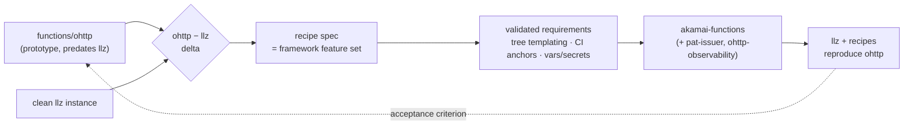
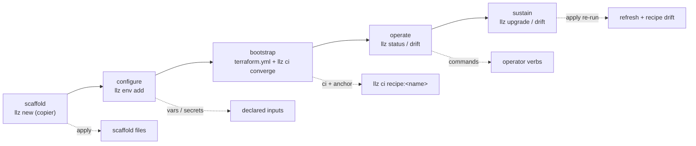
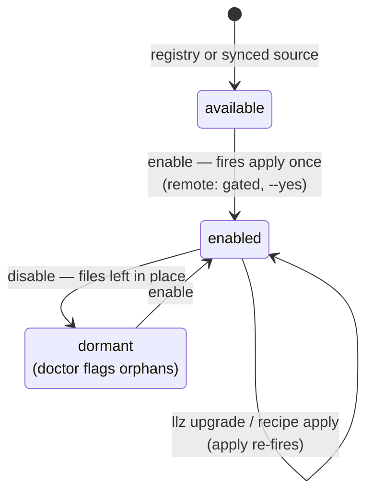
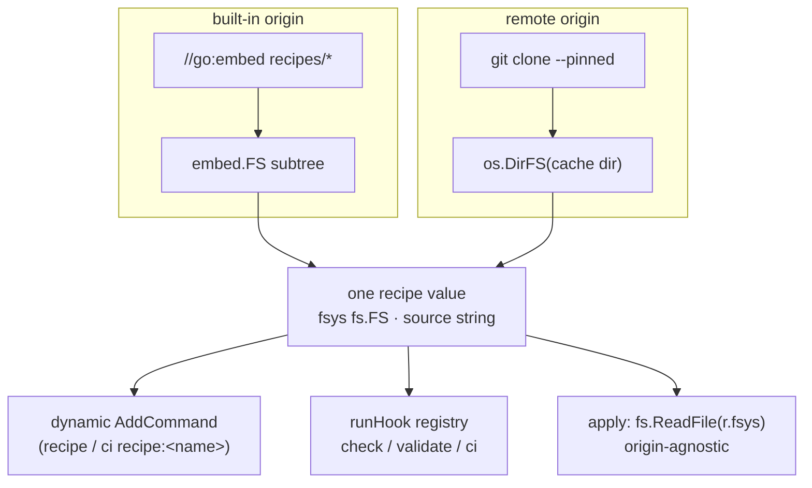
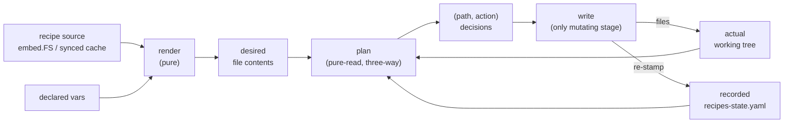
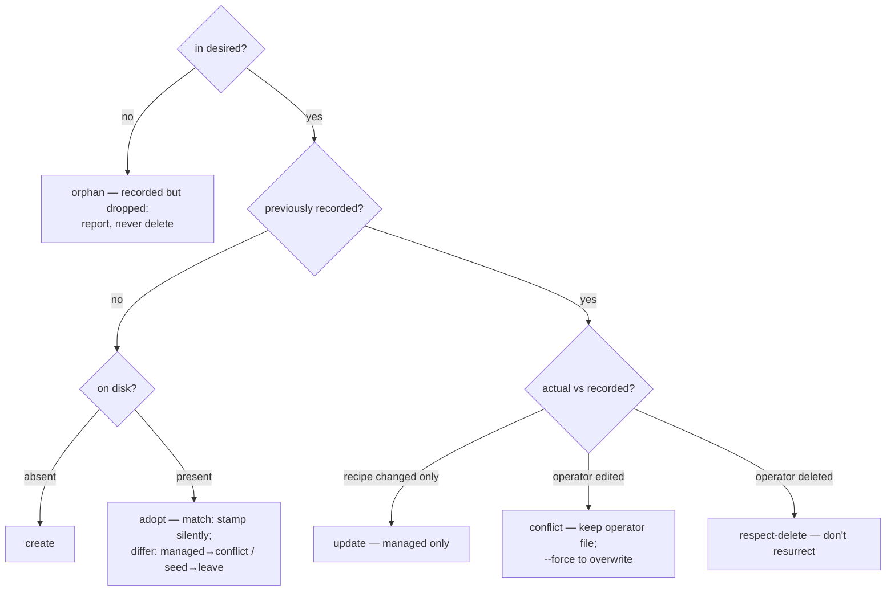
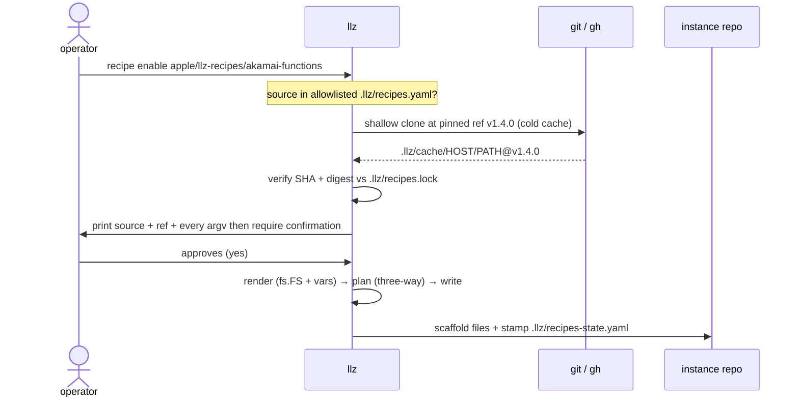
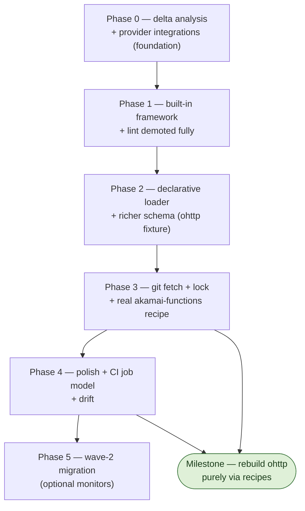

# Recipes: user-enablable capabilities for llz

Status: **draft / design** — nothing here is implemented yet.

## Summary

A **recipe** is a named, user-enablable capability bundle for an llz instance.
It can scaffold files into the instance repo, contribute steps to llz's gates
(pre-commit, validate), register CI steps bound to lifecycle anchors, declare
the vars and secrets it needs, and surface its health in `llz doctor`. Recipes
come from two origins — **built-in** (compiled into the binary) and **remote**
(declarative manifests pulled from a pinned git repo) — that share one runtime
model: past the load boundary, built-in vs. remote is invisible because both
normalize to a single `recipe` value whose files are read through an `fs.FS`.

The first built-in recipe is **lint**, demoting today's hardcoded `llz lint`
into the framework it bootstraps. The framework's *scope* is fixed by a real
workload rather than guessed from toy examples: it must be able to reconstruct
`functions/ohttp` from a clean llz instance plus recipes (see *The forcing
function*). The `ohttp − llz` delta is the spec; if recipes cannot reproduce
ohttp, the framework is incomplete.

## The lifecycle contract (as implemented)

The design narrative below uses "recipe / hook point"; the shipped code calls
these **extensions** firing **typed hooks** at **lifecycle phases**. The contract
the implementation enforces is deliberately narrow:

- **The lifecycle has three top-level stages (IaC → Kube-Infra → App).** Above the
  phases sits a coarser axis: the delivery stack's three layers, in dependency order —
  **IaC** (Terraform provisions the cloud + cluster), **Kube-Infra** (the GitOps-converged
  platform layer), and **App** (workloads on the platform). The phases are the temporal
  cycle each stage passes through; the stage (`Stage` enum, `stages` registry) fixes the
  engine, the gate vocabulary, and the toolchain. An extension declares its `stage:`, and
  `llz extension stages` prints the layers + which extensions target each. The load-bearing
  rule is `StageMeta.PlatformGated`: **IaC and Kube-Infra checks run in the platform gate
  (`llz lint`/`validate`); App checks do NOT** — an app's quality bar (cargo coverage/
  mutants) runs in the app's own scaffolded CI, with the app's toolchain, on the app's PRs.
  That is why `akamai-functions` (stage `app`) ships its gates as a workflow, not as
  platform-fired `check:`/`validate:` steps; a stage-less extension is cross-cutting and
  platform-gated (the lint packs).
- **Lifecycle phases are core-owned.** There is one registry —
  `lifecyclePhases` in `tools/cmd/llz/lifecycle.go` — and it is the single source
  of truth. The CI anchor spine, the reconcile contributions, and the
  `runLint` / `runUpgrade` tails all *derive* from it; none re-declares the table.
  `llz extension lifecycle` (alias `anchors`) prints it. Each phase carries a
  structured set of `Runners` (`external` / `laptop` / `actions` / `bot` / `human`)
  beside its prose engine, so "what runs in CI?" is queryable, not parsed from a string —
  and a phase may legitimately span engines (Gate is laptop + Actions; Sustain is laptop
  + the Renovate bot).
- **The lifecycle has a teardown arc, not just a birth arc.** Beyond the eight
  methodology phases (and the code-only Gate), there is a code-only **Decommission**
  phase carrying the inverse actions `unseed` (revoke seeded secrets — the inverse of
  `seed`) and `teardown` (remove scaffolded files — the inverse of `scaffold`). This
  closes the `disable`→orphaned-{credential,file} asymmetry: `extension disable` is
  non-destructive and points at these gated actions.
- **An extension touches a phase through one of two disjoint registers.**
  - A **hook** (`HookKind`: `config`, `files`, `check`, `validate`, `ci`, `health`,
    `commands`) is a declarative artifact a phase drives. `check` is the lint tier
    (missing tool skips); `validate` is the heavyweight CI tier (tools *required*, folded
    into `runValidate`); `health` is a report-only probe surfaced by doctor/status; `ci`
    is the only hook permitted to cloud-mutate, and only at workflow runtime. `HookMeta.FiredBy`
    records *what* drives each (`reconcile` / `validate` / `doctor` / `startup`) — so
    `commands` (startup registration, not a phase) is visibly distinct from the rest.
    A `ci:` step also has a *trigger* axis (`Trigger`: converge / dispatch / schedule):
    a `schedule:` cron emits the step into a separate `llz-extensions-scheduled.yml`
    (`on: schedule`), distinct from the converge-anchored `llz-extensions.yml` — what
    scheduled-checks, cluster-health, and a secret-rotation cadence ride.
  - An **action** (`Action`: `seed`, `rotate`, `upgrade`, `unseed`, `teardown`, `provision`)
    is an imperative, usually cloud/host-mutating day-2 operation run *only* via a gated
    operator command or a cadence workflow, and **never fired by reconcile**. `seed` lives at Configure,
    `rotate` at Operate (backed by the `TokenRotator` interface; it *belongs to* the
    `llz-secret-rotation.yml` cadence but is operator-invoked today — the TokenRotator
    step is not yet wired into that workflow, recorded as `ActionMeta.DriverWired=false`),
    `upgrade` at Sustain. `ActionMeta` records each one's command, cadence driver, wiring
    status, and interface, so the day-2 story — including what is *not yet automated* — is
    legible from the registry rather than grepped from command files. `TestActionDriverWiring`
    keeps the wiring flag honest against the actual workflow contents.

  The two registers are kept disjoint by test (`TestActionsAreNotHooks`,
  `TestActionsAreNeverReconciled`): an action can never be mistaken for a fired hook.
  There are no arbitrary `onEnable` / `onUpgrade` callbacks in either register.
- **CI anchors are only the GitHub Actions subset of the lifecycle.** A `ci:` step
  may anchor only to a phase that runs as a generated workflow job
  (`LifecyclePhase.Anchorable()` — today Bootstrap/`converge` and Operate). The
  other phases run in other engines (copier, the spec renderer, `promote.yml`,
  `llz upgrade`, humans) and are reached through their typed hook or action, not an anchor.
- **Extensions do not redefine bootstrap, promotion, or convergence.** Those are
  core phases. An extension contributes artifacts *around* them (a job that
  `needs:` converge, files re-applied on Sustain); it never owns the phase itself.
- **There are three enablement tiers, including a shipped-but-optional one.** A built-in
  ships compiled into the binary; with `optional: true` it is OFF by default and turned on
  with `llz extension enable <name>` (scaffolding from the embed), with `optional` absent
  it is always-on (core hygiene like `gitattributes`). A local/remote extension is opt-in
  but instance-authored, not shipped with the binary. The optional-built-in tier is the
  home for **net-new** capabilities that should *travel with llz* yet stay off until
  wanted — the lint packs (`lint-yaml`/`lint-typos`/`lint-markdown`), `validate-trivy`
  (the heavyweight CI-tier IaC scan), `scheduled-checks`.
  A capability the **instance template already delivers** is NOT a built-in candidate:
  the devcontainer, for instance, is template-shipped (`merge .devcontainer/**`) and backed
  by a cosign-signed multi-arch CI image — a built-in would only conflict with it and lose
  the image build. Migrate what the template does *not* already own.

Failure semantics live with the hook kind, not the call site (`HookMeta`): `check`
and `ci` are blocking, `files` is blocking when invoked directly but downgraded to
best-effort during `llz upgrade`, `config` is report-only, and only hooks marked
`ToolSkip` may skip on a missing external tool. Actions carry their own posture in
`ActionMeta` (`Gated` ⇒ `--yes` required before any cloud mutation).

Laptop-driven phases fire extension work through named entry points in `lifecycle.go`,
so a core command never reaches into an extension internal: `runLint` → `lifecycleGate`
(Gate), `runUpgrade` → `lifecycleSustain` (Sustain), `runDoctor` → `lifecycleDoctor`
(Configure readiness — a required extension secret missing fails the doctor gate), and
`runDrift` → `lifecycleDrift` (Sustain output drift, report-only). The Actions-run
phases (Bootstrap / Operate / Promote) fire through generated workflows instead, which
is why they have no laptop entry point.

**Tool supply.** An extension's steps need external tools, so each tool is declared in
`tools:` (`extTool{name, via, version}`). Declaration drives two things: doctor/enable
*verify* presence (a missing tool is surfaced, not a silent check-skip), and
`llz extension provision` (the Configure-phase `ActionProvision`) *installs* the host/local
set by aggregating the enabled extensions' pinned `via` refs into a generated `.mise.toml`
and running `mise`. The trust boundary is the same one the argv-only ceiling holds: an
extension declares **what** to install — a pinned, registry-resolvable ref (`pipx:yamllint`,
`npm:markdownlint-cli`, `aqua:crate-ci/typos`) — and **never how**. There is no install-script
field, so a remote, git-pinned extension cannot smuggle host execution; `mise` installs from
its backends' registries (checksum-verified for the binary backends), the version pins ride
the source SHA+digest lock, and the install is gated (`--yes`).

For **CI-run tools** the supply is the job's container image, not a host install: a `ci:`
step declares a `image:` and its generated job runs in `container: …`. The image must be
**digest-pinned** (`…@sha256:<64hex>`) — enforced at both `extension lint` and workflow
generation — because a remote extension's CI image runs with the workflow's permissions, so
a mutable `:latest` is trust surface that could be swapped after review (the same reasoning
as the source SHA pin). This is the right home for heavy workload kits (a `spin`/`cargo`
deploy runs in the extension's pinned toolchain image, never installed on the runner). For
trusted built-in packs, the devcontainer image remains an option. So supply is organized by
`Runner`: `laptop` → mise (`provision`), `actions` → a digest-pinned container, with the
"declare pinned data, never execute" boundary holding across both.

## Motivation

llz already has two patterns that bracket what we want:

| Pattern | What it is | Lives where |
| --- | --- | --- |
| `.llz/commands.yaml` (`ext.go`) | operator's ad-hoc shell aliases; no scaffolding; unversioned | operator repo, committed |
| checks/steps (`checks.go`) | curated capabilities (lint/validate), ported into the binary "so they propagate with the binary instead of via copier update" | embedded in llz |

Neither covers the middle: a **curated, versioned, optional** capability that
bundles scaffolded files with the steps that consume them. The gap is visible
in `checks.go`'s own header comment — the lint *steps* ship with the binary
while the lint *configs* (`.tflintrc.hcl`, `.gitleaks.toml`, `.checkov.yaml`)
still ship via copier, so the two halves version independently and drift.

The codebase is closer to this design than it looks: `func(globalOpts) error`
is already the step interface — every check in `checks.go` has that exact
signature, and `runLint` / `runValidate` / `runPrecommit` are three hardcoded
mini flow-engines iterating slices of them. The framework is mostly *hoisting
those slices into a registry keyed by named hook points*, not inventing a new
execution model.

Why remote recipes are declarative: a recipe fetched at runtime cannot be
compiled Go (plugins are platform-fragile and version-locked). A remote recipe
is `commands.yaml`'s declarative argv model extended with scaffolding,
templating, and versioning. Everything flows through the existing `run` /
`runGated` seam, so `--dry-run`, the `→ argv` echo, and tool-skip carry over
unchanged.

## The forcing function: rebuild ohttp atop llz

The framework's feature set is derived from a real delta, not invented from
`lint`/`renovate` toy cases.

**History.** `functions/ohttp` is the **prototype that predates llz**. llz was
generalized and extracted *from* it — ohttp's own `docs/templatization-plan.md`
("turn the ohttp-beta cluster into a modular, reusable template another team can
adopt without forking-and-praying") is essentially the llz genesis doc. ohttp is
the upstream original, not a downstream fork.

**The vehicle.** Rebuild `functions/ohttp` *on top of* a clean llz instance —
reconstruct it from **llz + recipes** instead of as a bespoke repo — and use
that rebuild as the forcing function to design the recipe framework. The delta
between a base llz instance and ohttp **is** the recipe spec. Decomposing "what
ohttp adds on top of llz" reverse-engineers the framework's actual requirements
instead of guessing them.

**The delta (`ohttp − llz`).** A freshly-scaffolded llz instance diffed against
`functions/ohttp` clusters into:

- **`akamai-functions/` Rust + Spin components** — relay (opaque OHTTP forward +
  Apple PAT + OTel), gateway (HPKE X25519/AES-128-GCM), target-echo. Each a
  standalone Cargo workspace (`crate-type=["cdylib"]`, `spin-sdk` v6, thin Wasm
  adapter over a `*-core` crate, Wasm-tuned release profile) with `spin.toml`
  v2 (variables block, HTTP trigger, `cargo build --target wasm32-wasip2
  --release`).
- **CI + deploy** — `.github/workflows/akamai-functions.yml`
  (`build-wasm → e2e → deploy-lab`), the `.github/actions/spin-cloud-deploy`
  composite action, `scripts/app/deploy-{local,cloud}.sh`.
- **Secrets/vars** — `FERMYON_CLOUD_TOKEN`, `OHTTP_KEY_SEED`,
  `PAT_ISSUER_PRIVATE_PEM`, `PAT_ORIGIN`; OpenBao paths + GH env secrets;
  injected via `spin deploy --variable` / `spin cloud variables set`.
- **apl-values / manifests** — PAT issuer deployment, `otel`/`gateway` Istio
  ingress hosts, OHTTP AppProjects + Grafana dashboards.
- **Toolchain** — `spin`, `rustup target add wasm32-wasip2`, the pinned
  `ci-rust` image.

That delta groups into candidate recipes — `akamai-functions` as the headline
remote recipe, with `pat-issuer` and `ohttp-observability` as possible smaller
ones. **The union of their needs defines the framework feature set.**

**What the delta validates (formerly "design gaps").** The thin recipe shape
(`files: [{src,dst}]` straight copy, `check/ci: [{argv}]`) is too thin for
ohttp. The delta turns three speculative gaps into validated requirements:

1. **Tree scaffolding + templated values.** ohttp needs a whole
   `akamai-functions/` subtree with substituted values (domain, per-env app
   name/suffix, gateway URL) — not a flat list of byte-for-byte copies. This is
   the biggest change and it reverses the earlier "no templating" stance; see
   *The apply pipeline → Templated render*.
2. **CI contribution as a multi-step job, not a single argv.** The deploy is
   `build-wasm → e2e → deploy` with prebuilt-Wasm artifact passing and secret
   injection — a workflow fragment bound to a lifecycle anchor, not a one-line
   `argv`. See *CI contribution*.
3. **A secrets/vars contract.** The manifest must *declare* required secrets and
   vars so `doctor` checks them and `enable` prompts. See *Vars and secrets*.

**What the delta confirms (keep as designed).**

- **Git-pin + lock (SHA + digest).** ohttp already pins everything this way
  (`git::…//…?ref=v0.1.0` TF modules, OCI charts by tag, a git-`rev`-pinned
  `opentelemetry-wasi`).
- **Built-in vs. remote split.** `akamai-functions` is unambiguously *remote* —
  it exercises the Phase 3 fetch/lock path end-to-end where `lint`/`renovate`
  only hit the easy cases.
- **Tool-skip + `doctor` via `tools`** — maps cleanly onto the heavier
  `spin`/wasm toolchain.

**Acceptance criterion (definition of done for the milestone).** A clean llz
instance + `llz recipe enable akamai-functions …` (+ values) reproduces a
working `functions/ohttp` deployment. That is the milestone, and the regression
test thereafter.



## Recipe vs. chart: when to reach for which

A natural question, once recipes exist: if I want to ship an optional
capability, why not just publish another Helm chart under `kubernetes-charts/`?
The answer is that the two operate on **different layers and at different
times**, and the boundary is sharp enough to be a decision rule rather than a
judgment call.

| | Helm chart (`kubernetes-charts/*`) | Recipe |
| --- | --- | --- |
| Operates on | the **cluster** — runtime Kubernetes state | the **instance repo** + the operator's gate/CI/doctor workflow |
| Artifact | templated K8s manifests (NetworkPolicies, namespaces, CRs, Jobs) | scaffolded repo files + steps bound to `check` / `validate` / `ci` / `doctor` |
| Delivered by | OCI publish → ArgoCD sync onto a live cluster | the apply pipeline, written into the repo and committed |
| Acts at | cluster runtime (reconcile loop) | author / commit / validate / CI / `doctor` time — no cluster required |
| Reconciler | ArgoCD (sync, prune, self-heal) | three-way `render → plan → write`; enable/disable lifecycle |
| Versioned as | chart version + OCI tag | tap tag (remote) or the binary (built-in) |
| Answers | "what must be *running in* the cluster" | "what must be *in the repo* and enforced around it" |

**The decision rule.** Is the thing you want to ship *Kubernetes runtime
state* — workloads, policies, CRs that must exist in a cluster to have any
effect? That is a chart; `llz-cluster-foundation` (default-deny NetworkPolicies,
namespaces, the CoreDNS rewrite) is the archetype, and nothing about it wants to
become a recipe. Is it instead *repo-side capability* — config files plus the
gates, CI steps, and health checks that consume them at author/build time
(lint's `.tflintrc.hcl` + its four check steps; renovate's `renovate.json` + its
config-validator; the optional monitors' workflows + ci steps)? That is a
recipe. A chart deployed onto no cluster does nothing; a recipe runs entirely
before — and independently of — any cluster existing.

**They compose; they don't compete.** The layers stack rather than overlap. A
recipe is in fact the natural way to ship the *repo-side half* of a chart-backed
capability: scaffold the ArgoCD `Application` (or the chart's values override)
that points GitOps at an OCI chart, add a `check` step that lints those values,
and add a `doctor` step that reports the chart's sync health — while the chart
itself still does all the in-cluster work. The chart owns runtime; the recipe
owns the repo wiring around it and keeps that wiring versioned with the binary
that generates and gates it. `akamai-functions` is exactly this composition: the
recipe scaffolds the Spin components, CI, and apl-values overrides; the cluster
state those overrides drive is still ArgoCD's job.

### What a recipe gives you that a chart cannot

When a capability *could* be expressed either way — typically because it is
mostly config files plus some glue — these are the things that tip it toward a
recipe, none of which a chart provides:

- **It gates your workflow.** A chart cannot fail your pre-commit or block
  `llz validate`; a recipe contributes blocking `check` / `validate` steps. The
  capability stops bad commits, not just bad cluster state.
- **It scaffolds into the repo and keeps files + steps in lockstep.** A chart
  versions cluster manifests; it has no answer for "the `.tflintrc.hcl` in your
  repo must match the lint step in this binary." Recipes close exactly the
  copier/binary drift the framework exists to fix, and three-way apply (the
  `managed` / `seed` modes) refreshes the recipe's version without clobbering
  operator edits — semantics a `helm upgrade` does not have for repo files.
- **It reports in `doctor`.** Tool presence, declared-secret presence,
  credential expiry, and per-file drift ("`renovate.json` modified since
  renovate@v1.4.0") surface in `llz doctor`. A chart's health lives in ArgoCD,
  off to one side of the operator's daily loop.
- **It has an operator-legible lifecycle.** `recipe enable` / `disable`,
  adoption detection, and the `recipes.yaml` diff make "is this capability on"
  a reviewable repo fact — versus a chart's presence being implicit in
  whatever Argo is syncing.
- **It needs no running cluster.** Recipes act at author time, so a capability
  that is fundamentally about *the repo and its CI* (linting, dependency
  updates, scheduled monitors, the `akamai-functions` build/deploy pipeline)
  gets a home that does not pretend to be a cluster workload.

The inverse holds and bounds the framework: anything whose entire job is to put
resources *into* a cluster gains nothing from being a recipe and should stay a
chart. Recipes are deliberately not a Kubernetes deployment mechanism — see
*Keep core* and *Out of scope*.

## Concepts

### The instance lifecycle recipes hook into

An llz instance moves through a fixed spine (condensed from
`docs/delivery-methodology.md`):



Two **delivery channels** already feed this spine; recipes are a *third*:

1. **Copier** — files rendered from `instance-template/`, governed by
   `.template-manifest`'s ownership classes (`managed` = overwritten on update,
   `merge` = 3-way, `owned` = never touched). Updated by `llz upgrade` →
   `copier update` + re-stamp `.template-version`.
2. **Binary-embedded logic** — checks/ci/commands compiled into llz "so they
   propagate with the binary instead of via copier update" (`checks.go`). No
   `embed.FS` for *files* yet.
3. **Recipes (new)** — unify built-in + remote, scaffold files *and* contribute
   logic, re-applied by `llz recipe apply`.

The design question the framework answers: **what fires a recipe's hooks, when
in the spine, and who owns the files it writes** so channel 3 doesn't fight
channel 1. The mapping:

| Stage | Core driver (today) | Recipe hook | Fires when |
| --- | --- | --- | --- |
| **Scaffold** | `llz new` (copier copy) | `apply` (render files → instance repo) | on `recipe enable`; re-run by `llz recipe apply` / `llz upgrade` |
| **Configure** | `llz env add` | `vars` / `secrets` (declared inputs) | `doctor` checks presence; `enable` prompts |
| **Pre-commit gate** | `llz lint` → `runLint` | `check` | folded into the hook engine on every commit |
| **Validate** | `llz validate` | `validate` | `llz validate` (no-`--env` path) |
| **Bootstrap** | `terraform.yml` + `llz ci converge` | `ci` + **anchor** | invoked as `llz ci recipe:<name> <step>` at its declared anchor |
| **Operate** | `llz status` | `commands` | registered at startup (after built-ins, `ext.go` collision rule) |
| **Sustain** | `llz upgrade` / `llz drift` | `apply` re-run + **recipe drift** | `upgrade` runs `recipe apply`; `drift` reports recipe output + source drift |

The seams already exist for two of these (the `runLint`/`runValidate` loops for
`check`/`validate`, `ext.go` registration for `commands`); the framework makes
`apply`, `vars`/`secrets`, and bootstrap `ci` first-class at the same level.

### Two lifecycles

Distinct from the instance spine above, recipes themselves undergo a
**framework-owned state lifecycle** — they don't hook these; they undergo them:



### Hook points

Rule: **a hook point exists only when a shipping recipe needs it.** Every hook
below is justified by a concrete candidate (see Candidates) — the ohttp delta
in particular justifies `ci` anchors and the `vars`/`secrets` contract. Adding a
hook later is one constant plus one firing site — the engine doesn't change — so
the vocabulary starts minimal. Every hook point is trust surface for remote
recipes and a compatibility promise to recipe authors.

| Hook | Fired by | Justified by | Failure semantics |
| --- | --- | --- | --- |
| `apply` | `recipe enable`, `recipe apply`, tail of `llz upgrade` | every recipe (renovate, devcontainer are apply-only; `akamai-functions` scaffolds a tree) | see Apply pipeline below |
| `check` | `llz precommit` (after the core secrets guard), `llz lint` | lint's four steps; renovate's config-validator | blocking; tool-absent skips with a warning |
| `validate` | `llz validate` (no-`--env` path) | validate recipe (tf-validate + checkov) | blocking; tool-skip |
| `ci` | scaffolded workflows via `llz ci recipe:<name> <step>`, bound to an **anchor** | the four optional-monitor workflows; `akamai-functions` `build-wasm → e2e → deploy` | step-declared: blocking by default, `warnOnly` for the health-* style monitors |
| `doctor` | `llz doctor` | monitors (credential presence); declared-secret presence; framework itself (orphans, lock staleness) | never blocks — report-only |

Two deliberate properties:

- **Failure semantics belong to the hook point, not the recipe.** The point
  defines the contract (check blocks commits, doctor never blocks), so an
  operator reasoning about "what can a recipe do to my commit flow" needs only
  this table. A remote recipe cannot opt its doctor step into blocking.
- **Hooks are data, not callbacks.** A recipe attaches *steps* (name, tool,
  argv-or-func, anchor) to named points. There are no `onEnable` / `onUpgrade`
  arbitrary-code hooks: `apply` is the only thing that runs at state
  transitions, and it is constrained to the `files:` projection plus the
  framework's own manifest stamping. This keeps declarative remote recipes at
  full parity with built-ins, and keeps the trust story honest: the complete
  set of moments where remote-supplied argv executes is `check` / `validate` /
  `ci` — all operator-initiated, all echoed through `run()`.

Deferred hook points, and the trigger that would add them:

- `env-add` (per-deployment scaffolding) — the day a monitor recipe needs
  per-env config scaffolded by `llz env add`.
- `prebuild` (gate inside `llz build`) — orthogonal behavior change; if wanted
  later it is `runHook(validate)` at the top of `cmdBuild`.
- `teardown` / `reap` — no candidate; high blast radius; keep out.

### The recipe value: one type, two origins

The only real difference between a built-in and a remote recipe is *where its
files live*. Hide that behind `fs.FS` and no downstream code branches on origin
— this is the same trick `ext.go` already uses for `.llz/commands.yaml`, with
more structure.



```go
type hook string

const (
    hookCheck    hook = "check"
    hookValidate hook = "validate"
    hookCI       hook = "ci"
)

// recipe is the single runtime value built-in and remote recipes both load into.
type recipe struct {
    name, short string
    tools       []toolDep             // doctor + haveTool skip-with-warning if absent
    files       []fileMap             // apply: src in fsys → instance path, + mode + platform
    vars        []varDecl             // declared inputs; doctor checks, enable prompts, render substitutes
    secrets     []secretDecl          // declared inputs; doctor checks presence
    steps       map[hook][]recipeStep // check / validate / ci, with ci carrying an anchor

    fsys   fs.FS  // embed.FS subtree (built-in) | os.DirFS(cacheDir) (remote)
    source string // "" built-in | "host/path@ref" remote
}

type fileMap struct {
    src, dst string
    mode     string // "managed" | "seed"  (default seed)
    platform string // runner selector; "" / "all" → scaffold everywhere
}
type recipeStep struct {
    name     string                 // surfaces in `llz check <name>` / `ci recipe:<r> <name>`
    short    string
    tool     string                 // optional: haveTool skip-with-warning if absent
    anchor   string                 // ci only: "pre-commit" | "post-converge" | "operate"
    warnOnly bool                   // ci only: monitor semantics
    run      func(globalOpts) error // built-in fn, or an argv adapter for declarative
}
type varDecl    struct{ name, deflt, doc string }
type secretDecl struct{ name, doc string; required bool }
```

One engine replaces the three hardcoded loops:

```go
func runHook(g globalOpts, h hook) error {
    for _, r := range enabledRecipes() {       // enabled-list order: deterministic
        for _, s := range r.steps[h] {         // declaration order
            if err := s.run(g); err != nil {
                return fmt.Errorf("%s/%s: %w", r.name, s.name, err)
            }
        }
    }
    return nil
}
```

A remote `check: [{argv: [...]}]` entry becomes a `recipeStep` whose `run` is
`func(g) error { return run(g, argv...) }` — it inherits `--dry-run`, the argv
echo, and tool-skip from the existing seam with no new machinery.

`apply` reads from `r.fsys` and renders into the instance repo — identical for
both origins, because `fs.ReadFile` does not care whether `fsys` is an
`embed.FS` subtree or `os.DirFS` over the synced cache:

```go
//go:embed recipes/*
var recipeFS embed.FS

func builtinRecipes() []recipe {
    sub, _ := fs.Sub(recipeFS, "recipes/lint")
    return []recipe{{name: "lint", short: "repo lint gate", fsys: sub /* steps: runLint */}}
}

func recipeFromManifest(m manifest, dir fs.FS, src string) recipe {
    return recipe{name: m.Name, short: m.Short, tools: m.Tools, files: m.Files,
        vars: m.Vars, secrets: m.Secrets, steps: m.steps(), fsys: dir, source: src}
}
```

Loading mirrors `loadExtCommands` (missing-is-not-an-error); registration is the
dynamic `AddCommand` path `addExtCommands` already uses (see *What cobra gives
us*):

```go
func loadRecipes(root string) ([]recipe, error) {
    rs := builtinRecipes()
    cfg, _ := loadRecipeConfig(root)                 // .llz/recipes.yaml absent → no error
    for _, src := range cfg.Sources {
        dir, err := ensureSyncedAndVerified(root, src) // sync + lock check
        if err != nil { return nil, err }
        for _, name := range enabledFrom(src, cfg.Enabled) {
            m := parseManifest(filepath.Join(dir, name, "recipe.yaml"))
            rs = append(rs, recipeFromManifest(m, os.DirFS(filepath.Join(dir, name)), src.ref()))
        }
    }
    return rs, nil
}
```

## The apply pipeline

`apply` is not a single verb. As one operation it conflates four things —
first scaffold, version refresh, drift detection, and operator-edit
reconciliation — and the refresh path has a clobber hazard: if `llz upgrade`
re-applies the lint recipe after the operator added rules to `.tflintrc.hcl`,
a naive apply silently reverts their config. That is the copier-update problem
again, and it gets the same answer: a three-way model with a pipeline you can
stop partway through.



- **render** — pure: compute desired file contents from the recipe source
  (embed.FS or synced cache), substituting declared vars. No reads of the
  instance tree.
- **plan** — pure-read: three-way classify each file against `desired` (what
  render produced), `recorded` (digest in the per-recipe state from the last
  apply), and `actual` (working tree) → a list of (path, action) decisions.
  Touches nothing.
- **write** — execute the plan; re-stamp the state file. The only mutating
  stage.

The state stamped at write time is the linchpin: it is the "last-applied" base
that lets plan distinguish *the recipe changed* from *the operator changed
it*, which a two-way diff cannot.

### Templated render

ohttp's `akamai-functions/` subtree needs values substituted at scaffold time
(domain, per-env app name/suffix, gateway URL), so `render` is a templating
stage, not a byte-copy. The earlier "plain copy, no templating" stance is
reversed — but the reason it was held (don't reimplement copier) is honored by
**reusing copier's engine rather than building a new one**:

- Render through the **same Jinja engine copier uses**, with the `{{ }}`
  delimiters from `copier.yml`. Built-in, remote, and copier then produce
  byte-identical output for the same inputs — which is what makes digest-based
  drift detection in `plan` meaningful (a hand-edit is the only way on-disk
  diverges from a re-render).
- Inputs to render are the recipe's declared `vars` (see *Vars and secrets*),
  resolved from `.llz/recipes.yaml` values + copier answers + defaults. Files
  with no template markers pass through unchanged, so neutral files
  (`renovate.json`, CODEOWNERS) cost nothing.
- A recipe scaffolds a **tree**, not just a flat file list: a `fileMap.src`
  that is a directory renders every file beneath it, preserving structure into
  `dst`. This is what `akamai-functions/relay/…`, `gateway/…`, `target-echo/…`
  require.

No new templating *language* is introduced — the cap is "whatever copier's
Jinja already does," nothing more exotic.

### Per-file ownership mode

Candidates split into two intents, declared per file in the recipe manifest:

- **`managed`** — the recipe owns the file and it must track the recipe
  version. Forcing case: a scaffolded workflow calls
  `llz ci recipe:<name> <step>`, so it *must* refresh when the binary's
  command surface changes. Lint's `.gitleaks.toml` and ohttp's `spin.toml` /
  build workflow are likewise managed.
- **`seed`** — written once as a starting point, then operator-owned forever.
  Archetype: `renovate.json` (operators customize schedules immediately);
  `.devcontainer`, CODEOWNERS likewise. Re-apply never touches an existing
  seed file.

Default is `seed` — the safe direction: the worst a stale seed does is go
stale, while a wrongly-managed file clobbers operator work.

This is in effect a **fourth ownership class** alongside copier's `managed` /
`merge` / `owned`: recipe-written files are re-rendered idempotently from the
binary/remote source but must be **invisible to copier**, or `copier update`
clobbers them or flags them as drift. Two mechanics enforce that:

- **Record outputs.** Every file `apply` writes is recorded (path + mode +
  digest + recipe-version) in `.llz/recipes-state.yaml` — the three-way base
  for `plan`.
- **Fence copier off.** Recipe output paths are `_exclude`d in `copier.yml`
  (alongside `.llz/cache/`), so `copier update` never touches them and never
  reports them as drift.

### Idempotency contract

`apply` runs unattended on every `upgrade`/`drift`, so it must be safe to
re-run. Render and plan are **pure** functions over (recipe source, declared
vars, recorded state, on-disk digests) — table-testable without a real tree,
same pattern as the argv builders in `checks.go`. Write fails hard but is
idempotent: re-running converges. Because render is byte-deterministic for
fixed inputs, "nothing changed" plans to an empty write.

### Plan classification



| desired | recorded | actual | action |
| --- | --- | --- | --- |
| ✓ | — | absent | **create** |
| ✓ | — | present | **adopt** — matches desired: stamp silently (this *is* the copier→recipe migration path); differs: managed → conflict, seed → leave + stamp |
| ✓ | ✓ | = recorded, desired changed | **update** (managed only) |
| ✓ | ✓ | ≠ recorded | **conflict** — keep the operator's file, warn with a diff hint; overwrite only with `--force` |
| ✓ | ✓ | absent | **respect-delete** — operator removed it deliberately; warn once, don't resurrect |
| — | ✓ | present | **orphan** — recipe dropped the file (or was disabled); report, never delete |

No sidecar conflict files (`.rej` / `.new`) in phase 1 — warn-and-keep plus
`--force` covers the real cases; sidecars are easy to add later and noisy to
retract.

### Stage firing matrix

| Trigger | Stages | Posture |
| --- | --- | --- |
| `recipe enable` | render → plan → write | fresh tree; mostly creates/adopts |
| `recipe apply` / `llz upgrade` tail | render → plan → write | full three-way; conflicts surface here |
| `recipe apply --dry-run` | render → plan, print | existing `--dry-run` philosophy; no new verb |
| `llz doctor` / `llz drift` | render → plan, report | "unscaffolded drift" is a free read-only reuse of plan, not a feature to build |
| `recipe disable` | plan only | reports the would-be orphans it leaves behind |

## Vars and secrets

The ohttp delta forces a configuration contract: `akamai-functions` cannot
deploy without `FERMYON_CLOUD_TOKEN`, `OHTTP_KEY_SEED`,
`PAT_ISSUER_PRIVATE_PEM`, `PAT_ORIGIN`, plus render-time vars (domain, app
name/suffix, gateway URL). The manifest **declares** these; the framework
checks and prompts.

```yaml
vars:
  - { name: gateway_url, doc: "public OHTTP gateway URL", default: "" }
  - { name: app_suffix,  doc: "per-env Fermyon app suffix" }
secrets:
  - { name: FERMYON_CLOUD_TOKEN, doc: "Fermyon Cloud deploy token", required: true }
  - { name: OHTTP_KEY_SEED,      doc: "HPKE key seed",              required: true }
```

- **`vars`** feed `render` (Templated render above) and are resolved from
  `.llz/recipes.yaml` values → copier answers → declared default. A required
  var with no value is an `enable`-time prompt and a `doctor` finding.
- **`secrets`** are **declare + doctor-check only** in the first cut — `doctor`
  reports declared-but-absent secrets against the active provider integration's
  secret store; `enable` prints what must be set. The framework does **not**
  wire them (seed OpenBao paths / push GH env secrets) initially; wiring is a
  later increment once the declare-only contract proves out. Secret *values*
  never enter recipe state or the lock.

## CI contribution: anchors and multi-step jobs

A recipe's CI is more than a single argv. ohttp's deploy is a three-step job
(`build-wasm → e2e → deploy`) with artifact passing and secret injection, and it
**cannot run anywhere** — deploy must run *after* apl-core + Istio ingress are
converged. Two mechanics cover this without a full DAG:

- **Anchors.** Each `ci` step binds to a small enum of named lifecycle anchors —
  the recipe-level analog of Argo sync-waves (llz owns bootstrap ordering, Argo
  owns in-cluster fan-out):

  ```yaml
  ci:
    - name: build-wasm
      anchor: pre-commit       # pre-commit | post-converge | operate
      argv: [cargo, build, --target, wasm32-wasip2, --release]
    - name: deploy
      anchor: post-converge    # runs only after `llz ci converge` returns exit 0
      argv: [./scripts/app/deploy-cloud.sh]
  ```

  `post-converge` steps run only after `llz ci converge` returns exit 0 (per
  `docs/architecture/convergence-contract.md`).

- **Workflow fragments, invoked not inlined.** CI wiring composes via
  scaffolding: the recipe's `files:` ships a workflow yml (one variant per
  runner — see Provider integrations) whose steps call
  `llz ci recipe:<name> <step>`. The namespaced command is the stable
  entrypoint; the scaffolded workflow is what makes CI invoke it at the right
  anchor. llz never edits workflows in place — the loop closes through the repo.
  Multi-step jobs and artifact passing live in the workflow fragment; the step
  bodies stay provider-clean Go reading `ciEnv`.

## Per-repo state

Three committed files plus a cache, each with one job — they change at different
times and merging them would muddy every diff:

**`.llz/recipes.yaml`** (committed, operator-owned; missing is not an error,
per the `ext.go` convention) — *what the operator wants*:

```yaml
sources:
  - repo: github.com/apple/llz-recipes
    ref: v1.4.0          # tag or SHA — pinned; floating branches rejected
enabled:
  - apple/llz-recipes/renovate   # additive: non-default recipes, namespaced by source
disabled: []                      # explicit opt-out of built-in defaults
values:                           # var inputs to render, per recipe
  apple/llz-recipes/akamai-functions:
    gateway_url: https://gw.example.com
    app_suffix: lab
```

Built-in defaults (`lint`, `validate`) are **implicitly enabled unless listed
in `disabled:`**. This is deliberate: with a fully-owned `enabled:` list, the
day an operator writes `enabled: [apple/llz-recipes/renovate]` — the obvious
thing to write — lint silently drops out of the pre-commit gate. And every
existing instance has no `recipes.yaml` at all, so missing-file must mean
"defaults on." `llz recipe disable lint` writes `disabled: [lint]` and warns
loudly.

**`.llz/recipes.lock`** (committed) — *what the sources resolve to*: the
resolved commit SHA and content digest per source (go.sum / package-lock
model). Digest mismatch on re-sync is a hard error.

**`.llz/recipes-state.yaml`** (committed) — *what apply last wrote*: per
recipe, entries of `(path, mode, digest, recipe-version)`. This is the
three-way base for plan, and the source of doctor's per-file drift report. Kept
separate from `recipes.lock` so the lock stays source-only (sources change on
`sync`; outputs change on `apply`).

**`.llz/cache/recipes/<host>/<path>@<ref>/`** (gitignored) holds fetched
sources, alongside the other `.llz/*` local state.

## Remote recipes

### Authoring model

A recipe repo is a **tap** (Homebrew model): one directory per recipe, one
repo tag versions all recipes in it. Per-recipe versioning is deferred until
someone needs it.

```
llz-recipes/
  renovate/
    recipe.yaml
    renovate.json
  akamai-functions/
    recipe.yaml
    akamai-functions/          # a whole subtree, rendered with vars
      relay/ gateway/ target-echo/
    ci/gha/akamai-functions.yml
    scripts/app/deploy-cloud.sh
```

Discovery is **by scan, not index**: after cloning the pinned source into the
cache, llz globs `*/recipe.yaml`. No index file to drift out of sync with the
directories.

### Manifest

The declarative projection of the `recipe` struct:

```yaml
# akamai-functions/recipe.yaml
name: akamai-functions
short: OHTTP relay/gateway Spin components + deploy
tools: [spin, cargo]
files:
  - { src: akamai-functions/, dst: akamai-functions/, mode: managed }   # tree, templated
  - { src: ci/gha/akamai-functions.yml, dst: .github/workflows/akamai-functions.yml, mode: managed, platform: gha }
  - { src: scripts/app/deploy-cloud.sh, dst: scripts/app/deploy-cloud.sh, mode: managed }
vars:
  - { name: gateway_url, doc: "public OHTTP gateway URL" }
  - { name: app_suffix,  doc: "per-env Fermyon app suffix" }
secrets:
  - { name: FERMYON_CLOUD_TOKEN, doc: "Fermyon Cloud deploy token", required: true }
  - { name: OHTTP_KEY_SEED,      doc: "HPKE key seed",              required: true }
check:
  - argv: [cargo, fmt, --check]
ci:
  - { name: build-wasm, anchor: pre-commit,    argv: [cargo, build, --target, wasm32-wasip2, --release] }
  - { name: deploy,     anchor: post-converge, argv: [./scripts/app/deploy-cloud.sh] }
```

Templating is bounded to copier's Jinja engine (see *Templated render*) — no new
language. The lighter recipes (`renovate`, CODEOWNERS) carry no `vars`/`secrets`
and no template markers, so they remain effectively plain copies.

### Transport: git, pinned

Source = git repo + tag/SHA. Fetch via the existing git/gh shell-out through
`runGated` (`git clone --depth=1 --branch <ref> …`) — no new dependency.
OCI-via-Harbor considered and deferred; git works against any host. The source
spec is host-qualified already (`github.com/apple/llz-recipes`), so a tap can
live on GitLab, Bitbucket, or a GHE host with no per-provider code, and
independently of which provider the consuming instance runs on — see Provider
integrations (source transport).

```
git clone --depth=1 --branch <ref> https://<host>/<path> .llz/cache/<host>/<path>@<ref>
git -C <cache> rev-parse HEAD        # ref → SHA
hash(tree)                           # content digest
# verify against .llz/recipes.lock (hard error on mismatch) or write on first enable
```

Network policy: **never touch the network implicitly except on a cold cache.**
On cold-cache fetch, verify the fetched SHA + digest against the lock — hard
error on mismatch. Re-resolve upstream refs only on an explicit
`llz recipe sync --update` (which also detects force-moved tags by comparing
against the lock).

End to end, a remote `recipe enable` threads the transport, trust, and apply
seams together:



## Trust model

Remote recipes execute third-party argv and write files. Mitigations:

- **Pin + lock** — sources resolve to SHA + digest in `.llz/recipes.lock`;
  floating refs rejected; drift is a hard error.
- **Cache re-verification** — the lock digest is verified against the *cache
  contents* before executing remote argv (cheap hash per gate run, or at
  minimum per sync), not only at fetch time. Otherwise a tampered cache dir is
  an argv-injection path that pin+lock never re-checks.
- **Allowlist by construction** — llz only fetches sources listed in the
  committed `.llz/recipes.yaml`; adding a source is a reviewable diff.
- **First-enable gated** — routed through `runGated`; refuses without
  `--yes`; prints source + ref + every argv before executing.
- **No implicit binaries** — recipes invoke tools by name; tool-skip applies;
  a recipe cannot fetch-and-run an arbitrary binary.
- **Bounded execution moments** — remote argv runs only at `check` /
  `validate` / `ci`, all operator-initiated, all echoing through `run()`.
- **Secrets never leave the operator** — recipes *declare* secrets; values are
  resolved by the provider integration's store and never written to recipe
  state, the lock, or the cache.
- **doctor surfaces it** — enabled-but-unscaffolded drift; lock/cache status;
  declared-but-absent secrets.

Net blast radius equals `.llz/commands.yaml` today (runs argv against tools
you already have, writes files you review in the diff) — just versioned and
shared.

## Provider integrations (VCS + runner)

VCS/runner support is a **first-class integration, not a recipe.** The two are
deliberately different kinds of thing, and conflating them was the mistake the
earlier draft made:

| | Provider integration | Recipe |
| --- | --- | --- |
| What it is | the binding of llz to one {VCS host, CI runner} | an optional capability bundle |
| Count | exactly one per instance | zero-to-many |
| Chosen | once, at `llz new` | enable/disable anytime |
| Backs | the *core* product (terraform/bootstrap CI, secret push, repo create) | optional add-ons only |
| Code | compiled-in Go per provider (a host driver) | declarative argv + scaffolded files; no remote Go |
| Trust | trusted core | pin/lock/gate surface |

The operator journey is **download llz → `llz new` → pick a provider →
everything (core *and* recipes) targets it.** Because the provider is
load-bearing for the core landing zone — not an optional capability — it cannot
be a recipe: recipes are optional and carry no compiled Go. It is a foundation
recipes ride on. This is why it lands as **Phase 0, before the recipe
framework** (see Plan).

### What an integration supplies

Selected by the `platform:` config, a provider integration supplies three things
the rest of llz consumes:

1. **Host driver** — the Go interface for operations llz performs *against* the
   host: `dispatch` (run a pipeline/workflow), `setSecret`, `setVariable`,
   `createRepo`, `pushRepo`. Implementations: `github`, `ghe`, `gitlab`,
   `bitbucket`. This hoists today's scattered `gh …` argv builders
   (`commands.go`) and the lone `ghHost()` / `LLZ_GH_HOST` seam into one
   selected interface. The hardest host operations live here too: `runner-acl`
   (egress-IP ACL) and the credential-expiry monitors (`ghe-pat-expiry`) — each
   provider implements its own ACL/IP-detection and PAT model. The recipe
   `secrets` contract resolves through `setSecret`/secret-store reads here.
2. **Runner env (`ciEnv`)** — normalizes the runner's concrete env vars
   (job-summary sink, scratch dir, repo slug, commit SHA, ref) so every
   `llz ci …` step — core and recipe — is provider-agnostic Go instead of
   reading `$GITHUB_STEP_SUMMARY` / `$RUNNER_TEMP` / `GITHUB_*` directly.
3. **Core CI surface** — the integration owns the *core* pipeline files in its
   runner's dialect: terraform/bootstrap as GitHub Actions
   (`.github/workflows/*.yml`), GitLab CI (`.gitlab-ci.yml`), or Bitbucket
   Pipelines (`bitbucket-pipelines.yml`). `llz new` scaffolds the variant for
   the chosen provider.

### Config

The `platform:` block — a copier answer surfaced through `.copier-answers.yml`,
chosen at `llz new` and read where `ghHost()` reads today:

```yaml
platform:
  vcs: github       # github | ghe | gitlab | bitbucket
  host: github.com  # the enterprise / self-hosted host
  runner: gha       # gha | gitlab-ci | bitbucket-pipelines
```

`vcs` and `runner` are separate fields because they're separable (a GitHub repo
with self-hosted GitLab runners is legal), but `runner` defaults from `vcs`
since the native pairing dominates.

### How recipes consume the active integration

Recipes carry **no** provider logic; they target the integration's abstractions:

- **Recipe CI scaffolding** — a recipe that wires CI ships one workflow variant
  per runner; `render` selects by the active integration's `runner`. The
  contract underneath is identical across variants — every one calls the same
  `llz ci recipe:<name> <step>` entrypoint at its anchor; only the surrounding
  YAML dialect differs:

  ```yaml
  files:
    - { src: ci/gha/scheduled-checks.yml,        dst: .github/workflows/scheduled-checks.yml, mode: managed, platform: gha }
    - { src: ci/gitlab/scheduled-checks.yml,      dst: .gitlab-ci.yml,                          mode: managed, platform: gitlab-ci }
    - { src: ci/bitbucket/scheduled-checks.yml,   dst: bitbucket-pipelines.yml,                 mode: managed, platform: bitbucket-pipelines }
  ```

  `platform:` defaults to "all" — a file with no selector scaffolds everywhere
  (neutral files like `renovate.json` / CODEOWNERS). Cross-runner variance is N
  committed files the plan filters, not branches inside one file; *within-file*
  variance (per-env names, URLs) is Jinja vars. A deselected file is simply
  absent from `desired` and falls through the plan table's existing orphan /
  respect-delete rows.
- **Recipe steps** — `check` / `validate` / `ci` steps read `ciEnv` and call the
  host driver, so they are provider-agnostic Go and port for free.
- **Recipe source transport** — orthogonal to the instance's integration. A tap
  is a pinned git repo cloned host-agnostically, so a recipe can be hosted
  anywhere regardless of which provider the consuming instance runs on (see
  Transport).

### What this costs

This is the load-bearing consequence of "all four providers, recipe CI recipes
must actually run": the integration layer (four host drivers + `ciEnv` + the
per-provider core CI surface) is itself a substantial multi-provider program,
and it lands **before** the recipe framework. Later phases are authored against
the integration interfaces, so they stay provider-clean by construction.
Recipes stay small precisely because the provider complexity is paid once, in
Phase 0, not re-litigated in every recipe.

## Command surface

`llz recipe` parent command, in the style of `checkCmd`:

- `llz recipe list` — available vs. enabled, missing tools and unset required
  vars/secrets flagged (reuses `haveTool`).
- `llz recipe enable <name>` — apply pipeline + record in `recipes.yaml`;
  prompts for required vars; remote first-enable gated.
- `llz recipe disable <name>` — records in `disabled:` (built-in) or removes
  from `enabled:` (remote); leaves files; reports orphans.
- `llz recipe apply [--force] [--dry-run]` — full pipeline for every enabled
  recipe; also fired by the `llz upgrade` tail.
- `llz recipe sync [--update]` — clone/verify sources at pinned refs; run
  implicitly before apply/enable only when the cache is cold.

Compatibility surface (unchanged verbs, new engine):

- `llz lint` ≡ `runHook(check)` — the verb survives as an alias; muscle
  memory, docs, and the quickstart all reference it.
- `llz validate` ≡ `runHook(validate)`; its `--env` readiness mode stays core.
- `llz precommit` ≡ core secrets guard → `runHook(check)` →
  `.githooks/pre-commit.local`. Installed hook shims exec by absolute path and
  keep working untouched.
- `llz check <step>` enumerates enabled recipes' steps; lint's keep bare names
  (`fmt-check`, `tf-lint`, …) for compat; other recipes' are prefixed
  (`renovate:config-validate`).
- `llz ci recipe:<name> <step>` — recipe CI steps are namespaced so they are
  visibly recipe-owned and cannot shadow a core ci step.

Collision rule (from `ext.go`): built-ins win; recipe commands and steps
warn-and-skip on clash. Registration order: built-ins → enabled recipes →
`.llz/commands.yaml` ext commands.

## Wiring into current code

- **check** — `runPrecommit` (hooks.go) replaces its `runLint` call with
  `runHook(check)`. Order is fixed: core secrets guard → recipes in enabled
  order → `.githooks/pre-commit.local`. The secrets guard does **not** become
  a recipe — it is the safety floor and must not be disableable via the
  recipe knob. Same for the branch policy (branchpolicy.go).
- **validate** — `runValidate` (checks.go) becomes `runHook(validate)`.
- **apply** — new tail in `runUpgrade` (commands.go) after the version stamp,
  so `llz upgrade` = `copier update` (channel 1) **then** `llz recipe apply`
  (channel 3) — one command converges both. `llz new` arms recipes the same
  way it arms hooks.
- **ci** — one `ci recipe` parent registered in `ciCmd()` (ci.go), subcommands
  generated from enabled recipes; anchor dictates which core CI step the
  scaffolded workflow invokes it after.
- **drift** — `llz drift` already compares `.template-version` to the template
  head; it gains two recipe reports: **output drift** (on-disk digest vs
  `.llz/recipes-state.yaml`) and **source drift** (lock SHA vs upstream pinned
  ref).
- **doctor** — `runDoctor` gains a recipes section: per-recipe tool presence,
  declared-but-absent vars/secrets, plan-derived file drift, lock/cache status
  for remote sources. Note: doctor's tool checks are currently ad-hoc — a small
  refactor to expose a tool-check primitive comes first.

### What cobra gives us, and what we build

We are on cobra v1.10.2. The split is sharp: cobra owns the *command surface*;
the *flow engine* is ours.

Cobra primitives the framework leans on (most already used in the codebase):

- **Dynamic `root.AddCommand()` at startup** — exactly what `ext.go`'s
  `addExtCommands` already does. Cobra does not care that a command was built
  from an embed.FS or a synced YAML manifest, so the `recipe` parent, the
  generated `ci recipe:<name>` tree, and recipe-contributed commands all use
  the same registration path. Built eagerly (not lazily) before `Execute()` so
  help and completion stay correct.
- **`cobra.Group` + `AddGroup` + `GroupID`** (since v1.6) — register a
  `"Recipes:"` help group and stamp `GroupID` on recipe commands so
  `llz --help` visibly segregates them from core porcelain (the same legibility
  concern that made `ci.go` its own grouped subtree). New to this codebase;
  adopt it here.
- **`Command.Annotations` (`map[string]string`)** — tag recipe-contributed
  commands with `{"recipe": name}` so doctor, collision handling, and
  `recipe list` introspect the live command tree instead of a side registry.
  Annotations are used elsewhere in the tree but not yet on commands.
- **`DisableFlagParsing: true`** — already the trick `ext.go` uses to forward
  argv verbatim; the declarative `argv:` projection wants identical treatment.
- **`Hidden: true`** — for the `ci recipe:` plumbing entrypoints, same as the
  hidden `precommit` command today.
- **`root.Commands()` enumeration** — there is no built-in duplicate-rejection,
  so the built-in-wins collision loop from `ext.go` stays as-is and we extend
  it to recipe commands.

What cobra does **not** provide, by design — these are ours:

- **The hook engine.** `check` / `validate` / `apply` are not new commands;
  they are existing command `RunE`s that call `runHook(...)`. Cobra has no
  notion of a named extension point that multiple registered units contribute
  steps to. The registry-and-iterate model is the part we own.
- **Do not use `PersistentPreRunE` as a hook mechanism.** It fires before
  *every* subcommand and only the nearest one in the chain runs unless parents
  are manually chained — wrong semantics for hooks that must fire at specific
  points (precommit, validate) and nowhere else. Keep hooks as explicit
  `runHook()` calls in the handful of `RunE`s that own them. (`credentials.go`
  uses `PersistentPreRun` for its own setup; that is not a precedent for hooks.)
- **A plugin system.** Cobra has none; the kubectl/git "exec a `cobra-foo`
  binary on PATH" pattern is convention, not a feature — and it is the opposite
  of the declarative-argv remote model, which deliberately avoids fetch-and-run
  binaries. Cobra giving us nothing here is fine; we don't want it.

## Candidates

What makes a good candidate — at least two of: **optional** (not every
instance wants it), **spans the copier/binary divide** (scaffolded files +
binary steps that must stay in sync), **tool-dependent** (skippable when
absent), **different cadence** than the core bootstrap flow.

### Wave 1 — built-ins that prove the framework

- **lint** (default-enabled) — the four check steps **plus** `.tflintrc.hcl`
  and `.gitleaks.toml` as its `files:`, closing the exact gap `checks.go`'s
  header laments: config and step finally travel together.
- **validate** (default-enabled) — `tf-validate` + `checkov` steps plus
  `.checkov.yaml`. Checkov is heavyweight; instances that don't want it get a
  clean `recipe disable validate` instead of perpetual skip-warnings.
- **renovate** — `instance-template/renovate.json` exists today; moving it is
  the cheapest proof of the `files:` + embed.FS path.
- **devcontainer** — scaffold-only recipe with zero steps; exercises the
  degenerate case.

### Wave 2 — the optional workflows

The instance template's workflows split into a core pair (terraform.yml,
bootstrap-*.yml — the product) and four optional monitors, each exactly
recipe-shaped: a scaffolded workflow + a family of existing `llz ci` steps +
tool/credential deps for doctor. The Go implementations stay compiled in; the
recipe contributes the workflow file and the namespaced ci surface.

- **scheduled-checks** — scheduled-checks.yml + the warn-only SLA family
  (tls-cert-expiry, ghe-pat-expiry, cred-audit, health-approle-rotation,
  health-lkeadmin-rotation, health-loki-objkey-rotation, health-openbao,
  health-cert-manager, health-prom-rules).
- **cluster-health** — cluster-health.yml + ci health/converge.
- **secret-rotation** — secret-rotation.yml + ci rotation-plan/propagate-pat.
- **openbao-auto-unseal** — openbao-auto-unseal.yml + the bao-unseal* steps.

These are the bulk of what forces copier updates today when only a monitor
changed; migrating them thins instance-template's workflows to the core pair.

### Wave 3 — the ohttp rebuild (remote, the milestone)

The headline remote recipe(s), authored in the `llz-recipes` tap, that reproduce
`functions/ohttp` from a base instance and satisfy the acceptance criterion:

- **akamai-functions** — the `akamai-functions/` Rust+Spin subtree (templated
  tree scaffold), the `build-wasm → e2e → deploy` CI job (anchors +
  multi-step), the `spin`/wasm toolchain deps, and the
  `FERMYON_CLOUD_TOKEN` / `OHTTP_KEY_SEED` / `PAT_*` secret declarations. This
  is the recipe that exercises every validated requirement end-to-end.
- **pat-issuer**, **ohttp-observability** — candidate smaller recipes
  (PAT issuer deployment; otel/gateway ingress + Grafana dashboards), pending
  the Phase 0 delta analysis decision on granularity (one big recipe vs.
  several composable ones).

### Wave 4 — remote/community (seed the llz-recipes repo)

CODEOWNERS / PR templates, extra linters (yamllint, shellcheck for
`.githooks/`), kubeconform/kube-score over `apl-values/`, conftest/OPA policy
packs. None built-in; they are the existence proof for the remote model beyond
ohttp.

### Keep core — and why

- **Secrets guard + branch policy** — security floors; not disableable via
  the recipe knob.
- **The lifecycle** — new/tokens/secrets/build/bootstrap/status/verify/env/
  upgrade/drift/doctor. This is the product.
- **terraform.yml + bootstrap workflows and their ci steps** — core path,
  deep `internal/*` logic, no optionality.
- **reap, runner-acl, openbao commands** — operator tooling with no
  scaffolding component; a recipe wrapper adds indirection without benefit.
- **`.llz/commands.yaml`** — stays as the unversioned one-off escape hatch.

## Migration

Two hazards to design for up front:

**The copier→recipe ownership handoff.** When a file leaves
`instance-template/` for a recipe, the next `copier update` on an existing
instance *deletes* it (it vanished from the template) while `recipe apply`
re-creates it. The `llz upgrade` ordering works (update deletes → apply
restores) — but only if the recipe is enabled. Hence **adoption detection**:
on first run against a pre-recipe instance, seed the enabled set from what is
already scaffolded (renovate.json present → renovate enabled) rather than
defaulting existing instances to nothing and dropping their files on the next
upgrade. The plan table's `adopt` action handles the file side.

**`.template-manifest` and `llz drift` must learn recipe ownership.** Files
that move to recipes must leave the copier manifest (and be `_exclude`d in
`copier.yml`), or drift reports recipe-owned files as template drift forever.
The flip side is an opportunity: `.llz/recipes-state.yaml` gives doctor/drift
the same story per capability — "renovate.json modified since renovate@v1.4.0
applied."

## Plan

Each phase is independently testable and lands behind the prior one. **Phase 0
has a design half and a build half**: the `ohttp − llz` delta analysis produces
the spec (above), and the provider-integration layer is the foundation every
later phase is authored against.



- [ ] **Phase 0 — Delta analysis + provider integrations (foundation).**
  *Design:* finish the `ohttp − llz` delta (see The forcing function), fixing
  the framework feature set, the recipe granularity (`akamai-functions` alone
  vs. + `pat-issuer` + `ohttp-observability`), and which anchors / vars /
  secrets the framework must support. *Build:* the platform layer the recipe
  phases are authored against (see Provider integrations) — `platform.go`: the
  `platform:` copier answer + `llz new` provider selection (vcs/host/runner,
  validated against the four supported providers); the host-driver interface
  (`dispatch` / `setSecret` / `setVariable` / `createRepo` / `pushRepo`) with
  `github` / `ghe` / `gitlab` / `bitbucket` implementations, extracting today's
  `gh …` argv builders (`commands.go`) and folding `ghHost()` / `LLZ_GH_HOST`
  into it; the `ciEnv` normalizer, with every core `llz ci …` step ported off
  raw `$GITHUB_*`; per-provider core CI surface; and per-provider `runner-acl` +
  credential-expiry. Largest phase by far — it is the cost of "all four
  providers, recipe CI recipes must run" — but paid once. Ends with a working
  core landing zone on each of the four providers, no recipes yet.
- [ ] **Phase 1 — Built-in framework + lint demoted fully.** `recipe.go`:
  types, registry, hook engine, `recipeFS` embed, recipe
  list/enable/disable/apply commands, `recipes.yaml` load/save (mirror
  `loadExtCommands`), apply pipeline (render/plan/write + state file).
  `lintRecipe()` + `validateRecipe()` registered; `runLint` ≡
  `runHook(check)` — no hybrid "tail" (temporary hybrids ossify, and full
  demotion exercises the framework's hottest path on every commit from day
  one). `renovate` + `devcontainer` recipes prove `files:`. Wiring in
  main.go via the existing dynamic-`AddCommand` path, with a `"Recipes:"`
  `cobra.Group` and `{"recipe": name}` command `Annotations` from the start.
  No network/trust surface. The `files:` projection carries a `platform:`
  selector (default "all"), so render filters by the active integration's
  runner (Phase 0) — recipe CI scaffolding is provider-clean from the first
  recipe.
- [ ] **Phase 2 — Declarative loader + richer schema.** `recipe.yaml` manifest
  parser mapping YAML → `recipe`, tested against a local fixture (no fetch) —
  including an **ohttp-shaped fixture** that exercises the validated
  requirements: the templated **tree** render (req 1), `ci` **anchors** +
  multi-step (req 2), and `vars`/`secrets` declaration (req 3). Proves remote
  and built-in converge on one value, and that templating reuses copier's Jinja
  engine.
- [ ] **Phase 3 — Git fetch + lock + the real ohttp recipe.** `recipe_remote.go`:
  clone into `.llz/cache/...` via `runGated`, lock write/verify (SHA + digest),
  cache re-verification before executing remote argv, `llz recipe sync
  [--update]`, `--yes` gating on first enable, source allowlist enforcement.
  Source parser is host-agnostic. Author the real `akamai-functions` recipe in
  the `llz-recipes` tap as the end-to-end test of the remote path.
- [ ] **Phase 4 — Polish + CI job model + drift.** doctor recipes section
  (declared-but-absent vars/secrets, plan-derived drift, lock/cache status),
  `ci recipe:<name>` namespacing + anchor binding (hidden cobra subcommands),
  `root.Commands()`-based collision handling extended to recipe commands,
  `.template-manifest` / `copier.yml` ownership handoff, adoption detection,
  recipe output + source drift in `llz drift`, docs in `docs/extending-llz.md`.
- [ ] **Phase 5 — Wave-2 migration.** Move the four optional-monitor workflows
  out of instance-template into built-in recipes, each shipping a workflow
  variant per runner selected by `platform:`. The `llz ci` step bodies are
  already provider-clean from Phase 0's `ciEnv` port, so this is migration +
  per-runner workflow authoring; no new framework.
- [ ] **Milestone — rebuild ohttp purely via recipes.** A clean llz instance +
  `llz recipe enable akamai-functions …` (+ values) reproduces a working
  `functions/ohttp` deployment. Meets the acceptance criterion; becomes the
  regression test.

## Resolved questions

- **Framework scope is set by ohttp, not toy cases**: the `ohttp − llz` delta
  defines the feature set; reproducing ohttp is the acceptance criterion.
- **Templating**: in scope, but **bounded to copier's existing Jinja engine**
  (reuse, not reimplement) so built-in/remote/copier render byte-identically.
  Reverses the earlier "plain copy only" stance — the ohttp `akamai-functions/`
  subtree requires substituted values.
- **CI model**: recipes emit **workflow fragments** (composable, per-runner)
  invoking `llz ci recipe:<name> <step>` at a bound **anchor** (`pre-commit |
  post-converge | operate`) — not argv-only. ohttp's `build-wasm → e2e →
  deploy` forces this.
- **Secrets**: **declare + doctor-check only** in the first cut; wiring
  (seed OpenBao paths / push GH env secrets) is a later increment. Values never
  enter recipe state or the lock.
- **Cache location**: per-repo `.llz/cache` — self-contained, digest-verified
  anyway; instance count per machine is small.
- **sync verification cadence**: verify cached SHA + digest against the lock
  on every implicit sync (no network); re-resolve upstream refs only on
  explicit `--update`.
- **enabled-list schema**: implicit built-in defaults + explicit `disabled:`
  list, not a fully-owned `enabled:` list (see Per-repo state).
- **recipe ownership class / output tracking**: outputs recorded in a separate
  `.llz/recipes-state.yaml` (not the source-only lock); recipe paths `_exclude`d
  in `copier.yml` so copier never fights channel 3.
- **lint demotion depth**: full demotion in phase 1, no transitional tail.
- **cobra's role**: command surface only (dynamic AddCommand, Groups,
  Annotations, DisableFlagParsing, Hidden); the hook engine, apply pipeline,
  registry, and remote loader are ours. `PersistentPreRunE` is explicitly not
  the hook mechanism.
- **Not Go plugins**: built-in = compiled Go values + `//go:embed`; remote =
  declarative `recipe.yaml`; both normalize to one `recipe` value with files
  behind `fs.FS`. Go's `plugin` package is platform-locked and rejected.
- **VCS/runner support is a first-class integration, not a recipe**: providers
  bind the *core* product and carry compiled-in Go, so they cannot be optional
  declarative recipes. Selected once at `llz new`; recipes consume the active
  integration's host driver, `ciEnv`, and runner selection.
- **provider scope**: all four (github / ghe / gitlab / bitbucket) ship working,
  including the core landing-zone CI, so the recipe CI recipes actually run on
  the chosen provider. This makes Phase 0 (integrations) a prerequisite.

## Open questions

- **Recipe granularity for ohttp**: one big `akamai-functions` recipe vs. several
  composable ones (`akamai-functions` + `pat-issuer` + `ohttp-observability`).
  Phase 0's delta analysis decides this.
- **Anchor set sufficiency**: is `pre-commit | post-converge | operate` enough,
  or do we need per-Terraform-root anchors (cluster vs. cluster-bootstrap) for
  recipes that contribute TF?
- **`llz new` default recipes**: auto-enable defaults (`lint`/`validate`) at
  scaffold, or only on first `recipe enable`?
- **Secret wiring later**: once declare-only proves out, do recipes graduate to
  *wiring* secrets (seed OpenBao paths / push GH env secrets), or stay
  declare-only permanently?
- **`seed` staleness in doctor**: report when a `seed` file differs from the
  current recipe version ("re-seed with `--force` if wanted"), or is that noise
  for files the operator deliberately owns?
- **Adoption detection scope**: detect only the files we migrate out of copier
  (closed list, safe), or generically match any enabled-recipe file already
  present (broader, riskier)?
- **Disable friction**: does `recipe disable` of a default (`lint`) need
  stronger friction than a loud warning — e.g. require `--yes`?

## Out of scope (for now)

- OCI/Harbor transport (revisit once remote authoring stabilizes).
- Operator-authored local recipe directories (hybrid discovery path).
- Compiled/plugin remote recipes.
- A *new* templating language — render is capped at copier's existing Jinja
  engine; nothing more exotic.
- Per-recipe versioning within a source repo (tap model: one tag versions
  all).
- Secret *wiring* (seeding stores / pushing env secrets) — declare + doctor-check
  only in the first cut.
- Providers beyond the supported four (github / ghe / gitlab / bitbucket) — the
  host-driver interface admits a fifth, but none is planned. Note: the four
  integrations themselves are explicitly **in** scope, as Phase 0 (see Provider
  integrations) — they are the foundation, not a deferral.
