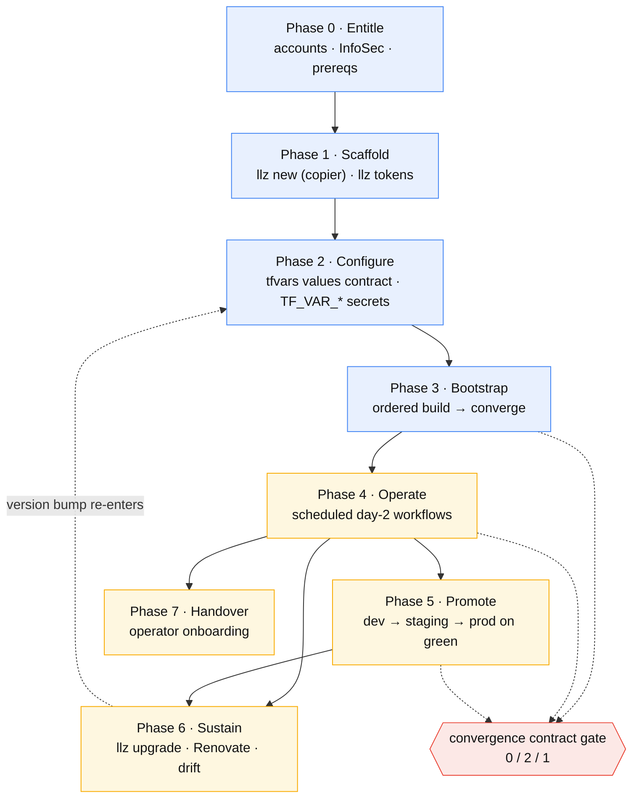

# Delivery methodology

How a team **delivers and sustains** an LKE-Enterprise + Akamai App Platform
landing zone with LLZ — the repeatable, phased path from "we have an entitlement"
to "the cluster converges and stays converged on day-2" — and, for each phase,
the LLZ mechanism that makes it a gate rather than a hope.

> This is a **methodology**, not a runbook. The step-by-step commands live in
> [quickstart.md](quickstart.md) (the fast path) and [adopter-guide.md](adopter-guide.md)
> (the same path with rationale). This doc is the layer above both: *why* the
> phases are ordered the way they are, what "done" means at each boundary, and
> which property of LLZ's design enforces it. When a phase here and a command
> there disagree, the command wins — please fix this doc.

## The thesis: delivery is convergence, not handcraft

The methodology rests on one inversion. A landing zone is **not** delivered by an
expert running a sequence of imperative steps that another team later struggles to
reproduce. It is delivered as **versioned artifacts plus a CLI that drives a
repo toward a declared end-state**, where every "is it done?" question has a
machine-checkable answer. Delivery is therefore *repeatable by construction*: the
same `llz` flow that the authoring team runs is the flow a sister team runs, and
the cluster is "delivered" exactly when it satisfies the
[convergence contract](architecture/convergence-contract.md) — not when someone
declares victory.

Five tenets follow from that, and each is load-bearing for a phase below:

| Tenet | What it means for delivery | LLZ mechanism |
|---|---|---|
| **Publish / consume, never fork-and-pray** | The durable units of reuse are published and independently versioned; an adopter consumes them, overriding only org/cluster identity. Upstream fixes arrive as a **version bump**, not a hand-merged diff. | OCI Helm charts on GHCR + `git::`-pinned Terraform modules under one umbrella tag ([overview](architecture/overview.md)) |
| **The CLI is the version anchor and single driver** | One pinned binary drives the whole lifecycle and re-renders every first-party pin in lockstep. There is no "which version of which piece" matrix to reason about. | `llz` — `new` / `tokens` / `env add` / `build` / `status` / `upgrade` ([adopter §2](adopter-guide.md)) |
| **Every delivery decision is a reviewable git fact** | Identity, ordering, per-stage knobs, and secrets-wiring all land as committed, diffable files — never as runtime-only state or tribal knowledge. | tfvars + `apl-values/<env>/` overlays; `promotion_rank`; `.copier-answers.yml` |
| **Convergence over completion** | "Delivered" is a measured state, not a checklist tick. Readiness checks are pollable and have a defined failure mode. | three-exit-code [convergence contract](architecture/convergence-contract.md) (0 converged · 2 in-progress · 1 hard-fail) |
| **Defaults with escape hatches, not forks** | Adopters customize without diverging: managed files track upstream, owned files are theirs forever, and updates merge only the delta. | Copier `.template-manifest` (managed / merge / owned); `.llz/commands.yaml`; `.githooks/pre-commit.local` |

Everything below is these five tenets applied in order.

## The delivery lifecycle

Delivery walks seven phases. Each has an **entry condition**, a **definition of
done** that is checkable (not subjective), and the **LLZ surface** that drives it.
Phases 0–3 are *stand-up* (one-time per deployment); phases 4–6 are the *sustaining*
loop that runs forever; phase 6 (handover) is what makes the team that comes after
you independent.

### Phase 0 — Entitle

**Entry:** a decision to stand up a platform. **Done:** every hard prerequisite in
the [adopter guide §1](adopter-guide.md) is satisfied and verifiable.

This phase is mostly *lead time*, and it is first because its longest pole — a
production Linode account with LKE-Enterprise — needs an executive sponsor and
InfoSec approval. Start it before anything else. The givens are deliberate and
**not** abstracted away: Linode LKE-E and apl-core are hard dependencies; only
org/cluster identity is variabilized.

- **Drives it:** the [Linode account request checklist](infosec/linode-account-request-checklist.md);
  `llz doctor` as the authoritative, always-current list of required CLI tooling
  and whether `gh` is authed.
- **Tenet:** *publish/consume* — you are consuming a platform, so its substrate
  (LKE-E, apl-core entitlement, an HTTPS-reachable GitOps repo) is a precondition,
  not something delivery provisions.

### Phase 1 — Scaffold

**Entry:** prerequisites met. **Done:** an instance repo exists, pinned to one
release, with the pre-commit gate armed and CI credentials provisioned.

`llz new` runs the Copier scaffold and sets `llz_version` to the binary's own
version, so the instance pins module `?ref=`, workflow `uses:@`, and `template-ref:`
to exactly the release the CLI came from — the lockstep that makes "the CLI is the
version anchor" true from the first commit. `llz tokens` runs the credential wizard
and seeds the `TF_VAR_*` / GHCR secrets CI will read.

- **Drives it:** `llz new`, `llz tokens`; Copier `--trust` arms the hook via
  `llz hooks` and copies operator `docs/` in.
- **Done is checkable:** `llz doctor` green; `.copier-answers.yml` records the
  template commit + answers.
- **Tenet:** *CLI as anchor* + *reviewable git fact* — the scaffold and its pins
  are committed, not configured out-of-band.

### Phase 2 — Configure

**Entry:** an instance repo. **Done:** every **ADOPTER-MUST-SET** value is filled,
secrets are wired as `TF_VAR_*` in CI, and the overlay renders.

Each Terraform root ships a `terraform.tfvars.example` documenting three value
classes — **MUST-SET** (identity: region, k8s version, cluster name/domain),
**SECRET** (`TF_VAR_*` only, never committed), and **default** (Linode/apl-core
shapes you keep). Adding a deployment is `llz env add`, which declares the env in
the LandingZone spec and `llz render`s a thin overlay over the shared apl-values
base (`_shared/` + `components/`) rather than cloning or hand-copying per-env files.

- **Drives it:** `llz env add <env>` (with `--dry-run` to preview), the values
  contract in [adopter §3](adopter-guide.md), `llz validate --env <env>` to flag
  unfilled placeholders before any build.
- **Done is checkable:** `llz validate --env <env>` passes;
  `kubectl kustomize apl-values/<env>/manifest` succeeds.
- **Tenet:** *reviewable git fact* — tfvars is the single source of truth; identity
  is a diff, secrets are environment-injected.

### Phase 3 — Bootstrap

**Entry:** a configured deployment. **Done:** the cluster reports
`bootstrap_application_synced` = `Synced + Healthy` — exit 0 on the convergence
gate.

Bootstrap is **ordered and gated**, not a single button. The Terraform roots apply
in sequence (`cluster → object-storage → cluster-bootstrap`);
`cluster-bootstrap` installs apl-core, which stands up Argo CD, which fans out the
first-party charts in sync-wave order (foundation → OpenBao platform → cert
automation). The methodology's "convergence over completion" tenet is most visible
here: TF returns success **only** once the bootstrap Application converges, and the
poll/stop/fail decision is the three-exit-code contract — never a human eyeballing
`kubectl get pods`.

- **Drives it:** the Terraform workflow dispatched per module (`cluster`,
  `object-storage`, `cluster-bootstrap`), then `bootstrap-openbao.yml`; the
  polling `llz ci converge` (wrapping `llz ci health`).
- **Ordering caveat:** the **first** cluster bootstrapped writes Harbor robot
  credentials later clusters read — bootstrap one fully before the next
  ([bootstrap-openbao](runbooks/bootstrap-openbao.md)).
- **Tenet:** *convergence over completion* — see the
  [low-level convergence walkthrough](architecture/overview.md#low-level-how-an-instance-converges).

### Phase 4 — Operate

**Entry:** a converged cluster. **Done:** this phase has no end — it is the steady
state the rest of the methodology protects.

Day-2 is **scheduled and reconciling**, not on-call toil. A set of reusable
workflows — `cluster-health`, `secret-rotation`,
`scheduled-checks` — poll the same readiness model and keep the cluster converged
with no standing operator effort. They fan out across **all** deployments via
`llz env list --json`.

- **Drives it:** `llz status` / `health` / `converge` / `drift`; the scheduled
  reusable workflows; the [playbooks](playbooks/operator-onboarding.md) for access
  and ops.
- **Tenet:** *convergence over completion* — the same gate that defined "delivered"
  in phase 3 defines "still healthy" forever.

### Phase 5 — Promote

**Entry:** more than one deployment in the instance. **Done:** a merged change has
walked `dev → staging → prod` in rank order, each stage gated on the prior stage's
green convergence.

Promotion is the methodology's blast-radius control: **one commit on `main`, rolled
across N ranked deployments in order**. It is *not* a second repo or a separate
config system — the artifact promoted is the merged commit, and the pipeline is the
order you apply it in. `promotion_rank` in each `cluster/<env>.tfvars` is the single
source of truth; the `needs:`-chained `promote.yml` is **generated** from it, so a
rank edit can't silently diverge from the workflow (`llz env pipeline --check`
guards that in CI). Per-stage knobs (version pins, sizing, region) live in each
deployment's tfvars, so `dev` can canary a version ahead of `prod` without forking.

- **Drives it:** `promotion_rank`; `llz env list --ordered` / `llz env next`;
  `llz env pipeline` (regenerate) / `--check` (drift gate). Full treatment:
  [environments-and-promotion.md](environments-and-promotion.md).
- **Tenet:** *reviewable git fact* — the pipeline order is a committed tfvars field,
  the workflow is rendered from it, and GitHub Environment protection supplies
  approval + soak.
- **Boundary:** this sequences *clusters*. Sequencing *apps within* a cluster is
  Argo CD's job — keep the two mental models separate.

### Phase 6 — Sustain

**Entry:** a delivered, operating platform. **Done:** recurring — the instance
tracks upstream without manual diffing and without drift accumulating silently.

Two tracks keep an instance current, and the methodology keeps them deliberately
**separate so they never race**:

- **First-party LLZ pins** (module `?ref=`, reusable-workflow `uses:@`,
  `template-ref:`, and the copied scaffold) move in lockstep via
  `llz self-update` (get the new CLI) then `llz upgrade --ref vX.Y.Z` (Copier
  update + re-pin). Copier merges only the delta, so local edits survive and
  conflicts surface only where you edited a line upstream also changed.
- **Independently-versioned artifacts** (OCI charts, external action digests) move
  via **Renovate** — grouped PRs, first-party chart patches automerge. Renovate is
  deliberately disabled on the first-party LLZ pins so it never races `llz upgrade`.

Drift between the instance and the template it was generated from is itself
measured: `llz drift` (and the monthly `template-drift` job) reports how far behind
the template you've fallen.

- **Drives it:** `llz self-update`, `llz upgrade`, Renovate
  (`instance-template/renovate.json`), `llz drift`,
  `template-scripts/stamp-template-version.sh`.
- **Tenet:** *publish/consume* + *defaults with escape hatches* — fixes arrive as
  bumps; the `managed` / `merge` / `owned` manifest decides what an upgrade may
  touch.
- **Re-entry:** a version bump loops back into phase 2 (re-validate) → phase 3/5
  (re-converge / re-promote). Sustaining is just the lifecycle running again on a
  smaller delta.

### Phase 7 — Handover

**Entry:** a platform that operates. **Done:** a sister system team can run the
whole lifecycle without the delivering team in the room.

Handover is a first-class phase, not an afterthought, because the entire model is
built so the team that comes after you runs the *same* `llz` flow you did — there is
no privileged "delivery environment." The [operator onboarding
playbook](playbooks/operator-onboarding.md) is the start-here; the
[adopter guide](adopter-guide.md) is the rationale; `llz doctor` tells a new
operator exactly what their workstation is missing.

- **Drives it:** [operator-onboarding](playbooks/operator-onboarding.md), the
  [playbooks](playbooks/) and [runbooks](runbooks/), `llz doctor`, the
  [Dev Container](devcontainer.md) (ships the full toolchain so onboarding is
  `open in container`, not a host-install marathon).
- **Tenet:** *CLI as anchor* — one binary, one flow, reproducible by anyone.

## Phase → support → reference, at a glance

| Phase | Definition of done (checkable) | Primary LLZ surface | Deep dive |
|---|---|---|---|
| 0 · Entitle | prerequisites satisfied | `llz doctor` | [adopter §1](adopter-guide.md) · [InfoSec checklist](infosec/linode-account-request-checklist.md) |
| 1 · Scaffold | instance pinned; hook armed; tokens seeded | `llz new`, `llz tokens` | [adopter §2,§4](adopter-guide.md) |
| 2 · Configure | `llz validate --env` passes; overlay renders | `llz env add`, `llz validate` | [adopter §3](adopter-guide.md) |
| 3 · Bootstrap | convergence gate exit 0 | TF workflow + `llz ci converge` | [overview low-level](architecture/overview.md) · [convergence contract](architecture/convergence-contract.md) |
| 4 · Operate | scheduled gates stay green | `llz status/health/drift` + day-2 workflows | [playbooks](playbooks/operator-onboarding.md) |
| 5 · Promote | change walked `dev→staging→prod` on green | `promotion_rank`, `llz env pipeline/next` | [environments-and-promotion](environments-and-promotion.md) |
| 6 · Sustain | pins current; drift reported | `llz upgrade`, Renovate, `llz drift` | [adopter §2,§4](adopter-guide.md) |
| 7 · Handover | sister team runs the flow solo | `llz doctor`, playbooks, Dev Container | [operator-onboarding](playbooks/operator-onboarding.md) |

## Roles and what each owns

The methodology distributes ownership so that no phase depends on a single person's
memory:

- **Delivering / authoring team** — owns the *template*: the published modules,
  charts, reusable workflows, and the `llz` CLI. They never own an adopter's
  identity or secrets. Their deliverable is a tagged release, not a configured
  cluster.
- **Adopting / system team** — owns the *instance*: tfvars, overlays, secrets in
  CI, and the promotion order. They consume releases; they do not fork the template.
- **InfoSec / account sponsor** — owns phase 0 entitlement and the credential
  posture (egress ACLs, rotation cadence) that the runbooks operate.
- **LLZ (the tool) itself** — owns the *gates*: it refuses to call a deployment done
  until the convergence contract says so, refuses to let a rank edit diverge from
  the pipeline, and refuses to clobber an `owned` file on upgrade. The
  non-negotiable parts of the methodology are enforced in the binary, not in a
  reviewer's discipline.

## Signs of divergence (antipatterns)

Divergence rarely announces itself; it accumulates as small manual shortcuts that
each felt faster than the convergent path. Because *divergence is a failure mode,
not a customization strategy*, the methodology is easier to hold when you can name
the day-to-day smells that mean you've stepped off it. Each maps to the tenet it
erodes and the convergent move that gets you back on.

| Smell you'll notice | What it really means | Get back on the path |
|---|---|---|
| **Routine mutating `kubectl`** — `apply` / `edit` / `patch` / `scale` / `create secret` as standard operating procedure, not a one-off diagnosis | Cluster state now lives only in someone's shell history; Argo CD will either reconcile it away or it becomes silent, undocumented drift. Erodes *convergence, not handcraft* + *reviewable git fact*. | Change the **chart values / `apl-values/<env>` overlay / tfvars** and let GitOps converge. Read-only `kubectl get/describe/logs` for diagnosis is expected — **mutating verbs as a habit are the antipattern.** |
| **Watching `kubectl get pods` to decide "is it done?"** | "Delivered/healthy" has regressed from a measured state back to a human eyeballing pods. Erodes *convergence over completion*. | Let the [convergence contract](architecture/convergence-contract.md) gate answer it — `llz ci converge` / `llz status`, whose exit code is the verdict. |
| **Hand-merging upstream / editing `managed` files** | You're back to *fork-and-pray*; the next `llz upgrade` will conflict or clobber the edit. Erodes *publish/consume* + *defaults with escape hatches*. | Take fixes as a **version bump** (`llz self-update` → `llz upgrade`); put local changes in `owned` files / `.llz/commands.yaml` / `.githooks/pre-commit.local`. |
| **Editing `promote.yml` (or any generated file) by hand** | The pipeline no longer derives from `promotion_rank`; `llz env pipeline --check` will flag the drift in CI. Erodes *reviewable git fact*. | Edit `promotion_rank` in the tfvars and **regenerate** with `llz env pipeline`. |
| **Secrets typed straight into the cluster** (`kubectl create secret`, console paste) | Secret material now exists outside the wired `TF_VAR_*` → OpenBao path, so rotation and review can't see it. Erodes *reviewable git fact* + the [secrets model](secrets.md). | Wire it as a `TF_VAR_*` / through the OpenBao platform so it's environment-injected, never ad-hoc. |
| **Bumping a single module `?ref=` or chart by hand** | The "which version of which piece" matrix is back; first-party pins no longer move in lockstep. Erodes *CLI as the version anchor*. | First-party pins move via `llz upgrade`; independently-versioned artifacts move via **Renovate** — never edit one ref in isolation. |
| **A step only the original author can run** | A privileged "delivery environment" has crept in, and handover will fail. Erodes *CLI as anchor* + phase 7. | Drive everything through `llz` so a sister team runs the identical flow — if a step isn't in the CLI or a playbook, that gap *is* the bug. |

The throughline: **whenever you reach for an imperative shortcut, ask what declared
artifact should have changed instead.** A handful of manual `kubectl` mutations
during an incident is fine — a *team that runs on them* has quietly re-introduced
the handcraft model this methodology exists to replace.

## What this methodology is *not*

- **Not application continuous delivery.** This delivers and sustains the
  *platform* and rolls *instance-repo changes across clusters*. Delivering *your
  workloads onto* a cluster is apl-core / Argo CD's job — see the boundary note in
  [environments-and-promotion §7](environments-and-promotion.md).
- **Not a fork-and-customize model.** Divergence is a failure mode, not a
  customization strategy; the escape hatches (`owned` files, `.llz/commands.yaml`,
  `.githooks/pre-commit.local`) exist precisely so you never have to fork to extend.
- **Not multi-substrate.** LKE-Enterprise + apl-core are intentional hard givens.
  Portability across clouds is explicitly out of scope; only org/cluster identity
  varies.

## See also

- [quickstart.md](quickstart.md) — the fast, single-deployment path end to end.
- [adopter-guide.md](adopter-guide.md) — every phase with full rationale and the
  values contract.
- [architecture/overview.md](architecture/overview.md) — the publish→consume and
  converge mechanics the phases ride on.
- [architecture/convergence-contract.md](architecture/convergence-contract.md) —
  the three exit codes that define "done" at every gate.
- [environments-and-promotion.md](environments-and-promotion.md) — phase 5 in full.
- [playbooks/operator-onboarding.md](playbooks/operator-onboarding.md) — the
  handover start-here.
