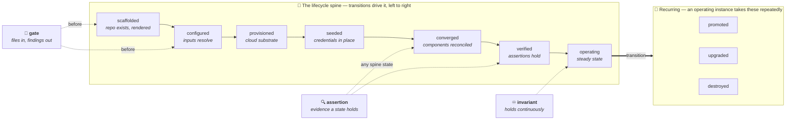
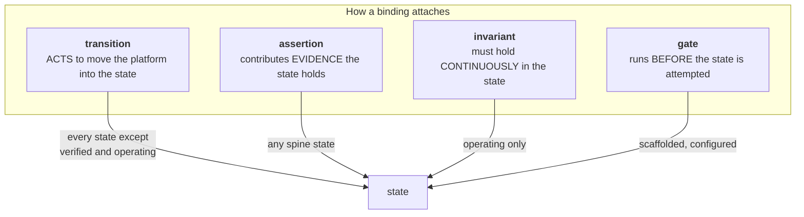
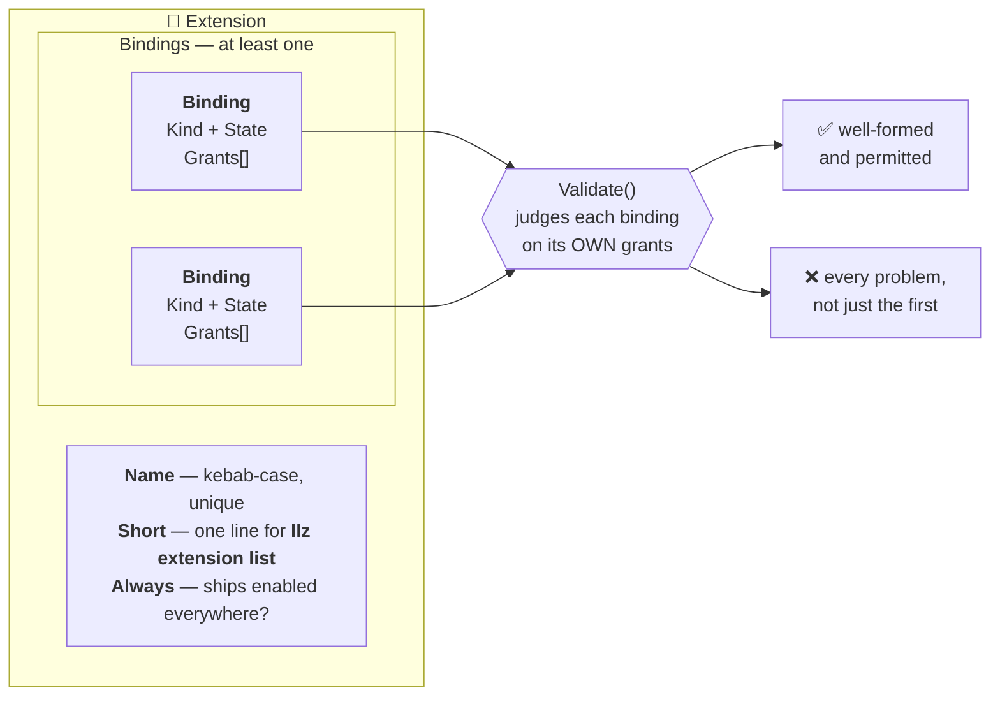

# Design: the internal extension model — bindings and grants

**Status:** **Partial** — Phases 1 and 2 landed. Phase 1 is the declaration model (states,
bindings, grants and their validation) in `tools/internal/extension`. Phase 2 is the first ten
extensions: `guard-budgets` (`tools/internal/budget`), `guard-docs` (`tools/internal/docsguard`),
`posture-at-rest` (`tools/internal/atrest`), `assert-storage` (`tools/internal/volumes`) and
`reconcile-actions` (`tools/internal/reconcilelanes`) `teardown` (`tools/internal/teardown`) and
`template-sustain` (`tools/internal/sustain`) and `import-brownfield` (`tools/internal/brownfield`) and
`obj-encryption` (`tools/internal/objenc`), `guard-charts`
(`tools/internal/chartguard`), `cluster-access` (`tools/internal/clusteraccess`), `health-sla`
(`tools/internal/healthsla`) `token-inventory` (`tools/internal/tokeninv`) `converge`
(`tools/internal/converge`) `assert-platform`
(`tools/internal/assertplatform`) `assert-reconciler`
(`tools/internal/assertreconciler`) `assert-registry`
(`tools/internal/assertregistry`) `promote-pipeline`
(`tools/internal/promote`) `posture-credential-coverage`
(`tools/internal/credcoverage`) `config-readiness`
(`tools/internal/configreadiness`) `env-topology`
(`tools/internal/envtopology`) `assert-network`
(`tools/internal/assertnetwork`) `wave-health`
(`tools/internal/wavehealth`) `tofu-driver`
(`tools/internal/tofudriver`) `assert-observability`
(`tools/internal/assertobs`) `assert-secrets`
(`tools/internal/assertsecrets`) and `assert-identity` (`tools/internal/assertidentity`) declare themselves, `tools/internal/extension/registry` collects and validates the compiled-in set,
and `llz extension list` shows them. **Nothing is loaded, dispatched or disabled through the model** —
all twenty-seven still run because `ci.go` and the reconciler register them, and the declarations are inert.
**ALL TEN STATES** — `promoted` was the last, taken by `promote-pipeline` — and `seeded` — the group the old ceiling banned by omission — ALL EIGHT grants, both values of `Always`, multi-binding extensions,
named bindings, `Incomplete` and the `grantStates` table are now exercised against real code — and [the
closure census](internal-extensions.md#the-cost-of-the-interesting-half) shows why that is structural
rather than incidental. The action
ABI, the YAML manifest, per-instance enablement and the remote half did *not* land. Phase 1 replaces
the `kind: check|tool` capability ceiling from PR #15 (closed); the rest of that design is not
contradicted here, only re-sequenced, and is tracked in issue #399.

**The VOCABULARY was wrong once, and it took three extractions in a row to prove it.**
`secret-custody` was a single word documented as *"read or write credential material"*. `cluster-access`
WRITES a kubeconfig (custody); `health-sla` READS `updated_time` with the root token (declared custody
under protest); `token-inventory` READS every pipeline credential and mutates nothing — and that one
was **inexpressible**, because a gate permits `read-repo` alone and an assertion permits read grants
only, which `secret-custody` was not. The grant was split into `secret-read` (reading credential
material or its metadata; read-only) and `secret-custody` (placing it; mutating). **This is the model's
only vocabulary ADDITION**, as against two `grantStates` widenings, and the distinction it draws is the
one a reviewer actually wants: *"this could leak a secret"* versus *"this decides what the secret is"*.

Note what did NOT happen: no `grantStates` row was widened. The ceiling was not too tight, the
vocabulary was too coarse — and widening the row would have let every credential-reading check in the
repo claim a mutating grant.

**The ceiling has been wrong twice, at opposite ends of the lifecycle, and both times an
extraction of shipping code found it.** The second: `secret-custody` was legal at `seeded` and
`operating` only, which made `cluster-access` — it fetches the cloud-issued **cluster-admin
kubeconfig**, the one human-facing credential per cluster — inexpressible. The row had only ever seen
credentials the platform *mints* or *replaces*, both of which happen to a cluster that already works,
so it quietly meant "custody begins once there is a platform to hold it". `provisioned` was added.
Note the symmetry: the first widening added a state at the **end** of the lifecycle, this one at the
**start**, and neither was predictable by reading the catalog. The first:

**The ceiling was wrong once, and the fourth extension found it.** `grantStates` did not list
`operating` as a legal state for `cloud-mutate`, which made two shipping reconciler lanes — they run
in-pod, continuously, and mutate Linode Volumes — inexpressible. The row was added with the argument
recorded beside it and the whole table pinned by a test. Refusing it was not the conservative choice:
a ceiling that makes a continuously-running cloud mutator inexpressible does not prevent it, it only
stops it being written down, which is `→ seeded` banned-by-omission recurring inside the half of the
ceiling built to fix banning-by-omission.

**FIXED by the seventh extension:** that an extension is PARTIAL. `reconcile-actions` declares four bindings and reads as complete, while four more of its
lanes are still in core — the same failure shape as banning by omission, since the reader cannot tell
what is missing. `template-sustain` was the second independent case, so `Extension.Incomplete` now exists and both partial declarations say what they are missing.

**A third thing the model cannot say, found by the sixth extension:** the difference between
GRANTED and CONFIRMED. `cloud-mutate` permits a binding to delete cloud resources; nothing expresses
whether a human authorised *this* deletion (`teardown.Deps.Confirm` — `--yes`). A destroy verb that is
granted but unconfirmed must dry-run rather than proceed, so the two bits must not be one. Unlike the
other two this is probably not a missing grant but a missing axis, and it belongs to the action ABI.

**One known gap, found by the second extension:** there is no `write-repo` grant, so a binding that
writes files in the repository cannot say so. `own-paths` is a copier fence, not a write permit. Two
independent cases — `llz ci gen-toc` and the catalog's `promote-pipeline` — are recorded in [the
catalog](internal-extensions.md#the-first-two-extracted). Deliberately not invented here: two cases
say the vocabulary has a hole, not what shape it is.

**Relates:** [ADR 0014](../adr/0014-core-surface-budget.md) (the budget this exists to relieve),
[internal-extensions.md](internal-extensions.md) (the catalog this model is derived from),
[ADR 0013](../adr/0013-llz-as-apl-cli.md) (the boundary discipline), issue #10 (parent),
issue #399 (the sequenced plan), PR #15 (closed, superseded).

**This document owns the MODEL** — states, bindings, grants, and the rules between them. Its
evidence is [the catalog](internal-extensions.md); the budget it serves is [ADR
0014](../adr/0014-core-surface-budget.md). Cited, not restated.

## What changed, and why

PR #15 asked **what an extension is**: `kind: check` (logic-bearing, ships tests) or `kind: tool`
(thin argv wrapper). The menu of skeletons *was* the capability ceiling — "if there's no skeleton to
start from, that capability belongs in core".

[The catalog](internal-extensions.md) tested that ceiling against all 214 files of package `main`
and it does not hold — see its closing section for the three measurements. The one that decides this
design is that **the whole `→ seeded` group is structurally inexpressible**: there is no `seeder`
skeleton, so OpenBao lifecycle, Keycloak, Harbor, database admin and four credential families are
banned *by omission*. Nobody decided that; nothing announced it.

Banning by omission is the specific failure. A ceiling should refuse things *with a reason*, and the
reason should be legible to whoever reads the declaration. The other two measurements set this
design's shape rather than its existence: most candidates cannot be external, so the model must be
in-process Go first; and most ship always-enabled, so universality cannot be the thing that decides
what may become an extension.

## The model

An extension declares **where it attaches** (bindings) and, **per binding, what that attachment
touches** (grants). It no longer declares what it *is*.

Grants hang off the binding, not the extension, and that placement is load-bearing rather than
cosmetic. Every rule about a grant is really a rule about a binding — "a gate may only read the
repo", "an assertion must not mutate what it measures" — so extension-scoped grants cannot be
reconciled with multi-binding extensions. Scoping them wrongly produced two real defects before
this was corrected: an assertion's read-only ceiling could be switched off by bolting on any
unrelated transition, and a `gate` + `transition:seeded` pair was *unsatisfiable*, with one rule
demanding `secret-custody` and another forbidding it. Per-binding grants dissolve both — each
binding is judged only on what it declares, and a sibling binding lends it nothing.
`Extension.Grants()` remains available as the derived union, so "what does this extension touch?"
is still answerable and can never disagree with the bindings it summarises.

### The phase model, drawn

The spine is the order an instance actually comes up in, and the solid arrows along it **are**
transitions. The other three kinds attach to it: `gate`s run *before* the early states over files
alone, `assertion`s attest that a state holds (the edge into `converged` is the one that matters —
that is where the health predicate lands once it separates from the converge action), and
`invariant`s hold continuously in `operating`.



Four binding kinds attach to those states, and the difference between them is what the model is
actually for:



Two of those arrows are findings rather than taxonomy, and both are explained under
[Bindings](#bindings): a `transition` cannot target `verified` or `operating`, and an `assertion` may
target *any* spine state rather than only `verified`.

### States

The lifecycle spine, in order:

`scaffolded` → `configured` → `provisioned` → `seeded` → `converged` → `verified` → `operating`

Plus three an operating instance takes repeatedly, outside the spine: `promoted`, `upgraded`,
`destroyed`.

These are the groups the catalog assigned all 214 files to, so the vocabulary is derived from the
code rather than invented ahead of it.

### Bindings

| kind | means | may attach to |
|---|---|---|
| `transition` | **acts** to move the platform into the state | every state except `verified` and `operating` |
| `assertion` | contributes **evidence** the state holds | any state |
| `invariant` | must hold **continuously** in the state | `operating` |
| `gate` | runs **before** the state is attempted, over files alone | `scaffolded`, `configured` |

Two of these rows are load-bearing findings rather than taxonomy:

**`transition` cannot target `verified` or `operating`.** Neither is somewhere an action moves the
platform *to*. `verified` is the conclusion of assertions; `operating` is a condition that holds.
Making that a type error is what stops "run the asserts" from being modelled as a step.

**`assertion` may target any state, not just `verified`.** Two things follow from that, and the
first is load-bearing.

*It reaches the recurring states, because that is where being wrong costs money.* `assert-no-orphans`
(`ci_teardown.go`) is the assertion that `destroyed` actually holds — a missed Volume or
NodeBalancer bills until somebody notices, which is why PR #391 exists. An earlier cut of this table
read "any spine state" and left the repo's highest-stakes assertion inexpressible in a model derived
from that repo. Asserting `upgraded` (template drift) and `promoted` follows the same way.

*It reaches the non-`verified` spine states, and the repo already demonstrates why.* `internal/health`
is **1,164 logic lines** of pure classification — `argo.go`, `certs.go`, `matchers.go` — which
`health.go`'s own header calls "the tested `internal/health` predicate", describing itself as "the
kubectl orchestration that feeds them". That separation is already built and already load-bearing;
under this model the library half simply *is* an `assertion:converged` and the command half a
`transition:converged`. `config-readiness` is the same shape for `configured`, which the catalog
identified as "the `configured` predicate, mis-filed as a command". A rule admitting only `verified`
would have nowhere to put either.

(An earlier draft of this section claimed `health.go` *fused* action and predicate and called that
the catalog's most valuable split. It does not — the split happened before this design existed. The
rule is unchanged; the evidence for it is stronger as a precedent than it was as a proposal.)

An extension may carry **several bindings**, which is how the catalog's strongest structural signal
gets expressed: `harbor-provisioner` ↔ `assert-registry`, `database-provisioner` ↔
`assert-database`, `keycloak-provisioner` ↔ `assert-identity`, `reconciler-runtime` ↔
`assert-reconciler`. A capability and its assertion enable and disable together; making them one
extension with two bindings removes the possibility of them drifting out of step, and takes the
count from ~57 toward ~49.

### Grants

`read-repo` · `cloud-read` · `cluster-read` · `secret-read` · `cluster-write` · `cloud-mutate` · `secret-custody` ·
`own-paths`

The vocabulary is closed. [The catalog](internal-extensions.md) records how it distributes across all
57 candidates, and no grant is held by a majority — which is what a scoping model looks like when it
discriminates rather than relabels.

**Read that as a design intuition, not a measurement.** The grants were assigned in the same pass
that invented the vocabulary, so the spread reports the author's judgement about package `main`, not
an independent property of it. It is a reason to believe the axis discriminates; it is not evidence,
and it cannot become evidence until extensions declare their own grants and the distribution is
*observed* rather than assigned. The same caution applies to "nothing in package `main` needed a
fifth binding kind": the catalog was built with four in mind.

### The ceiling, restated as rules

The ceiling is now the relationship between the two. `Validate()` enforces:

| rule (each applies to ONE binding) | why |
|---|---|
| a `gate` binding may hold **only** `read-repo` | it runs in the fast pre-commit path; all six catalogued gates need nothing else, and one that reached a cluster would be doing so pre-commit against live infrastructure |
| an `assertion` binding may hold only read grants | an assertion observes; it does not change what it measures |
| a `transition:seeded` binding **must** declare `secret-custody` | that transition is *defined* by placing credential material; claiming the state without the grant hides custody from the reviewer reading the grant line |
| `own-paths` only on a `transition` to `scaffolded` or `upgraded` | it is exactly `.template-manifest`'s `owned` class — "copier must not render these bytes, something else does" — and a fence only matters when the thing it fences off runs. Copier runs at exactly two moments: `llz new` and `copier update`. Writing a file at some other state is not grounds for the grant; being outside copier's render is (see the catalog's Decision 1) |
| every binding must declare **at least one** grant | the grant is the handle the action receives — a read-only kubeconfig, a path-fenced OpenBao token — so a binding asking for nothing is handed nothing and cannot run |
| `secret-custody` (PLACING credential material — reading it is `secret-read`, which is unrestricted) only at `provisioned`, `seeded` or `operating`; `cloud-mutate` only at `provisioned`, `seeded`, `converged`, `operating`, `destroyed`; `cluster-write` at the same five | the other half of the ceiling. Requiring custody at `seeded` while forbidding it nowhere left a transition to `scaffolded` free to declare it and validate clean — so "declare what you touch and be judged on it" held only for `gate` and `assertion`, 13 of 57 declarations, while the 44 transitions and invariants went unchecked |

Plus the structural rules: kebab-case unique names, at least one binding, closed vocabularies, no
duplicate bindings or grants.

**Repeated attachments carry a name.** `operating` is the only state an invariant may attach to, so
without one an extension could hold exactly a single invariant — and `reconcile-actions` is seven,
whose needs genuinely differ (the token restorers place credential material; the storage-class
demoter only writes to the cluster). Collapsing them into one binding widens its grants to the union,
which is the over-granting that scoping grants *per binding* was introduced to prevent. The name is
optional and only disambiguates: two unnamed attachments of the same `kind:state` are still the
mistake they always were.

**The state table's restricted-grant rows are judgement transcribed, not derived.** They record where
the catalog places each grant today. A new row is the most likely thing here to be needed, and should
arrive as an argued change rather than a quiet widening. Two have: `cloud-mutate` at `operating` and
`secret-custody` at `provisioned`, each carrying its argument inline and each re-pinned in
`grantstates_internal_test.go`. Both were found by extracting code that already ships — **not** by
re-reading the catalog — which is the case for taking the expensive capabilities early.

**THE ACTION ABI IS NOW THE BINDING CONSTRAINT.** Fourteen extractions have not needed one; the
fourteenth showed why the next ones will. `converge` is 2,476 lines whose call tree runs six or seven
frames from entry point to the leaf that shells out, so its capabilities are INSTALLED once
(`converge.Install`) rather than threaded as a parameter the way every earlier extension does. That
works, and its cost is stated in the package: an installed seam is global mutable state, tests must
restore it, and two callers cannot hold different capability sets at once. An action ABI would hand
each binding its own handle at dispatch time — which is exactly the thing package-level installation
cannot do. `cmd/llz/ci_converge.go` is the hand-written version of that dispatch, and it is the
clearest specification of the ABI these extractions have produced. Issue #399 sequences it.

**The escape hatch is re-modelling, not an exception list.** The catalog contains exactly two
entries that break the assertion rule, and flags both itself: `assert-storage` holds `cloud-mutate`
("the odd one out") and `wedge-gameday` holds `cluster-write` ("so not a plain assertion"). The
model's answer is that each is a transition *paired with* an assertion — the same pairing shape
above — so both become expressible by declaring the mutating half honestly — as its own transition binding
with its own grants, while the assertion binding stays read-only. `assert-storage` is carried in the
catalog-sample test in exactly that shape.

## Anatomy of an extension

An extension is a Go value. It declares an identity, where it attaches, and — per attachment — what
it may touch. That is the whole surface today; there is no manifest, no action, no registry yet (see
[What is deliberately absent](#what-is-deliberately-absent)).



**Grants hang off the binding, not the extension.** A sibling binding lends nothing to its
neighbours — that independence is what makes the ceiling enforceable, and getting it wrong produced
two real defects (see [Bindings](#bindings)).

### Three worked examples

The simplest — one binding, one grant, nothing to argue about:

| | `guard-budgets` |
|---|---|
| bindings | `gate:configured` |
| grants | `read-repo` |
| always | yes |
| why it validates | a gate may hold only `read-repo`, and it holds exactly that |

The pairing pattern — one extension, two bindings, each scoped separately. The capability and its
assertion enable and disable together, so they are one extension rather than two kept in step by hand:

| | `harbor-provisioner` |
|---|---|
| bindings | `transition:seeded` · `assertion:verified` |
| grants | `secret-custody` (on the transition) · `cluster-read` (on the assertion) |
| always | no |
| why it validates | the seeded transition declares the custody that transition is *defined* by; the assertion stays read-only |

The acid test — the action and the predicate separated. `health.go` fuses them today; under this
model they come apart, which is why an `assertion` must be allowed to target `converged`:

| | `converge` |
|---|---|
| bindings | `transition:converged` (the action) · `assertion:converged` (health, the predicate) |
| grants | `cluster-read` + `cluster-write` · `cluster-read` |
| always | yes |
| why it matters | if assertions could only target `verified`, this split would have nowhere to land |

### What the validator refuses, and why you cannot smuggle past it

The ceiling is [the rules table above](#the-ceiling-restated-as-rules), applied per binding. Two
refusals are worth seeing concretely, because both were live bugs before grants moved onto the
binding:

```
assertion:verified[secret-custody, cloud-mutate, cluster-write]
  + transition:scaffolded[read-repo]        ← an unrelated binding

  ✗ an assertion permits only read grants (read-repo, cloud-read, cluster-read),
    not "secret-custody" — if it must mutate, declare the mutating half as its
    own transition binding
```

Adding an unrelated transition used to switch the assertion's ceiling off entirely. It no longer
does, because each binding is judged alone.

```
gate:configured[read-repo] + transition:seeded[secret-custody]

  ✓ validates — the gate carries read-repo, the seeded transition carries
    secret-custody, and neither lends anything to the other
```

That pair was once *unsatisfiable*: one rule demanded `secret-custody`, another forbade anything but
`read-repo`, and no edit satisfied both. Per-binding scoping dissolves it.

## What is deliberately absent

**The action ABI.** How an extension's Go entry point receives a cluster client, a credential handle
or a render context is not defined here. There is no consumer yet, and freezing the signature before
the first real extension needs it is how the wrong ABI gets locked in. `converge` (the acid test) and `import-brownfield` (the biggest movable block) are the two that
should drive its shape, which is why issue #399 sequences them early rather than last.

Its *shape* is nonetheless constrained already, because **grants are enforced: the grant IS the
handle.** A `cluster-read` binding receives a read-only kubeconfig, a `secret-custody` binding an
OpenBao token fenced to its declared paths. That makes the ABI a delivery mechanism for scoped
capabilities rather than one context handed to everyone — a security decision, not only an ergonomic
one — and it is why a binding declaring no grants is now rejected: it would receive nothing and could
do nothing.

**The manifest.** The declaration is a Go value. A YAML projection is for the externalisable
minority (29 of 57) and can be added when one of them is actually externalised; adding it now would
mean designing the schema against zero external extensions.

**The registry, loader, ordering and enablement.** The next slice. The catalog sizes it: ~45–55
internal extensions, so `llz extension list` and the loader must be built for dozens. `Always` is a
**default**, not a constant: `llz ci assert-suite` is called from three places in
`instance-template/`, so an instance with no object storage must be able to turn `assert-objstore`
off in its own configuration rather than by taking a different build.

**The driver, and what advances the last two spine states.** Five of the seven are entered by acting;
`verified` and `operating` are not, and naming them is the driver's job. Two decisions already
constrain it (both recorded in [the catalog](internal-extensions.md#decisions)):

- **`llz state` recomputes with a freshness window.** Cheap predicates evaluate every time; the
  expensive ones reuse a recorded result inside a TTL and re-run past it. So every state needs a
  predicate with a declared cost, and `llz state` must be able to say when it last actually looked. A
  recorded-only state reports a station the instance has drifted out of; always-recompute makes the
  command too slow to reach for, and an unobserved state machine is a diagram.
- **A required assertion may be waived — with a reason and an expiry, in the spec.** The core keeps
  the required set; the driver evaluates it *minus live waivers*. An extension never declares its own
  state reached. The waiver's job is to make a skipped assertion visible and time-boxed rather than
  absorbed, which is what stops `verified` from meaning something different on every instance.

## Ordering

The remote half of PR #15 — git-pinned `sources:`, digest lock, trust model, `extension sync` — can
serve at most the externalisable minority and none of the majority that needs in-process Go. The half
that unblocks 91% of the decomposition is this one, and the spike treated it as a later phase.
Reversing that is the whole point of the re-sequencing.

**The phased plan lives in issue #399**, with the catalog's first five as the forcing cases. It is
not duplicated here: it carries per-slice line counts that move as `main` moves, and a copy in this
document would drift silently — as an earlier copy already had, quoting `guard-budgets` at 646 lines
when it had grown to 691.
