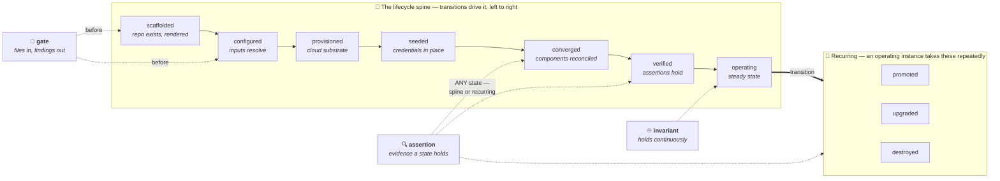
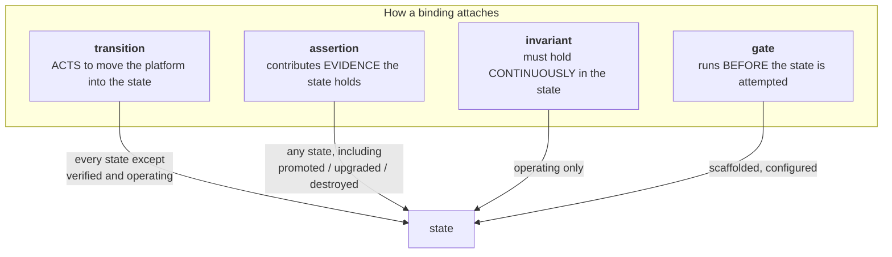
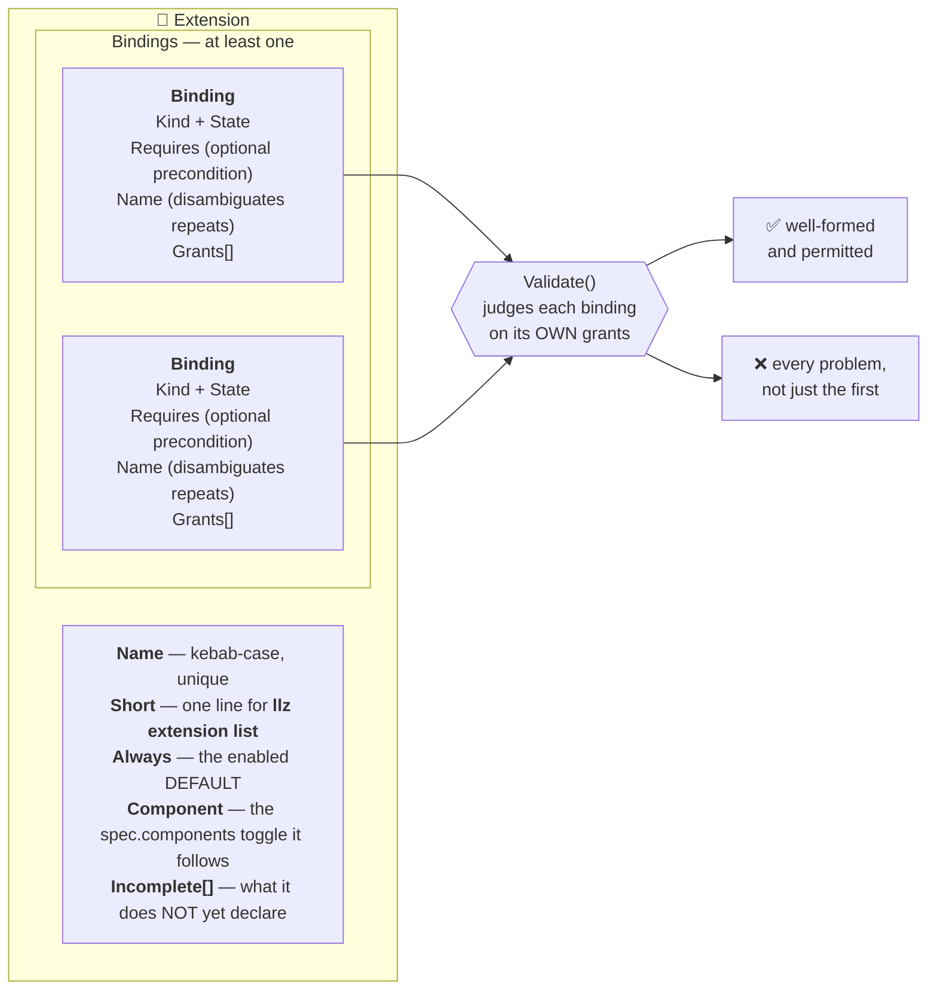

# Design: the internal extension model — bindings and grants

**Status:** **Shipped** — as the **declaration model**, which is what this document specifies: where
an extension attaches to the platform lifecycle (bindings), what each attachment may touch (grants),
and the rules between the two. That model is landed on `main`, load-bearing, and enforced in code.
**68 extensions across 67 packages** declare **122 bindings** between them. The set is not enumerated
here, because a list beside the code it describes is the hand-maintained second copy this design
exists to avoid — `llz extension list --verbose` is the listing, and it derives the package path from
each declaration's constructor rather than transcribing it.

**THE SCOPE WAS NARROWED TO GET HERE, and that is the honest part of this status line.** This design
was once the front half of the whole decomposition programme, and carried the action ABI, a YAML
manifest, a loader, ordering, and the remote half with it. Those are **not** specified here and are
not deferred work *of this design* — see [Out of scope](#out-of-scope-and-where-it-is-tracked) for
each one and why. The programme is tracked in issue #399.

The narrowing is a claim worth checking rather than trusting: the decomposition target that motivated
the programme has been **met**. Issue #399 aimed package `main` at ~3,000 lines from 41,803; the
counted CLI surface is **1,954** today (`cli-wiring-layer` 1,948 + `cmd-llz-entrypoint` 6, both
`exact: true`). What remains is framework for consumers that do not exist yet.

**THE DECLARATIONS ARE NO LONGER INERT**, which is the sentence this block carried for far too long
after it stopped being true. Three consumers read them today, and only one is dispatch:

| consumer | what it does with a declaration |
|---|---|
| `registry/gates.go` | **RUNS** gate bindings — **29 rows**, covering 22 of the 24 extensions that declare one. A row is a *command*, so one extension can contribute several (`guard-manifests` has three). `llz ci gates` drives the whole table; `make llz-gates` is how CI calls it. The two that are not driven are declared undriven **with a reason** in the same file, not omitted |
| `registry/enablement.go` | resolves an instance's enabled set from `spec.components`; 10 extensions name a component they follow. `registry.Commands()` separately pins that every verb an extension exposes is reachable in the cobra tree `internal/cli` builds |
| `shared/capability` | builds the **handles** a binding's grants entitle it to — `capability.For`, `CloudFor`, `RepoForGate`. The grant IS the handle, so a binding declaring nothing is handed nothing |

**Exactly one of the four kinds dispatches from the registry.** Gates do. Assertions and transitions
are hand-wired into the cobra tree in `tools/internal/cli`; invariants are scheduled by the in-cluster
reconciler. So `Kind` is a real constraint for the validator and a real dispatch key for one kind,
and saying so plainly beats a reader inferring otherwise from the model's symmetry.

**One gap is real, and calling it out-of-scope does not make it smaller.** Nothing evaluates a
required set and names a state, so `verified` and `operating` — the two spine states not entered by
acting — are vocabulary that bindings attach to rather than stations an instance is ever declared to
have reached. The lifecycle spine is **descriptive here, not operational**. That is the driver's job,
it is the one absent piece with real pull, and it is the reason this document is scoped to
declaration rather than to running the machine.

This design replaces the `kind: check|tool` capability ceiling from PR #15 (closed); the rest of that
design is not contradicted here, only re-sequenced, and is tracked in issue #399.

**ALL TEN STATES** — `promoted` was the last, taken by `promote-pipeline` — and `seeded`, the group
the old ceiling banned by omission — **ALL NINE grants**, both values of `Always`, multi-binding
extensions, named bindings, `Incomplete` and the `grantStates` table are exercised against real code,
and [the closure census](internal-extensions.md#the-cost-of-the-interesting-half) shows why that is
structural rather than incidental.

<details>
<summary>The first extensions, in the order they were extracted (historical)</summary>

`guard-budgets` (`tools/internal/extensions/guards/budget`), `guard-docs` (`tools/internal/extensions/guards/docsguard`),
`posture-at-rest` (`tools/internal/extensions/lifecycle/atrest`), `assert-storage` (`tools/internal/extensions/assertions/volumes`) and
`reconcile-actions` (`tools/internal/extensions/lifecycle/reconcilelanes`) `teardown` (`tools/internal/extensions/lifecycle/teardown`) and
`template-sustain` (`tools/internal/extensions/assertions/sustain`) and `import-brownfield` (`tools/internal/extensions/lifecycle/brownfield`) and
`obj-encryption` (`tools/internal/extensions/lifecycle/objenc`), `guard-charts`
(`tools/internal/extensions/guards/chartguard`), `cluster-access` (`tools/internal/extensions/lifecycle/clusteraccess`), `health-sla`
(`tools/internal/extensions/lifecycle/healthsla`) `token-inventory` (`tools/internal/extensions/assertions/tokeninv`) `converge`
(`tools/internal/extensions/lifecycle/converge`) `assert-platform`
(`tools/internal/extensions/assertions/assertplatform`) `assert-reconciler`
(`tools/internal/extensions/assertions/assertreconciler`) `assert-registry`
(`tools/internal/extensions/assertions/assertregistry`) `promote-pipeline`
(`tools/internal/extensions/lifecycle/promote`) `posture-credential-coverage`
(`tools/internal/extensions/guards/credcoverage`) `config-readiness`
(`tools/internal/extensions/assertions/configreadiness`) `env-topology`
(`tools/internal/shared/envtopology`) `assert-network`
(`tools/internal/extensions/assertions/assertnetwork`) `wave-health`
(`tools/internal/extensions/guards/wavehealth`) `tofu-driver`
(`tools/internal/extensions/lifecycle/tofudriver`) `assert-observability`
(`tools/internal/extensions/assertions/assertobs`) `assert-secrets`
(`tools/internal/extensions/assertions/assertsecrets`) and `assert-identity` (`tools/internal/extensions/assertions/assertidentity`) and `deliver-docs`
(`tools/internal/extensions/lifecycle/deliverdocs`) and `argocd-diagnostics`
(`tools/internal/verbs/argodiag`) and `posture-plaintext`
(`tools/internal/extensions/guards/plaintext`) and `chart-publish`
(`tools/internal/extensions/lifecycle/chartpublish`) and `guard-manifests`
(`tools/internal/extensions/assertions/manifestguard`) and `assert-objstore`
(`tools/internal/extensions/lifecycle/assertobjstore`) and `wedge-gameday`
(`tools/internal/extensions/lifecycle/gameday`) and `phase-timing`
(`tools/internal/verbs/phasetiming`) and `doctor-probes`
(`tools/internal/verbs/doctor`) and `kyverno-policies`
(`tools/internal/extensions/lifecycle/kyverno`) and `dev-mutation-testing`
(`tools/internal/verbs/mutate`) and `release-publish`
(`tools/internal/extensions/lifecycle/releasepublish`) and `credential-state-passphrase`
(`tools/internal/extensions/lifecycle/statepassphrase`) and `credential-pat` + `credential-objkey`
(both in `tools/internal/extensions/lifecycle/credrotate` — the first package to declare two) and `database-provisioner`
(`tools/internal/extensions/lifecycle/database`, holding `assert-database` as its third binding) and `openbao-seed`
(`tools/internal/extensions/lifecycle/openbao`) and `openbao-peer-ca`
(`tools/internal/extensions/lifecycle/openbao`).

These paths were accurate when each was extracted and are **not** maintained — `llz extension list
--verbose` derives the current one. The list stops here because it stopped being the whole set long
before it stopped being edited.

</details>

**The VOCABULARY was wrong once, and it took three extractions in a row to prove it.**
`secret-custody` was a single word documented as *"read or write credential material"*. `cluster-access`
WRITES a kubeconfig (custody); `health-sla` READS `updated_time` with the root token (declared custody
under protest); `token-inventory` READS every pipeline credential and mutates nothing — and that one
was **inexpressible**, because a gate permits `read-repo` alone and an assertion permits read grants
only, which `secret-custody` was not. The grant was split into `secret-read` (reading credential
material or its metadata; read-only) and `secret-custody` (placing it; mutating). This was the model's
**first** vocabulary change and the only one for a long stretch; `write-repo` is the second and so far
last (see below). The distinction it draws is the one a reviewer actually wants: *"this could leak a
secret"* versus *"this decides what the secret is"*.

Note what did NOT happen *here*: no `grantStates` row was widened for it. The ceiling was not too
tight, the vocabulary was too coarse — and widening the row would have let every credential-reading
check in the repo claim a mutating grant.

> **The sections below are chronological strata**, each written when its extraction found the defect,
> and each keeps the count that was true at the time. The running total is one table:
> [the widenings](#the-ceiling-restated-as-rules) — **four widenings plus one whole row added** —
> and that table is the one pinned by `TestDesignDocGrantStatesMatchesTheCode`. Trust it over any
> count in the prose.

**The ceiling was wrong at both ends of the lifecycle, and each time an extraction of shipping code
found it.** The second: `secret-custody` was legal at `seeded` and
`operating` only, which made `cluster-access` — it fetches the cloud-issued **cluster-admin
kubeconfig**, the one human-facing credential per cluster — inexpressible. The row had only ever seen
credentials the platform *mints* or *replaces*, both of which happen to a cluster that already works,
so it quietly meant "custody begins once there is a platform to hold it". `provisioned` was added.
Note the symmetry: the first widening added a state at the **end** of the lifecycle, this one at the
**start**, and neither was predictable by reading the catalog. The first:

**The FIRST widening, found by the fourth extension.** `grantStates` did not list
`operating` as a legal state for `cloud-mutate`, which made two shipping reconciler lanes — they run
in-pod, continuously, and mutate Linode Volumes — inexpressible. The row was added with the argument
recorded beside it and the whole table pinned by a test. Refusing it was not the conservative choice:
a ceiling that makes a continuously-running cloud mutator inexpressible does not prevent it, it only
stops it being written down, which is `→ seeded` banned-by-omission recurring inside the half of the
ceiling built to fix banning-by-omission.

**FIXED by the seventh extension:** that an extension is PARTIAL. `reconcile-actions` declares five invariants and reads as complete, while three more of its
lanes sit undeclared in the reconciler package next door — the same failure shape as banning by omission, since the reader cannot tell
what is missing. `template-sustain` was the second independent case, so `Extension.Incomplete` now exists and both partial declarations say what they are missing.

**A FOURTH thing the model could not say, found by the twenty-ninth extension — and since RESOLVED,
against the kind.** There is no binding kind for a **diagnostic**. `argocd-diagnostics` reads a
failing platform and prints it for a human, always exits 0 by design ("diagnostics must never mask
the failure that triggered them"), and runs precisely when `converged` did *not* hold. None of the
four kinds fits: `gate` is files-only, `transition` acts, `invariant` holds continuously, and
`assertion` contributes evidence a state **holds** — which is the opposite of what this contributes.
It was to be argued from `doctor-probes` and `phase-timing`, on this model's usual bar of a
declaration that is impossible rather than awkward, plus two independent cases.

**Both refuted it.** `phase-timing` attaches to *no* state at all — its subject is the run — so it and
`argocd-diagnostics` disagreed about the one thing a binding encodes; `doctor-probes` was the
tiebreaker and sat at `configured` as a plain assertion, needing no note. A kind wide enough for all
three would have had to mean *"produces operator-facing output and never fails"*, which is a property
of the **output** where a binding encodes a **position in the lifecycle**.

All three then moved to `tools/internal/verbs`, because they are cobra commands rather than
capabilities — nobody enables or disables `llz doctor`. So the answer to *"which of the four kinds
does a diagnostic hold?"* is that it holds **none, because it is not an extension**, and the refusal
is structural rather than argued: `internal/verbs` declares nothing
(`TestVerbsDoNotDeclareExtensions`) and the validator rejects the word
(`TestDiagnosticIsNotABindingKind`). This paragraph described the question as open for a while after
it closed, citing a declaration that no longer exists — read both tests before proposing a fifth.

**A third thing the model cannot say, found by the sixth extension:** the difference between
GRANTED and CONFIRMED. `cloud-mutate` permits a binding to delete cloud resources; nothing expresses
whether a human authorised *this* deletion (`teardown.Deps.Confirm` — `--yes`). A destroy verb that is
granted but unconfirmed must dry-run rather than proceed, so the two bits must not be one. Unlike the
other two this is probably not a missing grant but a missing axis, and it belongs to the action ABI.

**The `write-repo` gap is CLOSED, by the twenty-eighth extension.** It was open from the second one,
and refused three times: `llz ci gen-toc`, `guard-docs` and `promote-pipeline` each write the
operator's repo, and each was resolved by a **file split** — the package renders bytes, package `main`
calls `os.WriteFile` — on the stated grounds that two cases say the vocabulary has a hole and do not
say what shape it is.

`deliver-docs` is where that answer stops working. It does not render bytes for someone else to
write: it **prunes a directory and rewrites links in place**, deciding per file, mid-walk, from that
file's inode identity and whether the template owns its path. Hoisting the writes means buffering
every rewritten file to hand back, or passing `main` a callback that writes — the write happening
inside the package with extra indirection. The declaration was **impossible**, not incomplete, which
is this model's stated bar for a new word.

`write-repo` means the instance repo's **tracked** files; a temp dir needs no grant, the same way
reading `/tmp` needs no `read-repo`. Its `grantStates` row is `{scaffolded, configured, upgraded}` — the two
moments copier runs, plus `configured`, which `environments` and `render` earned by authoring the
instance's own files — and deliberately **not** `promoted`, because `promote-pipeline` still keeps its
write in `main` and a row no shipping code exercises is a guess. It is not `own-paths`: that is a
**fence** ("copier must not render these bytes") and this is a **permit**; `deliver-docs` holds the
permit and not the fence, since it prunes what copier just rendered and wants the re-render.

Two vocabulary additions in twenty-eight extractions — `secret-read` (a **split**) and `write-repo`
(an **addition**) — is the rate to judge the next one against.

**Relates:** [ADR 0014](../adr/0014-core-surface-budget.md) (the budget this exists to relieve),
[internal-extensions.md](internal-extensions.md) (the catalog this model is derived from),
[ADR 0013](../adr/0013-llz-as-apl-cli.md) (the boundary discipline), issue #10 (parent),
issue #399 (the sequenced plan), PR #15 (closed, superseded).

**This document owns the MODEL** — states, bindings, grants, and the rules between them. Its
evidence is [the catalog](internal-extensions.md); the budget it serves is [ADR
0014](../adr/0014-core-surface-budget.md). Cited, not restated.

<!-- toc -->
## Contents

- [What changed, and why](#what-changed-and-why)
- [The model](#the-model)
- [Anatomy of an extension](#anatomy-of-an-extension)
- [How the directory and the code support the model](#how-the-directory-and-the-code-support-the-model)
- [Out of scope, and where it is tracked](#out-of-scope-and-where-it-is-tracked)
- [What comes next](#what-comes-next)

<!-- /toc -->

## What changed, and why

PR #15 asked **what an extension is**: `kind: check` (logic-bearing, ships tests) or `kind: tool`
(thin argv wrapper). The menu of skeletons *was* the capability ceiling — "if there's no skeleton to
start from, that capability belongs in core".

[The catalog](internal-extensions.md) tested that ceiling against all 214 files of package `main`
and it does not hold — see its closing section for the three measurements. The one that decides this
design is that **the whole `→ seeded` group is structurally inexpressible**: there is no `seeder`
skeleton, so OpenBao lifecycle, Keycloak, Harbor, database admin and four credential families are
banned *by omission*. Nobody decided that; nothing announced it.

Banning by omission is the specific failure. A ceiling should refuse things *with a reason*, and the
reason should be legible to whoever reads the declaration. The other two measurements set this
design's shape rather than its existence: most candidates cannot be external, so the model must be
in-process Go first; and most ship always-enabled, so universality cannot be the thing that decides
what may become an extension.

## The model

An extension declares **where it attaches** (bindings) and, **per binding, what that attachment
touches** (grants). It no longer declares what it *is*.

Grants hang off the binding, not the extension, and that placement is load-bearing rather than
cosmetic. Every rule about a grant is really a rule about a binding — "a gate may only read the
repo", "an assertion must not mutate what it measures" — so extension-scoped grants cannot be
reconciled with multi-binding extensions. Scoping them wrongly produced two real defects before
this was corrected: an assertion's read-only ceiling could be switched off by bolting on any
unrelated transition, and a `gate` + `transition:seeded` pair was *unsatisfiable*, with one rule
demanding `secret-custody` and another forbidding it. Per-binding grants dissolve both — each
binding is judged only on what it declares, and a sibling binding lends it nothing.
`Extension.Grants()` remains available as the derived union, so "what does this extension touch?"
is still answerable and can never disagree with the bindings it summarises.

### The phase model, drawn

The spine is the order an instance actually comes up in, and the solid arrows along it **are**
transitions. The other three kinds attach to it: `gate`s run *before* the early states over files
alone, `assertion`s attest that a state holds (the edge into `converged` is the one that matters —
that is where the health predicate lands once it separates from the converge action), and
`invariant`s hold continuously in `operating`.



Four binding kinds attach to those states, and the difference between them is what the model is
actually for:



Two of those arrows are findings rather than taxonomy, and both are explained under
[Bindings](#bindings): a `transition` cannot target `verified` or `operating`, and an `assertion` may
target *any* spine state rather than only `verified`.

### States

The lifecycle spine, in order:

`scaffolded` → `configured` → `provisioned` → `seeded` → `converged` → `verified` → `operating`

Plus three an operating instance takes repeatedly, outside the spine: `promoted`, `upgraded`,
`destroyed`.

These are the groups the catalog assigned all 214 files to, so the vocabulary is derived from the
code rather than invented ahead of it.

### Bindings

| kind | means | may attach to |
|---|---|---|
| `transition` | **acts** to move the platform into the state | every state except `verified` and `operating` |
| `assertion` | contributes **evidence** the state holds | any state |
| `invariant` | must hold **continuously** in the state | `operating` |
| `gate` | runs **before** the state is attempted, over files alone | `scaffolded`, `configured` |

Two of these rows are load-bearing findings rather than taxonomy:

**`transition` cannot target `verified` or `operating`.** Neither is somewhere an action moves the
platform *to*. `verified` is the conclusion of assertions; `operating` is a condition that holds.
Making that a type error is what stops "run the asserts" from being modelled as a step.

#### Preconditions

A binding's `State` says what it **establishes**. `Requires` says what must **already hold** for it to
run, and is optional — the zero value means the binding makes no such claim, which is the honest
reading for most of the catalog.

| field | means | may be |
|---|---|---|
| `Requires` | the state that must already hold | `operating`, on a `transition` only |

Three extractions in a row shipped a declaration that was accurate about the effect while silently
dropping the precondition. `wedge-gameday` refuses to start unless the cluster is already Healthy;
`rotate-admin` refuses to rotate an unseeded path; `bao-breakglass` restores root access to a
platform that is up. None of them moves the platform anywhere, and all of them need it to be
somewhere.

**This is a field, not a fifth kind**, and `wedge-gameday` wrote the reason down before the field
existed: what these want "is not a new binding kind but a way to say 'this is a CHECK, it must mutate
to run, and it requires state X rather than establishing it'. A fifth kind bolted on now would have
answered the kind question and left the state question exactly where it is." The kind was never
wrong — all three really are transitions and really do mutate. `State` was carrying two meanings and
could only ever express one.

**It does not relax the rule above.** Letting `transition` reach `operating` was the other available
fix and would have spent the restriction to buy the accuracy: something could then claim to move the
platform *to* `operating`. `Requires` gets the accuracy and keeps the rule.

**The grant check runs at both states, never at `Requires` alone.** Checking only the precondition is
the natural reading and is a quiet widening — a binding could then ask at `operating` for a grant its
declared `State` forbids, and the `State` line would stop meaning anything. Requiring both is
strictly tighter than the check that shipped before the field existed, and all three cases pass it
unchanged.

The gap was real rather than cosmetic, and the sharpest evidence is that the two ceiling tables
*contradicted each other* about `rotate-admin`: `grantStates` lists `operating` in the
`secret-custody` row explicitly for rotation, while `bindableStates` bars a transition there. It
ended up at `seeded`, the one state both tables allow.

**`assertion` may target any state, not just `verified`.** Two things follow from that, and the
first is load-bearing.

*It reaches the recurring states, because that is where being wrong costs money.* `assert-no-orphans`
(`ci_teardown.go`) is the assertion that `destroyed` actually holds — a missed Volume or
NodeBalancer bills until somebody notices, which is why PR #391 exists. An earlier cut of this table
read "any spine state" and left the repo's highest-stakes assertion inexpressible in a model derived
from that repo. Asserting `upgraded` (template drift) and `promoted` follows the same way.

*It reaches the non-`verified` spine states, and the repo already demonstrates why.* `internal/health`
is **1,164 logic lines** of pure classification — `argo.go`, `certs.go`, `matchers.go` — which
`health.go`'s own header calls "the tested `internal/health` predicate", describing itself as "the
kubectl orchestration that feeds them". That separation is already built and already load-bearing;
under this model the library half simply *is* an `assertion:converged` and the command half a
`transition:converged`. `config-readiness` is the same shape for `configured`, which the catalog
identified as "the `configured` predicate, mis-filed as a command". A rule admitting only `verified`
would have nowhere to put either.

(An earlier draft of this section claimed `health.go` *fused* action and predicate and called that
the catalog's most valuable split. It does not — the split happened before this design existed. The
rule is unchanged; the evidence for it is stronger as a precedent than it was as a proposal.)

An extension may carry **several bindings** — 120 across the 66. The catalog read the
capability/assertion pair as its strongest structural signal (`harbor-provisioner` ↔
`assert-registry`, `database-provisioner` ↔ its admin check, `reconciler-runtime` ↔
`assert-reconciler`) and predicted that merging each pair into one two-binding extension would pull
the count from ~57 down toward ~49.

**Neither half of that prediction held, and the second is the correction worth recording.** The set
is **64**, not ~49, because extraction kept finding capabilities the catalog had folded into a
neighbour. And merging is no longer the recommended shape: of the catalogued pairs, only
`database-provisioner` merged — it carries `admin-usable` (`assertion:verified`) beside its two
seeding transitions. `harbor-provisioner`/`assert-registry` and
`reconciler-runtime`/`assert-reconciler` deliberately stayed **two extensions each**, and
`assert-registry`'s header states the reason: *the merged grant line is the union*. The provisioner
holds `cloud-mutate` and `secret-custody` to MINT a robot; the assertion holds `cluster-read` and
`secret-read` to USE one. Nothing in the union would be true of either half, and a reviewer reading
one grant line would see a capability neither binding actually wants.

So the drift-out-of-step problem the pairing was meant to solve is solved by **`Component`, not by
co-residence**: both harbor extensions name `harbor`, both reconciler extensions name
`llzReconciler`, and `registry.EnabledFor` enables and disables them together. Merging remains
correct where the halves share a grant line honestly, as `database-provisioner` does.

### Grants

`read-repo` · `cloud-read` · `cluster-read` · `secret-read` · `write-repo` · `cluster-write` ·
`cloud-mutate` · `secret-custody` · `own-paths`

The vocabulary is closed. [The catalog](internal-extensions.md) recorded how it distributed across
its 57 candidates and found no grant held by a majority — which it read as what a scoping model looks
like when it discriminates rather than relabels. It also said that spread was **a design intuition,
not a measurement**: the grants were assigned in the same pass that invented the vocabulary, so it
reported the author's judgement about package `main`, and it "cannot become evidence until extensions
declare their own grants and the distribution is *observed* rather than assigned".

**That condition has since been met, and the observation disagrees.** 68 extensions now declare their
own grants. Measured against the live registry, per extension:

| grant | extensions declaring it |
|---|---|
| `read-repo` | **48 / 68** |
| `cluster-read` | 23 |
| `cloud-mutate` | 17 |
| `cloud-read` | 17 |
| `cluster-write` | 16 |
| `secret-custody` | 12 |
| `secret-read` | 9 |
| `write-repo` | 6 |
| `own-paths` | 1 |

`read-repo` is held by two thirds of the set, so the headline claim is false against the very test the
caveat named. Honouring the test rather than the conclusion leaves something narrower and still
useful: the grants that **cost** something spread thinly and discriminate well, while `read-repo` is
close to universal and carries little scoping information by itself — which is precisely why its
capability had to be a **fence around a root** rather than a yes/no (see
`tools/internal/shared/capability/repo.go`). The counts are pinned by
`TestHandleHeaderCensusesMatchTheRegistry`.

The same caution — not the same refutation — still applies to "nothing in package `main` needed a
fifth binding kind": the catalog was built with four in mind, and no comparable observation exists.

### The ceiling, restated as rules

The ceiling is now the relationship between the two. `Validate()` enforces:

| rule (each applies to ONE binding) | why |
|---|---|
| a `gate` binding may hold **only** `read-repo` | it runs in the fast pre-commit path; all six catalogued gates need nothing else, and one that reached a cluster would be doing so pre-commit against live infrastructure |
| an `assertion` binding may hold only read grants | an assertion observes; it does not change what it measures |
| a `transition:seeded` binding **must** declare `secret-custody` | that transition is *defined* by placing credential material; claiming the state without the grant hides custody from the reviewer reading the grant line |
| `own-paths` only on a `transition` to `scaffolded` or `upgraded` | it is exactly `.template-manifest`'s `owned` class — "copier must not render these bytes, something else does" — and a fence only matters when the thing it fences off runs. Copier runs at exactly two moments: `llz new` and `copier update`. Writing a file at some other state is not grounds for the grant; being outside copier's render is (see the catalog's Decision 1) |
| every binding must declare **at least one** grant | the grant is the handle the action receives — a read-only kubeconfig, a path-fenced OpenBao token — so a binding asking for nothing is handed nothing and cannot run |
| `secret-custody` (PLACING credential material — reading it is `secret-read`, which is unrestricted) only at `provisioned`, `seeded`, `operating`; `cloud-mutate` at `configured`, `provisioned`, `seeded`, `converged`, `operating`, `destroyed`; `cluster-write` at `provisioned`, `seeded`, `converged`, `operating`, `destroyed`; `write-repo` at `scaffolded`, `configured`, `upgraded` | the other half of the ceiling. Requiring custody at `seeded` while forbidding it nowhere left a transition to `scaffolded` free to declare it and validate clean — so "declare what you touch and be judged on it" held only for `gate` and `assertion`, 13 of 57 declarations, while the 44 transitions and invariants went unchecked |

Plus the structural rules: kebab-case unique names, at least one binding, closed vocabularies, no
duplicate bindings or grants.

**Repeated attachments carry a name.** `operating` is the only state an invariant may attach to, so
without one an extension could hold exactly a single invariant — and `reconcile-actions` is five lanes,
whose needs genuinely differ (the token restorers place credential material; the storage-class
demoter only writes to the cluster). Collapsing them into one binding widens its grants to the union,
which is the over-granting that scoping grants *per binding* was introduced to prevent. The name is
optional and only disambiguates: two unnamed attachments of the same `kind:state` are still the
mistake they always were.

**The state table's restricted-grant rows are judgement transcribed, not derived.** They record where
the catalog places each grant today. A new row is the most likely thing here to be needed, and should
arrive as an argued change rather than a quiet widening. **Four have, plus one whole row added**, each
carrying its argument inline and each re-pinned in `grantstates_internal_test.go`:

| change | for |
| --- | --- |
| `cloud-mutate` at `operating` | `assert-storage`'s reconciler lanes, which run in-pod and PUT tags onto Linode Volumes |
| `secret-custody` at `provisioned` | `cluster-access` — the bootstrap kubeconfig the cloud issues before anything is seeded |
| `cloud-mutate` at `configured` | `chart-publish` — a pinned chart the registry never received is an input that does not resolve until something writes |
| `write-repo` at `configured` | `environments` and `render`, whose entire job is authoring the instance's own files |
| `write-repo` as a NEW row (`scaffolded`, `configured`, `upgraded`) | `deliver-docs`, which prunes a directory mid-walk — the first grant added since `secret-custody` was split |

Every one was found by extracting code that already ships — **not** by re-reading the catalog — which
is the case for taking the expensive capabilities early.

**This table drifted from the code and nothing noticed**, which is why
`TestDesignDocGrantStatesMatchesTheCode` now checks it the way the binding table has always been
checked. It had `cloud-mutate` at five states when the code allowed six, described `cluster-write` as
"the same five" when the two rows had diverged, and omitted `write-repo` entirely — three errors in
the half of the ceiling that governs the dangerous grants, in a document whose whole purpose is to
say what the ceiling is.

**THE ACTION ABI: THE ARGUMENT FOR ONE WEAKENED AFTER GATES SHIPPED, and this section records both
halves rather than picking a winner.**

*The case FOR, made by the fourteenth extraction.* `converge` is 2,476 lines whose call tree runs six
or seven frames from entry point to the leaf that shells out, so its capabilities are INSTALLED once
(`converge.Install`) rather than threaded as a parameter the way every earlier extension does. That
works, and its cost is stated in the package: an installed seam is global mutable state, tests must
restore it, and two callers cannot hold different capability sets at once. An action ABI would hand
each binding its own handle at dispatch time — exactly the thing package-level installation cannot
do. `tools/internal/cli/ci_converge.go` is the hand-written version of that dispatch.

*The case AGAINST, made by the first dispatch that actually shipped.* `registry/gates.go` drives 26
gate rows and needs no ABI: each binding acquires its capability by looking **itself** up from
its own declaration at the point of use (`capability.RepoForGate` and the accessors beside it), and
the driver passes nothing but flags. Self-service turned out to do something a dispatcher cannot —
`teardown` narrows itself to a read-only handle from `--dry-run` at RUNTIME, after flags are parsed,
where a `Run func(Handles) error` must choose the handle before. One of the three cases that looked
like it needed dispatch (`template-sustain`) dissolved into a package-placement problem instead.

So the open question is no longer *"when will something need `Handles` delivered through dispatch"*
but ***"does anything, given self-service works"***. The honest remaining candidates are the cases
self-service demonstrably cannot serve: a lane that must be handed a NARROWED capability by something
other than itself, and an auditor needing a central record of what was handed out. That is a smaller
question than the one deferred here, and it should be answered before an ABI is built rather than by
building one. Read `registry/gates.go`'s header before starting. Issue #399 sequences it.

**The escape hatch is re-modelling, not an exception list.** The catalog contains exactly two
entries that break the assertion rule, and flags both itself: `assert-storage` holds `cloud-mutate`
("the odd one out") and `wedge-gameday` holds `cluster-write` ("so not a plain assertion"). The
model's answer is that each is a transition *paired with* an assertion — the same pairing shape
above — so both become expressible by declaring the mutating half honestly — as its own transition binding
with its own grants, while the assertion binding stays read-only. `assert-storage` is carried in the
catalog-sample test in exactly that shape.

## Anatomy of an extension

An extension is a Go value. It declares an identity, where it attaches, and — per attachment — what
it may touch. There is a registry (`tools/internal/shared/extension/registry`) that collects,
validates and — for gate bindings — **runs** them. There is still no manifest and no action ABI (see
[What is deliberately absent](#what-is-deliberately-absent)).



**Grants hang off the binding, not the extension.** A sibling binding lends nothing to its
neighbours — that independence is what makes the ceiling enforceable, and getting it wrong produced
two real defects (see [Bindings](#bindings)).

### Three worked examples

The simplest — one binding, one grant, nothing to argue about:

| | `guard-budgets` |
|---|---|
| bindings | `gate:scaffolded` (unnamed — there is only one) |
| grants | `read-repo` |
| always | yes |
| why it validates | a gate may hold only `read-repo`, and it holds exactly that |

(It contributes **two** rows to `registry/gates.go` — `core-surface` and `untestable-loc` — off that
single binding. A row is a command; the binding is the thing the ceiling judges.)

The multi-binding pattern — one extension, three bindings, each scoped separately. This is the one
catalogued capability/assertion pair that genuinely merged, because each half's grants stay its own:

| | `database-provisioner` |
|---|---|
| bindings | `transition:seeded` "seed-admin" · `transition:seeded` "rotate-admin" · `assertion:verified` "admin-usable" |
| grants | `cloud-read` + `secret-custody` · `cloud-mutate` + `secret-custody` · `cloud-read` + `secret-read` |
| always | no |
| why it validates | both seeded transitions declare the custody that state is *defined* by; the assertion stays read-only. Two same-`kind:state` attachments are legal because they are **named** |

The acid test — the action and the predicate separated, which is why an `assertion` must be allowed
to target `converged`:

| | `converge` |
|---|---|
| bindings | `transition:converged` "drive" (the action) · `assertion:converged` "health" · `assertion:converged` "health-incluster" |
| grants | `cluster-read` + `cluster-write` · `cluster-read` · `cluster-read` |
| always | yes |
| why it matters | if assertions could only target `verified`, this split would have nowhere to land |

### What the validator refuses, and why you cannot smuggle past it

The ceiling is [the rules table above](#the-ceiling-restated-as-rules), applied per binding. Two
refusals are worth seeing concretely, because both were live bugs before grants moved onto the
binding:

```
assertion:verified[secret-custody, cloud-mutate, cluster-write]
  + transition:scaffolded[read-repo]        ← an unrelated binding

  ✗ an assertion permits only read grants (read-repo, cloud-read, cluster-read),
    not "secret-custody" — if it must mutate, declare the mutating half as its
    own transition binding
```

Adding an unrelated transition used to switch the assertion's ceiling off entirely. It no longer
does, because each binding is judged alone.

```
gate:configured[read-repo] + transition:seeded[secret-custody]

  ✓ validates — the gate carries read-repo, the seeded transition carries
    secret-custody, and neither lends anything to the other
```

That pair was once *unsatisfiable*: one rule demanded `secret-custody`, another forbade anything but
`read-repo`, and no edit satisfied both. Per-binding scoping dissolves it.

## How the directory and the code support the model

The model is held up by **where a package sits** as much as by what it declares. Four structural
rules do that work, each pinned by a test, and each added after the rule had already been broken.

The arithmetic ties the tree to the registry exactly, and is worth re-deriving from a fresh clone
rather than trusting this table:

| bucket | packages | declarations |
|---|---|---|
| `internal/extensions/guards/` | 18 | 18 |
| `internal/extensions/assertions/` | 17 | 17 |
| `internal/extensions/lifecycle/` | 28 | **29** — `credrotate` is the one package declaring two |
| **total** | **63** | **64** |

Nothing outside `internal/extensions/` declares. (`internal/cli/extension.go` is the `llz extension
list` command, not a declaration.)

```
tools/
├── cmd/llz/                     a six-line entry point, capped by the `cmd-llz-entrypoint` budget
└── internal/
    ├── shared/extension/        THE MODEL — State, BindingKind, Grant, Binding, Validate()
    │   └── registry/
    │       ├── gates.go         the 26-row gate table, plus the `undriven` map and its reasons
    │       ├── enablement.go    EnabledFor — resolves spec.components into the enabled set
    │       └── commands.go      extension → cobra constructors, BY FUNCTION REFERENCE
    ├── shared/capability/       grants → handles (For, CloudFor, RepoForGate)
    ├── shared/…                 59 substrate packages; none may import an extension
    ├── extensions/
    │   ├── guards/<name>/       extension.go + the guard — blocks a change
    │   ├── assertions/<name>/   extension.go + the lane  — produces a verdict
    │   └── lifecycle/<name>/    extension.go + the action — moves or holds the platform
    ├── verbs/                   10 packages of dev tooling that may NOT declare
    └── cli/                     the composition root — builds the cobra tree, installs Deps
```

### The four structural rules

| rule | test | the drift it was written after |
|---|---|---|
| a package's **bucket** must agree with its declaration | `TestBucketAgreesWithDeclaration` | `assert-objstore` sat in `assertions/` while declaring only `transition:converged[cloud-mutate]`. It had been filed by its **name prefix** — the third time that same mistake was made |
| `internal/shared` may not import `internal/extensions` | `TestSharedPackagesDoNotImportExtensions` | had already drifted **four times**, always the same way: a general helper written inside whichever extension needed it first, then imported downward instead of moved |
| no extension may import a peer | `TestNoNewExtensionToExtensionImports` | 41 of 75 extensions imported one. `assert-objstore` was undisableable *at compile time* because four peers imported `objenc` — the headline `Always`-is-a-default promise, undeliverable, and no declaration recorded it. **14 allowed edges remain**, each one a package that should probably be split |
| `internal/verbs` may not declare | `TestVerbsDoNotDeclareExtensions` | the verbs were extensions once. An extension is a thing an instance can HAVE or NOT HAVE; nobody ships an instance with `lint` disabled |

The third is a **ratchet in both directions** — an allowance that no longer corresponds to a real
edge fails too, because stale slack is what the next change spends without anyone deciding to.

### The composition root

`internal/cli` is where declarations become a running binary, and it is the seam that has produced
the most defects — not because the wiring is hard, but because **a missing wire is silent**. Each of
these is now a source-scanning coupling test rather than something a reviewer has to notice:

| what could go missing | test |
|---|---|
| an extension's `Init()` is never called, so its commands never register | `TestEveryExtensionInitIsCalled` |
| a `Deps` struct literal omits a func field — and `Install` REPLACES the struct wholesale, so the omission is `nil`, not the package's fail-closed default | `TestEveryDepsLiteralSetsEveryFuncField` |
| a sentinel seam (`"not installed"`, `"never wired"`) is declared and never assigned | `TestEverySentinelSeamIsWired` |
| a gate the driver runs holds more than `read-repo` | `TestEveryDrivenGateIsReadRepoOnly` |
| this document's `grantStates` table drifts from the code | `TestDesignDocGrantStatesMatchesTheCode` |
| the grant-distribution counts above drift from the registry | `TestHandleHeaderCensusesMatchTheRegistry` |

The `Deps` one is the sharpest illustration of why the model needs enforcement in code rather than
convention: the same omission shipped **twice**, in two packages, and both times the symptom was a
segfault in a live e2e run, arbitrarily far from the line that omitted the field.

## Out of scope, and where it is tracked

Each of these was once in this design's scope and is no longer. The arguments are kept in full
because they are the reason for the boundary, not an apology for it — and because three of the five
carry a live argument that they may never be worth building.

| piece | why it is not here | tracked |
|---|---|---|
| action ABI | the case for it **weakened** after gates shipped — self-service works | #399 |
| YAML manifest | serves the externalisable minority; no external extension exists | #399 |
| loader | every declaration is compiled in, and nothing has asked to read one from elsewhere | #399 |
| ordering | nothing sequences bindings against each other, and nothing has needed to | #399 |
| remote half | serves at most the argv-shaped minority, none of the in-process majority | #399 |
| **the driver** | **a real gap, not a deferral** — it is what would make the spine operational | **#419** |

**The action ABI.** How an extension's Go entry point receives a cluster client, a credential handle
or a render context is not defined here. No consumer needs one yet — the one driver that ships
(`registry/gates.go`) lets each binding fetch its own handle instead, see above — and freezing the signature before
the first real extension needs it is how the wrong ABI gets locked in. `converge` (the acid test) and `import-brownfield` (the biggest movable block) are the two that
should drive its shape, which is why issue #399 sequences them early rather than last.

Its *shape* is nonetheless constrained already, because **grants are enforced: the grant IS the
handle.** A `cluster-read` binding receives a read-only kubeconfig, a `secret-custody` binding an
OpenBao token fenced to its declared paths. That makes the ABI a delivery mechanism for scoped
capabilities rather than one context handed to everyone — a security decision, not only an ergonomic
one — and it is why a binding declaring no grants is now rejected: it would receive nothing and could
do nothing.

**The manifest.** The declaration is a Go value. A YAML projection is for the externalisable
minority (29 of 57) and can be added when one of them is actually externalised; adding it now would
mean designing the schema against zero external extensions.

**The loader and ordering** — but *not* the registry or enablement, which **landed** and are
described in the status block above. The catalog sized this at ~45–55 internal extensions and the set
is now 64, so anything built here is built for dozens. `Always` is a **default**, not a constant:
`llz ci assert-suite` is called from three places in `instance-template/`, so an instance with no
object storage must be able to turn `assert-objstore` off in its own configuration rather than by
taking a different build — `registry.EnabledFor` is what delivers that today, and 10 extensions name
the component they follow. Neither **ordering** (nothing sequences bindings against each other) nor a
**loader** (every declaration is compiled in; none is read from anywhere) exists, and in both cases
nothing has yet asked for one — which is why they sit in #399 rather than here.

**The driver, and what advances the last two spine states.** This is the one entry in the table above
that is a gap rather than a boundary, and it is tracked in issue #419. Five of the
seven spine states are entered by acting; `verified` and `operating` are not, and naming them is the
driver's job. Two decisions already constrain it (both recorded in
[the catalog](internal-extensions.md#decisions)), and together they are most of its specification:

- **`llz state` recomputes with a freshness window.** Cheap predicates evaluate every time; the
  expensive ones reuse a recorded result inside a TTL and re-run past it. So every state needs a
  predicate with a declared cost, and `llz state` must be able to say when it last actually looked. A
  recorded-only state reports a station the instance has drifted out of; always-recompute makes the
  command too slow to reach for, and an unobserved state machine is a diagram.
- **A required assertion may be waived — with a reason and an expiry, in the spec.** The core keeps
  the required set; the driver evaluates it *minus live waivers*. An extension never declares its own
  state reached. The waiver's job is to make a skipped assertion visible and time-boxed rather than
  absorbed, which is what stops `verified` from meaning something different on every instance.

## What comes next

The remote half of PR #15 — git-pinned `sources:`, digest lock, trust model, `extension sync` — can
serve at most the externalisable minority and none of the majority that needs in-process Go. The half
that unblocks 91% of the decomposition is this one, and the spike treated it as a later phase.
Reversing that was the whole point of the re-sequencing, and that reversal is what shipped.

**The phased plan lives in issue #399**, with the catalog's first five as the forcing cases. It is
not duplicated here: it carries per-slice line counts that move as `main` moves, and a copy in this
document would drift silently — as an earlier copy already had, quoting `guard-budgets` at 646 lines
when it had grown to 691.

**If one thing is picked up next, it should be the driver** (issue #419), because it is the only
absent piece with a consumer waiting: `llz state` is the command that would make the spine
observable, and an
unobserved state machine is a diagram. Concretely it needs a declared **cost** on each state's
predicate, a recorded-result store with a freshness TTL that can say when it last actually looked, a
core-held required-assertion set, and spec-level **waivers carrying a reason and an expiry**. The
other four can wait for a consumer that may never arrive — and this document takes the position that
waiting is correct, rather than building a framework against zero users.
