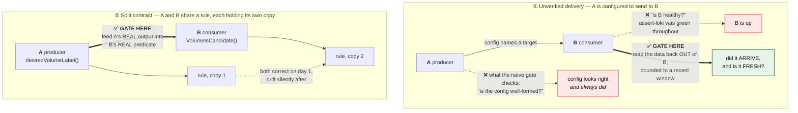

# E2E gates — proving behavior still works

This is the testing convention for behavior that only exists on a live cluster.
It is written for AI agents and contributors adding features here, and its rule
is short:

> **A new behavior ships with a gate that fails when the behavior stops
> working.** Not a test that the code parses, renders, or is present — a test
> that the thing it does still happens.

The rest of this file is why that phrasing is so specific, and how to satisfy it
without writing a gate that passes for the wrong reason.

## The two regressions this convention comes from

Both shipped green. Both had unit tests. Both passed `make lint`, `helm lint
--strict`, `helm template`, and the whole `assert-*` battery. Neither was found
by CI — one was found by reading an ADR, the other by noticing an account full of
leaked volumes.

### 1. The OpenBao audit pipeline shipped nowhere

The promtail sidecar pushed audit records to `loki-gateway.llz-observability`.
apl-core runs Loki in `monitoring`, and nothing ever creates a Service by that
name — so every audit record, every request path, operation and
`auth.display_name`, went to a name that does not resolve.

What made it survive review is the part worth internalizing: the config was
**internally consistent**. `platform.networkPolicy.observabilityNamespace` was
`llz-observability` too, so the egress allow matched the push URL exactly. A rule
granting nothing, pointed at an empty namespace, looking complete from every
angle. Both sides agreed with each other and neither agreed with the cluster.

Nothing in the gate set could see it. `converge` and `health` saw a Running pod —
promtail retries a dead DNS name forever and stays up. `assert-loki` proved Loki
was bootstrapped and S3-backed, which is a fact about Loki, not about anything
reaching it. And no static guard could have closed it, because *any* URL is
consistent with a NetworkPolicy naming the same namespace. The only check with
the power to catch it is the round trip: write from OpenBao, read from Loki.

### 2. Volume relabeling blinded the reaper

`llz reap` selected orphaned Volumes by the `pvc-` label prefix — the Linode CSI
default. Then the volume-labels reconciler took over relabeling and started
renaming bound Volumes to `<region>-<namespace>-<pvc>`. One component renamed
volumes away from `pvc-*`; another still only matched `pvc-*`.

The reaper reported "orphan Volumes: none matched the filter" against an account
holding ~17 leaked volumes, and had been blind for weeks. The commit that
introduced the rename **edited the reaper's own file**, adding the call that
performs it about 19 lines from the prefix check it invalidated. One commit, both
sides of a contract, one side updated.

Neither subsystem was individually wrong. Their **coupling** was, and no test
covered the coupling, because each side's tests exercised its own copy of the
rule.

## The two archetypes

Everything above reduces to two shapes. When you add a behavior, ask which one it
is — most behaviors worth gating are one of them.

The green edges are the gates. Both naive alternatives in ① stay green while the
behaviour is broken — which is exactly how each of the two regressions above
shipped.

### Unverified delivery — A is configured to send to B

A push URL, a scrape target, a webhook, a log/metric/event sink, a secret written
to a store another component reads. The configuration can be perfectly
well-formed and name something that does not exist.

**Gate at the consumer, on data the producer actually emitted.** Not "is the
config right" (it looked right) and not "is B healthy" (`assert-loki` was green
throughout) — *did the thing arrive*. `assert-openbao-audit` reads OpenBao's
audit records back out of Loki; `assert-scrape-targets` asks Prometheus whether
each ServiceMonitor yielded a live `up` target.

**Assert freshness, not existence.** Loki retains history. "Some audit line
exists" stays green for the whole retention period *after* the pipeline breaks —
the gate would keep passing on the corpse of a working pipeline. Bound the query
to a recent window and require the newest entry to fall inside it.

### Split contract — A and B share a rule, each holding its own copy

A naming scheme, a label format, a path layout, a serialization, a truncation
limit. Both copies are correct on the day they are written and drift silently
after.

**Feed the producer's real output into the consumer's real predicate**, across
the boundary that let them drift. `TestReaperRecognisesRelabelerOutput` calls the
relabeler's actual `desiredVolumeLabel()` and hands each result to the reaper's
actual `linode.VolumeIsCandidate()`. It never restates either rule.

That distinction is the whole value. A test that re-implements the predicate
passes happily while the real consumer goes blind — it is a test of the test. Use
the shipped functions, and if that means exporting one across a package boundary,
export it.

Pin the **exclusions** too. A destructive selector must keep saying no: the
reaper test asserts that an unrelated volume never matches and that relabeled
volumes stay out of scope without `--env`. A gate that only proves "matches more"
is one bad edit away from matching everything.

## Doctrine every gate follows

These are not new rules; they are what the existing gates already do, collected
so a new gate can be held to them.

- **Fail closed on vacuity.** A gate that reports success having examined nothing
  is worse than no gate, because it launders an absence of evidence into a green
  check — and "examined nothing" is exactly what a broken pipeline looks like.
  Zero streams, zero targets, zero PVs, an unreachable API: all failures. The
  storage gate fails deliberately on a cluster with no Linode-CSI PVs at all for
  this reason.
- **Separate "could not tell" from "nothing there."** A parse failure or an
  unreachable endpoint is an error, not an empty result. Collapsing them into
  `nil` is how a gate passes on a response it never understood.
- **Never derive the expected set from the thing under test.**
  `assert-scrape-targets` hardcodes the landing-zone ServiceMonitors rather than
  listing by the `prometheus: system` label — if that label regresses at the
  source, a label-filtered query returns an empty expected set and the gate
  passes green on the very bug it exists to catch.
- **Prefer ground truth to a proxy.** "Is every PVC on `block-storage-retain`?"
  infers encryption from a StorageClass *name*. That proxy was in place while 13
  of 16 PVCs provisioned unencrypted. `encryption: "enabled"` on the Volume object
  is what survives someone renaming or re-parameterising the class.
- **Bound the settle budget.** A freshly converged cluster races first scrapes,
  promtail batching, and reconciler sweeps. Poll for a stated budget, then fail —
  don't retry forever, and don't assert on the instant converge returns.
- **Say what to check when it fails.** The gate proves a negative; the operator
  still has to find out why. `assert-openbao-audit` prints the ordered list —
  target, egress, shipper, source, tenant — because "no records" alone sends you
  nowhere.
- **Classify healable vs final.** A pending reconcile is worth waiting on. A
  naming/predicate mismatch is a code bug, and waiting on it only burns the heal
  budget that exists for the former.

## Which layer

| The behavior… | Gate it with |
|---|---|
| is decidable from repo contents alone (a chart value, a manifest shape, a mesh policy) | a static guard in `make lint` — fails at PR time |
| is a contract between two components in this repo | a coupling test calling **both sides' real functions** (`tools/`, `go test`) |
| only exists once something is running — delivery, admission, discovery, rotation, sweep | an `llz ci assert-*` verb wired into the e2e lane battery |

Prefer the cheapest layer that can actually see the failure — but be honest about
what each layer *cannot* see. Regression 1 was invisible to layers 1 and 2 by
construction: two consistent-with-each-other values cannot be told apart from two
correct values without asking the cluster.

Most gates end up with both a static and a live half. Keep the static half beside
the gate: `assert-openbao-audit`'s unit test asserts its default target matches
what the chart actually ships to, so a future divergence fails at PR time instead
of at e2e time.

## Adding an e2e gate

1. **Write the verb** as `tools/cmd/llz/ci_assert_<thing>.go`, registered in
   `ci.go`. Keep the judgement in a pure function over parsed input so it is
   testable without a cluster; keep the transport (kubectl, port-forward, API) in
   a seam a test can replace. `ci_assert_scrape.go` and
   `ci_assert_openbao_audit.go` are the models.
2. **Unit-test it** — the pure evaluator, the fail-closed arms (empty, malformed,
   unreachable), and the static half of the contract.
3. **Wire it into the lane battery** — the `(e2e) assert suite` step in
   `instance-template/.github/workflows/llz-bootstrap-openbao.yml`. Add the
   `lane` line **and** the name to the result-collection loop; a lane missing from
   that loop never fails the step.
4. **Document the lane** in `docs/workflows/llz-bootstrap-openbao.md` — one
   bullet saying what it proves and what stays green without it.
5. Check lane safety: mutating lanes must touch disjoint namespaces, and anything
   port-forwarding must bind local port `:0`.

**A gate that isn't in the lane list does not exist.** It is the same vacuous
pass the doctrine above refuses, one level up — a check nothing runs reports
nothing wrong.

## Honesty about cost

Not every change needs an e2e gate, and pretending otherwise gets the convention
ignored. A refactor with no behavior change doesn't. A doc change doesn't. A
statically decidable invariant belongs in `make lint`, where it costs seconds
rather than a cluster.

What does need one: anything where a component starts depending on another
component's live output, anything that renames or reformats something a second
component parses, and anything whose failure mode is *silence*. Those are the
ones that stay green while broken, and they are the only reason this file exists.

## When a lane goes red

A gate's job is not finished when it fails — it is finished when its failure says
what to do next. Nine of the fourteen gating lanes went red the first time this
suite met a real cluster, and the ones that were cheap to fix were the ones whose
output named the specific thing that was missing. The expensive ones said
something true and unhelpful ("Secret X is absent", "no log lines in the window")
and sent the reader to a live cluster to find out what *was* there.

So when you write the failure message, answer the reader's next question in it:

- **Name what IS present**, not only what is missing. `assert-obj-roundtrip` lists
  the Secrets that do exist in the namespace, because the ref it was looking for
  had been renamed and no amount of staring at the absent name reveals the new one.
- **Print the parameter you queried with.** `assert-log-ingestion` reports the Loki
  tenant and whether that tenant holds any labels at all — the difference between
  "collection stopped" and "we asked the wrong tenant", which are indistinguishable
  from the bare symptom and have nothing in common as remedies.
- **Keep the distinction your probe already made.** `llz ci net-probe` classifies
  every dial as refused / timeout / dns precisely because they point at different
  subsystems; the gate above it once collapsed all three to "blocked" and then
  printed a list of things to go check.

And distinguish **absent** from **not applicable**. Several lanes failed on
clusters that were behaving correctly: a component this deployment shape does not
install, an opt-in credential nobody seeded, a rollout step deliberately not taken
yet. A gate that cannot tell those from a regression will be turned off, which
costs more than the coverage it was protecting. Read the live state and skip on
it — `assert-network-enforcement` reads the namespace's PeerAuthentication mode
rather than assuming STRICT, so it starts enforcing by itself the day someone
flips it.

If every check in a lane skipped, **fail**. "All checks passed" having observed
nothing is the vacuous pass in its purest form.

For getting kubectl at a cluster a lane failed on, see
[docs/runbooks/e2e-lane-diagnostics.md](runbooks/e2e-lane-diagnostics.md).
