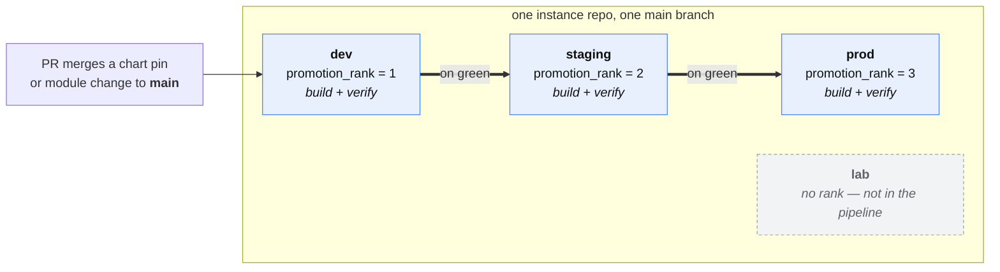

# Environments as a code-promotion pipeline

How to use llz **deployments** (the `<env>` you pass to `llz`) to model a
`dev → staging → prod` promotion pipeline: one instance repo, one set of
workflows, N ranked deployments, and a change that walks them in order on green.

> Prerequisite: you can stand up a single deployment end to end
> ([quickstart.md](quickstart.md)). This doc is the multi-deployment layer on
> top — read the quickstart's *What "environment" means here* table
> ([§3](quickstart.md#3-scaffold-your-instance--llz-new--llz-env-add)) for the
> three meanings of "environment" first; here, "environment" always means
> a **deployment**.

## 1. The model: a pipeline is N deployments in one repo

An llz instance repo describes any number of deployments. Each is one cluster's
identity — its own Terraform state key, `cluster/<env>.tfvars`, and
`apl-values/<env>/` overlay — discovered dynamically from the tfvars (there is no
hardcoded env list). A **code-promotion pipeline is just a set of those
deployments put in an order**: `dev`, then `staging`, then `prod`.

What "promotion" means here is deliberately narrow and GitOps-shaped:

- **The change lives in git.** A pull request edits the shared sources — a chart
  pin in `apl-values/*/values.yaml`, a module change under
  `terraform-iac-bootstrap/`, a workflow — and merges to `main`. `main` is the
  single source every deployment builds from.
- **Promotion is applying that already-merged change to the next deployment.**
  You build `dev` from `main`, verify it converges, then build `staging` from the
  *same* `main`, then `prod`. The artifact being promoted is the commit; the
  pipeline is the order you roll it out in.
- **Each deployment keeps its own knobs.** Region, node sizing, k8s version, HA
  role, domain, and chart-version pins are per-`<env>.tfvars`, so `prod` can lag
  `dev` on a version while still sharing the repo (see §5).

This gives you blast-radius control (a bad change is caught on `dev` before it
reaches `prod`) without a second repo or a separate config system: the same
`llz tokens → doctor → build → status` flow you already run for one deployment
(or `llz up <env>`, which chains the first three), run per stage in a fixed order.



Each stage is a **separate cluster** built from the same `main`. Only ranked
deployments appear in the pipeline — `lab` above is a real deployment that
`llz env list --ordered` simply never returns, because it has no
`promotion_rank`.

## 2. Declaring the order: `promotion_rank`

The pipeline order is declared the same way HA topology is — a field in the
cluster tfvars that Terraform carries and `llz` reads to drive CI (this is the
"tfvars is the single source of truth" contract):

```hcl
# terraform-iac-bootstrap/cluster/dev.tfvars
promotion_rank = 1
# staging.tfvars → 2,  prod.tfvars → 3
```

Rules:

- **Ascending = promotion order.** Lowest positive rank is the first stage,
  highest is the last.
- **`0` (the default) means "not in any pipeline."** Existing deployments,
  one-off `lab`/`scratch` clusters, and the `e2e` deployment stay out until you
  rank them — promotion is explicit opt-in, nothing changes for deployments you
  don't touch.
- **Ranks must be unique.** A pipeline is a line, not a tie, so "what's next" is
  unambiguous — `llz` errors loudly if two deployments share a rank.
- **Gaps are fine.** Use `10, 20, 30` if you want room to insert a stage later.

Set it at scaffold time:

```bash
# --region and --obj-cluster are required on every `env add`; the rest of the
# sizing falls back to spec.defaults.
llz env add dev     --region us-ord --obj-cluster us-ord-1 --promotion-rank 1
llz env add staging --region us-ord --obj-cluster us-ord-1 --promotion-rank 2
llz env add prod    --region us-sea --obj-cluster us-sea-1 --promotion-rank 3
```

…or edit `promotion_rank` in an existing `cluster/<env>.tfvars` by hand. Either
way it is a reviewable line in a committed tfvars file.

> **Spec-driven instances:** if you author a [LandingZone spec](landing-zone-spec.md)
> (`landingzone.yaml` + `environments/<env>.yaml`), set `cluster.promotionRank` in
> the env's file instead — `llz render` writes it into the transient
> `cluster/<env>.tfvars`. Don't hand-edit those rendered tfvars; the next render
> overwrites them. `llz env list --ordered` / `llz env next` read the rendered
> result the same way.

## 3. Reading the order: `llz env list --ordered` and `llz env next`

Two read-only helpers turn the ranks into something CI can walk. Both are
layout-aware and read straight from the tfvars, so they never drift from what is
actually scaffolded.

```bash
# The pipeline, in promotion order (only ranked deployments appear):
$ llz env list --ordered
dev
staging
prod

# As a JSON array — drops straight into a workflow matrix via fromJSON(...):
$ llz env list --ordered --json
["dev","staging","prod"]

# The stage promoted into after a given one — what a promote-on-green job
# builds next once <env> is green:
$ llz env next dev
staging
$ llz env next staging
prod
$ llz env next prod
llz: deployment "prod" is the last stage — nothing to promote to   # non-zero exit
```

`llz env next <env>` errors (non-zero) on the last stage and on an unranked
deployment — both are "stop here" signals a CI step can branch on.

## 4. Wiring it into CI: a generated, GitHub-native pipeline

The pipeline runs as a **static `needs:`-chained workflow**
(`.github/workflows/promote.yml`) — *generated from the ranks*, not hand-written.
GitHub already provides every piece of a promotion pipeline, so the runtime
reinvents nothing:

| Promotion concern | Native mechanism |
|---|---|
| On-green gate between stages | `needs:` — a stage starts only once the prior stage's whole apply **and** the `converge` gate succeeded |
| Approval + soak time | `infra-<stage>` Environment protection rules (required reviewers + wait timer) |
| "Only `main` promotes" | Environment deployment-branch policy (set to `main`) |
| Resume from a failed stage | GitHub's built-in **"Re-run failed jobs"** |

`promotion_rank` stays the single source of truth; the workflow is rendered from
it. Each stage calls the same reusable `llz-terraform.yml` apply path the
single-deployment flow uses — promotion only adds *ordering* (`needs:`) and the
*green gate* between stages:

```yaml
# .github/workflows/promote.yml  (GENERATED — `llz env pipeline` renders it)
jobs:
  llz-preflight:                                          # spec gate — see below
    runs-on: ubuntu-latest
    container: { image: "${{ vars.TF_IMAGE }}" }
    steps:
      - uses: actions/checkout@<pinned-sha>
      - run: llz ci assert-image-fresh          # skew check FIRST — see below
        env: { GH_TOKEN: "${{ github.token }}" }
      - run: llz env pipeline --check --require-pipeline
  dev:                                                    # rank 1 — pipeline entry
    needs: llz-preflight
    uses: ./.github/workflows/llz-terraform.yml           # vendored body — local, same-repo
    with: { action: apply, module: all, region: dev }
    secrets: inherit
  staging:                                                # rank 2
    needs: dev                                            # green gate
    uses: ./.github/workflows/llz-terraform.yml
    with: { action: apply, module: all, region: staging }
    secrets: inherit
  prod:                                                   # rank 3
    needs: staging
    uses: ./.github/workflows/llz-terraform.yml
    with: { action: apply, module: all, region: prod }
    secrets: inherit
```

**A fresh instance does not have this file — it has a placeholder with no stages.**
It ships that way on purpose. The template used to deliver the three-stage example
above *live and dispatchable*, which meant an instance that declared only `prod`
could run a `dev → staging → prod` promotion: three stages started, and each died
about twenty seconds in with `llz: env "dev" not in spec (have: [prod])`. One
cause, three unrelated-looking failures. An example you can run is not an example,
so the runnable copy lives here and the instance gets a placeholder that tells you
to rank two deployments.

The `uses:` is **repo-local**: the instance vendors the reusable bodies and
composite actions (ADR 0003), so `secrets: inherit` is same-repo and nothing is
fetched from the template repo at runtime — the property that makes cross-org
instances and air-gapped GHE deployments work.

You never edit this file by hand. **`llz env add <env> --promotion-rank N`
regenerates it**, and for the hand-edit path (you changed a `promotion_rank` in a
tfvars directly) **`llz env pipeline`** re-renders it from the current ranks:

```bash
llz env pipeline           # regenerate promote.yml from the promotion_rank ordering
llz env pipeline --check   # CI gate: exit non-zero on rank drift, or on a stage the spec does not declare
```

`--check` asserts two different things, and the second is the one that bites:

1. **Rank drift** — the file no longer matches the `promotionRank` ordering. Fix
   by regenerating.
2. **A stage naming a deployment that does not exist** — renamed, deleted, or
   never created. Fix by adding the deployment, or re-running `llz env pipeline`
   (which regenerates from what the spec actually declares).

Only the first needs two or more ranked deployments to mean anything; the second
runs at any count, *including zero*. That asymmetry is the whole point. The check
used to abstain below two ranks and print "in sync" for it, so an instance with
one deployment and a three-stage workflow was reported as healthy right up until
somebody pressed **Run workflow**. Abstaining is not agreement.

It runs in three places, and each catches a population the others cannot:

| Where | When | Catches |
| --- | --- | --- |
| `llz doctor` | locally, before you push | the bad edit *and* the state your instance was scaffolded in — this is the only one that runs before a commit exists |
| `promote-pipeline-drift` in `llz-terraform.yml` | on every pull request | the bad edit before it lands |
| the `llz-preflight` job the generated `promote.yml` chains its first stage from | on dispatch | anything that reached `main` another way, before a single stage starts applying |

The first was added last, and the gap it closed was the expensive one. The other
two only ever fire on a *change*, so an instance that carried an unrunnable
`promote.yml` from the day it was scaffolded — nobody edits a file they never
configured — met neither until some unrelated pull request happened to run the CI
job months later. `llz upgrade` runs `llz doctor` as its post-upgrade readiness
report, so the check now also reaches the operator at the one moment they are
guaranteed to be looking.

**`llz ci assert-image-fresh` runs first in the preflight, and the order is load
bearing.** A `TF_IMAGE` that has not been re-pinned since the last upgrade is the
*normal* state right after one, and that image's baked `llz` does not have
`--require-pipeline` — so with the steps the other way round the job dies on
`unknown flag` and the actionable skew message never runs, on exactly the
population it was built for. `assert-image-fresh` has shipped for many releases,
so it resolves in the old image and says the useful thing. Any new verb or flag
added to this job belongs *below* it. (Same rule `repo-readiness` records in
`llz-terraform.yml`, learned the same way.)

### One declared deployment: the single-stage pipeline

**You do not need two deployments to have a working `Promote`.** An instance that
declares exactly one gets a one-stage pipeline that applies it, generated by the
same `llz env pipeline`:

```yaml
jobs:
  llz-preflight:            # same gate as the chain form
    ...
  prod:
    name: Promote → prod (the only deployment)
    needs: llz-preflight
    uses: ./.github/workflows/llz-terraform.yml
    with: { action: apply, module: ${{ inputs.module || 'all' }}, region: prod }
    secrets: inherit
```

Dispatch it and it runs. No `promotionRank` is involved and none is printed: the
rank answers *which order*, and with one deployment there is no order to answer.
Declare a second, rank both, re-run `llz env pipeline`, and the same file grows
into the `needs:`-chain above.

This replaced an answer that was worse than it looked. A single-deployment
instance used to get the **stage-less placeholder** — a `Promote` button that
promoted nothing, every check green, and a message telling the operator to go
dispatch `terraform.yml` by hand, for the one topology where *what to apply* was
never in question. The placeholder is still what you get with **two or more**
unranked deployments, where `llz` genuinely cannot know the order you want.

### When `llz` is *not* managing this file

`llz env pipeline` writes only where there is nothing to destroy: a file that
cannot run, a file that applies nothing, or a file `llz` itself generated (every
generated `promote.yml` opens with a `# GENERATED` banner). Anything else it
leaves **alone** — an unranked chain over deployments that all exist applies
exactly what it says, and is yours to maintain.

The case it *will* overwrite is a stage naming a deployment that **does not
exist** — a **literal** name the spec does not have. That file cannot run, and
regenerating is the only route back to a green `--check`: to the single stage if
you declare one deployment, to the stage-less placeholder if you declare several
and have ranked fewer than two.

Recognising its own banner is what keeps a generated file *managed*. Without it,
the second `llz env pipeline` disowned the pipeline it had just written — and,
more expensively, stopped reporting drift on it, so a hand-edit to a generated
stage read as "in sync".

A `region:` that is an **expression** (`${{ inputs.target }}`) is *not* that case,
and is never overwritten. There is no name to compare against the spec, so calling
it undeclared would assert a falsehood — and no edit makes an expression resolvable
at check time, so the failure would have no reachable remedy. `--check` reports such
a stage as **unverified** and still exits 0; the passing message says so rather than
claiming every stage was checked. Whatever it resolves to at run time must be a
declared deployment, and only the run can tell you.

What `--check` *will* fail on, ranked or not, is a file with two or more `action:
apply` stages and **no `needs:` between any of them**. Every stage starts at once,
so the last deployment applies alongside the first — and the ordering is precisely
what `promote.yml` adds over dispatching `terraform.yml` per deployment. A *partial*
chain (one stage fanning out to two) stays legal: that is an ordering, and a
hand-maintained file is not required to look like the generated one.

### `llz upgrade` never rewrites this file

`promote.yml` is `owned` in `.template-manifest` and fenced by copier's
`_skip_if_exists`: seeded once at scaffold, yours from then on. `llz env pipeline`
is what keeps it correct, so copier must not be what rewrites it. Left in the
three-way merge, an instance that took the old shipped example unchanged had
`ours == base`, so copier applied *theirs* cleanly — silently replacing a working
promotion pipeline, with no conflict markers for `llz upgrade` to stop on.

The cost of that safety is that improvements to this file — a new preflight step, a
bumped `actions/checkout` — **do not arrive by upgrade**. Re-run `llz env pipeline`
after an upgrade to pick them up. An instance whose pipeline predates the preflight
job keeps dispatching without one; `--check` says so as an advisory rather than
failing, because that file runs correctly and nothing the operator did caused it.

The caller boilerplate (`instance_repo`) is **preserved** from the file already
on disk (or lifted from the sibling `terraform.yml`), and the stages carry no
template pin at all — so a template version bump is *not* treated as drift, and
does not rewrite this file. Only a rank change does.

Start a rollout with **Run workflow** on the Promote action (or `gh workflow run
promote.yml`). It walks `dev → staging → prod`, pausing at each protected
environment for approval, and stopping at whichever stage fails its convergence
gate. Adding a stage is a one-line tfvars edit (`promotion_rank`) plus
`llz env pipeline` — no workflow hand-editing.

> The matrix workflows (scheduled health checks, credential rotation) use
> `llz env list --json` to fan out over **all** deployments at once; a promotion
> pipeline is the opposite shape — **sequential**, gated — so it is a `needs:`
> chain rather than a matrix. `llz env list --ordered` / `llz env next` expose the
> same ranks for scripting and documentation. The two coexist on one instance.

## 5. Per-stage differences are a feature, not a fork

Because each deployment owns its tfvars and overlay, stages can differ without
branching the repo:

| Knob | Where | Typical pipeline use |
|---|---|---|
| `aplChartVersion` | `spec.cluster.bootstrap.aplChartVersion` (env YAML) | bump `dev` first, promote the pin to `staging`/`prod` once green |
| `k8s_version` | `cluster/<env>.tfvars` | canary a new LKE-E version on `dev` |
| node sizing / count | `cluster/<env>.tfvars` | smaller `dev`, production-sized `prod` |
| region | `cluster/<env>.tfvars` | co-locate or spread stages |
| Helm values | `apl-values/<env>/values.yaml` | per-stage replicas, hostnames, feature flags |

Promotion of a *version* pin, then, is literally: edit `dev`'s pin → merge →
build `dev` → on green, copy the pin into `staging`'s tfvars in a follow-up PR →
build `staging`, and so on. `llz doctor --env <env>` flags any unfilled
placeholder before each stage's build, so a half-configured stage fails fast.

## 6. Ordering caveats that interact with promotion

Two existing constraints layer on top of the promotion order — promotion does not
remove them:

- **Bootstrap-first sequencing.** The *first* cluster you ever bootstrap writes
  Harbor robot credentials that later clusters read; always bootstrap one fully
  before the next ([bootstrap-openbao.md](runbooks/bootstrap-openbao.md#additional-cluster-ordering-constraint)).
  For a fresh pipeline, bootstrap stages in `promotion_rank` order so this falls
  out naturally.
- **HA pairs are a different axis.** `promotion_rank` orders *stages*; `ha_role`/
  `ha_group` pair two clusters into one OpenBao HA topology
  ([secrets.md](secrets.md)). A stage can itself be an HA pair — rank one member
  (or both, with distinct ranks) as your topology requires. The two fields are
  independent: `llz env list --ha` and `llz env list --ordered` answer different
  questions.

## 7. What this is *not*

This is platform/infrastructure promotion — rolling an instance-repo change
across clusters in order. It is **not** application-level continuous delivery of
*your* workloads onto a cluster; that is apl-core / Argo CD's job, and the
"Deploy GitHub Environment" row in the [quickstart's environment table](quickstart.md#3-scaffold-your-instance--llz-new--llz-env-add)
is the seam for app secrets. Keep the two mental models separate: `promotion_rank`
sequences *clusters*; Argo sequences *apps within* a cluster.

## See also

- [delivery-methodology.md](delivery-methodology.md) — where promotion sits in the
  full seven-phase delivery lifecycle (this doc is phase 5).
- [quickstart.md](quickstart.md) — single-deployment end-to-end path and the
  three meanings of "environment".
- [secrets.md](secrets.md) — OpenBao HA topology (`ha_role`/`ha_group`), the
  other per-deployment ordering axis.
- [runbooks/bootstrap-openbao.md](runbooks/bootstrap-openbao.md) — the
  bootstrap-first ordering constraint.
- `llz env list --help`, `llz env next --help`, `llz env add --help`.
