# Quick Start

> **Goal:** go from nothing to a converging LKE-Enterprise + apl-core cluster
> built from this template, driving the whole flow with the **`llz`** CLI.
>
> **Audience:** a system team standing up its own instance. You're expected to
> already be on the stack (Linode LKE-E + Akamai App Platform). For the full
> rationale behind each step, read the [adopter guide](adopter-guide.md); this
> page is the fast path.

<!-- toc -->
## Contents

- [Where each step runs](#where-each-step-runs)
- [The whole path — copy/paste, top to bottom](#the-whole-path--copypaste-top-to-bottom)
- [1. Accounts you need](#1-accounts-you-need)
- [2. Install `llz`](#2-install-llz)
- [3. Scaffold your instance — `llz new` + `llz env add`](#3-scaffold-your-instance--llz-new--llz-env-add)
- [4. Build it — `llz up`](#4-build-it--llz-up)
- [5. Day-2 — upgrading to a newer upstream version](#5-day-2--upgrading-to-a-newer-upstream-version)
- [Checklist](#checklist)

<!-- /toc -->

## Where each step runs

The build happens **in CI**, not on your machine. That one fact explains the two
steps people trip on: you `git push` before building (step 5) because CI reads
your repo, and you fetch a kubeconfig afterwards (step 8) because the cluster was
created somewhere you were not. The push comes *after* `llz doctor`, not before —
whatever doctor sends you back to fix has to be committed too, and nothing commits
those edits for you.

```mermaid
flowchart LR
    subgraph L1["🖥️ Your machine"]
        direction TB
        I["<b>1.</b> install-llz.sh"]
        N["<b>2.</b> llz new"]
        E["<b>3.</b> llz env add"]
        D["<b>4.</b> llz doctor --env"]
        P["<b>5.</b> git add + commit + push"]
        U["<b>6.</b> llz up"]
        I --> N --> E --> D --> P --> U
    end

    subgraph CI["☁️ GitHub Actions — the cluster is built HERE"]
        direction TB
        TF["terraform apply<br/>vpc → cluster → object-storage"]
        BOOT["llz ci bootstrap-cluster"]
        CONV["converge gate"]
        TF --> BOOT --> CONV
    end

    subgraph L2["🖥️ Back on your machine"]
        direction TB
        K["<b>8.</b> llz ci fetch-kubeconfig"]
        S["<b>9.</b> llz status"]
        K --> S
    end

    U ==>|"workflow_dispatch"| TF
    CONV ==> K
    CONV -.->|"<b>7.</b> escrow offline"| M["🔑 recovery keys 4 &amp; 5 + root token<br/>(job summary, shown once)<br/>seal key (never printed —<br/>read from the cluster)"]

    classDef local fill:#e8f0fe,stroke:#4285f4,color:#111;
    classDef ci fill:#f3e8fd,stroke:#a142f4,color:#111;
    classDef warn fill:#fce8e6,stroke:#ea4335,stroke-width:2px,color:#111;
    class I,N,E,P,D,U,K,S local;
    class TF,BOOT,CONV ci;
    class M warn;
```



## The whole path — copy/paste, top to bottom

Once the [accounts](#1-accounts-you-need) exist, this is the **entire flow in
order**. Run it line by line, swapping `my-instance`, `lab`, the region, and the
OBJ cluster for your own. No clone of this repo required (the installer is a
one-liner; `llz new` creates your own repo). Each step links to the section that
explains it.

```bash
# 0. Prerequisites on your machine (§2). `llz` sequences tools; it bundles none.
#    git and gh you likely have; copier is a Python tool that is on no machine by
#    default, and the llz installer does NOT add it.
command -v git >/dev/null    || echo "install git first"
command -v copier >/dev/null || pipx install copier
#    gh must also be AUTHENTICATED. Host-scoped, so an unrelated/broken gh host
#    doesn't trigger a needless re-login.
gh auth status --hostname github.com || gh auth login --hostname github.com

# 1. Install the llz CLI (§2). It lands in ~/.local/bin, which is NOT on PATH by
#    default on macOS — put it there in THIS shell so the next line works.
curl -fsSL https://raw.githubusercontent.com/akamai-consulting/lke-landing-zone/main/template-scripts/install-llz.sh | bash
export PATH="$HOME/.local/bin:$PATH"        # also append to ~/.zshrc to make it stick
hash -r; llz version                        # must print the version the installer just did

# 2. Scaffold your instance repo + create/push it on GitHub (§3)
#    Answer instance_repo <owner>/<name> — the OWNER (org or your user) must
#    already exist; llz creates the repo, not the org.
llz new my-instance --push --yes
cd my-instance

# 3. Add a deployment — authors the spec, renders the tfvars + apl-values overlay (§3)
#    Export a Linode PAT FIRST: with it, `llz env add` and `llz doctor` check your
#    region, OBJ cluster, LKE-Enterprise entitlement and k8s version against your
#    ACCOUNT. Without it every one of those checks SKIPS, and a typo'd region or a
#    retired `+lke` version is first noticed by `terraform apply`, 20 minutes in.
#    (`read -rs` keeps the token out of your shell history. Written this way
#    because zsh's `read -p` means "read from the coprocess", not "prompt".)
printf 'Linode PAT: '; read -rs LINODE_TOKEN; echo; export LINODE_TOKEN
#    Run this from the instance directory (step 2's `cd`).
llz env add lab --region us-sea --obj-cluster us-sea-1

# 4. Confirm it's ready to build — fill anything doctor flags, then re-run (§4)
#    BEFORE the push, deliberately: `env add` already committed the spec, but
#    nothing commits the edits doctor sends you to make. Its repo-config section
#    stays red until step 6 provisions the credentials — expected at this point.
llz doctor --env lab

# 5. Publish — the build reads your pushed repo, not this checkout (§4)
git status --short          # anything listed here is NOT in the build yet
git add -A && git commit -m "llz: fill deployment values"   # skip if that was empty
git push

# 6. Provision credentials → readiness gate → build, in ONE command (§4)
llz up lab --yes

#    It prints the run URL + a `gh run watch` line: the build takes ~40 minutes and
#    runs in GitHub Actions, so that link is the only view you have of it. If it goes
#    red, docs/runbooks/first-build-failed.md covers what exists at each stage, what
#    is safe to re-run, and what to sweep — re-dispatching is almost always right.

# 7. AFTER the build, do the manual steps the bootstrap can't (§4). Each value
#    comes from a DIFFERENT place — see the escrow table in §4:
#    • recovery keys 4 & 5 + the root token — printed in the job summary, shown once
#    • OPENBAO_SEAL_KEY — never printed anywhere; read it out of the cluster:
#        kubectl -n llz-openbao get secret openbao-unseal-key -o jsonpath='{.data.unseal\.key}'
#    • TF_STATE_ENCRYPTION_PASSPHRASE, if step 6 generated one — printed by
#      `llz tokens`, and still cached in .llz/secrets.env
#    • delete the OPENBAO_ROOT_TOKEN secret from infra-lab if you seeded one
#      (`llz status` flags it every run until you do)

# 8. Get a kubeconfig — the cluster was built in CI, so this machine has none (§4)
#    NOTE --region here is the DEPLOYMENT name (`lab`), not the geographic region
#    you passed to `llz env add` (`us-sea`). The `llz ci` verbs find the cluster
#    through <deployment>.tfvars; passing `us-sea` fails with "cannot determine
#    cluster label".
export LINODE_API_TOKEN=$(grep ^LINODE_API_TOKEN .llz/secrets.env | cut -d= -f2-)
llz ci fetch-kubeconfig --region lab --output ~/.kube/lab.yaml
export KUBECONFIG=~/.kube/lab.yaml

# 9. Verify convergence (§4). DNS-01 needs no step — the llz-letsencrypt-*
#    ClusterIssuers sync via Argo CD once LINODE_DNS_TOKEN is set.
#    Use --wait: convergence takes several minutes, and a bare `llz status` polls
#    ONCE, so a red ✗ seconds after the build is the normal first answer, not a
#    failure. Refused or timing out instead? Expected if you left
#    --runner-ipv4-cidrs empty: the control-plane ACL has never contained this
#    laptop. Open it:  llz ci runner-acl open --region lab
llz status lab --wait
```

That is the whole thing, start to converged cluster. Step 6's `llz up` chains the
three gates — `tokens → doctor → build` — and **stops at the first failure**, so a
missing token or unfilled placeholder is caught before the expensive apply; you can
run those three individually to inspect each gate (§4). `llz` itself is a thin
[cobra](https://github.com/spf13/cobra) front-end over the tools this flow already
uses (`copier`, `gh`, `kubectl`, the Linode API) — it sequences them and adds the
`llz tokens` provisioning wizard (state bucket + scoped key, the GitHub PATs behind
pre-filled links, and the state-encryption passphrase), pushing everything to your
repo. Argo CD pulls your instance repo over **HTTPS with `APL_VALUES_REPO_TOKEN`** —
there is no deploy key to create.

Run `llz <command> --help` for any command; the persistent flags `--dry-run`
(print, change nothing), `--open` (open links), and `--yes` (execute
cloud-mutating commands) work anywhere on the line. Stuck on a step? `llz doctor`
(§4) is the always-current readiness check.

### If a command stops you

`llz` validates each step before it can cost you anything, and prints the fix
with the refusal — read the message and follow it. The full list of what gets
checked is in the
[adopter guide](adopter-guide.md#what-llz-checks-before-it-lets-you-spend-money).

---

## 1. Accounts you need

`llz` can't create these — get them first. The full table (the *why* + where to
get each) is canonical in the [adopter guide §1](adopter-guide.md#1-prerequisites);
the short version:

- **Linode account with LKE-Enterprise** — `+lke` versions, not standard LKE
- **Akamai App Platform (apl-core) entitlement**
- **A GitHub org you can create a repo in** — `llz new --push` creates the
  instance *repo* itself, but **not the org**: [create it](https://github.com/organizations/new)
  first, or use your own username as the `<owner>`. **Forking this template is
  not required** (see §3)

> **Start the Linode account first — it has the longest lead time.**

Run **`llz doctor`** any time to check your CLI tooling + `gh` auth — it is the
authoritative, always-current list of what the flow needs. With a repo/env it
also reports deployment + e2e readiness (see §4).

---

## 2. Install `llz`

**`llz` does not bundle its dependencies** — it sequences tools you install
yourself, and the installer adds only `llz`. Three are needed before you can
scaffold anything:

| Tool | Needed by | Get it |
|---|---|---|
| `git` | copier clones the template with it, `llz env add` commits with it, and the build reads what you `git push` | almost certainly already installed |
| `gh` | the installer, and every `llz` command that touches GitHub | [cli.github.com](https://cli.github.com) — then authenticate, below |
| `copier` | `llz new`, `llz upgrade` (they render the scaffold with it) | `pipx install copier` (also `uv tool install copier` / `brew install copier`) |

`copier` is the one that catches people out: it is a Python tool and is on no
machine by default. Without it `llz new` refuses up front and names the install
command — but it is the second thing you run, so install it now. `kubectl` is
needed later, for `llz status` (step 9). The rest of the toolchain
(`terraform`/`tofu`, `helm`, `bao`) only matters for day-2 work;
**`llz doctor` is the authoritative list** and the Dev Container ships all of it.

**Authenticate `gh` first.** The install script and every `llz` command that
touches GitHub (`llz new`, `llz tokens`, `llz doctor`, `llz self-update`) drive
the `gh` CLI, so it must be logged in *before* you run any of them:

```bash
gh auth status --hostname github.com || gh auth login --hostname github.com   # one-time; the check skips login if already authed
```

> **Already use `gh` for another host?** The installer and `llz doctor` scope
> their auth check to **`github.com`** (override with `GH_HOST`), so a second
> account in a broken state — e.g. an expired GHE token — won't block you. You
> only need `gh auth status --hostname github.com` to pass; a global
> `gh auth status` failing on an *unrelated* host is fine. If that host is the
> one you want, fix it with `gh auth login --hostname <host>` (or forget it:
> `gh auth logout --hostname <host>`).

> **Multiple github.com accounts?** gh picks the **active** account for a host —
> there's no per-command account flag, so set it before you run the flow:
> `gh auth switch --hostname github.com --user <name>` (persists; `gh auth status`
> lists them). To use a specific account for one command without switching, override
> the token for that invocation:
> `GH_TOKEN="$(gh auth token --hostname github.com --user <name>)" bash -c "$(curl -fsSL https://raw.githubusercontent.com/akamai-consulting/lke-landing-zone/main/template-scripts/install-llz.sh)"`
> (from a checkout: `GH_TOKEN=… ./template-scripts/install-llz.sh`).

> **`gh auth` ≠ your cloud/PAT credentials.** Logging in to `gh` covers GitHub
> repo, release, and API calls only. `llz tokens` (§4) still prompts you for a
> **Linode PAT** and a couple of **GitHub PATs** — that's by design, not a
> re-auth loop; those are the secrets it pushes into your repo so the build can
> run. See §4 for the full list.

**Install it — no clone required.** `llz` ships as a release binary of the public
template repo, [`github.com/akamai-consulting/lke-landing-zone`](https://github.com/akamai-consulting/lke-landing-zone/releases/latest).
Pipe the installer straight from `main`; it picks your platform, resolves the
latest full release, verifies the checksum, and installs to **`~/.local/bin`** —
a per-user dir that needs no `sudo` and works on locked-down corporate machines
that deny writes to `/usr/local/bin`:

```bash
curl -fsSL https://raw.githubusercontent.com/akamai-consulting/lke-landing-zone/main/template-scripts/install-llz.sh | bash
llz version
# wget:  wget -qO- https://raw.githubusercontent.com/akamai-consulting/lke-landing-zone/main/template-scripts/install-llz.sh | bash
```

The script still uses `gh` to fetch the release asset, so keep `gh` authenticated
(above) — only the script itself is downloaded anonymously.

> **Already have a template or instance checkout?** Skip the `curl` and run the
> same script from there: `./template-scripts/install-llz.sh` (append `v0.0.39` to
> pin a tag, or prefix `ORG=<fork>`).

> **Put `~/.local/bin` on your `PATH`.** If `llz version` prints "command not
> found", the dir isn't on your `PATH` yet — add it (then restart the shell):
>
> ```bash
> echo 'export PATH="$HOME/.local/bin:$PATH"' >> ~/.zshrc   # or ~/.bashrc
> ```

> **Already had an `llz` on this machine?** A copy earlier on `PATH` wins every
> lookup, so the install can succeed while `llz` keeps running the OLD binary —
> which then fails much later and cryptically (a stale llz scaffolds from a
> retired template ref: `pathspec 'vX.Y.Z' did not match any file(s) known to
> git`). Quickstarts before 2026-06-13 installed with `sudo` into
> `/usr/local/bin`, and the devcontainer image ships one there too. The installer
> now names every copy and tells you which one wins; check it yourself with:
>
> ```bash
> hash -r; type -a llz   # drop cached lookups, then list every llz your shell sees
> llz version            # must match what the installer just printed
> ```
>
> `hash -r` first because the list is not always in winning order: zsh answers
> from its command hash, so a shell that resolved `llz` before you installed
> keeps running the old path even once a nearer copy exists.
>
> If the winner is the old one, `rm` it (with `sudo` if it's root-owned) or put
> `~/.local/bin` first on `PATH` — then `hash -r` (zsh: `rehash`) so the current
> shell forgets the old location.

<details>
<summary><strong>Install by hand</strong> — no checkout, or you prefer the raw commands</summary>

Download the asset for your platform with `gh` and put it on your `PATH`. The
release tag is the bare `<VER>`; the snippet resolves the latest with
`gh release list` — highest **semver**, drafts and pre-releases dropped, which is
the same rule `llz self-update` and `llz new` apply. (Don't shorten it to
`--limit 1`: that returns whatever was released *last*, and a draft's git tag
does not exist yet, so the binary installs but `llz new` then dies with
`pathspec 'vX.Y.Z' did not match any file(s) known to git`.)

```bash
# macOS arm64 shown; swap the suffix for your platform:
#   llz-darwin-arm64  llz-darwin-amd64  llz-linux-amd64  llz-linux-arm64
ORG=akamai-consulting            # or your fork's org
VER=$(gh release list --repo "${ORG}/lke-landing-zone" --limit 200 --json tagName,isDraft,isPrerelease \
  --jq '[.[]|select((.isDraft or .isPrerelease)|not)|.tagName|select(test("^v[0-9]+\\.[0-9]+\\.[0-9]+([-+].*)?$"))]
        |map({t:.,k:(sub("^v";"")|sub("[-+].*$";"")|split(".")|map(tonumber))})
        |reduce .[] as $r (null; if . == null or $r.k > .k then $r else . end)|(.t // empty)')
: "${VER:?no published vX.Y.Z release found — check: gh release list --repo ${ORG}/lke-landing-zone}"
ASSET=llz-darwin-arm64
BINDIR="$HOME/.local/bin"
mkdir -p "$BINDIR"               # create it FIRST (see the PATH note above)
gh release download "${VER}" --repo "${ORG}/lke-landing-zone" \
  --pattern "${ASSET}" --pattern SHA256SUMS --clobber
grep " ${ASSET}\$" SHA256SUMS | shasum -a 256 -c -   # verify; Linux: sha256sum -c -
install -m 0755 "${ASSET}" "$BINDIR/llz" && rm -f "${ASSET}" SHA256SUMS
llz version
```

**Prefer `curl`?** The repo is public, so the browser download URL works
anonymously — no token, no API asset endpoint:

```bash
ORG=akamai-consulting; ASSET=llz-darwin-arm64
VER=$(gh release list --repo "${ORG}/lke-landing-zone" --limit 200 --json tagName,isDraft,isPrerelease \
  --jq '[.[]|select((.isDraft or .isPrerelease)|not)|.tagName|select(test("^v[0-9]+\\.[0-9]+\\.[0-9]+([-+].*)?$"))]
        |map({t:.,k:(sub("^v";"")|sub("[-+].*$";"")|split(".")|map(tonumber))})
        |reduce .[] as $r (null; if . == null or $r.k > .k then $r else . end)|(.t // empty)')
: "${VER:?no published vX.Y.Z release found — check: gh release list --repo ${ORG}/lke-landing-zone}"
BINDIR="$HOME/.local/bin"; mkdir -p "$BINDIR"
curl -fsSL \
  "https://github.com/${ORG}/lke-landing-zone/releases/download/${VER}/${ASSET}" \
  -o "$BINDIR/llz"
chmod +x "$BINDIR/llz" && llz version
```

**`curl: (56) Failure writing output to destination`?** The `-o` directory
doesn't exist. curl opens the output file only once bytes arrive, so a missing dir
surfaces mid-download instead of as a clean "can't create file" — that's why the
`mkdir -p "$BINDIR"` above is mandatory.

</details>

Enable shell completion (cobra-generated):

```zsh
# zsh — writes into the first writable dir on your $fpath, then restart the shell.
# (`${fpath[1]}` is a zsh array; in bash it expands to EMPTY and this writes to /_llz.)
llz completion zsh > "${fpath[1]}/_llz"
```

```bash
# bash — add to ~/.bashrc
source <(llz completion bash)
```

> If `${fpath[1]}` is a system directory you cannot write to, use a personal one
> instead: `mkdir -p ~/.zfunc && llz completion zsh > ~/.zfunc/_llz`, and add
> `fpath=(~/.zfunc $fpath)` above `compinit` in your `~/.zshrc`.

Once installed, keep the binary current without re-running the download — `llz
self-update` pulls the latest **full** release for your platform (pre-release
candidates are skipped; via `gh`, checksum-verified) and replaces itself in place;
`--ref v0.0.39` targets a specific version, `--dry-run` just reports what it would
install.

> Building from source instead? From a template checkout, `make llz` produces
> `bin/llz`.

> **Don't want to install the toolchain on your laptop at all?** Your instance
> ships a [Dev Container](devcontainer.md): "Reopen in Container" gives you a
> prebuilt, multi-arch image with `llz` itself plus everything `llz doctor`
> checks (`terraform`, `kubectl`, `helm`, `bao`, `copier`, `gh`, `linode-cli`, …)
> already on `PATH` — skip straight to §3.

---

## 3. Scaffold your instance — `llz new` + `llz env add`

Two commands: scaffold the instance repo, then add a deployment to it.

```bash
llz new my-instance --push --yes
cd my-instance                 # `llz env add` refuses to run outside an instance root
llz env add lab --region us-sea --obj-cluster us-sea-1
llz doctor --env lab           # fill what it flags BEFORE publishing (§4)
git add -A && git commit -m "llz: fill deployment values" && git push   # `env add`
                               # commits its own output; anything you changed after
                               # it is yours to commit, and the build reads the push
```

### Scaffold the instance repo — `llz new`

**Most users don't pass `--org`.** It names the **template to scaffold *from***
and defaults to the public upstream `akamai-consulting/lke-landing-zone` — exactly
what you want unless you maintain your *own fork* of the template, in which case
pass `--org <your-fork-org>`. It is **not** where your instance lands; that's the
`instance_repo` copier answer, created by `--push`. (Pointing `--org` at an org
with no template fork makes copier's HTTPS clone 404, which git surfaces as a
confusing `Username for 'https://github.com':` prompt — `llz new` now preflights
this and tells you to fix `--org` or fork first.)

`llz new` runs `copier copy` to render the instance into `my-instance/`, then
writes `.copier-answers.yml`. It prompts for three answers — keep the defaults
unless the note says otherwise:

| Prompt | What to answer |
|---|---|
| `upstream_org` | **Keep `akamai-consulting`** to track upstream. Set it only if you publish your own template fork. |
| `instance_repo` | **Your** instance repo as `<owner>/<name>` — this is what `--push` creates. The **`<owner>` must already exist** (see the note below). |
| `openbao_team` | Default `platform`. Names your operators' scoped, non-root OpenBao subtree (`secret/platform`) + the apl-core team. Lowercase kebab; add more later in `landingzone.yaml`. See [spec.teams](landing-zone-spec.md#field-reference). |

(`llz_version` is a fourth answer, but `llz new` sets it from its own version — you
are not prompted.) With `--push --yes` it also runs `gh repo create <instance_repo>
--private --source . --push`, so the remote repo exists and `llz tokens`/`doctor`
work against it immediately. It does **not** ask for credentials — that's
`llz tokens` (§4).

> **The `<owner>` half of `instance_repo` must already exist.** `llz new --push`
> creates a **repository**, never the GitHub org that holds it — so either
> [create the org](https://github.com/organizations/new) *before* you scaffold, or
> answer `instance_repo` with your own username (`<your-login>/<name>`). `llz new`
> checks the owner before it tries and tells you which fix to take; without that
> check GitHub returns a bare `does not have the correct permissions to execute
> CreateRepository`, which looks like a token-scope problem and isn't. Already
> created the repo by hand? Re-running `--push --yes` adopts it: llz wires it as
> `origin` and pushes instead of trying to create it again.

> **The instance pins to the `llz` version you installed.** `llz new` records this
> CLI's own version as the instance's `llz_version` and renders the scaffold's
> Terraform-module `?ref=` pins from it — no version to hardcode; pass `--ref vX.Y.Z` only
> to pin to a different release. Everything inside the scaffold is repointed to your
> fork by Copier — the only by-hand repoints are the published `kubernetes-charts/`
> values that live outside the scaffold ([adopter-guide §5](adopter-guide.md#5-org-literals-to-repoint-to-your-fork)).

### Add a deployment — `llz env add` writes the spec

`llz env add` is **spec-first**: it authors the declarative LandingZone spec and
then renders it. The first `env add` creates `landingzone.yaml` (your instance
identity + shared `spec.defaults`, seeded from `.copier-answers.yml`); every
`env add` writes one `environments/<env>.yaml` (a `ClusterDefinition` from your
flags) and runs `llz render` to reconcile the spec into the
`terraform-iac-bootstrap/*/<env>.tfvars` + `apl-values/<env>/` overlay. It then
**prints a checklist of the overlay placeholders** the spec doesn't carry. So you
edit **one file per deployment** — `environments/<env>.yaml` — not three tfvars
roots. The rendered `<env>.tfvars` are **gitignored** (regenerated from the spec
on every render and in CI), so you commit only the spec + overlay; CI renders the
tfvars before each terraform op:

```bash
llz env add lab --region us-sea --obj-cluster us-sea-1 \
  --k8s-version v1.33.6+lke7 --node-type g8-dedicated-8-4 --node-count 5 \
  --runner-ipv4-cidrs 203.0.113.0/24
```

`--region` and `--obj-cluster` are **required** (the spec validates them); the
rest of the must-sets come from flags or are inherited from `spec.defaults`. The
**ADOPTER-MUST-SET** values (full table in
[adopter-guide §3](adopter-guide.md#3-the-values-contract-what-you-must-set)):

- `region` (**required**), `k8sVersion` (an LKE-E `+lke` version) + node sizing (`--node-type`/`--node-count` — default to the seeded `spec.defaults`)
- `--runner-ipv4-cidrs` / `--runner-ipv6-cidrs` → `cluster.apiServerAllowCIDRs` — static operator/CI egress CIDRs that seed the bootstrap control-plane ACL (**never `0.0.0.0/0`**; leave empty for github.com-hosted runners, which open their egress IP at runtime via `llz ci runner-acl open`)
- `--apl-values-repo-url` (**HTTPS**, defaults from `instance_repo`), `--apl-chart-version`. `clusterLabel`/`cluster.bootstrap.name` are derived from your instance name — edit `environments/<env>.yaml` to change them. **Do not set a cluster domain** — Linode owns `lke<id>.akamai-apl.net` and LLZ discovers it in-cluster; the validator rejects `cluster.bootstrap.domainSuffix`, and the `--cluster-domain` flag is deprecated and ignored (it warns and writes nothing).
- `--obj-cluster` (**required**) — your region's Linode OBJ cluster id (e.g. `us-ord-1`, or a newer-generation `us-ord-10`). List them with `linode-cli object-storage clusters-list`; `env add` validates the shape up front.

> **Export `LINODE_TOKEN` (or `LINODE_API_TOKEN`) first** and `env add` checks
> `--region` and `--obj-cluster` against your account, including that they belong
> together — easy to mix up, since `us-sea-1` is an OBJ cluster and `de-fra-2` is
> a region. `0.0.0.0/0` in either `--runner-*-cidrs` flag is rejected: it would
> leave the Kubernetes API server open to the internet.

### Change, inspect & preview a deployment

To change a deployment, use the spec **write** commands — they edit the YAML in
place (comments preserved) and re-render for you, so the edit→render loop can't be
forgotten:

```bash
llz env set lab cluster.nodePool.count=8                # per-env fields (cluster.*/components.*) + re-render
llz env set lab components.harbor.enabled=false components.observability.retention=30d
llz spec set dns.acmeEmail=ops@example.com              # instance-wide fields (landingzone.yaml) + re-render
llz env edit lab                                        # open $EDITOR, re-render on exit
llz network add prod-ord --region us-ord               # declare a shared VPC; attach with
                                                        #   llz env set <env> cluster.network.vpc=prod-ord
```

A bad path is **rejected and the file left untouched** (no corruption), and `env
set` / `spec set` point you at each other for a mis-targeted field.

Inspect and preview before you commit:

```bash
llz components             # what's toggleable: default state, backends, sizing knobs
llz env show lab           # lab's effective config after spec.defaults + component set
llz render lab --diff      # preview exactly which files a render would create/change
```

For an HA pair, `env add` the active first (it defers the render until both peers
exist), then the standby with a **distinct** `--subnet-cidr`; completing the pair
renders both.

### Confirm readiness — `llz doctor --env`

Then fill any overlay placeholders `env add` listed and confirm readiness:

```bash
llz doctor --env lab   # validates the spec + drift, then scans the overlay for placeholders
```

`llz doctor --env` is the single readiness gate (full breakdown in §4): when a
spec is present it **validates it and confirms the committed `apl-values` are in
sync with it** — so a spec edit you forgot to `llz render` is caught here, not at
build. (`llz validate` runs the same spec check alongside the TF code gate.) Run
it now for the local file checks — the repo-config part fills in once `llz tokens`
has pushed. Or, from a template checkout, run `make instance-test` for a fast,
no-cloud smoke test of the whole instantiation path before paying for a real build.

> **The spec is the source of truth.** `landingzone.yaml` (instance identity +
> shared `spec.defaults` + shared VPCs) plus one `environments/<env>.yaml` per
> deployment (cluster definition + `components` toggles + per-component sizing) are
> what you edit; `llz render` reconciles them into the tfvars + `apl-values/<env>/`
> overlay, and `llz render --check` drift-guards the committed result in CI. See
> [landing-zone-spec.md](landing-zone-spec.md) and the fully-commented
> `landingzone.yaml.example` + `environments/prod-web-ord.yaml.example`.

<details>
<summary><strong>What "environment" means here</strong> — three distinct things</summary>

| Term | What it is | Examples |
|---|---|---|
| **Deployment** (the `<env>` you pass to `llz`) | One cluster's identity: its own Terraform state key (`cluster/<deployment>/…`), tfvars, and `apl-values/<deployment>/` overlay. | `primary`, `secondary`, `staging`, `lab`, `e2e` |
| **`infra-<deployment>` GitHub Environment** | One GitHub Actions *Environment* per deployment, holding that cluster's **infrastructure** secrets (Linode token, TF-state keys, OpenBao seal + recovery keys). Locked to `main`. | `infra-primary`, `infra-staging` |
| **Deploy GitHub Environment** | Actions Environments holding **application** secrets your deploy workflow reads at deploy time. Independent of the regional OpenBao clusters. | `lab`, `staging`, `production` |

A production-grade setup is typically **two deployments in two Linode regions**
(`primary` + `secondary`) for HA — OpenBao runs as two independent clusters with
operator-side dual-write, not cross-region replication ([secrets.md](secrets.md)).
Start with **one** deployment (e.g. `lab`), get it converging, then add the
second. When you run more than one, **always bootstrap the first fully before the
next** — additional clusters read Harbor robot credentials the first cluster's
bootstrap writes ([bootstrap-openbao.md](runbooks/bootstrap-openbao.md#additional-cluster-ordering-constraint)).

Want a `dev → staging → prod` flow? Model each stage as a deployment and rank
them with `promotion_rank` — see
[environments-and-promotion.md](environments-and-promotion.md).

</details>

<details>
<summary><strong>Listing deployments + scaffolding an HA pair</strong></summary>

List the deployments you have scaffolded at any time:

```bash
llz env list          # one deployment name per line
llz env list --json   # ["lab","primary",...] — the same source of truth the CI
                      # matrices use (a `discover` job feeds it into every
                      # per-deployment workflow matrix), so a deployment is
                      # covered by rotation + the scheduled health checks the
                      # moment it's in the spec (or its cluster/<name>.tfvars exists).
llz env list --ha     # only deployments in an OpenBao HA pair (ha_role != standalone)
llz env role lab      # active | standby | standalone (from the spec, else cluster/lab.tfvars)
llz env peer lab      # the deployment paired with lab (errors if standalone)
```

Most deployments are **standalone** (a single self-contained OpenBao — the
`llz env add` default). For a two-cluster HA pair, scaffold both with a shared
`--ha-group`, opposite roles, and **distinct** `--subnet-cidr`s (cross-region
peers can't share a CIDR). `env add` defers the render of the first peer until the
second completes the pair, then renders both:

```bash
llz env add east --region us-sea --obj-cluster us-sea-1 --ha-role active  --ha-group prod --subnet-cidr 10.0.0.0/14
llz env add west --region us-ord --obj-cluster us-ord-1 --ha-role standby --ha-group prod --subnet-cidr 10.4.0.0/14
```

The bootstrap, rotation, and Harbor workflows resolve `ha_role`/peer from the spec
(the tfvars are rendered from it — gitignored build artifacts, regenerated in CI)
instead of hardcoding which cluster is which.

</details>

---

## 4. Build it — `llz up`

One command runs the rest of the flow — provision credentials, confirm
readiness, dispatch the apply — and finishes by printing the manual actions only
you can do:

```bash
llz up lab --yes        # tokens → doctor → build   (--dry-run previews the whole chain)
```

It stops at the first failure, so a missing token or unfilled placeholder is
caught before the expensive apply. (Run the three commands individually whenever
you want to inspect each gate — see the collapsible below.) On dispatch it prints
the **run URL** and a `gh run watch` command — the build runs in GitHub Actions and
takes ~40 minutes, so that is your only view of it.

> **It went red?** [`runbooks/first-build-failed.md`](runbooks/first-build-failed.md)
> — which stage failed, what exists now, whether a re-dispatch is safe (it almost
> always is: Terraform state is authoritative and every stage is idempotent), and
> how to sweep what a failed cycle stranded. The failing job also writes a recovery
> summary to the run's Summary tab.

> **`llz up` is interactive — run it at a terminal, not in CI.** `--yes` authorizes
> the *cloud-mutating* steps; it does **not** make the run unattended. The first
> stage (`llz tokens`) still opens pre-filled browser links and prompts you to
> paste a Linode PAT + GitHub PATs and pick an OBJ cluster. Pass `--skip-tokens`
> once those are already provisioned to get a non-interactive `doctor → build`.

> ⚠️ **After the run, do the manual steps the bootstrap can't.** Copy to secure
> offline storage, then delete `OPENBAO_ROOT_TOKEN` from `infra-lab` if you set it
> (`llz status` flags it on every run until you do). See the
> [bootstrap runbook](runbooks/bootstrap-openbao.md#after-first-time-bootstrap--required-operator-actions).
>
> | What | Where to get it |
> |---|---|
> | Recovery keys 4 & 5 + the root token | printed in the job summary — **shown once** |
> | `TF_STATE_ENCRYPTION_PASSPHRASE` | printed by `llz tokens`; also cached in `.llz/secrets.env` |
> | **`OPENBAO_SEAL_KEY`** | **never printed** — read it from the cluster (below) |
>
> The seal key is masked in the job log and written straight into the `infra-lab`
> environment secret, which GitHub exposes by name only. There is no read-back API,
> so the *only* place you can still obtain it is the cluster itself:
>
> ```bash
> kubectl -n llz-openbao get secret openbao-unseal-key -o jsonpath='{.data.unseal\.key}'
> ```
>
> That is the same base64 value the GitHub secret holds. Escrow it — losing it and
> the recovery quorum together is unrecoverable.

> **Push before you build.** The workflow builds from your repo, not your laptop:
> `llz env add` commits the spec, pushing is yours, and `llz build` stops if you
> haven't. It dispatches against the repo's **default branch**, so a feature
> branch has to be merged, not just pushed. (`llz build --skip-preflight`
> overrides the check if you mean it.)
>
> **Nothing commits the edits you make after `env add`.** `llz env add` commits its
> own output (and `llz new` makes the initial scaffold commit, and `llz upgrade
> --commit` records an upgrade) — but filling the placeholders `env add` listed,
> `llz env set`, `llz spec set`, `llz env edit` all write files and commit none of
> them, so an edit made *after* your push is not in the build.
> That one fails quietly, because the pushed tree is internally consistent and
> renders fine; it is just the tree from before your fix. The preflight warns when
> it finds uncommitted spec/overlay changes, but committing is still yours.

Then finish the deferred DNS bit once its token exists (Argo CD's pull credential
is the HTTPS `APL_VALUES_REPO_TOKEN` `llz tokens` already pushed — there is no
deploy key), and verify convergence. `llz status` reads
the cluster over `kubectl`, and the build ran in GitHub Actions — so fetch a
kubeconfig first (it stops with these same commands if you don't):

```bash
export LINODE_API_TOKEN=$(grep ^LINODE_API_TOKEN .llz/secrets.env | cut -d= -f2-)
llz ci fetch-kubeconfig --region lab --output ~/.kube/lab.yaml
export KUBECONFIG=~/.kube/lab.yaml
llz status lab --wait          # openbao pods / argocd apps / ESO ClusterSecretStore
                               # (--wait polls; a bare `llz status` checks once, and
                               #  right after a build that first answer is a red ✗)
```

In a fresh clone, run `llz render lab` first — `fetch-kubeconfig` finds the
cluster through `lab.tfvars`, which is a render artifact and is not committed.

> **Still refused or timing out with a kubeconfig in hand?** Expected, on the
> default path. LKE-E's control-plane ACL admits only `cluster.apiServerAllowCIDRs`,
> and the advice above — leave the `--runner-*-cidrs` flags empty for
> github.com-hosted runners — is what a correctly-configured empty ACL looks like:
> CI opened its own egress IP for the job and revoked it on the way out, and your
> laptop was never in there. Add it yourself, against the live cluster:
>
> ```bash
> llz ci runner-acl open --region lab     # takes effect at once — no re-apply
> llz ci runner-acl revoke --region lab   # when you're done
> ```
>
> `runner-acl` reads `LINODE_API_TOKEN`/`LINODE_TOKEN` and **no-ops with exit 0**
> if neither is set, so export one first or it will report success and change
> nothing. Pass `--region` on **both** lines: it names the state file `revoke`
> reads back, and without it `revoke` finds nothing and leaves your IP in the ACL.
>
> That is the same Linode-API write the CI job does. It persists, because nothing
> else manages the ACL — unless you enabled the `cidrFirewall` component, whose
> controller replaces the ACL every reconcile; there, add `--runner-configmap` so
> the controller preserves your IP for the lease's 45 minutes.
>
> **A spec edit will not fix this cluster.** `cluster.apiServerAllowCIDRs` reaches
> Terraform, but the cluster resource holds the ACL under
> `ignore_changes = [control_plane[0].acl, pool]` — it is set at **create** only, so
> a re-apply is a no-op on it and would cost you 20 minutes to change nothing. Put
> your prefix in the spec so a cluster created *later* carries it; for this one,
> `runner-acl` is the way.

To add the HA second region, repeat §3–4 with `secondary` (or `staging`),
**after** `lab`/`primary` has fully bootstrapped.

<details>
<summary><strong>Run the gates individually</strong> — what <code>llz up</code> does, step by step</summary>

### Provision the credentials — `llz tokens`

```bash
llz tokens --env lab            # prints the readiness plan + the push plan; changes nothing
llz tokens --env lab --yes      # actually creates/gathers/pushes
```

It is **idempotent** — it reads what's already configured (your repo + local
`.llz/*.env`), prints the readiness plan, and **skips anything already set**.
For what's missing it:

| Step | What it does |
|---|---|
| **Linode token** | reads your Linode PAT (full Read/Write) → `LINODE_API_TOKEN`, and uses it for the next two steps |
| **State bucket** | lists your Linode OBJ clusters, you pick one, then **creates** the state bucket → `TF_STATE_BUCKET`, `TF_STATE_ENDPOINT` |
| **State key** | **creates** a bucket-scoped `read_write` OBJ key → `TF_STATE_ACCESS_KEY`, `TF_STATE_SECRET_KEY` |
| **GitHub PATs** | opens pre-filled links and reads: `OPENBAO_SECRETS_WRITE_TOKEN` (the build writes the remaining infra secrets with it — see the permissions note below), `APL_VALUES_REPO_TOKEN` (fine-grained PAT, **Contents: write** on your instance repo — apl-core's external values store; the in-cluster Gitea is obsoleted) |
| **Image vars** | computes `TF_IMAGE` / `KUBE_IMAGE`, pinned to the **commit your template pin names** (`ghcr.io/<org>/ci-tofu:sha-<commit>`). The CI jobs run the `llz` baked into that image, so it has to be the same `llz` that rendered your committed manifests — a floating tag outruns your pin and the first pipeline run dies on `llz render --check` |
| **State passphrase** | **generates** `TF_STATE_ENCRYPTION_PASSPHRASE` (repo-level) if the repo has none, and prints it **once** — every Terraform root encrypts its state with it ([ADR 0007](adr/0007-terraform-state-encryption.md)) and `terraform-init` exits 1 without it. **Copy it to offline escrow**: lose it and every state file is permanently unreadable. Skipped when one already exists; if GitHub can't say whether it does, `llz tokens` stops rather than risk overwriting a live one |
| **Optional** | offers `LINODE_DNS_TOKEN` (Enter to skip — the cluster still bootstraps) |

It writes everything to `my-instance/.llz/` (mode `0600`, **gitignored**), then
pushes: secrets into the `infra-lab` GitHub Environment, variables at repo level.
`TF_STATE_ENCRYPTION_PASSPHRASE` is the one exception — it goes in at **repo
level**, because an instance has exactly one of them: a single
`TF_STATE_ENCRYPTION_KEY_NAME` names the key every root writes under, and a
rotation re-keys all of them together. A second deployment reuses it rather than
minting its own.

> ⚠️ **`.llz/secrets.env` is a cache, not escrow.** It is one laptop, gitignored
> and `0600`. `TF_STATE_ENCRYPTION_PASSPHRASE` and the OpenBao recovery keys belong
> in your secret manager as soon as you have them — and the seal key, which is
> never printed, has to be read out of the cluster (§4).

The remaining infra secrets — `OPENBAO_SEAL_KEY`, `OPENBAO_RECOVERY_KEY_*`, the OpenBao root token,
Loki/Harbor OBJ keys, Harbor robots — are written **by the build**
(that's exactly what `OPENBAO_SECRETS_WRITE_TOKEN` is for); `llz` never asks for
them.

> ⚠️ **`OPENBAO_SECRETS_WRITE_TOKEN` needs `Environments: write`, not `Secrets`.**
> The wizard's pre-filled link creates a **fine-grained** PAT with **Actions: write
> + Environments: write** (a classic `repo` + `workflow` PAT also works). Two traps:
>
> - The fine-grained **"Secrets" permission covers only *repo-level* secrets and is
>   NOT enough** — `infra-<env>` environment secrets are governed by
>   **Environments**.
> - You must **also be Environment admin** on every `infra-<env>` environment.
>
> Get either wrong and repo-level writes still succeed while the `--env`-scoped
> `gh secret set` calls 401 — which typically surfaces as `bootstrap-openbao.yml`
> failing its S3 preflight ~5 minutes into a run you started 30 minutes earlier.
> Check the token is live with `GH_TOKEN=$PAT gh api user` (that cannot prove the
> Environments permission — only that the token works at all). Canonical
> reference: [bootstrap-openbao runbook](runbooks/bootstrap-openbao.md) →
> "`OPENBAO_SECRETS_WRITE_TOKEN` permissions".

> **Manual alternative.** `llz secrets gather` (paste every credential yourself)
> + `llz secrets push <env> --yes` is still available if you'd rather not have
> the wizard create Linode resources for you.
>
> **Maintainers:** `llz tokens --admin` additionally wires the *template* repo's
> e2e harness (`E2E_INSTANCE_REPO` / `E2E_LINODE_REGION` / `E2E_OBJ_CLUSTER` +
> `E2E_DISPATCH_TOKEN`) and defaults the instance to the example repo. Adopters
> don't need it.

### Confirm readiness — `llz doctor`

```bash
llz doctor --env lab            # or: llz doctor --repo <owner>/<name> --env lab
```

The single **"am I ready to build?"** gate. In one run it checks all three things
that must be true before the build:

1. **Tooling + `gh` auth** — the CLIs the flow uses, and that `gh` is logged in.
2. **Deployment files** — when a spec is present, validates it and confirms the
   committed `apl-values` are in sync with it (so a spec edit you forgot to
   `llz render` is caught here); then scans the tfvars + overlay for residual
   placeholders, verifies the deployment discriminator agrees across the tfvars,
   and renders the overlay. (This absorbed the env-scoped check `llz validate`
   used to carry; that flag still works but is deprecated and prints a notice.)
3. **Repo config** — every variable/secret an e2e/build needs, required vs
   optional, set vs missing, merging your local `.llz/*.env` with the live repo
   config. (Variable *values* are read from the repo; secrets are presence-only —
   the same plan `llz tokens` prints.)

Green when every **required** item is set; otherwise it lists what's missing and
the command to fix it.

### Dispatch the apply — `llz build`

```bash
llz build lab --yes
```

Dispatches `terraform.yml` with `region=lab action=apply module=all`, which walks
the whole bootstrap end to end ([adopter-guide §6](adopter-guide.md#6-bootstrap-order)):

1. **Provision** the LKE-E cluster, VPC, firewall, node pool.
2. **Object storage** — registry/log buckets; OBJ keys auto-stashed into env secrets.
3. **Install apl-core** + apply the `apl-values/lab/manifest` Argo CD Applications.
4. **Converge** — polls until the cluster meets the [convergence contract](architecture/convergence-contract.md).
5. **Bootstrap OpenBao** (chained) — Raft init, auto-unseal, KV v2, auth methods, seeds all
   platform secrets, populates GitHub secrets, revokes root.

</details>

---

## 5. Day-2 — upgrading to a newer upstream version

Two independent tracks, because the template ships two kinds of thing.

### Track A — the scaffold + first-party pins → `llz upgrade`

```bash
llz self-update                # get the new llz binary first (the version anchor)
llz upgrade                    # re-renders the scaffold + re-pins to llz's version
# or target a specific release explicitly:
llz upgrade --ref v0.0.39
```

Runs `copier update` (3-way merge — your local edits survive; conflicts appear as
`.rej`/merge markers only where you changed a line the template also changed),
which rewrites `.copier-answers.yml` — the one place the pin is recorded. With
no `--ref` it uses **this `llz` binary's own version**, so the upgrade path is: `llz self-update` to the release you want,
then `llz upgrade`. Because the scaffold's first-party pins are rendered from
`llz_version`, the same `copier update` **re-pins the Terraform-module `?ref=`
refs in lockstep** — there is no separate version bump for them, and nothing in
`.github/workflows/` carries a version to bump at all. Ownership follows `.template-manifest`;
`terraform-iac-bootstrap/*/.terraform.lock.hcl` files are seeded once and never re-touched.

It then **re-runs `llz render` for you**. The committed `apl-values/<env>/`
kustomizations reference the shared platform tree at `?ref=<the pin>`, so the pin
copier just rewrote leaves every one of them stale — on every upgrade, without
exception. That is not a judgment call, so it is not a step you have to remember:
skipping it would leave ArgoCD syncing the *old* release's manifests under a
new-release instance. `--no-render` opts out if you want to inspect the raw
`copier update` result first; you then owe the tree an `llz render`.

**The one step it cannot do for you: re-pin the CI images.** `TF_IMAGE` and
`KUBE_IMAGE` are computed from the same pin (`ci-tofu:sha-<the commit the pin
names>`), so they go stale on every upgrade for exactly the reason the
kustomizations do — but CI reads them as GitHub repo **variables**, and `llz
upgrade` pushes nothing. It detects the skew and prints both routes:

```bash
llz tokens --env <env> --yes    # re-pins + pushes them (and skips everything already set)
# or the two commands it prints:
gh variable set TF_IMAGE   --repo <owner>/<name> --body ghcr.io/<org>/ci-tofu:sha-<commit>
gh variable set KUBE_IMAGE --repo <owner>/<name> --body ghcr.io/<org>/ci-kubernetes:sha-<commit>
```

Skip it and the first pipeline run after the upgrade fails `llz ci
assert-image-fresh` with the same fix, 20 minutes later.

Check how far behind you are any time:

```bash
llz drift           # compares your recorded pin against the template head
```

The **Scheduled Checks** workflow runs the same check monthly (its
`template-drift` job, 1st @ 07:00 UTC). Point it at the upstream with
`git remote add upstream <template-repo-url>`.

### Track B — independently-versioned artifacts → Renovate

The OCI chart `targetRevision`s and external GitHub Action digests version on
their own cadence and move via **Renovate PRs** (not `llz`).
`renovate.json` (delivered into your instance by copier) bumps those. The first-party LLZ
module/workflow refs are **not** Renovate-managed — they ride `llz_version` and
move with `llz upgrade` (Track A), so Renovate is disabled on them to avoid
racing. After forking, repoint its `packageName` / `registryAliases` from
`akamai-consulting` to your fork. Details:
[adopter-guide §2](adopter-guide.md#keeping-the-pins-current--renovate).

**Rule of thumb:** `llz upgrade` moves the *scaffold and the first-party LLZ pins*
(in lockstep with the `llz` version); Renovate's PRs move the *independently-
versioned charts + external actions*.

---

## Checklist

- [ ] Accounts (§1): LKE-E, apl-core, GitHub org + instance repo
- [ ] `gh auth login` done, `copier` installed (§2) — the two prerequisites `llz new` needs
- [ ] `LINODE_TOKEN` exported (§2) — without it every account-side check silently skips
- [ ] `llz` installed + completion (§2); `llz doctor` tooling green
- [ ] `llz new … --push --yes` run; org literals repointed; instance pushed to GitHub (§3)
- [ ] `llz env add <env> --region … --obj-cluster …` run **from the instance root** (authors `landingzone.yaml` + `environments/<env>.yaml`, renders); the overlay placeholders it listed are filled (§3)
- [ ] `llz doctor --env <env>` green on the deployment files — run it **before** publishing (§4)
- [ ] spec + overlay **pushed** — `env add` commits its own output, but anything you changed after it is yours to commit; the build renders from the pushed tree (§4)
- [ ] `llz up <env> --yes` run (or `tokens → doctor → build`); kubeconfig fetched (`llz ci fetch-kubeconfig --region <env>`); cluster converges (`llz status <env> --wait`) (§4)
- [ ] **`TF_STATE_ENCRYPTION_PASSPHRASE` saved offline** — printed once by `llz tokens`; lose it and every Terraform state file is unreadable ([ADR 0007](adr/0007-terraform-state-encryption.md))
- [ ] Recovery keys 4 & 5 + root token (job summary) **and** the static seal key (`kubectl -n llz-openbao get secret openbao-unseal-key -o jsonpath='{.data.unseal\.key}'` — it is never printed) saved offline; `OPENBAO_ROOT_TOKEN` deleted
- [ ] `LINODE_DNS_TOKEN` set — `llz ci bootstrap-cluster` renders it into apl-core's DNS values; the ClusterIssuers then sync via Argo CD (no dedicated command)
- [ ] Renovate enabled and repointed; `llz upgrade` path understood (§5)
- [ ] Know where to go if a build fails: [runbooks/first-build-failed.md](runbooks/first-build-failed.md)

## See also

- [Dev Container](devcontainer.md) — open the instance in a ready-made workstation with the whole toolchain
- [Adopter guide](adopter-guide.md) — the same path with full rationale
- [Delivery methodology](delivery-methodology.md) — the phases this checklist walks, and how LLZ supports each
- [Linode account request checklist](infosec/linode-account-request-checklist.md) — account + InfoSec approval
- [The first build failed](runbooks/first-build-failed.md) — recovery, re-run safety, and sweeping leftovers
- [OpenBao bootstrap runbook](runbooks/bootstrap-openbao.md) — full secret inventory + recovery modes
- [Secrets operations guide](secrets.md) — dual-write rotation, CI read path, failover
- [Operator onboarding](playbooks/operator-onboarding.md) — day-2 operations
- [Run your first workload](playbooks/first-workload.md) — the step *after* the platform converges: your own app on it
