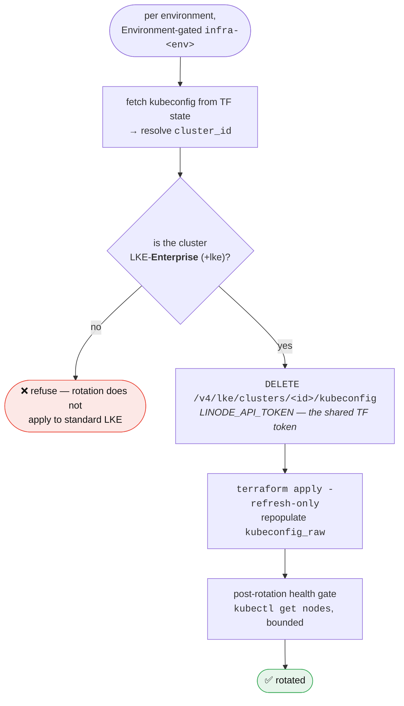

# LKE-Enterprise `lke-admin` Rotation — Runbook

**Applies to:** the `lke-admin-token` (cluster-admin token embedded in the LKE kubeconfig) on each **LKE-Enterprise** cluster
**Policy:** your org's secret-rotation policy — LKE secret rotation
**Source of truth:** your Product Security rotation guidelines

---

## Why this process exists

These clusters run **LKE-Enterprise** (`k8s_version` carries a `+lke` suffix, e.g. `v1.31.9+lke7`). Per your Product Security rotation guidelines, on LKE-Enterprise the **only sanctioned rotation today is `lke-admin-token`**. Every other token in the cluster (`bootstrap-token`, `ccm-user-token`, `cluster-autoscaler-user-token`, `konnectivity-server-token`, `linode`, `lke-monitoring`, `nlb-user-token`) is "being worked upon" upstream and **must not be rotated yet** — there is no batch SA-token rotation and no `regenerate` service-token call on LKE-E.

`lke-admin-token` is cluster-admin and is embedded in the kubeconfig used by SREs and CI. It must be rotated to limit blast radius if leaked.

**Hard rule:** never `kubectl delete` the `lke-admin-token` Secret — on LKE-E it will **not** be regenerated. Rotation goes exclusively through the Linode **delete-kubeconfig API**, which invalidates and regenerates it.

### PAT scope — accepted deviation from the guidelines

Your Product Security rotation guidelines recommend a Linode PAT scoped to the **Kubernetes resource only** for this call. We intentionally do **not** create one: rotation reuses the existing `LINODE_API_TOKEN` Actions secret, which is the **broad Linode token Terraform requires** (VPC, NodeBalancer, Object Storage, LKE, etc.). Maintaining a second, narrowly-scoped PAT solely for delete-kubeconfig is not worth the operational overhead of dual PAT lifecycles. Accepted residual risk: this token is broader than the guidelines' least-privilege recommendation. Compensating controls: it lives only in the `infra-<env>` Environment (approval-gated), never enters a cluster, and the tool only ever issues the single delete-kubeconfig call.

---

## Automated path (target state)

`.github/workflows/secret-rotation.yml` — monthly (1st, 04:00 UTC), each environment:



The tool is dry-run unless `--apply`. It touches **only** the Linode API — never the Kubernetes API — so it carries no in-cluster RBAC and the PAT never enters a cluster.

---

## Emergency path (admin exit / InfoSec / incident — same-day)

`Actions → LKE-E lke-admin Rotation → Run workflow`:

- **env:** the target environment (e.g. `primary` or `secondary`)
- **confirm:** type exactly `rotate:<env>` (e.g. `rotate:primary`)
- **reason:** free text — recorded to the run summary for audit

Environment approval on `infra-<env>` still applies. Run every environment for an org-wide trigger (admin offboarding).

---

## Manual path (break-glass, CI unavailable)

Use the shared `LINODE_API_TOKEN` (the broad Terraform Linode token — see the PAT-scope note above; a separate K8s-scoped PAT is intentionally not maintained):

```bash
# The cluster id, read from the cluster root's Terraform output:
cd terraform-iac-bootstrap/cluster
CID=$(llz ci tf-output cluster_id)

curl -fsSL -X DELETE \
  -H "Authorization: Bearer $LINODE_API_TOKEN" \
  "https://api.linode.com/v4/lke/clusters/${CID}/kubeconfig"
```

Then refresh Terraform state so downstream CI gets the new kubeconfig:

```bash
cd terraform-iac-bootstrap/cluster
llz tofu --region <env> -- init
llz --yes tofu -- apply -refresh-only -auto-approve -var-file="<env>.tfvars"
```

> **Run both steps through `llz tofu`.** Every root carries `encryption.tf`, so a
> bare `tofu` fails with OpenTofu's own unhelpful *"Invalid expression … A single
> static variable reference is required"* — the state-encryption tripwire, not a
> broken checkout. `llz tofu` builds `TF_ENCRYPTION` from the
> `TF_STATE_ENCRYPTION_PASSPHRASE` in `.llz/secrets.env`, the same value the
> `tf-encryption-env` composite action gives CI, and passes everything after `--`
> through untouched. `llz ci tf-output` resolves it for itself. See
> [ADR 0007 (state encryption)](https://github.com/akamai-consulting/lke-landing-zone/blob/main/docs/adr/0007-terraform-state-encryption.md).

Do **not** `kubectl delete` the `lke-admin-token` Secret.

---

## SLA & alerting

- **Cadence:** monthly (within the guidelines' weekly–monthly band for `lke-admin`).
- **Hard SLA:** 90 days (Critical). Also rotate same-day on admin exit, on InfoSec direction, or on compliance mandate.
- **Backstop:** `scheduled-checks.yml → lke-admin-rotation-health` (daily) reads the newest `lke-admin-token` Secret's age:
  - ≥ 35 days → `::warning::` (overdue vs monthly cadence)
  - ≥ 90 days → `::error::` + job failure (Critical SLA breached)

  This is the alert surface (the GitHub Actions scheduled check); there is no kube-state-metrics secret-age metric in this Prometheus, so a PrometheusRule would never fire. See [alerting.md](../alerting.md).

---

## Verification (post-rotation)

1. The workflow's health gate must pass (`kubectl get nodes` against the refreshed kubeconfig).
2. `lke-admin-rotation-health` should report the token age reset to ~0 days on the next daily run.
3. Confirm CI that consumes the kubeconfig (terraform.yml, scheduled-checks) still authenticates — TF state `kubeconfig_raw` was refreshed in the same run.
