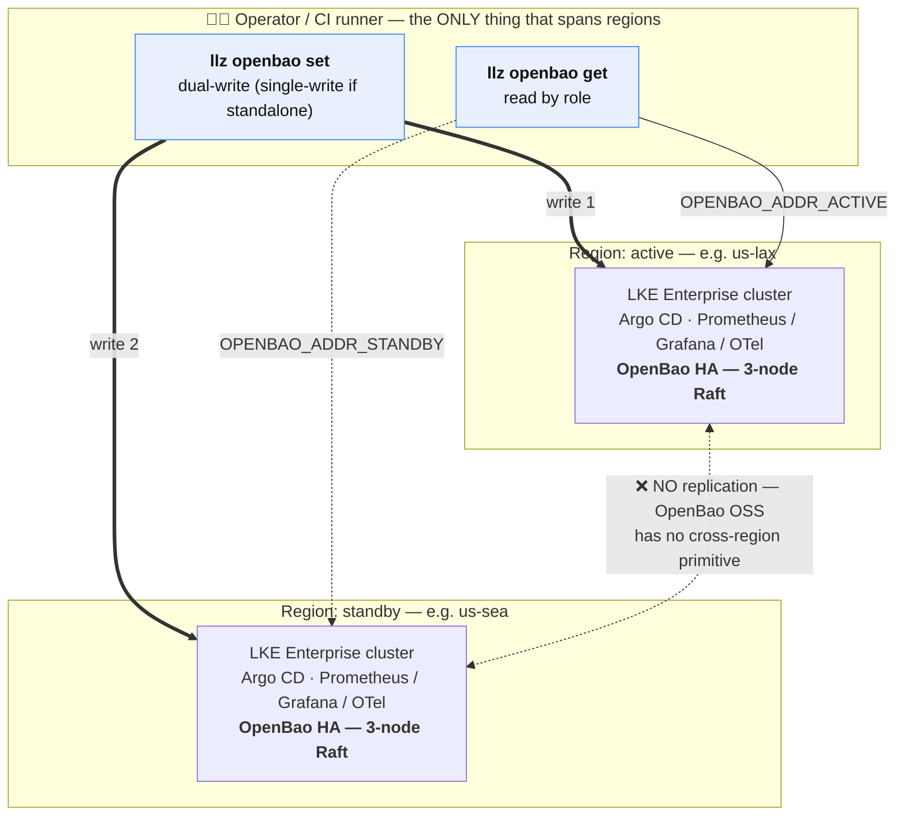

# Secrets — OpenBao operations guide

This document is the runbook for the platform's secret backend. It covers:

- What OpenBao is and why this template chose it (summary; brief rationale inline below)
- Initial per-region cluster bring-up (init, auto-unseal, KV v2, auth methods)
- Rotating secrets via the dual-write script
- How CI reads secrets at deploy time
- Regional failover behavior

The secret store itself runs as an Argo CD-managed Helm release of the published
`llz-openbao-platform` chart; its Argo CD Application + manifests live ONCE in the
shared `platform-apl/components/openbao/` component (enabled per env
via `spec.components.openbao`), and per-env value overrides in `apl-values/<env>/values.yaml`.
Your application workloads never talk to OpenBao directly — CI fetches the values
it needs and injects them as deploy-time configuration. (For an edge/serverless
target, for example, that means CI reads the values and passes them to the deploy
tool as variables; the mechanism is "CI injects at deploy time", not a runtime
client of OpenBao.)

<!-- toc -->
## Contents

- [Topology](#topology)
- [Why OpenBao and not Vault OSS](#why-openbao-and-not-vault-oss)
- [Why operator-side dual-write and not a stretched cluster](#why-operator-side-dual-write-and-not-a-stretched-cluster)
- [Initial cluster bring-up](#initial-cluster-bring-up)
- [Secret layout](#secret-layout)
- [Writing / rotating secrets — dual-write](#writing--rotating-secrets--dual-write)
- [CI read path](#ci-read-path)
- [Regional failover](#regional-failover)
- [In-cluster TLS to OpenBao](#in-cluster-tls-to-openbao)
- [Audit logging](#audit-logging)
- [Unseal automation](#unseal-automation)
- [Cross-references](#cross-references)

<!-- /toc -->

## Topology



**The dashed red edge is the whole design.** There is no replication between the
two clusters, so the operator *is* the replication mechanism — which is why
`llz openbao set` dual-writes rather than writing once and letting the cluster
gossip. See [why not a stretched cluster](#why-operator-side-dual-write-and-not-a-stretched-cluster).

Application workloads may run off-cluster (e.g. on an edge/serverless target) — in
that case the LKE clusters are the support plane only, holding the secret backend
and observability stack.

### HA roles are declared, not hardcoded

The active/standby relationship above is **declared per deployment** in its
cluster tfvars, not baked into "primary"/"secondary" strings:

- `ha_role = "active"` — provisions Harbor robots and receives its standby
  peer's CA.
- `ha_role = "standby"` — mirrors the active: seeds Harbor creds from the
  active's published secrets and ships its CA to the active. Pairs share one
  `ha_group`.
- `ha_role = "standalone"` (the default) — a single self-contained OpenBao. No
  peer, no cross-region CA, Harbor provisioned locally, and `llz openbao set`
  **single-writes** (no standby to dual-write to).

`llz env role <deployment>` and `llz env peer <deployment>` resolve these; the
bootstrap, rotation, and Harbor workflows branch on the role/peer instead of the
deployment name. `llz openbao get/set` addresses clusters by role
(`OPENBAO_ADDR_ACTIVE` / `OPENBAO_ADDR_STANDBY`).

## Why OpenBao and not Vault OSS

Short version: Apache 2.0 vs BSL 1.1, Linux Foundation governance, near-identical
feature set for this template's scope. OpenBao also ships an officially HA Postgres
storage backend that Vault OSS does not — not used today but available as a future
option. This is why OpenBao is the secret backend of record for the platform.

## Why operator-side dual-write and not a stretched cluster

OpenBao OSS has no cross-region replication primitive. Performance Replication is a
Vault Enterprise feature, intentionally not ported into OpenBao. The choices were:

1. **Stretched Raft cluster across regions (5 nodes, 3 in one region, 2 in the other)** — every write crosses the inter-region link; loses quorum if the majority region fails. Rejected.
2. **Two independent HA clusters + operator-side dual-write** — near-zero-write workload makes this trivial; regional failover is a config change, not a Raft recovery operation. **Chosen.**

## Initial cluster bring-up

**This process is automated.** Run `instance-template/.github/workflows/bootstrap-openbao.yml`
for each region. The workflow handles the full bootstrap: Raft init, auto-unseal, KV v2
setup, auth-method configuration (Kubernetes auth + GitHub-OIDC), all secret
seeding, and GitHub secrets population. See
[`docs/runbooks/bootstrap-openbao.md`](runbooks/bootstrap-openbao.md) for the
step-by-step procedure and required secrets.

The remainder of this section documents what the workflow does internally, which is
useful context for emergency recovery and understanding the secret layout.

### What bootstrap-openbao.yml does (reference)

1. **Seed the static seal key + Initialize Raft** — first creates the 32-byte static auto-unseal key as the `openbao-unseal-key` Secret (so the pods can start and unseal themselves; the key is also persisted as `OPENBAO_SEAL_KEY` in the `infra-<deployment>` environment for disaster recovery and must be copied offline — losing it loses the data). Then runs `bao operator init -recovery-shares=5 -recovery-threshold=3`. Stores recovery keys 1–3 as `OPENBAO_RECOVERY_KEY_1/2/3` in the `infra-<deployment>` environment (one of `infra-primary`, `infra-secondary`, `infra-staging`, `infra-lab`). The recovery keys authorize `bao operator generate-root` / `rekey` — they do **not** unseal (the static seal key does) and **cannot** decrypt the root key.

   **How you receive the shares depends on the `openbao_escrow_pubkey_b64` dispatch input**, and this is the one decision on the first bootstrap you cannot revisit — the 5 shares are minted exactly once.

   | `openbao_escrow_pubkey_b64` | What you get | What GitHub holds |
   |---|---|---|
   | set (base64 of your RSA public-key PEM, ≥ 2048-bit) | all 5 shares RSA-OAEP/SHA-256-encrypted to your key, as ciphertext in the job summary **and** the `openbao-recovery-keys-<deployment>-encrypted` artifact. Decrypt with your offline private key. | shares 1–3 only |
   | empty (default) | **nothing** — no offline copy exists | all 5 shares, as `OPENBAO_RECOVERY_KEY_1`–`5` |

   Generate a key first if you want the escrow:

   ```bash
   openssl genpkey -algorithm RSA -pkeyopt rsa_keygen_bits:4096 -out escrow-priv.pem
   openssl rsa -pubout -in escrow-priv.pem -out escrow-pub.pem
   base64 < escrow-pub.pem | tr -d '\n'      # paste this as openbao_escrow_pubkey_b64
   ```

   Keep `escrow-priv.pem` offline. Decrypt what comes back with:

   ```bash
   while read -r b; do printf '%s' "$b" | base64 -d \
     | openssl pkeyutl -decrypt -inkey escrow-priv.pem \
         -pkeyopt rsa_padding_mode:oaep -pkeyopt rsa_oaep_md:sha256; echo; \
   done < openbao-recovery-keys.b64
   ```

   **Nothing writes key material to the job summary on either path.** It used to write the raw `bao operator init` payload — root token and all 5 shares — which read as safe because the values were masked one line earlier. Masking redacts the **log stream**; a job summary is a Markdown file rendered exactly as written, and Actions **read** on the instance repo (a much wider grant than environment-secret write) was enough to open it and reconstitute a 3-of-5 quorum plus full root. `llz ci summary-secret-guard` is the gate that keeps it that way.

2. **Auto-unseal** — each pod unseals itself at boot from the static seal key (`seal "static"` in the chart); the workflow waits for all 3 to converge to unsealed (followers join the leader via Raft `retry_join`). There is no manual key submission.

3. **Configure** — enables KV v2 at `secret/`, Kubernetes auth, and GitHub-OIDC (`jwt`) auth. Creates four least-privilege policies (paths enumerated explicitly — no wildcard):
   - the read-only `platform-ci` policy, bound to the `eso` Kubernetes-auth role, which every in-cluster consumer reads through;
   - the write-scoped `eso-pusher` policy, bound to the `eso-pusher` Kubernetes-auth role (same ESO controller SA as `eso`), for the in-cluster-sourced PushSecret paths (`grafana/admin`, `otel/ingress`, `harbor/admin`);
   - the `linode-rotator` policy, bound to the `linode-rotator` Kubernetes-auth role, for the in-cluster credential rotator's paths (`loki/object-store`, `harbor/registry-s3`);
   - the `secret-propagator` GitHub-OIDC role + policy used by `llz ci rotate-incluster-pat`.

   Enables the file audit device.

4. **Seed secrets** — writes the following into OpenBao KV v2 and sets the corresponding GitHub secrets:
   - `secret/harbor/robot` (Harbor CI robot credentials, push+pull+delete; the buildah `config.json` is derived from these in-cluster by ESO — see note below)
   - `secret/harbor/pull-robot` (Harbor pull-only robot credentials; seeded + published as the `HARBOR_PULL_*` repo secrets for standby bring-up. **Not** auto-distributed as an imagePullSecret — see "Pulling images in your own namespace" below)
   - `secret/infra/github-dispatch-token` (harbor-ready PostSync dispatch)
   - `secret/cert-automation/github-token` (cert-automation Argo Workflow)
   - `secret/loki/object-store` (Linode Object Storage keys minted at bootstrap by `llz ci mint-bootstrap-objkeys`, rotated by the in-cluster linodeCredRotator)
   - Note: `secret/harbor/admin`, `secret/grafana/admin` and `secret/otel/ingress` are NO LONGER seeded here — External Secrets Operator writes them in-cluster via PushSecrets (harbor mirrors its Helm-generated Secret; grafana/otel use a Password generator + `updatePolicy: IfNotExists`), through the write-scoped `openbao-push` store. See `platform-apl/components/harbor/` and `manifest/generated-secrets/`.
   - Note: `secret/harbor/docker-config` is NO LONGER seeded — the buildah `config.json` is derived in-cluster by the `llz-cert-automation` chart's `harborDockerConfig` ExternalSecret, which renders the dockerconfigjson from the robot creds (`username`/`password`/`registry_host`) in `secret/harbor/robot` via an ESO template.

5. **Revoke root token** — runs unconditionally even on failure.

### Emergency manual bring-up (fallback only)

If the workflow fails partway through and you need to intervene manually, reach for
the individual verbs rather than raw `bao` — the bootstrap steps are Go commands,
not inline shell, so there is no shell transcript in the workflow to copy. The
dispatched `bootstrap-openbao.yml` is a thin caller; the body is
`llz-bootstrap-openbao.yml`, and every step in it is an `llz ci bao-*` verb:

| verb | what it does |
|---|---|
| `llz ci bao-status` | probes every pod, reports initialized/sealed — always safe, start here |
| `llz ci bao-init` | first-time `bao operator init`; escrows or persists the recovery shares, persists the root token |
| `llz ci bao-regen-root` | regenerates the root token by quorum |
| `llz ci bao-configure` | KV v2, auth methods, policies, roles, audit device |
| `llz ci bao-seed-all` | seeds the platform secret set |

Each is documented in
[`runbooks/bootstrap-openbao.md`](runbooks/bootstrap-openbao.md) → "Break-glass
handles". If you must drive `bao` inside the pod directly, the in-pod environment
is **not** the obvious one — target the loopback listener on `:8210` and set the
`BAO_*` names, or the command reaches the mTLS listener without a client
certificate and dies on the handshake:

```bash
kubectl -n llz-openbao exec -it <release>-openbao-0 -- \
    env BAO_ADDR=https://127.0.0.1:8210 BAO_CACERT=/openbao/tls/ca.crt \
    bao status
```

See [`playbooks/openbao-accounts.md`](playbooks/openbao-accounts.md) → "break-glass
root" for why (`:8200` is mTLS-only, and a present `BAO_ADDR` shadows `VAULT_ADDR`).

## Secret layout

The table below covers the operator-managed application secrets. Infrastructure
secrets seeded by `bootstrap-openbao.yml` (Harbor robot credentials, Loki
object-store keys, etc.) are listed in the
[Initial cluster bring-up](#initial-cluster-bring-up) section above; the paths that
are instead sourced or rotated in-cluster are covered in
[In-cluster rotation lifecycle](#in-cluster-rotation-lifecycle) below.

| Path                          | Keys                          | Writer   | Reader      |
|-------------------------------|-------------------------------|----------|-------------|
| `secret/<project>/keys`       | `<app_secret>`                | Operator | Operator (drift check via `llz openbao get`) |
| `secret/<project>/config`     | `<app_config_value>`          | Operator | Operator (drift check via `llz openbao get`) |
| `secret/<project>/<workload>` | `<workload_private_pem>`      | Operator | Workload pod (via ExternalSecret → K8s Secret mount) |

> **Note:** CI (deploy) reads the application secrets directly from **GitHub Actions
> environment secrets** (`lab`, `staging`, `production`) — not from OpenBao at deploy
> time. OpenBao holds the canonical copy for operator-side dual-write consistency and
> audit. Keep both in sync: after any `llz openbao set` rotation, also update the
> corresponding GitHub environment secrets and re-run the deploy workflow.

Any secret that must be **identical across both regions** (for example, a shared key
seed that every instance derives the same configuration from) must be kept in sync:
if primary and secondary drift, requests routed to the drifted region fail.

### In-cluster rotation lifecycle

Two Linode-minted support-plane credentials are rotated **in-cluster** — no CI
step, no GitHub secret — by the `linodeCredRotator` CronJob (`llz ci
rotate-linode-creds`; see [docs/runbooks/linode-credential-rotation.md](runbooks/linode-credential-rotation.md)
and [docs/designs/linode-credential-rotator.md](designs/linode-credential-rotator.md)):

- `secret/loki/object-store` — Loki's Object Storage keys
- `secret/harbor/registry-s3` — Harbor registry's Object Storage keys

For each, when the OpenBao `rotated_at` stamp is older than the threshold (or absent
on a fresh seed), the rotator mints a replacement via the Linode API, **verifies it
before touching the old one**, writes it to OpenBao through the `linode-rotator`
Kubernetes-auth role, then drains older same-labeled resources (keep-newest-N).
`bootstrap-openbao.yml` seeds `secret/loki/object-store` once; the rotator adopts it
on its first run and owns it thereafter. `secret/harbor/registry-s3` is **not** seeded
at bootstrap — the rotator creates it on first run.

> **DNS-01 note.** cert-manager DNS-01 challenges are solved by apl-core's
> `cert-manager-webhook-linode` (API group `acme.slicen.me`); the
> `llz-letsencrypt-*` ClusterIssuers target that webhook. In steady state its
> token — and ExternalDNS's — is the **rotating narrow in-cluster PAT** from
> `secret/linode/api-token`: the `dns-rotating-token` Kyverno policy repoints
> apl-core's two DNS ExternalSecrets at the `openbao` ClusterSecretStore (see
> [designs/linode-pat-dns-consolidation.md](designs/linode-pat-dns-consolidation.md)).
> The static token supplied via `TF_VAR_linode_dns_token` (from the
> `LINODE_DNS_TOKEN` GitHub secret) as `apps.cert-manager.dns.provider.linode.apiToken`
> remains only as the schema-required first-boot fallback, used until the policy
> syncs. The landing zone no longer seeds a separate `secret/certmanager/dns01`
> OpenBao path.

Separately, three secrets are **sourced in-cluster** by ESO PushSecrets (not minted
by the rotator) and pushed up to OpenBao through the `eso-pusher` Kubernetes-auth
role: `secret/grafana/admin` and `secret/otel/ingress` (generated once via a Password
generator, `updatePolicy: IfNotExists`) and `secret/harbor/admin` (mirrored from
Harbor's Helm-generated Secret).

> **Loki admin password — apl-core-managed (6.x).** The Loki gateway admin
> password is no longer a landing-zone secret. On apl-core 6.x the
> `apps.loki.adminPassword` values field is an x-secret with a generator
> (`x-secret: '{{ randAlphaNum 20 }}'`), and the loki reverse-proxy auth Secret is
> an ExternalSecret sourced from apl-core's own `core-secrets-store` — so apl-core
> generates, persists, and self-wires the password in-cluster when it is omitted.
> The landing zone no longer supplies it: there is no `LOKI_ADMIN_PASSWORD` GitHub
> environment secret, no `TF_VAR_loki_admin_password`, and no `ensure-env-secret`
> step. (On 5.0.0 the x-secret had no generator, so it had to be supplied via
> Terraform — see [docs/designs/apl-core-v6-migration.md](designs/apl-core-v6-migration.md).
> Nothing on the landing-zone side consumes this password — only apl-core's loki.)

### Secret & token inventory

Every credential the platform manages and how it is rotated. (Non-secret config
variables — `TF_IMAGE`, `KUBE_IMAGE`, `TF_STATE_BUCKET/ENDPOINT`, `HARBOR_URL`,
`E2E_*` — are omitted.) "Rotation method" legend: **automated** (workflow/CronJob on a
cadence), **on-demand** (operator-triggered workflow), **manual** (operator action,
policy SLA), **generate-once** (created in-cluster, not re-rotated), **ephemeral**
(short-TTL, minted per use), **static** (never rotated by design).

**GitHub Actions secrets** (operator/CI-managed; `infra-<env>` scope unless noted):

| Secret | What it is | Rotation method |
|--------|------------|-----------------|
| `LINODE_API_TOKEN` | Linode provisioning PAT (read/write) — **CI/Terraform-only** (never enters a cluster; also mints the narrow in-cluster PAT) | **Automated** — `secret-rotation.yml` mints monthly (`0 4 1 * *`), revokes old daily (`30 3 * * *`); ≤90-day policy with daily expiry audit |
| `LINODE_DNS_TOKEN` | Linode API token for the DNS **first-boot fallback** (`TF_VAR_linode_dns_token` → `apps.cert-manager.dns.provider.linode.apiToken`); steady-state DNS auth is the rotating in-cluster PAT via the `dns-rotating-token` Kyverno policy | **Manual** — **static** operator input; ≤90-day policy |
| `TF_STATE_ACCESS_KEY` / `TF_STATE_SECRET_KEY` | Object Storage key for the TF-state backend bucket | **On-demand** via `secret-rotation.yml` (`tf-state-key` / `tf-state-key-revoke` scopes); no scheduled rotation (bootstrap dependency). Age-tracked (`class="on-demand"`) from the GitHub secret's write time — these have no expiry and cannot live in OpenBao, see [ADR 0009](adr/0009-unmeasurable-credential-coverage.md) |
| `OPENBAO_SECRETS_WRITE_TOKEN` | GitHub classic PAT (Actions + Secrets: write) | **Manual**; ≤90-day policy, daily `token-inventory` expiry measurement (alerts via `LLZToken*`) |
| `APL_VALUES_REPO_TOKEN` | GitHub fine-grained PAT (Contents: write) | **Manual**; ≤90-day policy, daily `token-inventory` expiry measurement (alerts via `LLZToken*`) |
| LKE admin kubeconfig | Cluster-admin credential | **Automated** — `secret-rotation.yml` (`lke-admin` scope), monthly; see [lke-admin-rotation.md](runbooks/lke-admin-rotation.md) |
| `E2E_DISPATCH_TOKEN` | GitHub classic PAT for the e2e harness (template-repo scope) | **Manual** (template-repo admin); ≤90-day policy, daily `token-inventory` expiry measurement when set (alerts via `LLZToken*`) |
| `E2E_LINODE_TOKEN` | **Read-only** Linode PAT for the e2e harness (template-repo scope), and **optional**. Lets the e2e scaffold ask the account which LKE-Enterprise versions it can build instead of baking a literal — availability is per-account and rotates within hours. It must be for **the same account** as the instance repo's `LINODE_API_TOKEN`: a token for a different one seeds a version the building account may not offer, which is worse than the stale default it replaces. Unset → `llz env add` falls back to the compiled default and the lane emits a `::warning`<br>**`vars.E2E_K8S_VERSION` is no longer needed for a warm cluster.** With a token in scope the scaffold asks the account whether a cluster for this deployment already exists and pins **what it runs**, so a reused cluster plans no control-plane change on its own — it derives the account's newest only when there is no such cluster. (`k8s_version` reaches the LKE-E API on a create **or a change**, so a re-derive against a live cluster used to plan an upgrade nobody asked for; that is what the scaffold's cluster read closes.) Leave the var empty: a pin left behind after the warm cluster is gone **hard-fails the next cold run** once that version rotates out of the catalog. Set it when there is **no token** — llz then reads no catalog, so nothing judges the var and it holds indefinitely. In the three states where llz asked but could not **answer** — a failed cluster read, **two clusters sharing this deployment's label** (an orphan beside the live one; llz refuses to guess), or an account reporting no `k8s_version` for the cluster it found — the catalog *was* read, so the pin is judged against it with no exemption available, and the var only works until that version rotates out. After that the scaffold hard-fails. Treat it as a stopgap there and fix the state instead: re-run, delete the duplicate **by id**, or find out why the cluster reports no version. Each emits a `::warning`, and the middle two are easy to miss inside an otherwise green run. | **Manual** (template-repo admin). **Measured by nothing**, and deliberately so: it is a maintainer-only harness credential, and `credential-coverage-guard` covers `instance-template/.github/workflows` alone so adopter dashboards do not carry maintainer rows ([ADR 0009](adr/0009-unmeasurable-credential-coverage.md)). Read-only scope bounds the blast radius |
| `GHCR_READ_TOKEN` | GitHub `read:packages` PAT — **only** for a private fork/image; empty on a stock instance, since the first-party charts are public | **Manual**; ≤90-day policy, daily `token-inventory` expiry measurement when set. Unset → skipped entirely, not reported as `unknown` |
| `LLZ_AUTOMATION_TOKEN` | GitHub fine-grained PAT (**Contents: write, Pull requests: write, Workflows: write**) for the **opt-in** `template-upgrade.yml`, which pushes the upgrade branch and opens its pull request. **Workflows: write is not optional**: every genuine upgrade rewrites the `managed` `.github/workflows/llz-*.yml` bodies, and GitHub rejects a PAT push that touches any workflow file without it — so the push fails on exactly the upgrades that carry change, and succeeds on the empty ones. **Repo-level**. Empty unless you set `LLZ_TEMPLATE_UPGRADE=true`. **If your upstream template is private** (or a private fork), the token also needs `Contents: read` **on that repository** — `llz self-update` downloads a release from it and copier clones it, and a token scoped only to the instance repo fails inside copier, where the error reads as a template problem. It cannot be `GITHUB_TOKEN`: GitHub suppresses workflow runs from events raised with it, so the PR would run none of the gates that make an upgrade reviewable | **Manual**; ≤90-day policy, daily `token-inventory` expiry measurement when set. Unset → skipped entirely, not reported as `unknown`. **Its lapse is silent to the operator, not to the run**: an unset token fails the workflow's first step with an explicit `::error`, and an expired one fails the checkout — but the workflow runs monthly, so that red sits in the Actions tab unread, and what an operator actually observes is upgrade pull requests no longer arriving, which is indistinguishable from an instance with nothing upstream. Measured daily for that reason, rather than trusted to be noticed |
| `TF_STATE_ENCRYPTION_PASSPHRASE` | Passphrase for OpenTofu native state+plan encryption (all four TF roots). **Repo-level**, one per instance; generated and printed once by `llz tokens` when the repo has none | **On-demand** — `secret-rotation.yml` scope `state-passphrase` re-keys every root via an encrypted `fallback` (`llz ci rotate-state-passphrase`); the old passphrase is retained until every root verifies. **ESCROW OFFLINE**: until a rollover completes, losing it makes every state file unrecoverable. Age-tracked (`class="on-demand"`) from the GitHub secret's write time. See [ADR 0007](adr/0007-terraform-state-encryption.md), [ADR 0009](adr/0009-unmeasurable-credential-coverage.md) |

**OpenBao KV v2 secrets** (`secret/…`):

| Path | What it holds | Rotation method |
|------|---------------|-----------------|
| `secret/linode/api-token` | **Narrow in-cluster PAT** (`llz-incluster-<region>`: domains/object_storage/volumes rw, linodes/vpc ro, firewall rw) — read by volume-labeler, the cred-rotator (minting cred), cidr-firewall, and the DNS consumers via the `dns-rotating-token` policy | **Automated** — first minted by `mint-bootstrap-pat` at bootstrap; re-minted monthly per region by `secret-rotation.yml` → `rotate-incluster-pat` (GitHub-OIDC `secret-propagator` role), 7-day-grace drain. Age-tracked (`class="automated"`) — on the 90-day SLA, so a stalled rotation workflow alerts |
| `secret/linode/broad-pat` | **Broad account `read_write` PAT** — the provisioning credential the `broadPatRotator` CronJob owns; the highest-privilege Linode credential the platform holds | **Automated** in-cluster — `broadPatRotator` (weekly check, `ROTATE_AFTER_DAYS`), mint→verify→write→drain. Age-tracked (`class="automated"`) on the 90d SLA; its *expiry* is separately visible via the token-inventory's Linode enumeration |
| `secret/linode/cloud-firewall` | **Opt-in** least-privilege firewall token (`linodes:ro` + `vpcs:ro` + `firewall:rw`) for the cidr-firewall controller + discover CronJob. Most instances never seed it and read `linode/api-token` instead | **On-demand** — operator-seeded and re-seeded by hand (`llz openbao set`), documented ≤90-day policy. Age-tracked (`class="on-demand"`) when seeded; an unseeded instance 404s and publishes nothing |
| `secret/loki/object-store` | Loki Object Storage keys | **Automated** in-cluster — `linodeCredRotator` (~80-day threshold) |
| `secret/harbor/registry-s3` | Harbor registry Object Storage keys | **Automated** in-cluster — `linodeCredRotator` (~80-day threshold) |
| `secret/grafana/admin` | Grafana admin password | **Generate-once** — ESO PushSecret, Password generator (`IfNotExists`) via `eso-pusher` role. Age-tracked (`class="generate-once"`); see below |
| `secret/otel/ingress` | OTel ingress bearer token | **Generate-once** — ESO PushSecret, Password generator (`IfNotExists`) via `eso-pusher` role. Age-tracked (`class="generate-once"`); see below |
| `secret/harbor/admin` | Harbor admin password | **Tracks Harbor** — ESO PushSecret mirrors Harbor's Helm-generated Secret (`Replace`) via `eso-pusher` role. Age-tracked (`class="tracks-source"`); see below |
| `secret/harbor/robot` | Harbor CI robot (push/pull/delete) | **Static** — bootstrap seed; re-seed to rotate. Age-tracked (`class="static"`) |
| `secret/harbor/pull-robot` | Harbor pull-only robot (the credential an imagePullSecret is built from — LLZ does not build one for you) | **Static** — bootstrap seed; re-seed to rotate. Age-tracked (`class="static"`) |
| `secret/harbor/docker-config` | buildah `dockerconfigjson` | **Derived** — rendered in-cluster by ESO from `harbor/robot`; follows the robot creds (not seeded/stored) |
| `secret/cert-automation/github-token` | cert-automation Argo Workflow token | **Static** — bootstrap seed from `OPENBAO_SECRETS_WRITE_TOKEN`; re-seed when that PAT rotates. Age-tracked (`class="static"`) — a climbing age here is the signal that the source PAT was rotated and this copy was not |
| `secret/infra/github-dispatch-token` | harbor-ready PostSync dispatch token | **Static** — bootstrap seed from `OPENBAO_SECRETS_WRITE_TOKEN`; re-seed when that PAT rotates. Age-tracked (`class="static"`) — same drift signal as above |
| `secret/infra/apl-values-repo-token` | OpenBao copy of `APL_VALUES_REPO_TOKEN` — apl-core's `otomi.git` + the argocd repo Secrets read it through ESO | **Static** — bootstrap seed (best-effort, on-missing skip); re-seed when that PAT rotates. Age-tracked (`class="static"`) — the third copy of the same drift signal |
| `secret/alerts/webhooks` | Alertmanager Slack webhook URL (`slack_url`) — mounted via the Kyverno-repointed `alertmanager-credentials` ExternalSecret | **Manual** — operator seeds/rotates via `llz openbao set alerts/webhooks slack_url=…` (only needed when `spec.alerting.receivers` includes slack; see [alerting.md](alerting.md)). Age-tracked (`class="static"`) when seeded |
| `secret/infra/db-admin/<name>` | Managed Postgres admin connection (`akmadmin`) — endpoint, port, username, password, ca, sslmode | **On-demand** — seeded by `llz ci seed-db-admin`; rotated via `secret-rotation.yml` scope `db-admin` (`llz ci rotate-db-admin`). NOT scheduled and NOT in `all`. Age-tracked (`class="on-demand"`) via LIST discovery, not a literal path — see below |

> **Path moved — `secret/platform/db-admin/` → `secret/infra/db-admin/`.** The old
> location sat *inside* the default team's writable subtree: `llz new` scaffolds
> `openbao_team: platform` → `openbaoSubtree: secret/platform`, which produces a
> `platform-writer` policy with `create/update/read` on `secret/data/platform/*`.
> Every database admin password was therefore readable and writable by that team's
> human operators. `infra` is a reserved (non-team-claimable) namespace, so the
> credential is now out of reach of any `spec.teams` subtree.
>
> **Migrating a deployed instance:** re-run `bootstrap-openbao.yml` (its
> `seed-db-admin` step re-reads the databases root's Terraform output and writes
> the new path — the credential is unchanged, only its location), then purge the
> stale copy and its version history:
>
> ```bash
> llz openbao exec -- kv metadata delete secret/platform/db-admin/<name>
> ```
>
> Use `kv metadata delete`, not `kv delete`: the latter soft-deletes the current
> version only, leaving the password recoverable from history by anyone with the
> team's `read` grant — which is the exposure this move exists to close. Until you
> purge it, the old path remains readable by the team.
>
> Nothing the landing zone ships reads either path: `llz ci seed-db-admin` and
> `llz ci rotate-db-admin` both authenticate with `OPENBAO_ROOT_TOKEN` from CI,
> the reconciler holds metadata-only, and `platform-ci` (the ESO
> ClusterSecretStore's policy) grants db-admin nothing. **Check your own
> workloads before purging, though:** on a default-scaffolded instance the
> `platform-reader` policy covered `secret/data/platform/*`, so an app-team
> `ExternalSecret` pointing at the old path *would* have resolved. If you have
> one, repoint it — and treat that as having handed the database admin
> credential to an app workload, which is what this move prevents.

**OpenBao runtime auth & seal/recovery material:**

| Token / key | Lifetime | Rotation method |
|-------------|----------|-----------------|
| Kubernetes-auth tokens (`eso`, `eso-pusher`, `linode-rotator`) | 15m TTL | **Ephemeral** — minted per pod auth, auto-expires |
| GitHub-OIDC tokens (`platform-ci`, `secret-propagator`) | 15m TTL / 30m max | **Ephemeral** — minted per workflow run, auto-expires |
| `OPENBAO_ROOT_TOKEN` | Per bootstrap run | **Ephemeral** — revoked unconditionally at end of bootstrap; regenerated via recovery-key quorum |
| `OPENBAO_SEAL_KEY` | Permanent | **Static by design** — a changed key bricks auto-unseal; escrow offline |
| `OPENBAO_RECOVERY_KEY_1/2/3` | Permanent | **Static by design** — the quorum; authorize `generate-root`/`rekey` only |
| `OPENBAO_RECOVERY_KEY_4/5` | Permanent | **Static by design** — present only on a deployment bootstrapped **without** an escrow key; otherwise those two shares exist solely as ciphertext you hold |

Scheduled verification of these lives in `scheduled-checks.yml` (daily `0 6 * * *`):
Linode + GitHub PAT expiry audits (≤90-day policy, warn before expiry) and the
in-cluster rotation-SLA age checks. `secret-rotation.yml` carries the automated and
on-demand rotation jobs.

**These are on the credential single pane too.** They have no expiry to read
and cannot live in OpenBao — they *are* OpenBao's escrow, so storing them there
loses all of them together — which is exactly the shape ADR 0009 built the
GitHub-secret **write-time** probe for. They were simply not in the list it wrote,
and `llz ci credential-coverage-guard` now refuses to let a credential a workflow
uses stay off that list. What each publishes:

| Credential | `class` | Presence | Reading |
|---|---|---|---|
| `OPENBAO_SEAL_KEY` | `static` | expected **present** | The at-rest key for everything else in OpenBao. `LLZCredentialNeverRotated` at 365d; a rewrap is not implemented, so the yearly nudge is the honest signal. |
| `OPENBAO_RECOVERY_KEY_1/2/3` | `static` | expected **present** | An **absent** one means break-glass is impossible, and you would find out on the day you need it — `LLZCredentialUnconfigured`. |
| `OPENBAO_RECOVERY_KEY_4/5` | `static` | **optional** | Set only when the first bootstrap ran **without** `openbao_escrow_pubkey_b64`, where persisting them is the only way shares minted once survive. Absent means they were escrowed to you as ciphertext instead — the better posture — so neither state alerts. They are redundancy, not quorum: the threshold is 3 and 1–3 are always present. |
| `OPENBAO_ROOT_TOKEN` | `on-demand` | expected **absent** | Bootstrap revokes it; the quorum is what survives. A **set** one is a live full-admin credential left by a break-glass that never ran its revoke — `LLZCredentialRootTokenParked`, remedy `action=revoke`. |
| `HARBOR_PASSWORD` / `HARBOR_PULL_PASSWORD` | `static` | **optional** | Published by the **active** peer's `harbor-robot-provisioner`, so a standby peer (and any deployment before Harbor first comes up) legitimately has neither. Measured when present, never alerted either way. |

Presence is therefore not uniformly good, which is why the reconciler publishes a
PAIR: `llz_credential_configured{cred}` (the fact) and
`llz_credential_presence_ok{cred}` (whether that fact matches what is expected),
and two rules join them in opposite directions. The expectation is applied in the
reconciler and never carried as a metric label — the registry upserts by label set
and has no delete, so a classification label would strand a stale series alerting
forever the moment a credential was reclassified. The same series also closes the case ADR 0009 thought it had closed: a
credential that was never configured has no age, so before this it published
*nothing* and no age rule could evaluate for it — invisible rather than visibly
wrong.

**A refused read is not an absence.** The series is published only when the API
actually answered — `ok` or a 404. A 403 (environment-secret metadata needs
different token permissions from repo-scoped, and the five OpenBao credentials are
environment-scoped) publishes *nothing* and drops the funnel gauge instead, so a
token-permission fault pages as `LLZCredentialSecretProbeUnavailable` rather than
as a credential you are told to go and seed.

The whole write-time lane depends on one probe authenticating.
`LLZCredentialSecretProbeUnavailable` watches that, because when the probe cannot
run the symptom is silence: no entries, no series, and nothing for any other rule
to fire on.

#### Credential-age coverage and the rotation class

The `--reconcile-openbao-gauges` lane reads KV-v2 `updated_time` for every path in
`credPaths` ([`reconcile_openbao.go`](../tools/internal/extensions/lifecycle/reconcilelanes/openbao.go)) and
publishes `llz_credential_age_days{cred, class}`. The `class` label is what makes
the coverage honest — it separates "a rotator is late" from "nothing rotates this":

| `class` | Meaning | Alerting |
|---------|---------|----------|
| `automated` | A rotator resets it on a cadence (`linodeCredRotator` ~80d; `rotate-incluster-pat` monthly). A breach means the **rotator** is broken. | `LLZCredentialRotationOverdue` at 90d, **warning** |
| `on-demand` | A rotation path exists but an **operator** triggers it — the Managed Postgres admin credential via `secret-rotation.yml` scope `db-admin`, and the opt-in `linode/cloud-firewall` token re-seeded by hand with `llz openbao set`. The alert's remedy text branches on the credential, since those are different commands. A breach means **nobody ran it**. | `LLZCredentialRotationOverdue` at 90d, **warning** |
| `generate-once` | Written once by an ESO PushSecret Password generator (`IfNotExists`) and never again. | `LLZCredentialNeverRotated` at 365d, **info** |
| `tracks-source` | Mirrors a source of truth outside OpenBao; its age describes the source. | `LLZCredentialNeverRotated` at 365d, **info** |
| `static` | Seeded once by bootstrap or by an operator; nothing automated ever touches it. Re-seeding is the only thing that lowers the age. | `LLZCredentialNeverRotated` at 365d, **info** |

`automated` and `on-demand` are on the 90-day SLA rule — the test is whether the
age is **actionable**, not whether a cron owns it. The remedies differ (fix the
rotator vs. dispatch the workflow), so the alert description branches on the
class rather than pretending they are the same problem.

Classing the DB admin credential `static` would have been the tempting mistake:
accurate before `llz ci rotate-db-admin` existed, and afterwards it would have
given the highest-value credential in the deployment a yearly *info* nudge and
exempted it from the only rule that asks a human to act.

Putting the remaining classes on the 90d rule would
produce an alert that fires on day 91 and can never be cleared by any automation —
permanent noise. They get a yearly info-level nudge instead, and they are shown on
their own panel in the credential single-pane dashboard so the gap is visible
rather than silently absent.

`static` is the class that closes the last coverage hole: the rotation legend in
the inventory above has always had a **static** row, but the metric taxonomy did
not, so those paths published *no series at all*. A credential with no rotation is
a deliberate posture; a credential with no **series** is an invisible one, and the
two are indistinguishable on a dashboard. Every path in the inventory now carries
an age gauge.

**Managed Postgres admin paths are discovered, not declared.**
`secret/infra/db-admin/<name>` is named per declared database cluster, so it
cannot be a literal in `credPaths`. The sampler LISTs
`secret/metadata/infra/db-admin` each pass and tracks whatever it finds — a
cluster added later is covered with no code change, and a deployment with no
databases lists nothing and publishes nothing. This is the one grant in
`policyReconcilerRead` that is a prefix rather than an enumeration
(`secret/metadata/infra/db-admin/*`, read) plus the `list` on the collection.
Both are metadata-only: the admin password under `secret/data/infra/db-admin/*`
is granted to nothing, and `TestDBAdminGrantsInReconcilerPolicy` pins that.

> **Adding a path to `credPaths` is a two-file change.** Every entry also needs a
> `secret/metadata/<path>` read in `policyReconcilerRead`
> ([`ci_openbao_configure.go`](../tools/internal/extensions/lifecycle/identityconfig/openbao_configure.go)). The
> sampler treats only a 404 as "not seeded yet"; a 403 is fatal and fails the whole
> pass, taking the seal gauge and every other credential's age down with it.
> `TestCredPathsAreGrantedInReconcilerPolicy` pins the pair together.

### Database admin credentials — why rotation is on-demand only

`secret/infra/db-admin/<name>` holds the `akmadmin` credential for each Linode
Managed PostgreSQL cluster the `databases` root provisions
([shared-managed-postgres.md](designs/shared-managed-postgres.md)). It is the
highest-value credential in the deployment — it owns every logical database
carved out of the cluster — and `llz ci rotate-db-admin` is its rotation path.

It is the only rotator here that is **dispatch-only**, deliberately:

- **Linode offers no way to mint a second admin credential.** The user is fixed
  to `akmadmin`, and the sole mutation is `POST .../credentials/reset`, which
  regenerates the password *in place*. Every other rotator in this repo is
  mint → verify → swap → drain, so a bad mint can never break a consumer. Here
  there is **no overlap window**: the old password dies at the reset, and every
  consumer is broken until ESO re-syncs. That is an operator-chosen maintenance
  action, not something a cron should decide.
- **It is excluded from `scope=all`** for the same reason — `rotate:all` must not
  quietly reset every production database in the deployment.
- **The invariant flips.** Because the credential cannot be verified before it is
  committed to, the rule is not "never break a consumer" (unattainable) but
  "never LOSE the new credential". A failure after the reset is a loud error
  carrying the `linode-cli` command to re-read the password by hand — never the
  password itself.
- **OpenBao is authoritative, not Terraform state.** `llz ci seed-db-admin`
  compares the cluster's **endpoint** (its identity), never its password, so a
  path already pointing at this cluster is left alone. It re-seeds only when the
  path is absent or points at a *different* cluster (a recreate). That is what
  makes an out-of-band reset safe: nothing reconciles the credential back toward
  state.
- **Rotate-on-create.** Bootstrap runs `rotate-db-admin --rotate-now --apply`
  right after the seed, so the *provisioning* credential Terraform handed over —
  the copy sitting in Terraform state — is replaced within the same run. This
  bounds how long that copy is live; it does not keep a password out of state at
  all (`root_password` is provider-computed, and any later apply refreshes it).
  For the file itself, see [ADR 0007](adr/0007-terraform-state-encryption.md).

Report-only is the default — run it that way first:

```bash
# db-admin-apply omitted → reports each cluster's credential age and what is due
gh workflow run secret-rotation.yml -f scope=db-admin -f region=primary \
  -f confirm=rotate:db-admin -f reason="quarterly rotation"
```

## Writing / rotating secrets — dual-write

Use `llz openbao set`.
It writes to both regional clusters, verifies the SHA-256 hash of the post-write
payload matches, and rolls back the primary if the secondary write fails. It
**dry-runs by default** — add `--yes` to execute the write.

Prerequisites — **the normal path needs none of them**:

```bash
# Point KUBECONFIG at the cluster, then take a team-scoped, attributed token.
# `llz openbao set` port-forwards each cluster itself, so there is no address to export.
eval "$(llz openbao login --team <name>)"     # → OPENBAO_TOKEN
```

See [`runbooks/openbao-team-login.md`](runbooks/openbao-team-login.md). Root is
**not** the everyday credential: it is revoked at the end of every bootstrap, so
reaching for it means a break-glass regeneration
([`playbooks/openbao-accounts.md`](playbooks/openbao-accounts.md)) for a write the
team login already covers.

<details>
<summary>Overriding the addresses (an out-of-cluster OpenBao)</summary>

Only when you are not port-forwarding — e.g. an OpenBao reachable directly on the
network. Do **not** hand-assemble these from a cluster domain: on Managed App
Platform Linode owns the domain and LLZ discovers it in-cluster.

```bash
export OPENBAO_ADDR_ACTIVE=https://<active-openbao-host>
export OPENBAO_ADDR_STANDBY=https://<standby-openbao-host>
export OPENBAO_TOKEN_ACTIVE=...        # operator token for the active cluster
export OPENBAO_TOKEN_STANDBY=...       # operator token for the standby cluster
```

Do **not** use the ESO `platform-ci` credentials — they are read-only.

</details>

Rotate a generated key seed:

```bash
new_seed=$(openssl rand -hex 32)
llz openbao set secret/<project>/keys <app_secret>="$new_seed" --yes
```

Set a config value:

```bash
llz openbao set secret/<project>/config <app_config_value>=<value> --yes
```

Provision a workload private key:

```bash
llz openbao set secret/<project>/<workload> \
    <workload_private_pem>="$(cat /secure/<workload>.pem)" --yes
```

After a successful dual-write, update the matching GitHub environment secrets and
trigger a redeploy:

```bash
gh workflow run <deploy-workflow>.yml --ref main
```

### Script behavior

| Scenario                              | Exit | Side effect |
|---------------------------------------|:----:|-------------|
| Both writes succeed, hashes match     | 0    | New version in both regions |
| Primary write fails                   | 2    | No change in either region |
| Secondary write fails                 | 3    | Primary rolled back to its prior version |
| Post-write hash mismatch              | 4    | Both regions updated, but inconsistent — manual intervention |
| Dry run (the default — pass `--yes` to execute) | 0    | Nothing written; preview only |

The script uses KV v2's version history for rollback. If the prior version was 0 (no
secret existed), rollback is implemented as deleting the metadata path entirely so
the secret is fully removed.

### Drift verification

Run this any time as a consistency check:

```bash
hash_primary=$(
    llz openbao get active   secret/<project>/keys <app_secret> | shasum -a 256 | awk '{print $1}'
)
hash_secondary=$(
    llz openbao get standby secret/<project>/keys <app_secret> | shasum -a 256 | awk '{print $1}'
)
[[ "$hash_primary" == "$hash_secondary" ]] && echo "OK: in sync" || echo "DRIFT"
```

## CI read path

At deploy time the deploy jobs in your instance's deploy workflow read secrets from
**GitHub Actions environment secrets** (not directly from OpenBao). The environments
are `lab`, `staging`, and `production`; each holds its own copy of the application
secrets the workloads need (e.g. a key seed that must be identical across all
deployments in a region, plus any config values and workload private keys).

To rotate a runtime secret: update the value in the relevant GitHub environment
secrets and re-run the deploy workflow. For dual-region operator secrets that must
match across regions, update **all** environments so they stay in sync — there is no
automated cross-environment sync.

OpenBao holds the canonical copy of these values at `secret/<project>/...` and is the
write target for `llz openbao set`. The GitHub Actions
environment secrets and OpenBao values should be kept in sync manually after any
rotation.

## Regional failover

If the primary region is down:

1. **No action needed for CI** — GitHub Actions environment secrets are independent of regional OpenBao clusters; deploys continue to succeed.
2. **No action needed for the running workloads** — workloads deployed off-cluster have the last-pushed secrets cached as deploy-time variables; they keep serving.
3. **Rotation during an outage** — operators can continue `llz openbao set` only if **both** regions are up. During a primary outage, suspend rotations; when primary returns, run a drift check and, if needed, re-apply the last-written values.

This template intentionally does not support "write to secondary only during primary
outage" — that would create drift the moment primary returns, and there is no
automated reconciliation.

## In-cluster TLS to OpenBao

OpenBao's serving cert is signed by the private `openbao-ca` ClusterIssuer (see
[Unseal automation](#unseal-automation) and
`platform-apl/components/certManagerBootstrapCA/`), so the system trust bundle
cannot verify it. Every in-cluster caller therefore needs that CA locally, and
until it had one, all of them skipped verification.

**How the CA gets there.** Each consumer namespace issues its own
`openbao-ca-bundle` Certificate from the same cluster-scoped `openbao-ca`
ClusterIssuer. The leaf is disposable — nothing serves on it; it exists only
because cert-manager stamps `ca.crt` onto the Secret of every certificate it
issues from a CA issuer. That yields the bundle with no secret-reflector, no
Kyverno clone rule on a bootstrap-critical path, and no cross-namespace RBAC.
The Secret is mounted at `/etc/openbao-ca` and named by `OPENBAO_CA_FILE`.

Wired for the three workloads that hold an OpenBao token:

| Workload | Namespace |
|----------|-----------|
| `llz-reconciler` Deployment | `llz-reconciler` |
| `harbor-robot-provisioner` CronJob | `harbor` |
| `broad-pat-rotator` CronJob | `llz-pat-rotator` |

**The contract.** `inClusterBaoHTTPClient()`
([`openbao_k8s_login.go`](../tools/internal/shared/openbao/openbao_k8s_login.go)) is the single
place the transport is chosen:

1. `OPENBAO_CA_FILE` set → verify against that bundle.
2. else `OPENBAO_SKIP_VERIFY=true` → unverified (the cold-start fallback, kept
   because the bundle mount is `optional:` and a pod may start before
   cert-manager has issued it).
3. else → **error**. An unset environment must never silently mean unverified
   TLS; that default is how the skip became universal in the first place.

`TestInClusterOpenBaoConsumersVerifyTLS` pins all three workloads to the full
chain (Certificate exists → registered in its kustomization → mounted → named by
`OPENBAO_CA_FILE`), so the posture cannot regress by deleting one line.

`HTTPClientInsecure` is still correct for the cases with nothing to verify: the
`kubectl port-forward` loopback tunnel `llz openbao get/set/login` opens to
127.0.0.1, and `baoExec`, which runs inside the OpenBao pod itself.

## Audit logging

OpenBao's audit device writes every authenticated request (including failures, and
including the caller identity of each write/read of a KV secret) as JSON to
`/openbao/audit/audit.log`.

Each OpenBao pod runs a **Promtail sidecar** (see the `llz-openbao-platform` chart's
`extraContainers`) that tails the audit log and ships events to the in-cluster Loki
instance in `monitoring`. The Promtail config is rendered by the chart into the
`<release>-openbao-promtail` ConfigMap.

**The delivery is gated, not assumed.** `llz ci assert-openbao-audit` reads the audit
stream back out of Loki and fails if nothing arrived in the lookback window; it runs in
the release-e2e assert suite and in `cluster-health.yml`'s gate mode. It exists because
the pipeline shipped nowhere for its entire life: `lokiPushUrl` pointed at
`loki-gateway.llz-observability`, a Service nothing creates, while `observabilityNamespace`
named that same empty namespace — so the NetworkPolicy egress allow was correct in shape,
wrong in target, and granted nothing while looking complete. Promtail retries a dead name
forever, so every pod stayed Running and every other check stayed green. Only reading the
records back can tell a working pipeline from a plausible-looking one. To check by hand,
see [`playbooks/loki-access.md`](playbooks/loki-access.md).

### Enable the audit device (one-time, per region)

**This is automated by `bootstrap-openbao.yml`** and by the chart itself — the file
audit device is declared in the OpenBao HA config so it is present on every pod start
(the historical API-based `bao audit enable file ...` path is rejected by current
OpenBao with HTTP 400). To verify the device is active:

```bash
kubectl -n llz-openbao exec -it <release>-openbao-0 -- \
    env BAO_ADDR=https://127.0.0.1:8210 BAO_CACERT=/openbao/tls/ca.crt BAO_TOKEN=<token> \
    bao audit list
```

> The loopback listener (`:8210`) and the `BAO_*` names are both load-bearing —
> `:8200` requires a client certificate an in-pod caller does not have, and a
> present `BAO_ADDR` shadows `VAULT_ADDR`. `llz openbao exec -- audit list` does
> this for you.

### Audit device failure stops OpenBao

OpenBao audit devices are **synchronous** — if the only enabled device cannot write
(disk full, volume gone, permission error), OpenBao stops servicing all requests
until the device recovers. Mitigations:

- Keep the audit storage sized with headroom and monitor usage.
- The Promtail sidecar is a reader of the file; it cannot block OpenBao's writer even if Loki is unreachable. This is why the sidecar pattern is preferred over a syslog device that ships directly.
- If you truly need non-blocking, enable a second audit device on a different path as an insurance policy:

  ```bash
  bao audit enable -path=file_backup file file_path=/openbao/audit/audit-backup.log
  ```

### Querying audit events

From Grafana (Loki data source), label set is `{app="openbao", component="audit"}`:

```
{app="openbao", component="audit"} | json
```

Common filters:

| What | LogQL |
|------|-------|
| All writes to `secret/<project>/*`   | `{app="openbao", component="audit"} \|= "request.path" \|= "secret/data/<project>" \| json \| request_operation="update"` |
| Failed authentications               | `{app="openbao", component="audit"} \| json \| error!=""` |
| ESO Kubernetes-auth activity         | `{app="openbao", component="audit"} \|= "auth/kubernetes/login" \| json` |
| Root-token usage (should be rare)    | `{app="openbao", component="audit"} \| json \| auth_display_name="root"` |

Region is exposed as the `region` label on each stream, set by the chart's Promtail
config. Override per cluster via the per-env Argo CD Application value overrides.

### Loki backend

Loki runs in the `monitoring` namespace on each regional cluster (apl-core
managed), with storage on **Linode Object Storage** (chunks + index) and **Linode
Block Storage** (WAL only). See [docs/playbooks/loki-access.md](playbooks/loki-access.md)
for access and bucket/credentials setup.

## Unseal automation

Pods **auto-unseal** at boot from a per-cluster 32-byte static seal key — no
managed KMS (none exists on Linode) and no human quorum on every pod restart. The
key is configured via OpenBao's `seal "static"` stanza in the chart
(`kubernetes-charts/llz-openbao-platform`), reading the key from the
`openbao-unseal-key` Secret mounted at `/openbao/seal/unseal.key`. The Secret lives
only in etcd, which LKE-Enterprise encrypts at rest, so the key satisfies the
"encrypt secrets at rest" control without a KMS.

The key is created by `llz ci bao-seed-seal-key` during bootstrap (before the pods
start) and persisted as the `OPENBAO_SEAL_KEY` `infra-<deployment>` environment
secret for disaster recovery: a lost namespace/Secret is restored from there, and
the same key re-unseals the existing Raft data. **Copy it to offline storage** —
the recovery keys from `bao operator init` authorize `generate-root` but cannot
decrypt the root key, so the static seal key is the only thing that can unseal the
data. The key is never rotated (a changed key bricks unseal); migrating an existing
Shamir-initialized cluster to static seal is out of scope (rebuild instead).

A cert-rotation or node replacement that restarts a pod no longer needs any manual
action — the pod re-reads the seal key and unseals itself. A persistently sealed
pod means the `openbao-unseal-key` Secret is missing/unreadable, the key is wrong,
or Raft storage is unhealthy.

## Cross-references

- `llz openbao set` — dual-write implementation
- `llz openbao get` — CI read helper
- [docs/architecture/convergence-contract.md](architecture/convergence-contract.md) — cluster convergence contract
- [docs/runbooks/bootstrap-openbao.md](runbooks/bootstrap-openbao.md) — OpenBao bring-up procedure
- [docs/runbooks/lke-admin-rotation.md](runbooks/lke-admin-rotation.md) — lke-admin credential rotation
- [docs/runbooks/linode-credential-rotation.md](runbooks/linode-credential-rotation.md) — Linode token rotation
- [docs/runbooks/apl-values-propagation.md](runbooks/apl-values-propagation.md) — apl-values propagation
- [docs/playbooks/openbao-accounts.md](playbooks/openbao-accounts.md) — OpenBao account/access management
- [docs/playbooks/operator-onboarding.md](playbooks/operator-onboarding.md) — day-2 operator onboarding
- [docs/alerting.md](alerting.md) — alerting and on-call
- [docs/adopter-guide.md](adopter-guide.md) — standing up your own instance
