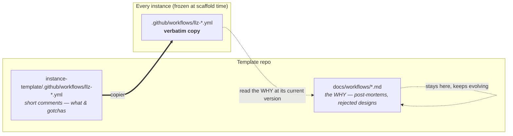

# Vendored workflow — maintainer notes

One document per reusable (`workflow_call`) workflow that copier vendors into
every instance. These are **archives, not instructions**: incident post-mortems,
e2e run IDs, rejected designs, and the reasoning behind a shape that looks odd
until you know what it is avoiding.

## Why they exist as separate files

Every `llz-*.yml` under `instance-template/.github/workflows/` is delivered into
each instance **verbatim**, where it can never be updated in place. So the
rationale cannot live as comments in the YAML — an adopter carries a frozen copy
of whatever the comments said on the day they scaffolded. The YAML keeps only
what someone debugging a live run at 3am needs; the archaeology lives here, in
the template repo, where it stays current.

## Index

| Workflow | What it is | Doc |
|---|---|---|
| `llz-terraform.yml` | The Terraform infra pipeline — plan / apply / destroy across the `cluster`, `vpc` and `object-storage` roots, plus the OpenBao bootstrap and the converge gate | [llz-terraform.md](llz-terraform.md) |
| `llz-bootstrap-openbao.yml` | Initialise, unseal and configure OpenBao; with `bootstrap_cluster=true`, the whole in-cluster bring-up and the final convergence gate | [llz-bootstrap-openbao.md](llz-bootstrap-openbao.md) |
| `llz-secret-rotation.yml` | Monthly out-of-band rotation: the per-cluster `lke-admin` token, the broad Linode PAT, and the TF-state keys | [llz-secret-rotation.md](llz-secret-rotation.md) |
| `llz-scheduled-checks.yml` | The scheduled health/audit checks, including the credential single pane | [llz-scheduled-checks.md](llz-scheduled-checks.md) |
| `llz-cluster-health.yml` | The cluster-health check, honouring the convergence contract's exit codes | [llz-cluster-health.md](llz-cluster-health.md) |
| `llz-breakglass-openbao.yml` | Break-glass OpenBao root-token generation | [llz-breakglass-openbao.md](llz-breakglass-openbao.md) |
| `llz-wedge-gameday.yml` | The blast-radius game-day that exercises the wedge classes the guards protect against | [llz-wedge-gameday.md](llz-wedge-gameday.md) |
| `llz-validate-credentials.yml` | Probes every pipeline credential for validity **and scope** against the secrets CI is actually handed — daily, and on demand | [llz-validate-credentials.md](llz-validate-credentials.md) |
| `llz-discover-deployments.yml` | A tiny shim: the single source of truth for the per-deployment CI matrix | [llz-discover-deployments.md](llz-discover-deployments.md) |
| `llz-template-upgrade.yml` | **Opt-in.** Runs `llz upgrade` in CI and opens the result as a reviewable pull request | [llz-template-upgrade.md](llz-template-upgrade.md) |

## Reading one

Each doc is organised **by job, and within a job by step name**, mirroring the
workflow it documents. Open the YAML alongside it — the section headings are the
job and step names, so the two scroll together.

## See also

- [Convergence contract](../architecture/convergence-contract.md) — the exit
  codes every readiness gate in these workflows honours.
- [ADR 0003](../adr/0003-vendor-actions-and-bodies-into-instances.md) — why the
  bodies and composite actions are vendored rather than referenced cross-repo.
- [`.github/workflows/AGENTS.md`](../../.github/workflows/AGENTS.md) — the
  template repo's *own* CI, which is a different set of workflows.
